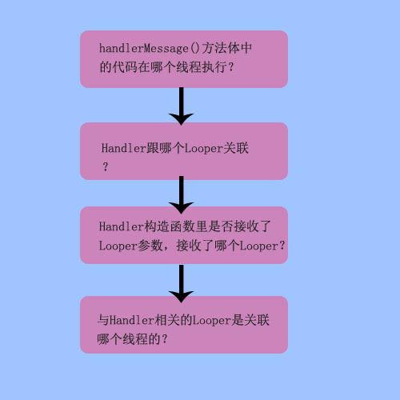

# Android 多線程編程的總結


##前言
這幾天在研究Android的多線程方面的知識，閱讀了許多大牛的文章，發現Android的多線程方式挺多的，關於各種方式的優缺點也都各有看法，所以這部分的知識還是很容易令人覺得混亂的，所以自己梳理了相關知識，用自己的角度去簡單總結這些知識，鞏固自己知識的同時也希望幫助到其他人。
首先，從兩個問題入手：我們為什麼需要多線程機制？什麼時候需要到多線程？
答：1、因為Android官方明確聲明在多線程編程時有兩大原則：第一、不要阻塞UI線程（即主線程，下文兩個稱呼可互換）、第二、不要在UI線程之外訪問UI組件。這個話題是老生常談了，想必很多人都明白箇中緣由。
2、我對多線程的使用情況歸結為主要有兩種情況：第一、將任務從主線程拋到工作線程，第二種情況是將任務從工作線程拋到主線程。這兩種情況其實跟上面兩個原則是對應的。當我們有耗時的任務，如果在UI線程中執行，那就會阻塞UI線程了，必須要拋到工作線程中去執行；而當我們要更新UI組件時，就一定得在UI線程裡執行了，所以就得把在工作線程中執行的任務結果返回到UI線程中去更新組件了。

## 一、將任務從工作線程拋到主線程

```java
protected void onCreate(Bundle savedInstanceState) {
    super.onCreate(savedInstanceState);
    setContentView(R.layout.activity_main);
    button = (Button) findViewById(R.id.button);
    text = (TextView) findViewById(R.id.text);//耗時任務完成時在該TextView上顯示文本

    mRunnable = new Runnable() {
        @Override
        public void run() {
            try {
                Thread.sleep(5000);//模擬耗時任務
            } catch (InterruptedException e) {
                e.printStackTrace();
            }
            text.setText("Task Done!!");//在非UI線程之外去訪問UI組件
        }
    };

    button.setOnClickListener(new View.OnClickListener() {
        @Override
        public void onClick(View v) {
            Thread thread = new Thread(mRunnable);
            thread.start();
        }
    });

}
```
佈局上只定義了一個Button和TextView,Button按下時會開啟一個新線程執行耗時任務，任務完成後更新TextView的文本。有點基礎的都能明白這段代碼是有問題的，因為它在非UI線程之外去訪問UI組件了。
那這個時候就得想辦法讓text.setText("Task Done!!");這句代碼拋到UI線程中去執行了。對此，我們大概有四種方法，下面分別演示。
有如下5種方式


### 1、Handler.sendXXXMessage()等方法
首先是在上面的Activity中定義一個Handler

```java
Handler mHandler = new Handler() {
    @Override
    public void handleMessage(Message msg) {
        if(msg.what == 0x123) {
            text.setText("Task Done!!");
        }
    }
};
```

然後將工作線程的代碼改為下面的樣子

```java
mRunnable = new Runnable() {
    @Override
    public void run() {
        try {
            Thread.sleep(5000);//模擬耗時任務
        } catch (InterruptedException e) {
            e.printStackTrace();
        }
        mHandler.sendEmptyMessage(0x123);//關於發消息的方法有很多,比如sendMessage(Message msg),sendMessageDelayed(Message msg, long delayMills)等等，可按具體需求選擇，這裡不作擴展

    }
};
```

這樣程序運行起來後就不會報錯了。
關於Handler的底層機制網上有非常多文章作了詳細的描述，比如有張鴻洋的Android 異步消息處理機制 讓你深入理解
Looper、Handler、Message三者關係，這裡也小小地提一下，為後面的內容做一些必要的鋪墊。

一個線程只有一個Looper, 而一個Looper持有一個MessageQueue, 當調用Looper.prepare()時，Looper就與當前線程關聯起來了(在Activity裡沒有顯示調用Looper.prepare()是因為系統自動在主線程裡幫我們調用了)，而Handler是與Looper的線程是綁定的，查看Handler類的源碼可以發現它幾個構造函數，其中有接收一個Looper參數的，也有不接收Looper參數的，從上面的代碼上看，我們沒有為Handler指定Looper，那麼Handler就默認更當前線程（即主線程）的Looper關聯起來了，之所以囉嗦那麼多就是因為這決定了Handler.handlerMessage(msg)方法體裡的代碼到底在哪個線程裡執行，我們再梳理一下，Looper.prepare調用決定了Looper與哪個線程關聯，間接決定了與這個Looper相關聯的Handler.handlerMessage(msg)方法體裡的代碼執行的線程。（太囉嗦了）
現在回到上面的代碼，我們的Handler是在主線程裡的定義的，所以也默認跟主線程的Looper相關聯，即handlerMessage方法的代碼會在UI線程執行，因此更新TextView就不會報錯了。下面這張圖是弄清handlerMessage(msg)方法體裡的代碼的執行線程的思路



###2、Handler.post(Runnable)
只要將上面代碼中的

```java
mHandler.sendEmptyMessage(0x123);  
```
改成

```java
mHandler.post(new Runnable() {
    @Override
    public void run() {
        text.setText("Task Done!!");
    }
});
```

就可以了，可能有人看到new了一個Runnable就以為是又開了一個新線程，事實上並沒有開啟任何新線程，只是使run()方法體的代碼拋到與mHandler相關聯的線程中執行，經過上面的分析我們也知道mHandler是與主線程關聯的，所以更新TextView組件依然發生在主線程了。


###3、Activity.runOnUIThread(Runnable)
將上面的代碼改成

```java
runOnUiThread(new Runnable() {
    @Override
    public void run() {
        text.setText("Task Done!!");
    }
});
```
這個看起來跟上面的方法很像，差別就是這種方法不需要去定義Handler。

###4、View.post(Runnable)

將上面的代碼改為

```java
text.post(new Runnable() {  
    @Override  
    public void run() {  
        text.setText("Task Done!!");  
    }  
});  
```

這個看起來依舊是跟上面的方法很像,依然不用定義Handler。


###5、AsyncTask
這種方法要改動上面整個開新線程的代碼，具體代碼在入門書籍上基本都有，這裡就不附上了，思路就是在doInBackground(Params…) 方法裡執行耗時邏輯，然後在onPostExecute(Result) 中將結果更新回UI組件。

使用哪種大多數情況我還是根據代碼風格和習慣來決定，上面這5種方法具體在效率上是否有巨大差異，我沒有深入研究，這方面有研究的兄弟希望可以在留言裡交流一下

## 二、將任務從主線程拋到工作線程

正如前言所說，耗時任務不能在主線程去進行，需要另外開一個線程。分別有下面幾種方法：

###1、Thread、Runnable
這個是最傳統的方法了，相信每個學過Java基礎的人都知道。無非就是繼承Thread類覆寫run()然後通過thread.start()或實現Runnable接口複寫run()然後New Thread(Runnable).start()，在上面的例子中就是通過這種最普通的方法去開新線程的，不過在實際開發中，這種開新線程的方法是很不被推薦的，理由如下：1）當你有多個耗時任務時就會開多個新線程，開啟新線程的以及調度多個線程的開銷是非常大的，這往往會帶來嚴重的性能問題，例如，你有100個耗時任務，那就開100個線程。2）如果在線程中執行循環任務，只能通過一個Flag來控制它的停止，如while(!iscancel){//耗時任務}。

###2、HandlerThread
在正式介紹HandlerThread前，我們先來看看以下代碼：

```java
protected void onCreate(Bundle savedInstanceState) {
    super.onCreate(savedInstanceState);
    setContentView(R.layout.activity_main);
    button = (Button) findViewById(R.id.button);
    button.setOnClickListener(new View.OnClickListener() {
        @Override
        public void onClick(View v) {
            mOtherHandler.sendEmptyMessage(0x124);
        }
    });
    new Thread(new Runnable() {
        @Override
        public void run() {
            Looper.prepare();//在新線程中調用
            mOtherHandler = new Handler() { //默認關聯新線程的Looper
                @Override
                public void handleMessage(Message msg) {

                    if (msg.what == 0x124) {
                        try {
                            Log.d("HandlerThread", Thread.currentThread().getName());//打印線程名
                            Thread.sleep(5000);//模擬耗時邏輯
                        } catch (InterruptedException e) {
                            e.printStackTrace();
                        }
                    }

                }
            };
            Looper.loop();
        }
    }).start();
}
```

可以看到這裡用的是第一種方法開啟新線程的，但是在新線程裡初始化了Looper(因為不是在主線程，所以要我們自己調用Looper.prepare()和loop()),還定義了一個Handler ,前面我之所以那麼囉嗦，就是為了讓你明白:這個Handler的handlerMessage(msg)方法體的代碼是在新線程（工作線程）中執行的，而不是主線程（忘了的話拉回去看前面的內容），所以我們只需要在Button的點擊事件中調用sendXXXMessage就可以讓耗時任務在新線程中執行了。

有意思的是，如果我們以非常快的速度連續點擊兩次Button,你會發現打印出來的兩條Log是以間隔5秒相繼出現的。這是因為每點一次按鈕並沒有開啟都開啟一個新線程，而只是發送了一條消息，我們在onCreate()裡就已經把一個新線程開好了，然後調用Looper.loop()使這個線程一直處於循環狀態了，而我們每發一條消息，消息都會在MessageQueue裡排隊。總而言之，不管我們點多少次按鈕，都只有一個工作線程，多個耗時任務在這個工作線程的隊列中排隊處理。思路如下圖


鋪墊了這麼多，可以把HandlerThread拉出來了，查看源碼，你會發現HandlerThread也是Thread的子類，那豈不是還是跟第一種方法一樣，說是也是，說不是也不是。其實呢，HandlerThread就是對上面的代碼的一種封裝，我們來看看它是怎麼用的


```java
handlerThread = new HandlerThread("MyNewThread");//自定義線程名稱
handlerThread.start();
mOtherHandler = new Handler(handlerThread.getLooper()) {
    @Override
    public void handleMessage(Message msg) {

        if (msg.what == 0x124) {
            try {
                Log.d("HandlerThread", Thread.currentThread().getName());
                Thread.sleep(5000);//模擬耗時任務
            } catch (InterruptedException e) {
                e.printStackTrace();
            }
        }

    }
};
```

這段代碼跟前面那一段代碼是完全等價的，HandlerThread的好處是代碼看起來沒前面的版本那麼亂，相對簡潔一點。還有一個好處就是通過handlerThread.quit()或者quitSafely()使線程結束自己的生命週期。

可能有人問了，那用以上方式執行完耗時任務後怎麼更新UI組件了，很簡單，完全照著面前所說的將任務從工作線程拋到主線程的五種方法去做就可以了。

可能又有人問了，那mOtherHandler.post(new Runnable())裡的Runnable在哪個線程運行，還是工作線程，只不過這樣就避開了handlerMessage的步驟而已，跟前面的分析還是一樣的原理的。

##3、AsyncTask
沒錯，又是它。具體的使用代碼就不貼上來了，到處都有。但值得一說的是，上面說過HandlerThread只開一條線程，任務都被阻塞在一個隊列中，那麼就會使阻塞的任務延遲了，而AsyncTask開啟線程的方法asyncTask.execute()默認是也是開啟一個線程和一個隊列的，不過也可以通過asyncTask.executeOnExecutor(AsyncTask.THREAD_POOL_EXECUTOR, 0)開啟一個含有5個新線程的線程池，也就是說有個5個隊列了，假如說你執行第6個耗時任務時，除非前面5個都還沒執行完，否則任務是不會阻塞的，這樣就可以大大減少耗時任務延遲的可能性，這也是它的優點所在，當你想多個耗時任務併發的執行，那你更應該選擇AsyncTask。

##4、IntentService
最後再小小地提一下IntentService，相信很多人也不陌生，它是Service的子類，用法跟Service也差不多，就是實現的方法名字不一樣，耗時邏輯應放在onHandleIntent(Intent intent)的方法體裡，它同樣有著退出啟動它的Activity後不會被系統殺死的特點，而且當任務執行完後會自動停止，無須手動去終止它。例如在APP裡我們要實現一個下載功能，當退出頁面後下載不會被中斷，那麼這時候IntentService就是一個不錯的選擇了。

筆者寫技術文章經驗很少，如有紕漏錯誤，歡迎指正交流！

