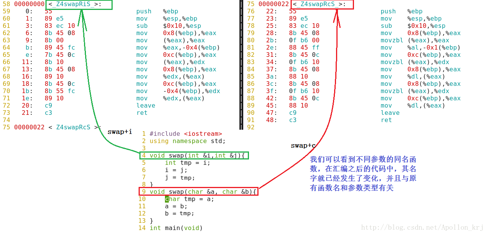
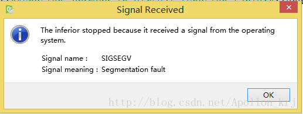

# C++动多态实现之虚函数与虚表指针


近在学习C++的动多态时，了解到关于虚函数表与虚表指针的知识点，感觉很有意思，因此总结记录下来（依据个人理解而写，欢迎批评指正）。

##1、静多态与命名倾轧，动多态与虚函数：
###（1）概述： 
我们知道，`C++的多态有静多态（Static polymorphism）与动多态（Dynamic polymorphism）`之分，静多态是依靠函数重载（function overloading）实现的，而且这种依靠函数重载的多态的实现是采用命名倾轧（关于命名倾轧可参考：C++函数重载与重载原理：命名倾轧 ）的方式，是在编译阶段就已经完成了的；而动多态（动态联编、动态关联）是在运行阶段才会确定的，是依靠虚函数来实现的，并且动多态是在有父子类才会产生的多态（虚函数脱离类是毫无意义的），而静多态则不必需要有类的继承。实现函数的动态联编其本质核心则是虚表指针与虚函数表。

###（2）静多态： 
关于静多态的命名倾轧，我们再用一个简单的例子验证： 
该例为swap()函数的重载测试（图中简单做以说明）： 




###（3）动多态： 
那么对于动多态我们首先总结一下有关其实现前提条件：

`实现前提： 赋值兼容 `

赋值兼容是动多态能够产生的前提。所谓赋值兼容顾名思义：不同类型的变量之间互相赋值的兼容现象。就像隐式类型转换一样，而对于父子类对象之间的赋值兼容是由严格规定的，只有在以下几种情况下才能赋值兼容：

- ①派生类的对象可以赋值给基类对象。 
- ②派生类的对象可以初始化基类的引用。 
- ③派生类对象的地址可以赋给指向基类的指针

但是由于基类对象与基类引用的局限性，我们一般采用基类指针进行派生类对象的函数调用。

实现条件：

- ①父类中有虚函数。 
- ②子类 override(覆写/覆盖)父类中的虚函数。 
- ③通过己被子类对象赋值的父类指针或引用，调用共用接口。

virtual type func（参数列表） = 0;为纯虚函数的声明方式，纯虚函数所在基类我们称为抽象基类，抽象基类不能实例化对象，只能为子类对象提供接口（并非只有纯虚函数才能实现动多态，但是一般我们不在纯虚函数所在的类中对虚函数具体化其功能。而仅设为纯虚以提供接口）我们所说的抽象基类提供接口，就是指特定子类对象通过抽象基类的纯虚函数接口，去匹配本对象对应的子类覆写的抽象基类的虚函数（子类中覆写的父类函数也是虚函数，只不过可以不写virtual修饰）。一般要将抽象基类中的析构函数也声明为虚基类，以解决对象析构时的析构不彻底问题（在 delete 父类指针的时候，会调用子类的析构函数，实现完整析构）。

##2、虚函数表与虚表指针剖析：
我们之前说多态条件中：派生类中与抽象基类同名的成员函数会覆写（override）其父类的虚函数，那么覆写是如何实现的呢？我们得先来看看虚函数表（Virtual function table）与虚表指针（Virtual pointer，vptr）的问题：

一个类在产生对象时，会根据类中成员来为对象分配一定的空间，无论是栈空间还是堆空间，其必定遵循一定的规律，就是什么样的成员需要分配空间，什么样的成员应该在什么样的位置。就这句话，我们来做个小实验：

```cpp
#include <iostream>
using namespace std;

class Base /*该类中函数均为虚函数*/
{
public:
    virtual void f()
    {
        cout << "Base::f()" << endl;
    }
    virtual void g()
    {
        cout << "Base::g()" << endl;
    }
    virtual void h()
    {
        cout << "Base::h()" << endl;
    }
private:
    int a;
    int b;
};
class Base_Two /*该类中函数均为非虚函数*/
{
public:
    void f()
    {
        cout << "Base::f()" << endl;
    }
    void g()
    {
        cout << "Base::g()" << endl;
    }
    void h()
    {
        cout << "Base::h()" << endl;
    }
private:
    int a;
    int b;
};
int main()
{
    Base b;
    cout << "Virtual function:" << sizeof(Base) << endl;
    cout << "Virtual function:" << sizeof(b) << endl;

    Base_Two b2;
    cout << "Ordinary function:" << sizeof(Base_Two) << endl;
    cout << "Ordinary function:" << sizeof(b2) << endl;

    return 0;
}
```


并且在我们将Base类中的三个虚函数改为两个或者一个时，其结果仍然是12，而若是三个虚函数均改为普通函数，则大小就与Base_Two类完全相同，这是为什么呢？函数不是应该不占用堆内存/栈内存吗？如果不是虚函数占用的，那么多出来的四个字节是提供给谁的？我们画张图来说明：


既然如上图所说，那么我们岂不是可以根据对象b的地址来访问vptr的值，进而访问三个虚函数的地址？答案是当然可以，测试代码如下：

```cpp
#include <iostream>
using namespace std;

class Base /*该类中函数均为虚函数*/
{
public:
    virtual void f()
    {
        cout << "Base::f()" << endl;
    }
    virtual void g()
    {
        cout << "Base::g()" << endl;
    }
    virtual void h()
    {
        cout << "Base::h()" << endl;
    }
private:
    int a;
    int b;
};
class Base_Two /*该类中函数均为非虚函数*/
{
public:
    void f()
    {
        cout << "Base::f()" << endl;
    }
    void g()
    {
        cout << "Base::g()" << endl;
    }
    void h()
    {
        cout << "Base::h()" << endl;
    }
private:
    int a;
    int b;
};

int main()
{
    Base b;

    cout << "Object start address:" << &b << endl; //对象起始地址
    cout << "Virtual function table start address:"; //V-Table起始地址
    cout << (long**)(*(long*)(&b)) << endl;

    cout << "Function address in virtual function table:" << endl;

    cout << ((long**)(*(long*)&b))[0] << endl;
    cout << ((long**)(*(long*)&b))[1] << endl;
    cout << ((long**)(*(long*)&b))[2] << endl;
    cout << ((long**)(*(long*)&b))[3] << endl;
    /****************************
    * 表达式分析：
    * (int *)&b：取对象b地址的前四个字节，即vptr的地址
    * *(int *)&b：取vptr的存储的地址值
    * (int **)(*(int *)&b)：将该地址值转换成二级指针，即存放虚函数地址(一级指针）的虚表数组地址
    * ((int **)(*(int *)&b))[i]:根据该虚表地址进行下标运算取具体的(第i个)虚函数地址
    *******************************/
    return 0;
}
```

我们在程序return 0；之前设置一个断点，调试并与运行结果进行对比：


发现程序打印的结果与调试中的变量地址是一致的，并且我们可以在调试框中看到[vptr]这一标志，其三个成员对应的函数名与其所属类一清二楚，由于虚函数表中最后一个存储值为NULL，打印就是0。当然我们也可以根据函数指针以及获取到的地址对其进行函数调用：


```cpp
#include <iostream>
using namespace std;

class Base /*该类中函数均为虚函数*/
{
public:
    virtual void f()
    {
        cout << "Base::f()" << endl;
    }
    virtual void g()
    {
        cout << "Base::g()" << endl;
    }
    virtual void h()
    {
        cout << "Base::h()" << endl;
    }
private:
    int a;
    int b;
};
class Base_Two /*该类中函数均为非虚函数*/
{
public:
    void f()
    {
        cout << "Base::f()" << endl;
    }
    void g()
    {
        cout << "Base::g()" << endl;
    }
    void h()
    {
        cout << "Base::h()" << endl;
    }
private:
    int a;
    int b;
};

int main()
{
    Base b;
    typedef void(*PFUNC)(void);

    PFUNC pf = ((PFUNC*)(long**)(*(long*)(&b)))[0];
    pf();
    PFUNC pg = ((PFUNC*)(long**)(*(long*)(&b)))[1];
    pg();
    PFUNC ph = ((PFUNC*)(long**)(*(long*)(&b)))[2];
    ph();

    return 0;
}
```
我们在程序return 0；之前设置一个断点，调试并与运行结果进行对比：


##3、虚函数表与动多态的实现：
根据以上分析，我们知道了虚函数的地址是放在虚函数表中的，而对象可以根据其所拥有的虚表指针以及相应的偏移量进行虚函数的访问调用。那么对于基于虚函数的动多态的实现又是怎样的？我们继续往下分析：

我们先将上面的程序稍作修改，让 Derive继承有虚函数的Base，此时的 Derive中并没有覆写父类的虚函数。

```cpp
#include <iostream>

using namespace std;
typedef void(*PFUNC)(void);

class Base
{
public:
    virtual void f()
    {
        cout << "Base::f()" << endl;
    }
    virtual void g()
    {
        cout << "Base::g()" << endl;
    }
    virtual void h()
    {
        cout << "Base::h()" << endl;
    }
private:
    int a;
    int b;
};

class Derive: public Base
{
public:
    virtual void f1()
    {
        cout << "Derive::f1()" << endl;
    }
    virtual void g1()
    {
        cout << "Derive::g1()" << endl;
    }
    virtual void h1()
    {
        cout << "Derive::h1()" << endl;
    }
private:
    int a;
    int b;
};

int main()
{
    Derive b;

    cout << "Object start address:" << &b << endl; //对象起始地址
    cout << "Virtual function table start address:"; //V-Table起始地址
    cout << (int**)(*(int*)(&b)) <<
         endl; //int **：二级指针，表示虚表指针为函数指针数组

    cout << "Function address in virtual function table:" << endl;

    for (int i = 0; i < 6; i++) {
        cout << ((long**)(*(long*)(&b)))[i] << endl;
    }

    PFUNC pfunc;

    for (int i = 0; i < 6; i++) {
        pfunc = ((PFUNC*)(long**)(*(long*)(&b)))[i];
        pfunc();
    }

    return 0;
}
```

对于没有覆写父类虚函数的这段例子，我们依然设置断点调试，结果如下：


在修改Derive::f1()、Derive::g1()、Derive::h1()三个函数名为Derive::f()、Derive::g()、Derive::h()及其输出内容之后，我们再进行测试，发现结果产生段错误：段错误的提示信息是由于此时覆写之后，虚表中只存在三个有效指针，我们循环时的条件未进行修改越界访问而导致的。本来想将循环条件值修改后测试截图，但是觉得这个段错误包含了覆写时的虚表大小改变的情况，就留了下来，我们不予理睬即可（段错误截图如下，收到SIGSEGV信号）：




我们只分析调试信息与输出信息： 


可以看到，父类的Base::f()、Base::g()、Base::h()函数已经不存在了，而被子类的同名函数Derive::f()、Derive::g()、Derive::h()给覆写了。

对上面的输出结果,根据其打印的地址，我们再画两张图来分析： 
下图为未覆写的内存图： 


下图为覆写后的内存图（注意：两次编译运行后打印的地址虽然相近但是无必然联系）： 


由这两张图，我们可以很好地看清，原来覆写时，vptr的地址由Base::f()的地址变成了Derive::f()的地址，因此在通过vptr指针与偏移量向低地址寻址的过程中，就不能再找到Base的函数了，不同子类其对象中在运行时修改vptr的值（也就是虚函数表的起始地址），也就实现了覆写与多态。 
##注意：
虚函数表的创建在抽象基类的构造函数之后才完成，虚函数表在子类的析构函数执行以后就已经不再有效。因此，在子类创建与销毁对象时，如果在抽象基类的构造函数与析构函数中，去调用虚函数，打印的信息是抽象基类的成员虚函数信息，而在抽象基类中的其他成员函数中调用虚函数打印的是调用方（子类中对象）覆写的虚函数信息。（即子类覆写的抽象基类虚函数作用域不包括抽象基类的构造器与析构器）