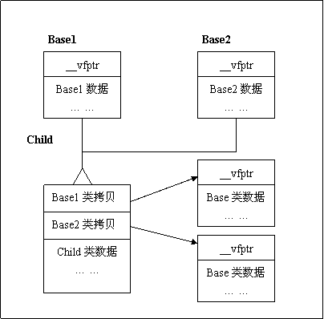
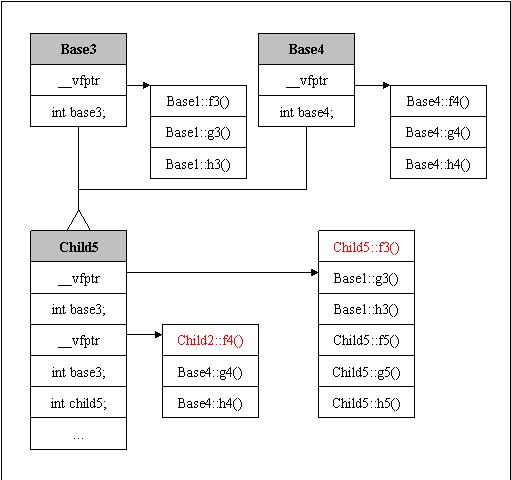
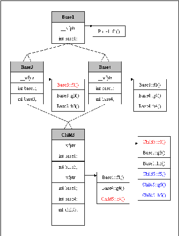

# C++类对象内存结构


 首先介绍一下C++中有继承关系的类对象内存的布局： 
在C++中，如果类中有虚函数，那么它就会有一个虚函数表的指针__vfptr，在类对象最开始的内存数据中。之后是类中的成员变量的内存数据。 

对于子类，最开始的内存数据记录着父类对象的拷贝`（包括父类虚函数表指针和成员变量）`。 之后是子类自己的成员变量数据。 

对于子类的子类，也是同样的原理。但是无论继承了多少个子类，对象中始终`只有一个`虚函数表指针。 


为了探讨C++类对象的内存布局，先来写几个类和函数 
首先写一个基类： 

```cpp
class Base
{
public:
    virtual void f()
    {
        cout << "Base::f" << endl;
    }
    virtual void g()
    {
        cout << "Base::g" << endl;
    }
    virtual void h()
    {
        cout << "Base::h" << endl;
    }
    int base;
protected:
private:
};
```


然后，我们多种不同的继承情况来研究子类的内存对象结构。 
###1. 无虚函数集继承 
 
//子类1，无虚函数重载 

```cpp
class Child1 : public Base
{
public:
    virtual void f1()
    {
        cout << "Child1::f1" << endl;
    }
    virtual void g1()
    {
        cout << "Child1::g1" << endl;
    }
    virtual void h1()
    {
        cout << "Child1::h1" << endl;
    }
    int child1;
protected:
private:
};

```

这个子类Child1没有继承任何一个基类的虚函数，因此它的虚函数表如下图： 


我们可以看出，子类的虚函数表中，先存放基类的虚函数，在存放子类自己的虚函数。 
 
###2. 有一个虚函数继承 
//子类2，有1个虚函数重载 


```cpp
class Child2 : public Base
{
public:
    virtual void f()
    {
        cout << "Child2::f" << endl;
    }
    virtual void g2()
    {
        cout << "Child2::g2" << endl;
    }
    virtual void h2()
    {
        cout << "Child2::h2" << endl;
    }
    int child2;
protected:
private:
};

```


当子类重载了父类的虚函数，则编译器会将子类虚函数表中对应的父类的虚函数替换成子类的函数。 
### 3. 全部虚函数都继承 
//子类3，全部虚函数重载 

```cpp
class Child3 : public Base
{
public:
    virtual void f()
    {
        cout << "Child3::f" << endl;
    }
    virtual void g()
    {
        cout << "Child3::g" << endl;
    }
    virtual void h()
    {
        cout << "Child3::h" << endl;
    }
protected:
    int x;
private:
};
```


###4. 多重继承 

多重继承，即类有多个父类，这种情况下的子类的内存结构和单一继承有所不同。 



我们可以看到，当子类继承了多个父类，那么子类的内存结构是这样的： 
子类的内存中，顺序 




### 5. 菱形继承 



### 6. 单一虚拟继承 


虚拟继承的子类的内存结构，和普通继承完全不同。虚拟继承的子类，有单独的虚函数表， 另外也单独保存一份父类的虚函数表，两部分之间用一个四个字节的0x00000000来作为分界。

子类的内存中，首先是自己的虚函数表，然后是子类的数据成员，然后是0x0，之后就是父类的虚函数表，之后是父类的数据成员。 

如果子类没有自己的虚函数，那么子类就不会有虚函数表，但是子类数据和父类数据之间，还是需要0x0来间隔。 

因此，在虚拟继承中，子类和父类的数据，是完全间隔的，先存放子类自己的虚函数表和数据，中间以0x分界，最后保存父类的虚函数和数据。

如果子类重载了父类的虚函数，那么则将子类内存中父类虚函数表的相应函数替换。 


### 7. 菱形虚拟继承 


## 结论： 
```sh
(1) 对于基类，如果有虚函数，那么先存放虚函数表指针，然后存放自己的数据成员；如果没有虚函数，那么直接存放数据成员。 
(2) 对于单一继承的类对象，先存放父类的数据拷贝(包括虚函数表指针)，然后是本类的数据。 
(3) 虚函数表中，先存放父类的虚函数，再存放子类的虚函数 
(4) 如果重载了父类的某些虚函数，那么新的虚函数将虚函数表中父类的这些虚函数覆盖。 
(5) 对于多重继承，先存放第一个父类的数据拷贝，在存放第二个父类的数据拷贝，一次类推，最后存放自己的数据成员。其中每一个父类拷贝都包含一个虚函数表指针。如果子类重载了某个父类的某个虚函数，那么该将该父类虚函数表的函数覆盖。另外，子类自己的虚函数，存储于第一个父类的虚函数表后边部分。 
(6) 当对象的虚函数被调用是，编译器去查询对象的虚函数表，找到该函数，然后调用
```
