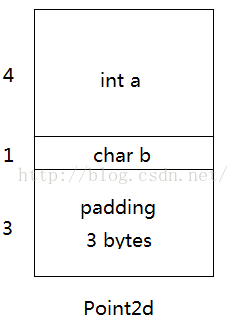
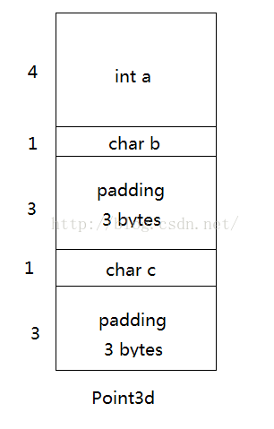
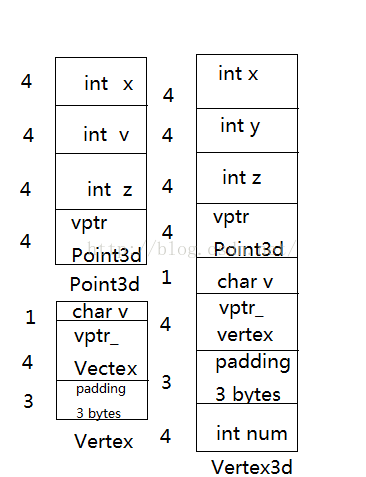

# C++四種繼承關係中內存分佈


###1、單一繼承不含虛函數

在這種情況下，對象會保持基類的原樣性，並且一個class derived class object表現出來的東西，是其自己的members加上其base classes members的總和。


```cpp
class Point2d  
{  
    int a;  
    char b;  
};  
  
class Point3d : public Point2d  
{  
    char c;  
};  
```

對於上述類，其模型如下：




###2、單一繼承含虛函數

與單一繼承不含虛函數唯一不同的是，在含有虛函數時，vptr放置的位置。如果vptr放置在起始位置處，則會表現出非自然多態。如果在在尾處，則可以自然多態。下面是一個構造的具有虛函數的繼承類。

```cpp
class Point2d
{
    int a;
    char b;
};

class Point3d : public Point2d
{
    char c;
public:
    virtual void print()
    {
        std::cout << "this is the Point2d" << std::endl;
    }
};
class Point4d : public Point3d
{
    char d;
public:
    void print() override
    {
        std::cout << "this is the Point4d" << std::endl;
    }
};
```
 對於上述類，其模型如下：
 


###3、多重繼承

多重繼承的問題主要發生於derived class objects和其第二或後繼的base class之間的轉換。他的內存分佈其實各個部分相加再加上自己的部分。

```cpp
class Point3d
{
private:
    int _x, _y, _z;
public:
    virtual void print()
    {
        std::cout << "this is the point3d" << std::endl;
    }

};

class Vertex
{
private:
    char v;
public:
    virtual void print()
    {
        std::cout << "this is the vertex" << std::endl;
    }
};

class Vertex3d : public Point3d, public Vertex
{
    int num;
};
```
對於這個類，它們的模型是：




在這個模型中，類型轉換是如何發生的呢？


```cpp
Point3d* ptrP3d1;
Vertex* ptrVtx1;
Vertex3d* ptrVtx3d1;
Vertex3d vtx3d1;
ptrP3d1 = &vtx3d1;//自然多態，不需要編譯器參與
ptrVtx1 = &vtx3d1;//非自然多態，需要編譯器參數 ptrVtx1 = (Vertex*)((char*)(&vtx3d1)+sizeof(Point3d));
ptrVtx3d1 = &vtx3d1;
ptrVtx1 = ptrVtx3d1;//非自然多態，需要編譯器 ptrVtx1 =ptrVtx3d1？(Vertex*)((char*)(ptrVtx3d1)+sizeof(Point3d))：0
```
###4、虛擬繼承

Class如果內含一個或多個virtual base class subobjects，將被分割成兩部分：一個不變區域和一個共享區域。

共享區域指的是virtual base class subobject這一部分，其位置會因為每次的派生操作而有變化。


下面我將分析一組虛擬派生繼承，以及它在vs中的內存分佈。代碼如下：

```cpp
class Point
{
    char p;
};

class Point2d : public virtual Point
{
    int a;
    int aa;
    char aaa;
};

class Point3d : public virtual Point2d
{
    int b;
public:
    virtual void print()
    {
        std::cout << "this is the Point3d" << std::endl;
    }
};

class Vertex : public virtual Point2d
{
    int c;

public:
    virtual void print()
    {
        std::cout << "this is the Vertex" << std::endl;
    }
};

class Vertex3d : public Point3d, public Vertex
{
    int d;
};
```

在這段代碼中，其所構造的模型如下：


