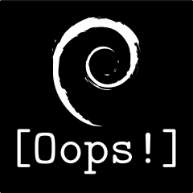

# [你所不知道的C語言](http://hackfoldr.org/dykc/): 未定義行為篇
Copyright (**慣C**) 2018 [宅色夫](http://wiki.csie.ncku.edu.tw/User/jserv)

==[直播錄影](https://www.youtube.com/watch?v=hYTHZfk1XwQ&feature=youtu.be)==


## 從 C 語言試題談起

```C=
int i = 10;
i = i++ + ++i;
```
請問 i 的值在第二行執行完後為何？

* 延伸閱讀: [萬惡的未定義行為](http://blog.ez2learn.com/2008/09/27/evil-undefined-behavior/)

C 語言沒規定 `i++` 或 `++i` 的「加 1」動作到底是在哪個敘述的哪個時刻執行，因此，不同 C 編譯器若在不同的位置 + 1，就可能導致截然不同的結果。

兩個詞彙:
* [Undefined behavior](https://en.wikipedia.org/wiki/Undefined_behavior): 程式行為並未在==語言規範==(在 C 中，自然就是 ISO/IEC 9899 一類的規格) 所明確定義規範。縮寫為 "UB"
* [Unspecified behavior](https://en.wikipedia.org/wiki/Unspecified_behavior): 程式行為仰賴==編譯器實作和平臺特性==而定

考慮以下程式碼:
```C=
void func(int *x) { return *x; }
int n = 0;
printf("%d %d %d\n", n++, n++, n++);
printf("%d %d %d\n", func(&n), func(&n), func(&n));
```

- [ ] 第 3 行的 `printf("%d %d %d\n", n++, n++, n++);` 是 Undefined behavior
- [ ] 第 4 行的 `printf("%d %d %d\n", func(&n), func(&n), func(&n));`
卻是 unspecified behavior，執行結果端視 ABI 規範 calling conventions 而定，詳見 [函式呼叫篇](https://hackmd.io/s/SJ6hRj-zg)

ISO C Standard 對 UB 的定義是:
> "behavior, upon use of a nonportable or erroneous program construct or of erroneous data, for which this International Standard imposes no requirements"

[C FAQ](http://c-faq.com/) 對 UB 則描述為:
> "Anything at all can happens; the Standard imposes no requirements. The program may fail to compile, or it may execute incorrectly (either crashing or silently generating incorrect results), or it may fortuitously do exactly what the programmer intended"


## 程式語言不都該詳細規範，怎麼會有 UB 呢？

C 語言最初為了開發 UNIX 和系統軟體而生，本質是低階的程式語言，在語言規範層級存在 UB，可允許編譯器引入更多==最佳化==。比方說 `X * 2 / 2` 在沒有 overflow 發生的時候，可最佳化為 `X`。

再看一個例子：

```C=
int func(unsigned char x)
{
    int value = 2147483600; /* assuming 32 bit int */
    value += x;
    if (value < 2147483600)
        bar();
    return value;
}
```

變數 `x` 的數值不可能是負數 (unsigned)，而在 C 語言中 signed integer overflow 是 UB，C 語言編譯器可推論 `value >= 2147483600` 總是成立，換言之，第 5 行的條件不會發生，於是編譯器可最佳化為以下等價程式碼：

```C
int foo(unsigned char x)
{
    int value = 2147483600;
    value += x;
    return value;
}
```

延伸閱讀:
* [數值系統篇](https://hackmd.io/s/BkRKhQGae): 談及 integer overflow
* [編譯器和最佳化原理篇](https://hackmd.io/s/Hy72937Me)

事實上即便是 Java 這樣強調安全的程式語言也存在若干 UB。

```C
/* Do not try to optimize this lines.
 * This is the only way you can do this
 * without undefined behavior
 */
```

Kugan Vivekanandarajah 和 Yvan Roux 的演講探討了 UB 及編譯器最佳化議題。
* 投影片 [Undefined Behavior and Compiler Optimizations – Why Your Program Stopped Working With A Newer Compiler](https://www.slideshare.net/linaroorg/bkk16503-undefined-behavior-and-compiler-optimizations-why-your-program-stopped-working-with-a-newer-compiler)
* 對應的 [演講錄影](https://www.youtube.com/watch?v=wZT20kR2AzY)

考慮以下程式碼:

```C
int d[16];
int SATD (void) {
    int satd = 0, dd, k;
    for (dd = d[k = 0]; k < 16; dd = d[++k]) {
        satd += (dd < 0 ? -dd : dd);
    }
    return satd;
} 
```

依據 [gcc PR53073](https://gcc.gnu.org/bugzilla/show_bug.cgi?id=53073) (PR 的意思是 Problem Reports)，gcc-4.8 會將上述程式碼轉譯為無窮迴圈，為什麼呢？

參照 C 語言規格 6.3.1.2 節:
* `d[++k]` 等價於 `(*((d) + (++k)))` 而
* `++k` 在 for 迴圈「預期」最後的數值為 `16`，也就是 `(*(d + 16))`

又參照到 C 語言規格 6.3.6 節:
> "Unless both the pointer operand and the result point to elements of the same array object, or the pointer operand points one past the last element of an array object and the result points to an element of the same array object, the behavior is undefined if the result is used as an operand of the unary * operator."

接下來就變得明朗，因為 C 語言指標允許指向 array (正式的寫法是 array subscripting) 的尾端，而 `(*(d + 16))` 取出的記憶體是沒有明確規範，於是編譯器就假設在 `k < 16` 條件中，`k` 不可能等於 `16`，然後產生了不會結束的迴圈。

還有一種 locale-specific behavior
> behavior that depends on local conventions of nationality, culture, and language that each implementation documents 

聽起來很玄吧？程式的執行竟然和語言、文化有關？！度量衡和小數點的寫法就是這樣的案例，北美和歐洲就不同，為此，C99 引入 [<locale.h>](https://en.wikibooks.org/wiki/C_Programming/locale.h)。範例程式碼:
```C
#include <stdio.h>
#include <locale.h>
int main(void) {
    setlocale(LC_ALL, "");
    const struct lconv * const cl = localeconv();
    printf("currency symbol is: %s\n", cl->currency_symbol);
    return 0;
}
```

近期的案例是，Apple Inc. 為了迎合中國市場的「規範」(政治正確)，原本 emoji (表情圖示) 有臺灣/中華民國國旗，但只要語系設定為中國 (簡體中文) 後，臺灣國旗的 emoji 就會在 iOS 裝置上被隱藏，以避免非戰之罪。顧及商業利益，Apple 此舉無可厚非，不過研究人員發現，可透過臺灣國旗，對 iOS 裝置做遠端攻擊，詳見 [A Remote iOS Bug](https://objective-see.com/blog/blog_0x34.html) 和 CVE-2018-4290


## 偵測 Undefined Behavior
* [UndefinedBehaviorSanitizer](https://clang.llvm.org/docs/UndefinedBehaviorSanitizer.html) (UBSan)
* [Linux 核心也引入 UBSan](https://people.freedesktop.org/~narmstrong/meson_drm_doc/dev-tools/ubsan.html)


## Undefined Behavior 的幾種類型

- [ ] Signed integer overflow

考慮以下程式碼:

```C=
#include <stdio.h>
int foo (int a) {
    if (a + 100 > a)
        printf("%d GT %dn", a + 100, a);
    else
        printf("%d LT %dn", a + 100, a);
    return 0;
}
int main () { foo(100); foo(0x7fffffff); return 0; } 
```

依據 gcc [PR30475](https://gcc.gnu.org/bugzilla/show_bug.cgi?id=30475)，在不同的編譯器最佳化等級會有不同的輸出:

* `-O0` (抑制最佳化)
```
200 GT 100
-2147483549 LT 2147483647
```
* `-O2` (預設最佳化等級)
```
200 GT 100
-2147483549 GT 2147483647
```
:::info
注意輸出字串的 `LT` 和 `GT`
:::

依據 C 語言規範，overflow of a signed value is undefined behavior，而符合規範的正確 C 程式不應產生 signed overflow。

在這個案例中，`(int + 100 > int)` 總是成立，自然上述第 6 行就被最佳化處理給移除了。

gcc 的編譯選項 `-fno-strict-overflow` 和 `-fwrapv` 可抑制這樣的行為。
```shell
$ gcc -O2 t.c -Wstrict-overflow
t.c: In function ‘foo’:
t.c:4:5: warning: assuming signed overflow
does not occur when assuming that (X + c) >= X
is always true [-Wstrict-overflow]
$ gcc -O2 t.c -fsanitize=undefined ; ./a.out
200 GT 100
t.c:5:7: runtime error: signed integer overflow: 
2147483647 + 100 cannot be represented in type 'int'
-2147483549 GT 2147483647
```

Signed integer overflow 是資訊安全挑戰的成因之一。在 LWN [GCC and pointer overflows](https://lwn.net/Articles/278137/) 提及以下案例:

```C
if (buffer + len >= buffer_end
    || buffer + len < buffer)
    die_a_gory_death("len is out of range\n"); 
```

會被最佳化為:

```C
if (buffer + len >= buffer_end)
    die_a_gory_death("len is out of range\n"); 
```
:::info
注意 `buffer + len < buffer` 的條件被移去了
:::

如果 `len` 來自使用者層級的輸入，即可以利用這弱點來攻擊 Linux 核心。不是謹慎加上各式檢查，你的程式碼就安全了，還要考慮因為 UB 而被編譯器最佳化移除檢查程式碼的可能！

- [ ] Shifting an n-bit integer by n or more bits

考慮以下程式碼:

```C
#include <stdio.h>
int foo(int x, int y) {
    x >>= (sizeof(int) << y);
    return x;
}
int main () {
    printf("%d\n", foo(1000, 3));
    return 0;
 }
```

依據 gcc [PR48418](https://gcc.gnu.org/bugzilla/show_bug.cgi?id=48418)，在不同的編譯器最佳化等級會有不同的輸出:

* `-O0` (抑制最佳化)
```shell
$ gcc t.c -O0; ./a.out
1000
```
* `-O2` (預設最佳化等級)
```shell
$ gcc t.c -O2; ./a.out
0
$ gcc -O2 t.c -fsanitize=undefined ; ./a.out
t.c:5:4: runtime error: shift exponent 32 is
too large for 32-bit type 'int'
1000
```

Note that what exactly is considered undefined differs slightly between C and C++, as well as between ISO C90 and C99. Generally, the right operand must not be negative and must not be greater than or equal to the width of the (promoted) left operand. An example of invalid shift operation is the following:
```C
int i = 23;
i <<= 32;
```

- [ ] Divide by zero

考慮以下程式碼:

```C=
#include <stdio.h>
int testdiv(int i, int k) {
    if (k == 0)
        printf("found divide by zero\n");
    return (i / k);
}
int main() {
    int i = testdiv(1, 0);
    return i;
}
```

依據 gcc [PR29968](https://gcc.gnu.org/bugzilla/show_bug.cgi?id=29968)，上述程式碼的 `k` 是除數，而編譯器假設 `k` 不該為 `0`，第 4 行的 `printf` 因而被最佳化處理移除掉。

乍看覺得是小事，但想想 Linux 核心一般複雜的程式碼。
檔案 `lib/mpi/mpi-pow.c` 原本的實作是:
```C
if (!msize)
    msize = 1 / msize;	/* provoke a signal */		
```

就可能被編譯器認定是不會執行到的程式，因而移除掉。

- [ ] Dereferencing a NULL pointer

在 LWN [Fun with NULL pointers](https://lwn.net/Articles/342330/) 提及以下 Linux 程式碼:

```C=
static unsigned int tun_chr_poll(struct file *file,
                                 poll_table * wait) {
    struct tun_file *tfile = file->private_data;
    struct tun_struct *tun = __tun_get(tfile);
    struct sock *sk = tun->sk;
    unsigned int mask = 0;

    if (!tun)
        return POLLERR;
```

似乎沒什麼問題，但若認真看第 5 行，可能致使 dereferences the pointer prior to the check. That, of course, is a bug. In the normal course of operations, the implications of this bug would be somewhat limited: it should cause a kernel oops if tun is NULL. That oops will kill the process which made the bad system call in the first place and put a scary traceback into the system log, but not much more than that should happen. It should be, at worst, a denial of service problem.



There is one little problem with that reasoning, though: NULL (zero) can actually be a valid pointer address. By default, the very bottom of the virtual address space (the "zero page," along with a few pages above it) is set to disallow all access as a way of catching null-pointer bugs (like the one described above) in both user and kernel space. But it is possible, using the mmap() system call, to put real memory at the bottom of the virtual address space. There are some valid use cases for this functionality, including running legacy binaries. Even so, most contemporary systems disable page-zero mappings through the use of the mmap_min_addr sysctl knob. 

- [ ] Pointer arithmetic that wraps

```C
unsigned char *addr = (unsigned char *) 0xfffffffe;
unsigned len = 4;

if (addr + len < addr) {
    printf("wraps\n");
} else {
    printf("no wrap\n");
}
```

在 Arm 平臺上，依據 gcc [PR54365](https://gcc.gnu.org/bugzilla/show_bug.cgi?id=54365)，在不同的編譯器最佳化等級會有不同的輸出:

* `-O0` (抑制最佳化)
```shell
$ gcc -O0 t.c; ./a.out
wraps
```
* `-O2` (預設最佳化等級)
```shell
$ gcc -O2 t.c; ./a.out
no wrap
```

- [ ] Two pointers of different types that alias
- [ ] Reading an uninitialized variable 

LLVM 之父 Chris Lattner 撰寫的系列文章 "What Every C Programmer Should Know About Undefined Behavior":
* [Part 1](http://blog.llvm.org/2011/05/what-every-c-programmer-should-know.html)
* [Part 2](http://blog.llvm.org/2011/05/what-every-c-programmer-should-know_14.html)
* [Part 3](http://blog.llvm.org/2011/05/what-every-c-programmer-should-know_21.html)

延伸閱讀
* [Undefined Behavior in 2017](https://blog.regehr.org/archives/1520)