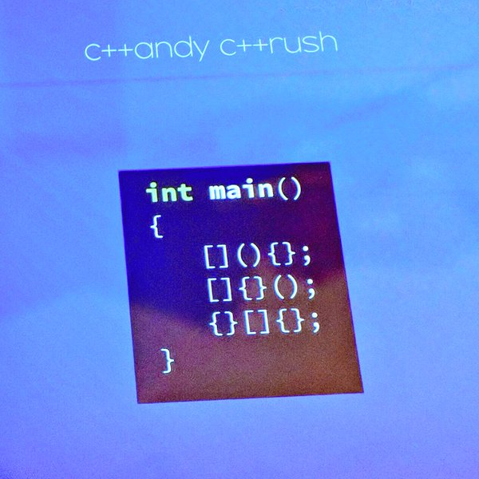
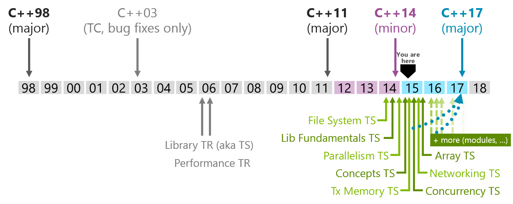

# 為何要深入學習C語言

# [你所不知道的 C 語言](http://hackfoldr.org/dykc/)：深入學習

Copyright (**慣C**) 2015 [宅色夫](http://wiki.csie.ncku.edu.tw/User/jserv)

[Jonathan Adamczewski](https://twitter.com/twoscomplement) 貼出經典著作《The C Programming Language》，然後評註說:
> "**C++: The Good Parts**"

C++ 可以美得令人不知所措 [[source](https://twitter.com/jfbastien/status/730963193799938051)]

## 為什麼我不探討 C++

* 在臺灣發文好像愛用「為什麼我不」開頭，後面可接「念研究所」、「待在大公司」等描述
* C++ 自稱為物件導向的程式語言，卻不願意對物件在執行時期的表現負責任
    * 若說 C 語言給了你足夠的繩子吊死自己，那麼 C++ 給的繩子除了夠你上吊之外，還夠綁住你身邊的朋友
    * 相較之下，Java 讓你在吊死自己之際仍有親友監視著，雖然死不了，但事後會更想死
    * [ [source](https://twitter.com/RichRogersHDS/status/666798359244611584) ]
        * In Ruby, everything is an object.
        * In Clojure, everything is a list.
        * In Javascript, everything is a terrible mistake.
        * in C, everything is a representation (unsigned char [sizeof(TYPE)]).
* Linus Torvalds [在 2010 年的解釋](http://www.realworldtech.com/forum/?threadid=104196&curpostid=104208)
* C++ 實際上已經是截然不同的程式語言
    * C++ 老爸 Bjarne Stroustrup 的文章: "[Learning Standard C++ as a New Language](http://jjhou.boolan.com/programmer-4-learning-standard-cpp.htm)"
* 最重要的是，C++ 改版飛快，C++ 17 即將推出，但我還沒看懂 C++ 98

* [ [source](https://isocpp.org/std/status) ]

## 延伸閱讀

* [沒有 C 語言之父，就沒有 Steve Jobs](http://blog.jobbole.com/92642/)
* [第一個 C 語言編譯器是怎樣編寫的？](http://blog.jobbole.com/94311/)