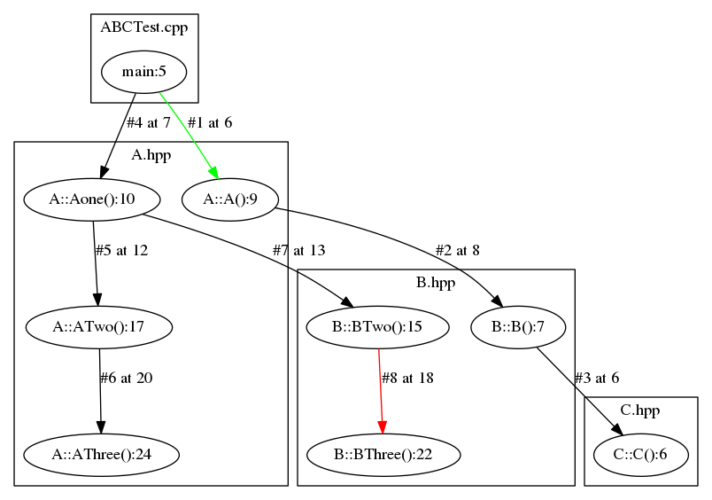

# C++源碼的調用圖生成


##主要思路

利用`gcc/g++的-finstrument-functions`的注入選項，
得到每個函數的調用地址信息，生成一個`trace文件`，
然後利用`addr2line和c++filt將函數名及其所在源碼位置`從地址中解析出來，
從而得到程序的`Call Stack`，
然後用`pygraphviz`畫出來

使用示例

比如我現在有`A.hpp、B.hpp、C.hpp、ABCTest.cpp`這幾個文件，
我想看他們的`Call Graph`

- A.hpp

```cpp
#ifndef _A_H_
#define _A_H_
#include "B.hpp"
#include "C.hpp"

struct A {
    B b;

    A() {}
    int Aone()
    {
        ATwo();
        b.BTwo();
        return 1;
    }

    int ATwo()
    {

        AThree();
        return 1;
    }

    int AThree()
    {
        return 1;
    }
};
#endif // _A_H_
```
- B.hpp

```cpp
#ifndef _B_H_
#define _B_H_
#include "C.hpp"

struct B {
    C c;
    B() {}
    int Bone()
    {
        BTwo();
        c.CTwo();
        return 1;
    }

    int BTwo()
    {

        BThree();
        return 1;
    }

    int BThree()
    {
        return 1;
    }
};
#endif // _B_H_

```

- C.hpp

```cpp
#ifndef _C_H_
#define _C_H_

struct C {

    C() {}
    int Cone()
    {
        CTwo();
        CThree();
        return 1;
    }

    int CTwo()
    {

        CThree();
        return 1;
    }

    int CThree()
    {
        return 1;
    }
};
#endif // _C_H_
```

- ABCTest.cpp

```cpp
#include "A.hpp"

int main(int argc, char *argv[])
{
    A a;
    a.Aone();
    return 0;
}
```

然後按下面編譯(instrument.c在上面github地址中可以下載，用於注入地址信息）：

```sh
g++ -g -finstrument-functions -O0 instrument.c ABCTest.cpp -o test
```

然後運行程序，得到trace.txt
輸入shell命令./test
最後
輸入shell命令
```sh
python CallGraph.py trace.txt test
```
彈出一張Call Graph




## 圖上標註含義:

- 綠線表示程序啟動後的第一次調用

- 紅線表示進入當前上下文的最後一次調用

- 每一條線表示一次調用，#符號後面的數字是序號，at XXX表示該次調用發生在這個文件（文件路徑在框上方）的第幾行

- 在圓圈裡，XXX:YYY，YYY是調用的函數名，XXX表示這個函數是在該文件的第幾行被定義的

##獲取C/C++調用關係

利用`-finstrument-functions` 編譯選項，
可以讓編譯器在每個函數的開頭和結尾註入`__cyg_profile_func_enter`和 `__cyg_profile_func_exit
`這兩個函數的實現由用戶定義

在本例中，只用到`__cyg_profile_func_enter`，定義在instrument.c中，
其函數原型如下:
`void __cyg_profile_func_enter (void *this_fn, void *call_site);`
其中this_fn為 被調用的地址，call_site為 調用方的地址

顯然，假如我們把所有的 調用方和被調用方的地址 都打印出來，
就可以得到一張完整的運行時Call Graph

因此，我們的instrument.c實現如下：


```c
/* Function prototypes with attributes */
void main_constructor( void )
    __attribute__ ((no_instrument_function, constructor));

void main_destructor( void )
    __attribute__ ((no_instrument_function, destructor));

void __cyg_profile_func_enter( void *, void * )
    __attribute__ ((no_instrument_function));

void __cyg_profile_func_exit( void *, void * )
    __attribute__ ((no_instrument_function));

static FILE *fp;

void main_constructor( void )
{
  fp = fopen( "trace.txt", "w" );
  if (fp == NULL) exit(-1);
}

void main_deconstructor( void )
{
  fclose( fp );
}

void __cyg_profile_func_enter( void *this_fn, void *call_site )
{
    /* fprintf(fp, "E %p %p\n", (int *)this_fn, (int *)call_site); */
    fprintf(fp, "%p %p\n", (int *)this_fn, (int *)call_site);
}
```

其中main_constructor在 調用main 前執行，main_deconstructor在調用main後執行，
以上幾個函數的作用就是 將所有的 調用方和被調用方的地址 寫入trace.txt中

然而，現在有一個問題，就是trace.txt中保存的是地址，我們如何將地址翻譯成源碼中的符號？
答案就是用addr2line

以上面ABCTest.cpp工程為例，比如我們現在有地址0x400974，輸入以下命令

```sh
addr2line 0x400aa4 -e a.out -f
```


```sh
_ZN1A4AOneEv
/home/cheukyin/PersonalProjects/CodeSnippet/python/SRCGraphviz/c++/A.hpp:11
```

第一行該地址所在的函數名，第二行為函數所在的源碼位置

然而，你一定會問，_ZN1A4AOneEv是什麼鬼？
為實現重載、命名空間等功能，因此`C++有name mangling`，因此函數名是不可讀的

我們需要利用c++filt作進一步解析：
```sh
輸入shell命令 addr2line 0x400aa4 -e a.out -f | c++filt
```

經過上面的步驟，我們已經可以把所有的(調用方, 被調用方)對分析出來了，相當於獲取到調用圖所有的節點和邊，
最後可以用`pygraphviz`將 每一條調用關係 畫出來即可，代碼用python實現在 CallGraph.py 中

- CallGraph.py

```py
import os
import sys
import tempfile
import webbrowser
import pygraphviz as pgv
import pdb

def addr2sym(addr, exe):
    cmd = "addr2line " + addr + " -e " + exe + "  -f | c++filt"
    return os.popen(cmd).read().split()

def src_lineno_process(pos, isCallSite):
    src, lineno = pos.split(':')
    src = src.split( os.getcwd()+'/' )[-1]
    if(isCallSite):
        lineno = str( int(lineno)-1 )
    return [src, lineno]

def parseTrace(tracefile, exe):
    curdir = os.getcwd()
    callStack = []

    with open(tracefile , 'r') as trace:
        for record in trace.readlines():
            fnAddr, callSiteAddr = record.split()

            fn, fn_pos = addr2sym(fnAddr, exe)
            fn_pos = src_lineno_process(fn_pos, False)

            callsite, callsite_pos = addr2sym(callSiteAddr, exe)
            callsite_pos = src_lineno_process(callsite_pos, True)

            callStack.append([callsite, callsite_pos, fn, fn_pos])
    return callStack


def callGraphDraw(callStack):
    G = pgv.AGraph(strict=False, directed=True)

    node_set = set()
    subgraph_set = {}

    for index, \
        [ callsite, [callsite_src, callsite_lineno], \
          fn, [fn_src, fn_lineno] ] \
        in enumerate(callStack):

        node = '{0}:{1}'.format(fn_src, fn)
        if node not in node_set:
            node_set.add(node)
            if fn_src not in subgraph_set:
                subgraph_set[fn_src] = G.add_subgraph(
                    name = 'cluster' + fn_src,
                    label = fn_src
                )
            subgraph = subgraph_set[fn_src]
            subgraph.add_node(
                node,
                label='{0}:{1}'.format(fn, fn_lineno)
            )

        callsite_node = '{0}:{1}'.format(callsite_src, callsite)
        if callsite_node not in node_set:
            continue

        if index == 1:
            color = 'green'
        elif index == len(callStack) - 1:
            color = 'red'
        else:
            color = 'black'

        # import pdb;pdb.settrace()
        G.add_edge(
            '{0}:{1}'.format(callsite_src, callsite),
            '{0}:{1}'.format(fn_src, fn),
            color = color,
            ltail = subgraph_set[fn_src].name,
            lhead = subgraph_set[callsite_src].name,
            label = '#{0} at {1}'.format(index, callsite_lineno)
        )

    fd, name = tempfile.mkstemp('.png')

    G.draw(name, prog='dot')
    G.close()

    webbrowser.open('file://' + name)

if __name__ == "__main__":
    tracefile = sys.argv[1]
    exe = sys.argv[2]
    callGraphDraw( parseTrace(tracefile, exe) )
```