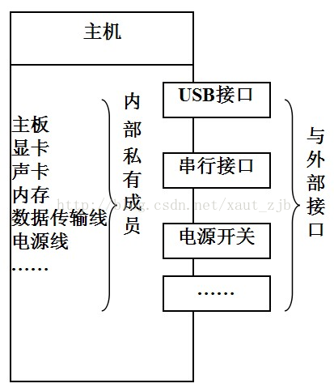

# c++面向對象設計的SOLID原則

SRP The Single Responsibility Principle 單一責任原則

OCP The Open Closed Principle 開放封閉原則

LSP The Liskov Substitution Principle 里氏替換原則

DIP The Dependency Inversion Principle 依賴倒置原則

ISP The Interface Segregation Principle 接口分離原則

 

##單一責任原則： 

當需要修改某個類的時候原因有且只有一個。換句話說就是讓一個類只做一種類型責任，當這個類需要承當其他類型的責任的時候，就需要分解這個類。 

##開放封閉原則：

軟件實體應該是可擴展，而不可修改的。也就是說，對擴展是開放的，而對修改是封閉的。這個原則是諸多面向對象編程原則中最抽象、最難理解的一個。

##里氏替換原則：

當一個子類的實例應該能夠替換任何其超類的實例時，它們之間才具有is-A關係 

##依賴倒置原則：

1、高層模塊不應該依賴於低層模塊，二者都應該依賴於抽象 

2、抽象不應該依賴於細節，細節應該依賴於抽象 

##接口分離原則： 

不能強迫用戶去依賴那些他們不使用的接口。換句話說，使用多個專門的接口比使用單一的總接口總要好。 

 

面向對象的主要進步就是實現了數據的封裝和隱藏。從外部看對象就像一個“黑匣子”，數據和方法是隱蔽的、看不見的。當用戶使用對象時，不必知道對象的具體實現細節，只需要根據對象提供的外部接口訪問對象即可。

封裝：是指將對象的數據和與這個數據有關的操作放在一起。各個對象之間相互獨立，互不幹擾。對象只留少量的接口，以便與外部聯繫。

封裝應具有以下幾個特點：

具有一個清楚的邊界，私有成員封裝在內部，外部不可以訪問提供必要的接口

對象內部的數據和方法是受封裝外殼保護的，其它對象不能直接使用。

