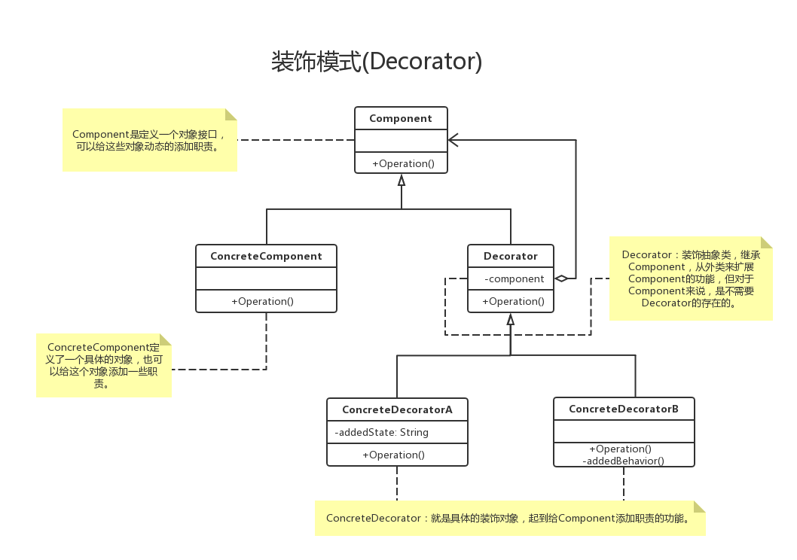

# 裝飾者模式

### 一. 基礎概念

1. 定義
    - 裝飾模式指的是在不必改變原類文件和使用繼承的情況下，動態地擴展一個對象的功能。它是通過創建一個包裝對象，也就是裝飾來包裹真實的對象。


2. 特點
    - 裝飾對象和真實對象有相同的接口。這樣客戶端對象就能以和真實對象相同的方式和裝飾對象交互。
    - 裝飾對象包含一個真實對象的引用（reference）
    - 裝飾對象接受所有來自客戶端的請求。它把這些請求轉發給真實的對象。
    - 裝飾對象可以在轉發這些請求以前或以後增加一些附加功能。這樣就確保了在運行時，不用修改給定對象的結構就可以在外部增加附加的功能。在面向對象的設計中，通常是通過繼承來實現對給定類的功能擴展。

3. 優點
    - Decorator模式與繼承關係的目的都是要擴展對象的功能，但是Decorator可以提供比繼承更多的靈活性。
    - 通過使用不同的具體裝飾類以及這些裝飾類的排列組合，設計師可以創造出很多不同行為的組合。

4. 缺點
    - 這種比繼承更加靈活機動的特性，也同時意味著更加多的複雜性。
    - 裝飾模式會導致設計中出現許多小類，如果過度使用，會使程序變得很複雜。
    - 裝飾模式是針對抽象組件（Component）類型編程。但是，如果你要針對具體組件編程時，就應該重新思考你的應用架構，以及裝飾者是否合適。當然也可以改變Component接口，增加新的公開的行為，實現“半透明”的裝飾者模式。在實際項目中要做出最佳選擇。

5. 設計原則
    - 多用組合，少用繼承。利用繼承設計子類的行為，是在編譯時靜態決定的，而且所有的子類都會繼承到相同的行為。然而，如果能夠利用組合的做法擴展對象的行為，就可以在運行時動態地進行擴展。
    - 類應設計的對擴展開放，對修改關閉。

6. 簡化
    - 如果只有一個Concrete Component類而沒有抽象的Component接口時，可以讓Decorator繼承Concrete Component。
    - 如果只有一個Concrete Decorator類時，可以將Decorator和Concrete Decorator合併。
    
7. 與其他設計模式區別
    - 關於新職責：適配器也可以在轉換時增加新的職責，但主要目的不在此。裝飾者模式主要是給被裝飾者增加新職責的。
    - 關於原接口：適配器模式是用新接口來調用原接口，原接口對新系統是不可見或者說不可用的。裝飾者模式原封不動的使用原接口，系統對裝飾的對象也通過原接口來完成使用。（增加新接口的裝飾者模式可以認為是其變種--“半透明”裝飾者）
    - 關於其包裹的對象：適配器是知道被適配者的詳細情況的（就是那個類或那個接口）。裝飾者只知道其接口是什麼，至於其具體類型（是基類還是其他派生類）只有在運行期間才知道。

8. 應用場景
    - 需要擴展一個類的功能，或給一個類添加附加職責。
    - 需要動態的給一個對象添加功能，這些功能可以再動態的撤銷。
    - 需要增加由一些基本功能的排列組合而產生的非常大量的功能，從而使繼承關係變的不現實。
    - 當不能採用生成子類的方法進行擴充時。一種情況是，可能有大量獨立的擴展，為支持每一種組合將產生大量的子類，使得子類數目呈爆炸性增長。另一種情況可能是因為類定義被隱藏，或類定義不能用於生成子類。
    
### 二. 代碼示例

1. 使用裝飾模式設計服裝搭配系統

- 定義Person類
```
    public class Person {
        /**
         * 姓名
         */
        private String name;
    
        public Person(String name) {
            this.name = name;
        }
    
        public Person() {}
    
        public void show () {
            System.out.print(name);
        }
    
        public String getName() {
            return name;
        }
    
        public void setName(String name) {
            this.name = name;
        }
    }
```

- 定義裝飾類, 擴展Person類
```
    /**
     * 裝飾類
     */
    public class DressDecorator extends Person {
    
        private Person person;
        
        /**
         * 添加裝飾
         * @param person
         */
        public void decorator (Person person) {
            this.person = person;
        }
    
        @Override
        public void show () {
            if (this.person != null) {
                this.person.show();
            }
        }
    
    }
```

- 實現裝飾
```
    public class TShirts extends DressDecorator {
    
        @Override
        public void show () {
            System.out.println("T恤");
            super.show();
        }
    }
```

- 測試
```
    public static void main(String[] args) {
        Person person = new Person("K.O");
        BigTrouser trouser = new BigTrouser();
        TShirts tShirts = new TShirts();

        //裝飾過程
        trouser.decorator(person);
        tShirts.decorator(trouser);

        tShirts.show();
    }
```