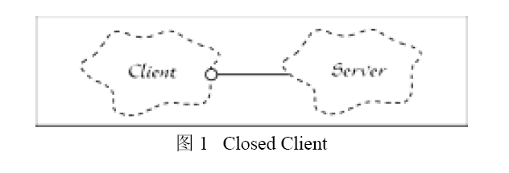

# <總結> 設計模式之 開放封閉原則OCP C++示例


開放封閉原則

系統在添加新的需求的時候能夠儘可能做到，只是添加新的代碼 open for extension，而不需要修改原有模塊代碼 closed for modification




通過提取基類的方法，client 調用server 抽象基類abstract server的抽象接口，從而更換不同sever的時候，client的調用server的代碼都不需要改動，接口不變，

只是server內容變化。


例子，

一個繪製函數，要求能夠針`對輸入的不同對象，調用不同的繪製函數`，如能夠繪製矩形，圓形，適當調用矩形繪製函數，圓形繪製函數。

###1.用c語言實現

這個例子其實給出了，`c語言模擬c++類繼承的方法。利用指針的強制轉換`,因為指針僅僅是地址可以指向任何對象，利用指針強制轉換，告訴編譯器具體按什麼對象處理指針所指。


```cpp
/*Procedural Solution to the Square/Circle Problem*/

typedef enum {circle, square} ShapeType;

struct Shape {
    ShapeType itsType;
};

struct Circle {
    ShapeType itsType;
    double itsRadius;
    // Point itsCenter;
};

struct Square {
    ShapeType itsType;
    double itsSide;
    // Point itsTopLeft;
};

void DrawSquare(struct Square* S) {}
void DrawCircle(struct Circle* C) {}

typedef struct Shape *ShapePointer;

void DrawAllShapes(ShapePointer list[], int n)
{
    int i;

    for (i = 0; i < n; i++) {
        struct Shape* s = list[i];

        switch (s->itsType) {
        case square:
            DrawSquare((struct Square*)s);
            break;

        case circle:
            DrawCircle((struct Circle*)s);
            break;
        }
    }
}

int main(int argc, char* argv[])
{

    return 0;
}

```

上面的代碼不符合open close法則，因為新加入其它的shape如橢圓， DrawAllShapes函數就需要變化。

###2. C++的實現

```cpp
#include <iostream>
#include <set>
#include <iterator>

using namespace std;

/*OOD solution to Square/Circle problem.*/
class Shape
{
public:
    virtual void Draw() const = 0;
};

class Square : public Shape
{
public:
    virtual void Draw() const;
};

class Circle : public Shape
{
public:
    virtual void Draw() const;
};

void DrawAllShapes(std::set<Shape*>& list)
{
    for (std::set<Shape*>::iterator it = list.begin(); it != list.end(); ++it) {
        (*it)->Draw();
    }
}

int main(int argc, char *argv[])
{
    
    return 0;
}
```


`但是事實上如果有新的需求變化，DrawAllShapes也無法做到完全不變，任何模塊只能是相對封閉，無法完全封閉。`

例如我們有新的需求，`要求繪製圖形列表的時候，一種形狀的圖形要在另一種圖形前面繪製`。

解決方法，加入` 順序抽象類`