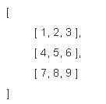

## 本章數組和隊列的習題

**1、不用除法運算**


兩個數組a[N]，b[N]，其中A[N]的各個元素值已知，現給b[i]賦值，b[i] = a[0]*a[1]*a[2]...*a[N-1]/a[i]；
要求：
 - 1.不準用除法運算
 - 2.除了循環計數值，a[N],b[N]外，不準再用其他任何變量（包括局部變量，全局變量等）
 - 3.滿足時間複雜度O(n)，空間複雜度O(1)。

提示：題目要求b[i] = a[0]*a[1]*a[2]...*a[N-1]/a[i] ，相當於求：a[0]*a[1]*a[2]*a[3]...a[i-1]*a[i+1]..*a[N-1]，等價於除掉當前元素a[i]，其他所有元素(a[i]左邊部分，和a[i]右邊部分)的積。

記left[i]=∏a[k], (k=1...i-1); right=∏a[k], (k=i+1...n)，根據題目描述b[i]=left[i] * right[i]， 對於每一個b[i]初始化為1，left[i]和right[i]兩部分可以分開兩次相乘，即對於循環變量i=1...n, b[i]=left[i];b[n-i]=right[n-i]， 循環完成時即可完成計算。

參考代碼如下所示：
```c
void Multiplication(int a[], int output[], int length)
{
	int left = 1;
	int right = 1;
	for (int i = 0; i < length; i++)
		output[i] = 1;
	for (int i = 0; i < length; i++)
	{
		output[i] *= left;
		output[length - i - 1] *= right;
		left *= a[i];
		right *= a[length - i - 1];
	}
}
```

**3、找出數組中唯一的重複元素**

1-1000放在含有1001個元素的數組中，只有唯一的一個元素值重複，其它均只出現一次。
每個數組元素只能訪問一次，設計一個算法，將它找出來；不用輔助存儲空間，能否設計一個算法實現？

**4、找出唯一出現的數**

一個數組裡，數都是兩兩出現的，但是有三個數是唯一出現的，找出這三個數。


**5、找出反序的個數**

給定一整型數組，若數組中某個下標值大的元素值小於某個下標值比它小的元素值，稱這是一個反序。
即：數組a[]; 對於i < j 且 a[i] > a[j],則稱這是一個反序。
給定一個數組，要求寫一個函數，計算出這個數組裡所有反序的個數。


**6、**

有兩個序列A和B,A=(a1,a2,...,ak),B=(b1,b2,...,bk),A和B都按升序排列，對於1<=i,j<=k，求k個最小的（ai+bj），要求算法儘量高效。

**8**

假設一個大小為100億個數據的數組，該數組是從小到大排好序的，現在該數組分成若干段，每個段的數據長度小於20「也就是說：題目並沒有說每段數據的size 相同，只是說每個段的 size < 20 而已」，然後將每段的數據進行亂序（即：段內數據亂序），形成一個新數組。請寫一個算法，將所有數據從小到大進行排序，並說明時間複雜度。

**9**

20個排序好的數組，每個數組500個數，按照降序排序好的，讓找出500個最大的數。


**10**

O(1)空間內實現矩陣轉置。


**11**

有N個數，組成的字符串，如012345，求出字串和取MOD3==0的子串，如012 12 123 45。

**12**

從一列數中篩除儘可能少的數使得從左往右看，這些數是從小到大再從大到小的。

提示：雙端 LIS 問題，用 DP 的思想可解。


**13**

有兩個序列a,b，大小都為n,序列元素的值是任意整數，無序。要求：通過交換a,b中的元素，使[序列a元素的和]與[序列b元素的和]之間的差最小。

例如:

var a=[100,99,98,1,2, 3];

var b=[1, 2, 3, 4,5,40]。

**14、螺旋矩陣**

Given a matrix of m x n elements (m rows, n columns), return all elements of the matrix in spiral order。一句話，即為螺旋矩陣問題。

舉個例子，給定如下的一個矩陣:



你應該返回：[1,2,3,6,9,8,7,4,5]。如下圖所示，遍歷順序為螺旋狀：


**15**

給你10分鐘時間，根據上排給出十個數，在其下排填出對應的十個數 要求下排每個數都是先前上排那十個數在下排出現的次數。 

上排的十個數如下： 

0，1，2，3，4，5，6，7，8，9

舉一個例子， 

數值: 0,1,2,3,4,5,6,7,8,9 

分配: 6,2,1,0,0,0,1,0,0,0 

0在下排出現了6次，1在下排出現了2次，

2在下排出現了1次，3在下排出現了0次.... 

以此類推..


**16**

對於一個整數矩陣，存在一種運算，對矩陣中任意元素加一時，需要其相鄰（上下左右），某一個元素也加一，現給出一正數矩陣，判斷其是否能夠由一個全零矩陣經過上述運算得到。

**17**

一個整數數組，長度為n，將其分為m份，使各份的和相等，求m的最大值。

比如{3，2，4，3，6} 可以分成
- {3，2，4，3，6} m=1; 
- {3,6}{2,4,3} m=2
- {3,3}{2,4}{6} m=3 

所以m的最大值為3。

**18**

求一個數組的最長遞減子序列 比如{9，4，3，2，5，4，3，2}的最長遞減子序列為{9，5，4，3，2}。


**19**

如何對n個大小都小於100的整數進行排序，要求時間複雜度O(n)，空間複雜度O(1)。

**20**

輸入一個正數n，輸出所有和為n連續正數序列。例如輸入15，由於1+2+3+4+5=4+5+6=7+8=15，所以輸出3個連續序列1-5、4-6和7-8。

**21、找出數組中兩個只出現一次的數字**

一個整型數組裡除了兩個數字之外，其他的數字都出現了兩次。請寫程序找出這兩個只出現一次的數字。要求時間複雜度是O(n)，空間複雜度是O(1)。

**22、找出數組中兩個只出現一次的數字**

題目：一個整型數組裡除了兩個數字之外，其他的數字都出現了兩次。
請寫程序找出這兩個只出現一次的數字。要求時間複雜度是O(n)，空間複雜度是O(1)。


**23、把數組排成最小的數**

輸入一個正整數數組，將它們連接起來排成一個數，輸出能排出的所有數字中最小的一個。例如輸入數組{32, 321}，則輸出這兩個能排成的最小數字32132。

**24、旋轉數組中的最小元素**

把一個數組最開始的若干個元素搬到數組的末尾，我們稱之為數組的旋轉。輸入一個排好序的數組的一個旋轉，輸出旋轉數組的最小元素。例如數組{3, 4, 5, 1, 2}為{1, 2, 3, 4, 5}的一個旋轉，該數組的最小值為1。

提示：從頭到尾遍歷數組一次，就能找出最小的元素，時間複雜度顯然是O(N)。但這個思路沒有利用輸入數組的特性，請讀者繼續思考更好的解法。

**25**

N個雞蛋放到M個籃子中，籃子不能為空，要滿足：對任意不大於N的數量，能用若干個籃子中雞蛋的和表示。

寫出函數，對輸入整數N和M，輸出所有可能的雞蛋的放法。

比如對於9個雞蛋5個籃子
解至少有三組：
1 2 4 1 1
1 2 2 2 2
1 2 3 2 1

**26**

請把一個整形數組中重複的數字去掉。例如： 

1,   2,   0,   2,   -1,   999,   3,   999,   88 

答案應該是： 

1,   2，   0，   -1，   999，   3，   88


**27**

有一臺機器，上面有m個儲存空間。然後有n個請求，第i個請求計算時需要佔 R[i]個空間，儲存計算結果則需要佔據O[i]個空間（據O[i]個空間（其中O[i]<R[i]）。問怎麼安排這n個請求的順序，使得所有請求都能完成。你的算法也應該能夠判斷出無論如何都不能處理完的情況。

比方說，m=14，n=2，R[1]=10，O[1]=5，R[2]=8，O[2]=6。在這個例子中，我們可以先運行第一個任務，剩餘9個單位的空間足夠執行第二個任務；但如果先走第二個任務，第一個任務執行時空間就不夠了，因為10>14-6。

**28**

在一維座標軸上有n個區間段，求重合區間最長的兩個區間段。

**29**

如果用一個循環數組q[0..m-1]表示隊列時,該隊列只有一個隊列頭指針front,不設隊列尾指針rear，求這個隊列中從隊列投到隊列尾的元素個數（包含隊列頭、隊列尾）。


**30**

給定一個實數數組，按序排列（從小到大）,從數組從找出若干個數，使得這若干個數的和與M最為接近，描述一個算法，並給出算法的複雜度。

有N個正實數(注意是實數，大小升序排列) x1 , x2 ... xN，另有一個實數M。 需要選出若干個x，使這幾個x的和與 M 最接近。 請描述實現算法，並指出算法複雜度。


**31**

有無序的實數列V[N]，要求求裡面大小相鄰的實數的差的最大值，關鍵是要求線性空間和線性時間。


**32**

一個數組保存了N個結構，每個結構保存了一個座標，結構間的座標都不相同，請問如何找到指定座標的結構（除了遍歷整個數組，是否有更好的辦法）？

提示：要麼預先排序，二分查找。要麼哈希。hash的話，座標(x,y)你可以當做一個2位數，寫一個哈希函數，把（x,y）直接轉成“(x,y)”作為key，默認用string比較。或如Edward Lee所說，將座標(x, y)作為 Hash 中的 key。例如(m, n)，通過 (m,n) 和 (n, m) 兩次查找看是否在 HashMap 中。也可以在保存時就規定 (x, y) , x < y ，在插入之前做個判斷。


**33**

現在有1千萬個隨機數，隨機數的範圍在1到1億之間。現在要求寫出一種算法，將1到1億之間沒有在隨機數中的數求出來。

提示：編程珠璣上有此類似的一題，如果有足夠的內存的話可以用位圖法，即開一個1億位的bitset，內存為100m/8== 12.5m, 然後如果一個數有出現，對應的bitset上標記為1，最後統計bitset上為0的即可。


**34**

有Ｎ＋２個數，N個數出現了偶數次，２個數出現了奇數次（這兩個數不相等），問用O（1）的空間複雜度，找出這兩個數，不需要知道具體位置，只需要知道這兩個值。

提示：xor一次，得到2個奇數次的數之和x。第二步，以x（展開成二進制）中有1的某位（假設第i位為1）作為劃分，第二次只xor第i位為1的那些數，得到y。然後x xor y以及y便是那兩個數。 


**35**

一個整數數組，有n個整數，如何找其中m個數的和等於另外n-m個數的和？


**36**

一個數組，裡面的數據兩兩相同，只有兩個數據不同，要求找出這兩個數據。要求時間複雜度0（N）空間複雜度O（1）。

**37**

一個環形公路，上面有Ｎ個站點，A1, ..., AN，其中Ai和Ai+1之間的距離為Di,AN和A1之間的距離為D0。
高效的求第i和第j個站點之間的距離，空間複雜度不超過O(N)。


**38**

將一個較大的錢，不超過1000000(10^6)的人民幣，兌換成數量不限的100、50、10、5、2、1的組合，請問共有多少種組合呢？


**39**

對於一個數組{1,2,3}它的子數組有{1,2}，{1,3}{2,3}，{1,2,3}，元素之間可以不是連續的，對於數組{5,9,1,7,2,6,3,8,10,4}，升序子序列有多少個？

或者換一種表達為：數組int a[]={5,9,1,7,2,6,3,8,10,4}  。求其所有遞增子數組(元素相對位置不變)的個數，   例如：{5，9}，{5，7，8，10}，{1，2，6，8}。


**40**

M*M的方格矩陣，其中有一部分為障礙，八個方向均可以走，現假設矩陣上有Q+1節點，從(X0，Y0)出發到其他Q個節點的最短路徑。
其中，1<=M<=1000，1<=Q<=100。


**41**

設子數組A[0:k]和A[k+1:N-1]已排好序(0≤K≤N-1)。試設計一個合併這2個子數組為排好序的數組A[0:N-1]的算法。要求算法在最壞情況下所用的計算時間為O(N)，只用到O(1)的輔助空間。

提示：此題來源於在高德納的計算機程序設計藝術第三卷第五章排序。


**42**

一個數組[1,2,3,4,6,8,9,4,8,11,18,19,100]
前半部分是是一個遞增數組，後面一個還是遞增數組，但整個數組不是遞增數組，那麼怎麼最快的找出其中一個數？


**43**

數組中的數分為兩組，讓給出一個算法，使得兩個組的和的差的絕對值最小，數組中的數的取值範圍是0<x<100，元素個數也是大於0， 小於100 。

比如a[]={2,4,5,6,7},得出的兩組數｛2，4，6｝和｛5，7｝，abs(sum(a1)-sum(a2))=0；

比如｛2，5，6，10｝，abs（sum(2,10)-sum(5,6))=1,所以得出的兩組數分別為｛2，10｝和｛5，6｝。


**44**

從1....n中隨機輸出m個不重複的數


**45**

數組al[0,mid-1] 和 al[mid,num-1]，都分別有序。將其merge成有序數組al[0,num-1]，要求空間複雜度O(1)。


**46、求旋轉數組的最小元素**

把一個數組最開始的若干個元素搬到數組的末尾，我們稱之為數組的旋轉。輸入一個排好序的數組的一個旋轉，輸出旋轉數組的最小元素。例如數組{3, 4, 5, 1, 2}為{1, 2, 3, 4, 5}的一個旋轉，該數組的最小值為1。


**47**

在一個平面座標系上，有兩個矩形，它們的邊分別平行於X和Y軸。
其中，矩形A已知， ax1(左邊), ax2（右邊）, ay1（top的縱座標）, ay2（bottom縱座標）. 矩形B，類似，就是 bx1, bx2, by1, by2。這些值都是整數就OK了。
要求是，如果矩形沒有交集，返回-1， 有交集，返回交集的面積。
int area(rect const& a, rect const& b)
{
  ...
}


**48**

一個數組裡，數都是兩兩出現的，但是有三個數是唯一出現的，找出這三個數。

提示：3個數唯一出現，各不相同。由於x與a、b、c都各不相同，因此x^a、x^b、x^c都不等於0。所以無法簡單的用異或解決此問題。


**49、計算逆序數組對**

給定一整型數組，若數組中某個下標值大的元素值小於某個下標值比它小的元素值，稱這是一個反序。
即：數組a[]; 對於i < j 且 a[i] > a[j],則稱這是一個反序。
給定一個數組，要求寫一個函數，計算出這個數組裡所有反序的個數。


**50**

有兩個序列A和B,A=(a1,a2,...,ak),B=(b1,b2,...,bk),A和B都按升序排列，對於1<=i,j<=k，求k個最小的（ai+bj），要求算法儘量高效。


**51**

有20個數組，每個數組裡面有500個數組，降序排列，每個數字是32位的unit,求出這10000個數字中最大的500個。


**52**

100個任務，100個工人每人可做一項任務，每個任務每個人做的的費用為t[100][100],求一個分配任務的方案使得總費用最少。

提示：匈牙利算法。


**53**

尋找3個數的中位數

提示：可以採用兩兩比較的思路。


**54**

給定一數組，輸出滿足2a=b（a，b代表數組中的數）的數對，要求時間複雜度儘量低。


**55**

1萬個元素的數組，90%的元素都是1到100的數，10%的元素是101--10000的數，如何高效排序。


**56**

一個有序數組（從小到大排列），數組中的數據有正有負，求這個數組中的最小絕對值。


**57**

等價於n*n的矩陣，填寫0，1，要求每行每列的都有偶數個1 （沒有1也是偶數個），問有多少種方法。


**58**

數組裡找到和最接近於0的兩個值。


**59**

N個數組，每個數組中的元素都是遞增的順序，現在要找出這N個數組中的公共元素部分，如何做? 注：不能用額外輔助空間。


**60**

二重歌德巴赫猜想

所有大於等於6的偶數都可以表示成兩個（奇）素數之和。

給定1-10000，找到可以用兩個素數之和表示每一個偶數的兩個素數，然後輸出這兩個素數，如果有多對，則只需要輸出其中之一對即可。

**61**

N個整數（數的大小為0-255）的序列，把它們加密為K個整數（數的大小為0-255）.再將K個整數順序隨機打亂，使得可以從這亂序的K個整數中解碼出原序列。設計加密解密算法,且要求K<=15*N.

如果是：
- N<=16,要求K<=16*N.
- N<=16,要求K<=10*N.
- N<=64,要求K<=15*N.

**62**

兩個無序數組分別叫A和B，長度分別是m和n，求中位數，要求時間複雜度O(m+n)，空間複雜度O(1) 。


**63**

假設一個大小為100億個數據的數組，該數組是從小到大排好序的，現在該數組分成若干段，每個段的數據長度小於20「也就是說：題目並沒有說每段數據的size 相同，只是說每個段的 size < 20 而已」，然後將每段的數據進行亂序（即：段內數據亂序），形成一個新數組。

請寫一個算法，將所有數據從小到大進行排序，並說明時間複雜度。


**64**

20個排序好的數組，每個數組500個數，按照降序排序好的，讓找出500個最大的數。


**65**

請自己用雙向鏈表實現一個隊列，隊列裡節點內存的值為int，要求實現入隊，出隊和查找指定節點的三個功能。


**66**

n個數字（0,1,…,n-1）形成一個圓圈，從數字0開始，每次從這個圓圈中刪除第m個數字（第一個為當前數字本身，第二個為當前數字的下一個數字）。

當一個數字刪除後，從被刪除數字的下一個繼續刪除第m個數字。求出在這個圓圈中剩下的最後一個數字。


**67、在從1到n的正數中1出現的次數**

輸入一個整數n，求從1到n這n個整數的十進制表示中1出現的次數。

例如輸入12，從1到12這些整數中包含1 的數字有1，10，11和12，1一共出現了5次。


**68**

對於給定的整數集合S，求出最大的d，使得a+b+c=d。a,b,c,d互不相同，且都屬於S。集合的元素個數小於等於2000個，元素的取值範圍在[-2^28，2^28 - 1]，假定可用內存空間為100MB，硬盤使用空間無限大，試分析時間和空間複雜度，找出最快的解決方法。

提示：兩兩相加轉為多項式乘法，比如(1 2 4 6) + (2 3 4 5) => (x + x^2 + x^4 + x^6)*(x^2 + x^3 + x^4 + x^5) 。

**69**

長度為N的數組亂序存放著0帶N-1.現在只能進行0與其他數的swap操作，請設計並實現排序，必須通過交換實現排序。


**70**

輸入是兩個整數數組，他們任意兩個數的和又可以組成一個數組，求這個和中前k個數怎麼做？

分析：假設兩個整數數組為A和B，各有N個元素，任意兩個數的和組成的數組C有N^2個元素。那麼可以把這些和看成N個有序數列：
       
              A[1]+B[1] <= A[1]+B[2] <= A[1]+B[3] <=…
              
              A[2]+B[1] <= A[2]+B[2] <= A[2]+B[3] <=…
              
              …
              
             A[N]+B[1] <= A[N]+B[2] <= A[N]+B[3] <=…
             
問題轉變成，在這N個有序數列裡，找到前k小的元素”。


**71、求500萬以內的所有親和數**

如果兩個數a和b，a的所有真因數之和等於b,b的所有真因數之和等於a,則稱a,b是一對親和數。 例如220和284，1184和1210，2620和2924。

**72、楊輝三角的變形**

        1
        
     1   1  1
     
  1  2   3  2  1
  
1  3  6   7  6  3  1

以上三角形的數陣，第一行只有一個數1，以下每行的每個數，是恰好是它上面的數，左上的數和右上數等3個數之和（如果不存在某個數，認為該數就是0）。

求第n行第一個偶數出現的位置。如果沒有偶數，則輸出-1。例如輸入3,則輸出2，輸入4則輸出3。


**73、三元組的數量**

{5 3 1}和{7 5 3}是2組不同的等差三元組，除了等差的性質之外，還有個奇妙的地方在於：5^2 – 3^2 – 1^2 = 7^2 – 5^2 – 3^2 = N = 15。

{19 15 11}同{7 5 3}這對三元組也存在同樣的性質：19^2 – 15^2 – 11^2 = 7^2 – 5^2 – 3^2 = N = 15。
這種成對的三元組還有很多。當N = 15時，有3對，分別是{5 3 1}和{7 5 3}，{5 3 1}和{19 15 11}，{7 5 3}和{19 15 11}。

現給出一個區間 [a,b]求a <= N <= b 範圍內，共有多少對這樣的三元組。（1 <= a <= b <= 5*10^6）

例如：a = 1，b = 30，輸出：4。（注：共有4對，{5 3 1}和{7 5 3}，{5 3 1}和{19 15 11}，{7 5 3}和{19 15 11}，{34 27 20}和{12 9 6}。

**74、格子塗色**

有一行方格，共有n個，編號為1-n,現在要用兩種顏色（例如藍色和黃色）給每個方格塗色，每個方格只能塗兩種顏色之一，不能不塗。要求最終至少有m個連續的格子被塗成藍色，問一共有多少種著色方法。例如n = 4, m = 3，有3種塗色的方法，分別為
- 藍藍藍黃
- 藍藍藍藍
- 黃藍藍藍


**75、尋找直方圖中面積最大的矩形**

給定直方圖，每一小塊的height由N個非負整數所確定，每一小塊的width都為1，請找出直方圖中面積最大的矩形。

如下圖所示，直方圖中每一塊的寬度都是1，每一塊給定的高度分別是[2,1,5,6,2,3]：


那麼上述直方圖中，面積最大的矩形便是下圖所示的陰影部分的面積，面積= 10單位。


