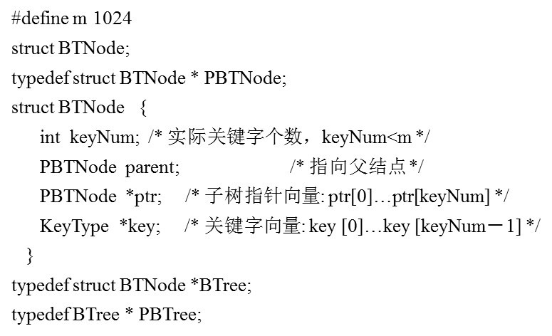

## B樹

#### 1.前言：

動態查找樹主要有：二叉查找樹（Binary Search Tree），平衡二叉查找樹（Balanced Binary Search Tree），[紅黑樹](http://blog.csdn.net/v_JULY_v/article/category/774945)(Red-Black Tree )，B-tree/B+-tree/ B\*-tree (B~Tree)。前三者是典型的二叉查找樹結構，其查找的時間複雜度`O(log2N)`與樹的深度相關，那麼降低樹的深度自然會提高查找效率。

但是咱們有面對這樣一個實際問題：就是大規模數據存儲中，實現索引查詢這樣一個實際背景下，樹節點存儲的元素數量是有限的（如果元素數量非常多的話，查找就退化成節點內部的線性查找了），這樣導致二叉查找樹結構由於**樹的深度過大而造成磁盤I/O讀寫過於頻繁，進而導致查詢效率低下**，因此我們該想辦法降低樹的深度，從而減少磁盤查找存取的次數。一個基本的想法就是：採用**多叉樹**結構（由於樹節點元素數量是有限的，自然該節點的子樹數量也就是有限的）。

這樣我們就提出了一個新的查找樹結構——平衡多路查找樹，即**B-tree（B-tree樹即B樹\***，B即Balanced，平衡的意思**）**，這棵神奇的樹是在[Rudolf Bayer, Edward M. McCreight](http://academic.research.microsoft.com/Author/1008233/rudolf-bayer)(1970)寫的一篇論文《Organization and Maintenance of Large Ordered Indices》中首次提出的。

後面我們會看到，B樹的各種操作能使B樹保持較低的高度，從而有效避免磁盤過於頻繁的查找存取操作，達到有效提高查找效率的目的。然在開始介紹B~tree之前，先了解下相關的硬件知識，才能很好的瞭解為什麼需要B~tree這種外存數據結構。 

#### 2.外存儲器—磁盤

計算機存儲設備一般分為兩種：內存儲器(main memory)和外存儲器(external memory)。 內存存取速度快，但容量小，價格昂貴，而且不能長期保存數據(在不通電情況下數據會消失)。

外存儲器—磁盤是一種直接存取的存儲設備(DASD)。它是以存取時間變化不大為特徵的。可以直接存取任何字符組，且容量大、速度較其它外存設備更快。

##### 2.1 磁盤的構造

磁盤是一個扁平的圓盤(與電唱機的唱片類似)。盤面上有許多稱為磁道的圓圈，數據就記錄在這些磁道上。磁盤可以是單片的，也可以是由若干盤片組成的盤組，每一盤片上有兩個面。如下圖11.3中所示的6片盤組為例，除去最頂端和最底端的外側面不存儲數據之外，一共有10個面可以用來保存信息。


當磁盤驅動器執行讀/寫功能時。盤片裝在一個主軸上，並繞主軸高速旋轉，當磁道在讀/寫頭(又叫磁頭) 下通過時，就可以進行數據的讀 / 寫了。

一般磁盤分為固定頭盤(磁頭固定)和活動頭盤。固定頭盤的每一個磁道上都有獨立的磁頭，它是固定不動的，專門負責這一磁道上數據的讀/寫。

活動頭盤 (如上圖)的磁頭是可移動的。每一個盤面上只有一個磁頭(磁頭是雙向的，因此正反盤面都能讀寫)。它可以從該面的一個磁道移動到另一個磁道。所有磁頭都裝在同一個動臂上，因此不同盤面上的所有磁頭都是同時移動的(行動整齊劃一)。當盤片繞主軸旋轉的時候，磁頭與旋轉的盤片形成一個圓柱體。各個盤面上半徑相同的磁道組成了一個圓柱面，我們稱為柱面 。因此，柱面的個數也就是盤面上的磁道數。 

##### 2.2 磁盤的讀/寫原理和效率

磁盤上數據必須用一個三維地址唯一標示：柱面號、盤面號、塊號(磁道上的盤塊)。

讀/寫磁盤上某一指定數據需要下面3個步驟：

1. 首先移動臂根據柱面號使磁頭移動到所需要的柱面上，這一過程被稱為定位或查找 。
2. 如上圖11.3中所示的6盤組示意圖中，所有磁頭都定位到了10個盤面的10條磁道上(磁頭都是雙向的)。這時根據盤面號來確定指定盤面上的磁道。
3. 盤面確定以後，盤片開始旋轉，將指定塊號的磁道段移動至磁頭下。

經過上面三個步驟，指定數據的存儲位置就被找到。這時就可以開始讀/寫操作了。

訪問某一具體信息，由3部分時間組成：

* 查找時間(seek time) Ts: 完成上述步驟(1)所需要的時間。這部分時間代價最高，最大可達到0.1s左右。
* 等待時間(latency time) Tl: 完成上述步驟(3)所需要的時間。由於盤片繞主軸旋轉速度很快，一般為7200轉/分(電腦硬盤的性能指標之一, 家用的普通硬盤的轉速一般有5400rpm(筆記本)、7200rpm幾種)。因此一般旋轉一圈大約0.0083s。
* 傳輸時間(transmission time) Tt: 數據通過系統總線傳送到內存的時間，一般傳輸一個字節(byte)大概0.02us=2\*10^(-8)s

**磁盤讀取數據是以盤塊**(block)**為基本單位的。**位於同一盤塊中的所有數據都能被一次性全部讀取出來。而磁盤IO代價主要花費在查找時間Ts上。因此我們應該儘量將相關信息存放在同一盤塊，同一磁道中。或者至少放在同一柱面或相鄰柱面上，以求在**讀/寫信息時儘量減少磁頭來回移動的次數，避免過多的查找時間Ts。**

所以，在大規模數據存儲方面，大量數據存儲在外存磁盤中，而在外存磁盤中讀取/寫入塊(block)中某數據時，首先需要定位到磁盤中的某塊，如何有效地查找磁盤中的數據，需要一種合理高效的外存數據結構，就是下面所要重點闡述的B-tree結構，以及相關的變種結構：B+-tree結構和B\*-tree結構。

#### 3.B- 樹 

##### 3.1 什麼是B-樹

B-樹，即為B樹。順便說句，因為B樹的原英文名稱為B-tree，而國內很多人喜歡把B-tree譯作B-樹，其實，這是個非常不好的直譯，很容易讓人產生誤解。如人們可能會以為B-樹是一種樹，而B樹又是另外一種樹。而事實上是，**B-tree就是指的B樹**。

我們知道，B 樹是為了磁盤或其它存儲設備而設計的一種多叉（下面你會看到，相對於二叉，B樹每個內結點有多個分支，即多叉）平衡查找樹。與之前介紹的紅黑樹很相似，但在降低磁盤I/0操作方面要更好一些。許多數據庫系統都一般使用B樹或者B樹的各種變形結構，如下文即將要介紹的B+樹，B\*樹來存儲信息。

B樹與紅黑樹最大的不同在於，B樹的結點可以有許多子女，從幾個到幾千個。不過B樹與紅黑樹一樣，一棵含n個結點的B樹的高度也為`O(lgn)`，但可能比一棵紅黑樹的高度小許多，因為它的分支因子比較大。所以，B樹可以在`O（logn）`時間內，實現各種如插入（insert），刪除（delete）等動態集合操作。

如下圖所示，即是一棵B樹，一棵關鍵字為英語中輔音字母的B樹，現在要從樹中查找字母R（包含n[x]個關鍵字的內結點x，x有n[x]+1個子女（也就是說，一個內結點x若含有n[x]個關鍵字，那麼x將含有n[x]+1個子女）。所有的葉結點都處於相同的深度，帶陰影的結點為查找字母R時要檢查的結點）：


**相信，從上圖你能輕易的看到，一個內結點x若含有n[x]個關鍵字，那麼x將含有n[x]+1個子女。如含有2個關鍵字D H的內結點有3個子女，而含有3個關鍵字Q T X的內結點有4個子女。**

**B樹**的定義

B 樹又叫平衡多路查找樹。**一棵m階的B 樹** (注：切勿簡單的認為一棵m階的B樹是m叉樹，雖然存在[四叉樹](http://zh.wikipedia.org/wiki/%E5%9B%9B%E5%8F%89%E6%A0%91)，[八叉樹](http://zh.wikipedia.org/wiki/%E5%85%AB%E5%8F%89%E6%A0%91)，[KD樹](http://blog.csdn.net/v_july_v/article/details/8203674)，及vp/R樹/R\*樹/R+樹/X樹/M樹/線段樹/希爾伯特R樹/優先R樹等空間劃分樹，但與B樹完全不等同)**的特性如下：**

1. 樹中每個結點最多含有m個孩子（m>=2）；
2. 除根結點和葉子結點外，其它每個結點至少有[ceil(m / 2)]個孩子（其中ceil(x)是一個取上限的函數）；
3. 根結點至少有2個孩子（除非B樹只包含一個結點：根結點）；
4. 所有葉子結點都出現在同一層，葉子結點不包含任何關鍵字信息(可以看做是外部結點或查詢失敗的結點，指向這些結點的指針都為null)；（注：葉子節點只是沒有孩子和指向孩子的指針，這些節點也存在，也有元素。類似紅黑樹中，每一個NULL指針即當做葉子結點，只是沒畫出來而已）。
5. 每個非終端結點中包含有n個關鍵字信息： (n，P0，K1，P1，K2，P2，......，Kn，Pn)。其中：  
a) Ki (i=1...n)為關鍵字，且關鍵字按順序升序排序K(i-1)< Ki。  
b) Pi為指向子樹根的結點，且指針P(i-1)指向子樹種所有結點的關鍵字均小於Ki，但都大於K(i-1)。   
c) 關鍵字的個數n必須滿足： [ceil(m / 2)-1]<= n <= m-1。比如有j個孩子的非葉結點恰好有j-1個關鍵碼。

B樹中的每個結點根據實際情況可以包含大量的關鍵字信息和分支(當然是不能超過磁盤塊的大小，根據磁盤驅動(disk drives)的不同，一般塊的大小在1k~4k左右)；這樣樹的深度降低了，這就意味著查找一個元素只要很少結點從外存磁盤中讀入內存，很快訪問到要查找的數據。

##### 3.2 B樹的類型和節點定義

B樹的類型和節點定義如下圖所示：

  

  

##### 3.3 文件查找的具體過程(涉及磁盤IO操作)

為了簡單，這裡用少量數據構造一棵3叉樹的形式，實際應用中的B樹結點中關鍵字很多的。上面的圖中比如根結點，其中17表示一個磁盤文件的文件名；小紅方塊表示這個17文件內容在硬盤中的存儲位置；p1表示指向17左子樹的指針。

其結構可以簡單定義為：

```c
typedef struct {
    /*文件數*/
    int  file_num;
    /*文件名(key)*/
    char * file_name[max_file_num];
    /*指向子節點的指針*/
     BTNode * BTptr[max_file_num+1];
     /*文件在硬盤中的存儲位置*/
     FILE_HARD_ADDR offset[max_file_num];
}BTNode;
```

假如每個盤塊可以正好存放一個B樹的結點（正好存放2個文件名）。那麼一個BTNODE結點就代表一個盤塊，而子樹指針就是存放另外一個盤塊的地址。

下面，咱們來模擬下查找文件29的過程：

1. 根據根結點指針找到文件目錄的根磁盤塊1，將其中的信息導入內存。【磁盤IO操作 1次】    
2. 此時內存中有兩個文件名17、35和三個存儲其他磁盤頁面地址的數據。根據算法我們發現：17<29<35，因此我們找到指針p2。
3. 根據p2指針，我們定位到磁盤塊3，並將其中的信息導入內存。【磁盤IO操作 2次】    
4. 此時內存中有兩個文件名26，30和三個存儲其他磁盤頁面地址的數據。根據算法我們發現：26<29<30，因此我們找到指針p2。
5. 根據p2指針，我們定位到磁盤塊8，並將其中的信息導入內存。【磁盤IO操作 3次】    
6. 此時內存中有兩個文件名28，29。根據算法我們查找到文件名29，並定位了該文件內存的磁盤地址。

分析上面的過程，發現需要**3次磁盤IO操作和3次內存查找**操作。關於內存中的文件名查找，由於是一個有序表結構，可以利用折半查找提高效率。至於IO操作是影響整個B樹查找效率的決定因素。

當然，如果我們使用平衡二叉樹的磁盤存儲結構來進行查找，磁盤4次，最多5次，而且文件越多，B樹比平衡二叉樹所用的磁盤IO操作次數將越少，效率也越高。

##### 3.4 B樹的高度

根據上面的例子我們可以看出，對於輔存做IO讀的次數取決於B樹的高度。而B樹的高度又怎麼求呢？

對於一棵含有N個關鍵字，m階的B樹來說（據B樹的定義可知：m滿足：ceil(m/2)<=**m**<=m，m階即代表樹中任一結點最多含有m個孩子，如5階代表每個結點最多5個孩子，或俗稱5叉樹），且從1開始計數的話，其高度h為：


這個B樹的高度公式從側面顯示了B樹的查找效率是相當高的。為什麼呢？因為底數m/2可以取很大，如m可以達到幾千，從而在關鍵字數一定的情況下，使得最終的h值儘量比較小，樹的高度比較低。

樹的高度降低了，磁盤存取的次數也隨著樹高度的降低而減少，從而使得存取性能也相應提升。

#### 4、B樹的插入、刪除操作

根據B樹的性質可知，如果是一棵m階的B 樹，那麼有：

- 樹中每個結點含有最多含有m個孩子，即m滿足：ceil(m/2)<=**m**<=m。
- 除根結點和葉子結點外，其它每個結點至少有[ceil(m / 2)]個孩子（其中ceil(x)是一個取上限的函數）；
- 除根結點之外的結點的關鍵字的個數n必須滿足： [ceil(m / 2)-1]<= n <= m-1（葉子結點也必須滿足此條關於關鍵字數的性質）。

下面咱們通過另外一個實例來對這棵B樹的插入（insert）,刪除（delete）基本操作進行詳細的介紹。以一棵**5階**（即樹中任一結點至多含有4個關鍵字，5棵子樹）B樹實例進行講解(如下圖所示)：


在上圖所示的一棵5階B樹中，讀者可以看到關鍵字數2-4個，內結點孩子數3-5個。**關鍵字數（2-4個）針對包括葉子結點在內的非根結點，孩子數（3-5個）則針對根結點和葉子結點之外的內結點。同時，根結點是必須至少有2個孩子的，不然就成直線型搜索樹了。**且關鍵字為大寫字母，順序為字母升序。

結點定義如下：

```c
typedef struct{
   int Count;         // 當前節點中關鍵元素數目
   ItemType Key[4];   // 存儲關鍵字元素的數組
   long Branch[5];    // 偽指針數組，(記錄數目)方便判斷合併和分裂的情況
} NodeType;
```


##### 4.1 插入（insert）操作

針對一棵高度為h的m階B樹，插入一個元素時，首先在B樹中是否存在，如果不存在，一般在葉子結點中插入該新的元素，此時分3種情況：

 - 如果葉子結點空間足夠，即該結點的關鍵字數小於m-1，則直接插入在葉子結點的左邊或右邊；
 - 如果空間滿了以致沒有足夠的空間去添加新的元素，即該結點的關鍵字數已經有了m個，則需要將該**結點**進行“分裂”，將一半數量的關鍵字元素分裂到新的其相鄰右結點中，中間關鍵字元素上移到父結點中，而且當結點中關鍵元素向右移動了，相關的指針也需要向右移。
- 此外，如果在上述中間關鍵字上移到父結點的過程中，導致根結點空間滿了，那麼根結點也要進行分裂操作，這樣原來的根結點中的中間關鍵字元素向上移動到新的根結點中，因此導致樹的高度增加一層。

下面咱們通過一個實例來逐步講解下。插入以下字符字母到一棵空的5階B 樹中：C N G A H E K Q M F W L T Z D P R X Y S，而且，因為是5階B樹，所以必有非根結點**關鍵字數**小了（小於2個）就合併，大了（超過4個）就分裂。

1. 首先，結點空間足夠，剛開始的4個字母可以直接到插入相同的結點中，如下圖：  

2. 插入H結點時，發現結點空間不夠，所以將其分裂成2個結點，移動中間元素G上移到新的根結點中，且把A和C留在當前結點中，而H和N放置在新的右鄰居結點中。如下圖：  

3. 當插入E,K,Q時，不需要任何分裂操作  

4. 插入M需要一次分裂，注意到M恰好是中間關鍵字元素，所以M向上移到父節點中  

5. 插入F,W,L,T不需要任何分裂操作  

6. 插入Z時，最右的葉子結點空間滿了，需要進行分裂操作，中間元素T上移到父節點中

7. 插入D時，導致最左邊的葉子結點被分裂，D恰好也是中間元素，上移到父節點中，然後字母P,R,X,Y直接陸續插入，不需要任何分裂操作  

8. 最後，當插入S時，含有N,P,Q,R的結點需要分裂，把中間元素Q上移到父節點中，但是問題來了，因為Q上移導致父結點 “D G M T” 也滿了，所以也要進行分裂，將父結點中的中間元素M上移到新形成的根結點中，從而致使樹的高度增加一層。


##### 4.2、刪除(delete)操作

下面介紹刪除操作，刪除操作相對於插入操作要考慮的情況多點。  

 - 首先查找B樹中需刪除的元素,如果該元素在B樹中存在，則將該元素在其結點中進行刪除，如果刪除該元素後，首先判斷該元素是否有左右孩子結點
- 如果有，則上移孩子結點中的某相近元素(“左孩子最右邊的節點”或“右孩子最左邊的節點”)到父節點中，然後是移動之後的情況；
- 如果沒有，直接刪除後，移動之後的情況。

刪除元素，移動相應元素之後，如果某結點中元素數目（即關鍵字數）小於**ceil(m/2)-1**，則需要看其某相鄰兄弟結點是否豐滿（結點中元素個數大於ceil(m/2)-1）
 - 如果豐滿，則向父節點借一個元素來滿足條件；
 - 如果其相鄰兄弟都剛脫貧，即借了之後其結點數目小於ceil(m/2)-1，則該結點與其相鄰的某一兄弟結點進行“合併”成一個結點，以此來滿足條件。

下面咱們還是以上述插入操作構造的一棵5階B樹（**樹中除根結點和葉子結點外的任意結點的孩子數m滿足3<=m<=5，除根結點外的任意結點的關鍵字數n滿足：2<=n<=4，所以關鍵字數小於2個就合併，超過4個就分裂**）為例，依次刪除H,T,R,E。


1. 首先刪除元素H，當然首先查找H，H在一個葉子結點中，且該葉子結點元素數目3大於最小元素數目ceil(m/2)-1=2，則操作很簡單，咱們只需要移動K至原來H的位置，移動L至K的位置（也就是結點中刪除元素後面的元素向前移動）  

2. 下一步，刪除T,因為T沒有在葉子結點中，而是在中間結點中找到，咱們發現他的繼承者W(字母升序的下個元素)，將W上移到T的位置，然後將原包含W的孩子結點中的W進行刪除，這裡恰好刪除W後，該孩子結點中元素個數大於2，無需進行合併操作。  

3. 下一步刪除R，R在葉子結點中,但是該結點中元素數目為2，刪除導致只有1個元素，已經小於最小元素數目ceil(5/2)-1=2,而由前面我們已經知道：**如果其某個相鄰兄弟結點中比較豐滿（元素個數大於ceil(5/2)-1=2），則可以向父結點借一個元素，然後將最豐滿的相鄰兄弟結點中上移最後或最前一個元素到父節點中**（有沒有看到紅黑樹中左旋操作的影子?）。
故在這個實例中，由於右相鄰兄弟結點“X Y Z”比較豐滿，而刪除元素R後，導致“S”結點稀缺
 - 所以原來的的“R S”結點先向父節點借一個元素W下移到該葉子結點中，代替原來S的位置，S前移；
 - 然後相鄰右兄弟結點中的X上移到父結點中；
 - 最後相鄰右兄弟結點中元素Y和Z前移。  

4. 最後一步刪除E， 刪除後會導致很多問題，因為E所在的結點數目剛好達標，剛好滿足最小元素個數（ceil(5/2)-1=2）,而相鄰的兄弟結點也是同樣的情況，刪除一個元素都不能滿足條件，所以需要**該節點與某相鄰兄弟結點進行合併操作**；
 - 首先移動父結點中的元素（該元素在兩個需要合併的兩個結點元素之間）下移到其子結點中，
 - 然後將這兩個結點進行合併成一個結點。所以在該實例中，咱們首先將父節點中的元素D下移到已經刪除E而只有F的結點中，然後將含有D和F的結點和含有A,C的相鄰兄弟結點進行合併成一個結點。  


也許你認為這樣刪除操作已經結束了，其實不然，在看看上圖，對於這種特殊情況，你立即會發現父節點只包含一個元素G，沒達標（因為非根節點包括葉子結點的關鍵字數n必須滿足於2=<n<=4，而此處的n=1），這是不能夠接受的。如果這個問題結點的相鄰兄弟比較豐滿，則可以向父結點借一個元素。假設這時右兄弟結點（含有Q,X）有一個以上的元素（Q右邊還有元素），然後咱們將M下移到元素很少的子結點中，將Q上移到M的位置，這時，Q的左子樹將變成M的右子樹，也就是含有N，P結點被依附在M的右指針上。

所以在這個實例中，咱們沒有辦法去借一個元素，只能與兄弟結點進行合併成一個結點，而根結點中的唯一元素M下移到子結點，這樣，樹的高度減少一層。  
  

為了進一步詳細討論刪除的情況，**再舉另外一個實例**：  
這裡是一棵不同的5序B樹，那咱們試著刪除C  
  
於是將刪除元素C的右子結點中的D元素上移到C的位置，但是出現上移元素後，只有一個元素的結點的情況。  
又因為含有E的結點，其相鄰兄弟結點才剛脫貧（最少元素個數為2），不可能向父節點借元素，所以只能進行合併操作，於是這裡將含有A,B的左兄弟結點和含有E的結點進行合併成一個結點。   
  
這樣又出現只含有一個元素F結點的情況，這時，其相鄰的兄弟結點是豐滿的（元素個數為3>最小元素個數2），這樣就可以想父結點借元素了，把父結點中的J下移到該結點中，相應的如果結點中J後有元素則前移，然後相鄰兄弟結點中的第一個元素（或者最後一個元素）上移到父節點中，後面的元素（或者前面的元素）前移（或者後移）；注意含有K，L的結點以前依附在M的左邊，現在變為依附在J的右邊。這樣每個結點都滿足B樹結構性質。  
  
從以上操作可看出：除根結點之外的結點（包括葉子結點）的關鍵字的個數n滿足：（ceil(m / 2)-1）<= n <= m-1，即2<=n<=4。這也佐證了咱們之前的觀點。刪除操作完。

#### 5.B+-tree

*B+-tree*：是應文件系統所需而產生的一種B-tree的變形樹。

一棵m階的B+樹和m階的B樹的異同點在於：

1. 有n棵子樹的結點中含有n-1 個關鍵字； (與B 樹n棵子樹有n-1個關鍵字 保持一致，參照：[http://en.wikipedia.org/wiki/B%2B_tree#Overview](http://en.wikipedia.org/wiki/B%2B_tree#Overview)，而下面**B+樹的圖可能有問題**，請讀者注意)
2. 所有的葉子結點中包含了全部關鍵字的信息，及指向含有這些關鍵字記錄的指針，且葉子結點本身依關鍵字的大小自小而大的順序鏈接。 (而B 樹的葉子節點並沒有包括全部需要查找的信息)
3. **所有的非終端結點可以看成是索引部分**，結點中僅含有其子樹根結點中最大（或最小）關鍵字。 (而B 樹的非終節點也包含需要查找的有效信息)

  

a) 為什麼說B+-tree比B 樹更適合實際應用中操作系統的文件索引和數據庫索引？ 

1. B+-tree的磁盤讀寫代價更低
B+-tree的內部結點並沒有指向關鍵字具體信息的指針。因此其內部結點相對B 樹更小。如果把所有同一內部結點的關鍵字存放在同一盤塊中，那麼盤塊所能容納的關鍵字數量也越多。一次性讀入內存中的需要查找的關鍵字也就越多。相對來說IO讀寫次數也就降低了。

舉個例子，假設磁盤中的一個盤塊容納16bytes，而一個關鍵字2bytes，一個關鍵字具體信息指針2bytes。一棵9階B-tree(一個結點最多8個關鍵字)的內部結點需要2個盤塊。而B+ 樹內部結點只需要1個盤快。當需要把內部結點讀入內存中的時候，B 樹就比B+ 樹多一次盤塊查找時間(在磁盤中就是盤片旋轉的時間)。

2. B+-tree的查詢效率更加穩定  

由於非終結點並不是最終指向文件內容的結點，而只是葉子結點中關鍵字的索引。所以任何關鍵字的查找必須走一條從根結點到葉子結點的路。所有關鍵字查詢的路徑長度相同，導致每一個數據的查詢效率相當。

總而言之，B樹在提高了磁盤IO性能的同時並沒有解決元素遍歷的效率低下的問題。正是為瞭解決這個問題，B+樹應運而生。B+樹只要遍歷葉子節點就可以實現整棵樹的遍歷，支持基於範圍的查詢，而B樹不支持range-query這樣的操作（或者說效率太低）。

b)  B+-tree的應用: VSAM(虛擬存儲存取法)文件(來源論文 *the ubiquitous Btree* 作者：D COMER - 1979 )


#### 6.B\*-tree

B\*-tree是B+-tree的變體，在B+樹的基礎上(所有的葉子結點中包含了全部關鍵字的信息，及指向含有這些關鍵字記錄的指針)，B\*樹中非根和非葉子結點再增加指向兄弟的指針；B\*樹定義了非葉子結點關鍵字個數至少為(2/3)\*M，即塊的最低使用率為2/3（代替B+樹的1/2）。給出了一個簡單實例，如下圖所示：


B+樹的分裂：當一個結點滿時，分配一個新的結點，並將原結點中1/2的數據複製到新結點，最後在父結點中增加新結點的指針；B+樹的分裂隻影響原結點和父結點，而不會影響兄弟結點，所以它不需要指向兄弟的指針。

B\*樹的分裂：當一個結點滿時，如果它的下一個兄弟結點未滿，那麼將一部分數據移到兄弟結點中，再在原結點插入關鍵字，最後修改父結點中兄弟結點的關鍵字（因為兄弟結點的關鍵字範圍改變了）；如果兄弟也滿了，則在原結點與兄弟結點之間增加新結點，並各複製1/3的數據到新結點，最後在父結點增加新結點的指針。

所以，B\*樹分配新結點的概率比B+樹要低，空間使用率更高；

#### 7.總結

通過以上介紹，大致將B樹，B+樹，B*樹總結如下：

* B樹：有序數組+平衡多叉樹；
* B+樹：有序數組鏈表+平衡多叉樹；
* B\*樹：一棵豐滿的B+樹。


順便說一句，無論是B樹，還是B+樹、b*樹，由於根或者樹的上面幾層被反覆查詢，所以這幾塊可以存在內存中，換言之，B樹、B+樹、B*樹的根結點和部分頂層數據在內存中，大部分下層數據在磁盤上。
