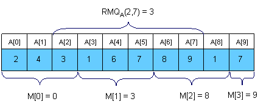
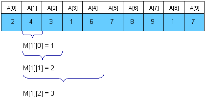
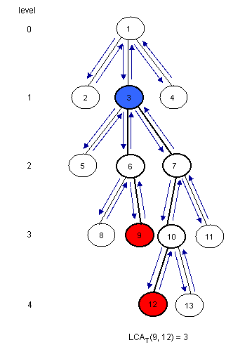

# 最近公共祖先LCA問題

## 問題描述

求有根樹的任意兩個節點的最近公共祖先。

## 分析與解法

解答這個問題之前，咱們得先搞清楚到底什麼是最近公共祖先。最近公共祖先簡稱LCA（Lowest Common Ancestor），所謂LCA，是當給定一個有根樹T時，對於任意兩個結點u、v，找到一個離根最遠的結點x，使得x同時是u和v的祖先，x 便是u、v的最近公共祖先。（參見：http://en.wikipedia.org/wiki/Lowest_common_ancestor ）原問題涵蓋一般性的有根樹，本文為了簡化，多使用二叉樹來討論。

舉個例子，如針對下圖所示的一棵普通的二叉樹來講：


結點3和結點4的最近公共祖先是結點2，即LCA（3 4）=2 。在此，需要注意到當兩個結點在同一棵子樹上的情況，如結點3和結點2的最近公共祖先為2，即 LCA（3，2）=2。同理：LCA（5，6）=4，LCA（6，10）=1。

明確了題意，咱們便來試著解決這個問題。直觀的做法，可能是針對是否為二叉查找樹分情況討論，這也是一般人最先想到的思路。除此之外，還有所謂的Tarjan算法、倍增算法、以及轉換為RMQ問題（求某段區間的極值）。後面這幾種算法相對高級，不那麼直觀，但思路比較有啟發性，瞭解一下也有裨益。

### 解法一：暴力對待

#### 1.1、是二叉查找樹

在當這棵樹是二叉查找樹的情況下，如下圖：


那麼從樹根開始：

* 如果當前結點t 大於結點u、v，說明u、v都在t 的左側，所以它們的共同祖先必定在t 的左子樹中，故從t 的左子樹中繼續查找；
* 如果當前結點t 小於結點u、v，說明u、v都在t 的右側，所以它們的共同祖先必定在t 的右子樹中，故從t 的右子樹中繼續查找；
* 如果當前結點t 滿足 u <t < v，說明u和v分居在t 的兩側，故當前結點t 即為最近公共祖先；
* 而如果u是v的祖先，那麼返回u的父結點，同理，如果v是u的祖先，那麼返回v的父結點。

代碼如下所示：

```cpp
//copyright@eriol 2011  
//modified by July 2014  
public int query(Node t, Node u, Node v) {    
    int left = u.value;    
    int right = v.value;    
  
    //二叉查找樹內，如果左結點大於右結點，不對，交換  
    if (left > right) {    
        int temp = left;    
        left = right;    
        right = temp;    
    }    
  
    while (true) {    
        //如果t小於u、v，往t的右子樹中查找  
        if (t.value < left) {    
            t = t.right;    
  
        //如果t大於u、v，往t的左子樹中查找  
        } else if (t.value > right) {    
            t = t.left;    
        } else {    
            return t.value;    
        }    
    }    
}  
```
  
#### 1.2、不是二叉查找樹

但如果這棵樹不是二叉查找樹，只是一棵普通的二叉樹呢？如果每個結點都有一個指針指向它的父結點，於是我們可以從任何一個結點出發，得到一個到達樹根結點的單向鏈表。因此這個問題轉換為兩個單向鏈表的第一個公共結點。

此外，如果給出根節點，LCA問題可以用遞歸很快解決。而關於樹的問題一般都可以轉換為遞歸（因為樹本來就是遞歸描述），參考代碼如下：

```cpp
//copyright@allantop 2014-1-22-20:01  
node* getLCA(node* root, node* node1, node* node2)  
{  
    if(root == null)  
        return null;  
    if(root== node1 || root==node2)  
        return root;  
  
    node* left = getLCA(root->left, node1, node2);  
    node* right = getLCA(root->right, node1, node2);  
  
    if(left != null && right != null)  
        return root;  
    else if(left != null)  
        return left;  
    else if (right != null)  
        return right;  
    else   
        return null;  
}  
```

然不論是針對普通的二叉樹，還是針對二叉查找樹，上面的解法有一個很大的弊端就是：如需N 次查詢，則總體複雜度會擴大N 倍，故這種暴力解法僅適合一次查詢，不適合多次查詢。

接下來的解法，將不再區別對待是否為二叉查找樹，而是一致當做是一棵普通的二叉樹。總體來說，由於可以把LCA問題看成是詢問式的，即給出一系列詢問，程序對每一個詢問儘快做出反應。故處理這類問題一般有兩種解決方法：

* 一種是在線算法，相當於循序漸進處理；
* 另外一種則是離線算法，如Tarjan算法，相當於一次性批量處理，一開始就知道了全部查詢，只待詢問。

### 解法二：Tarjan算法

如上文末節所述，不論咱們所面對的二叉樹是二叉查找樹，或不是二叉查找樹，都可以把求任意兩個結點的最近公共祖先，當做是查詢的問題，如果是隻求一次，則是單次查詢；如果要求多個任意兩個結點的最近公共祖先，則相當於是批量查詢。

涉及到批量查詢的時候，咱們可以借鑑離線處理的方式，這就引出瞭解決此LCA問題的Tarjan離線算法。

#### 2.1、什麼是Tarjan算法

Tarjan算法 （以發現者Robert Tarjan命名）是一個在圖中尋找強連通分量的算法。算法的基本思想為：任選一結點開始進行深度優先搜索dfs（若深度優先搜索結束後仍有未訪問的結點，則再從中任選一點再次進行）。搜索過程中已訪問的結點不再訪問。搜索樹的若干子樹構成了圖的強連通分量。

應用到咱們要解決的LCA問題上，則是：對於新搜索到的一個結點u，先創建由u構成的集合，再對u的每顆子樹進行搜索，每搜索完一棵子樹，這時候子樹中所有的結點的最近公共祖先就是u了。

舉一個例子，如下圖（不同顏色的結點相當於不同的集合）：


假設遍歷完10的孩子,要處理關於10的請求了，取根節點到當前正在遍歷的節點的路徑為關鍵路徑,即1-3-8-10，集合的祖先便是關鍵路徑上距離集合最近的點。

比如：

* 1，2，5，6為一個集合,祖先為1，集合中點和10的LCA為1
* 3，7為一個集合，祖先為3，集合中點和10的LCA為3
* 8，9，11為一個集合，祖先為8，集合中點和10的LCA為8
* 10，12為一個集合，祖先為10，集合中點和10的LCA為10

得出的結論便是：LCA(u,v)便是根至u的路徑上到節點v最近的點。

#### 2.2、Tarjan算法如何而來

但關鍵是 Tarjan算法是怎麼想出來的呢？再給定下圖，你是否能看出來：分別從結點1的左右子樹當中，任取一個結點，設為u、v，這兩個任意結點u、v的最近公共祖先都為1。


於此，我們可以得知：若兩個結點u、v分別分佈於某節點t 的左右子樹，那麼此節點 t即為u和v的最近公共祖先。更進一步，考慮到一個節點自己就是LCA的情況，得知：

* 若某結點t 是兩結點u、v的祖先之一，且這兩結點並不分佈於該結點t 的一棵子樹中，而是分別在結點t 的左子樹、右子樹中，那麼該結點t 即為兩結點u、v的最近公共祖先。

這個定理就是Tarjan算法的基礎。

一如上文1.1節我們得到的結論：“如果當前結點t 滿足 u <t < v，說明u和v分居在t 的兩側，故當前結點t 即為最近公共祖先”。

而對於本節開頭我們所說的“如果要求多個任意兩個結點的最近公共祖先，則相當於是批量查詢”，即在很多組的詢問的情況下，或許可以先確定一個LCA。例如是根節點1，然後再去檢查所有詢問，看是否滿足剛才的定理，不滿足就忽視，滿足就賦值，全部弄完，再去假設2號節點是LCA，再去訪問一遍。

可此方法需要判斷一個結點是在左子樹、還是右子樹，或是都不在，都只能遍歷一棵樹，而多次遍歷的代價實在是太大了，所以我們需要找到更好的方法。這就引出了下面要闡述的Tarjan算法，即每個結點只遍歷一次，怎麼做到的呢，請看下文講解。

### 2.3、Tarjan算法流程

Tarjan算法流程為：

```
Procedure dfs（u）；
	begin
		設置u號節點的祖先為u
		若u的左子樹不為空，dfs（u - 左子樹）；
		若u的右子樹不為空，dfs（u - 右子樹）；
		訪問每一條與u相關的詢問u、v
			-若v已經被訪問過，則輸出v當前的祖先t（t即u,v的LCA）
		標記u為已經訪問，將所有u的孩子包括u本身的祖先改為u的父親
	end
```

普通的dfs 不能直接解決LCA問題，故Tarjan算法的原理是dfs + [並查集](http://zh.wikipedia.org/zh-cn/%E5%B9%B6%E6%9F%A5%E9%9B%86)，它每次把兩個結點對的最近公共祖先的查詢保存起來，然後dfs 更新一次。如此，利用並查集優越的時空複雜度，此算法的時間複雜度可以縮小至O(n＋Q)，其中，n為數據規模，Q為詢問個數。

### 解法三：轉換為RMQ問題

解決此最近公共祖先問題的還有一個算法，即轉換為RMQ問題，用Sparse Table（簡稱ST）算法解決。

### 3.1、什麼是RMQ問題

RMQ，全稱為Range Minimum Query，顧名思義，則是區間最值查詢，它被用來在數組中查找兩個指定索引中最小值的位置。即RMQ相當於給定數組A[0, N-1]，找出給定的兩個索引如 i、j 間的最小值的位置。

假設一個算法預處理時間為 f(n)，查詢時間為g(n)，那麼這個算法複雜度的標記為\<f(n), g(n)\>。我們將用RMQA(i, j) 來表示數組A 中索引i 和 j 之間最小值的位置。 u和v的離樹T根結點最遠的公共祖先用LCA T(u, v)表示。

如下圖所示，RMQA(2,7 )則表示求數組A中從A[2]~A[7]這段區間中的最小值：


很顯然，從上圖中，我們可以看出最小值是A[3] = 1，所以也就不難得出最小值的索引值RMQA(2,7) = 3。

#### 3.2、如何解決RMQ問題

##### 3.2.1、Trivial algorithms for RMQ

下面，我們對對每一對索引(i, j)，將數組中索引i 和 j 之間最小值的位置 RMQA(i, j) 存儲在M[0, N-1][0, N-1]表中。 RMQA(i, j) 有不同種計算方法，你會看到，隨著計算方法的不同，它的時空複雜度也不同：

* 普通的計算將得到一個 \<O(N^3), O(1)\> 複雜度的算法。儘管如此，通過使用一個簡單的動態規劃方法，我們可以將複雜度降低到 \<O(N^2), O(1)\>。如何做到的呢？方法如下代碼所示：

```cpp
//copyright@  
//modified by July 2014  
void process1(int M[MAXN][MAXN], int A[MAXN], int N)  
{  
    int i, j;  
    for (i =0; i < N; i++)  
        M[i][i] = i;  
  
    for (i = 0; i < N; i++)  
        for (j = i + 1; j < N; j++)  
            //若前者小於後者，則把後者的索引值付給M[i][j]  
            if (A[M[i][j - 1]] < A[j])  
                M[i][j] = M[i][j - 1];  
            //否則前者的索引值付給M[i][j]  
            else  
                M[i][j] = j;  
}  
```

* 一個比較有趣的點子是把向量分割成sqrt(N)大小的段。我們將在M[0,sqrt(N)-1]為每一個段保存最小值的位置。如此，M可以很容易的在O(N)時間內預處理。



* 一個更好的方法預處理RMQ 是對2^k 的長度的子數組進行動態規劃。我們將使用數組M[0, N-1][0, logN]進行保存，其中M[ i ][ j ] 是以i 開始，長度為 2^j 的子數組的最小值的索引。這就引出了咱們接下來要介紹的Sparse Table (ST) algorithm。

##### 3.2.2、Sparse Table (ST) algorithm 



在上圖中，我們可以看出：
* 在A[1]這個長度為2^0的區間內，最小值即為A[1] = 4，故最小值的索引M[1][0]為1；
* 在A[1]、A[2] 這個長度為2^1的區間內，最小值為A[2] = 3，故最小值的索引為M[1][1] = 2；
* 在A[1]、A[2]、A[3]、A[4]這個長度為2^2的區間內，最小值為A[3] = 1，故最小值的索引M[1][2] = 3。

為了計算M[i][j]我們必須找到前半段區間和後半段區間的最小值。很明顯小的片段有著2^(j-1)長度，因此遞歸如下  


根據上述公式，可以寫出這個預處理的遞歸代碼，如下：

```cpp
void process2(int M[MAXN][LOGMAXN], int A[MAXN], int N)  
{  
    int i, j;  
    //initialize M for the intervals with length 1  
  
    for (i = 0; i < N; i++)  
        M[i][0] = i;  
  
    //compute values from smaller to bigger intervals  
    for (j = 1; 1 << j <= N; j++)  
        for (i = 0; i + (1 << j) - 1 < N; i++)  
            if (A[M[i][j - 1]] < A[M[i + (1 << (j - 1))][j - 1]])  
                M[i][j] = M[i][j - 1];  
            else  
                M[i][j] = M[i + (1 << (j - 1))][j - 1];  
}
```

經過這個O(N logN)時間複雜度的預處理之後，讓我們看看怎樣使用它們去計算 RMQA(i, j)。思路是選擇兩個能夠完全覆蓋區間[i..j]的塊並且找到它們之間的最小值。設k = [log(j - i + 1)]。

為了計算 RMQA(i, j)，我們可以使用下面的公式：


故，綜合來看，咱們預處理的時間複雜度從O(N3)降低到了O(N logN)，查詢的時間複雜度為O(1)，所以最終的整體複雜度為：\<O(N logN), O(1)\>。

#### 3.3、LCA與RMQ的關聯性

現在，讓我們看看怎樣用RMQ來計算LCA查詢。事實上，我們可以在線性時間裡將LCA問題規約到RMQ問題，因此每一個解決RMQ的問題都可以解決LCA問題。讓我們通過例子來說明怎麼規約的：

 


注意LCAT(u, v)是在對T進行dfs過程當中在訪問u和v之間離根結點最近的點。因此我們可以考慮樹的歐拉環遊過程u和v之間所有的結點，並找到它們之間處於最低層的結點。為了達到這個目的，我們可以建立三個數組：

* E[1, 2*N-1]  - 對T進行歐拉環遊過程中所有訪問到的結點;E[i]是在環遊過程中第i個訪問的結點
* L[1,2*N-1] -  歐拉環遊中訪問到的結點所處的層數;L[i]是E[i]所在的層數
* H[1, N] - H[i] 是E中結點i第一次出現的下標(任何出現i的地方都行，當然選第一個不會錯)

假定H[u]<H[v](否則你要交換u和v)。可以很容易的看到u和v第一次出現的結點是E[H[u]..H[v]]。現在，我們需要找到這些結點中的最低層。為了達到這個目的，我們可以使用RMQ。因此 LCAT(u, v) = E[RMQL(H[u], H[v])] ,RMQ返回的是索引，下面是E,L,H數組：


注意L中連續的元素相差為1。

### 3.4、從RMQ到LCA

我們已經看到了LCA問題可以在線性時間規約到RMQ問題。現在讓我們來看看怎樣把RMQ問題規約到LCA。這個意味著我們實際上可以把一般的RMQ問題規約到帶約束的RMQ問題(這裡相鄰的元素相差1)。為了達到這個目的，我們需要使用笛卡爾樹。

對於數組A[0,N-1]的笛卡爾樹C(A)是一個二叉樹，根節點是A的最小元素，假設i為A數組中最小元素的位置。當i>0時，這個笛卡爾樹的左子結點是A[0,i-1]構成的笛卡爾樹，其他情況沒有左子結點。右結點類似的用A[i+1,N-1]定義。注意對於具有相同元素的數組A，笛卡爾樹並不唯一。在本文中，將會使用第一次出現的最小值，因此笛卡爾樹看作唯一。可以很容易的看到RMQA(i, j) = LCAC(i, j)。

下面是一個例子：


現在我們需要做的僅僅是用線性時間計算C(A)。這個可以使用棧來實現。

* 初始棧為空。
* 然後我們在棧中插入A的元素。
* 在第i步,A[i]將會緊挨著棧中比A[i]小或者相等的元素插入,並且所有較大的元素將會被移除。
* 在插入結束之前棧中A[i]位置前的元素將成為i的左兒子，A[i]將會成為它之後一個較小元素的右兒子。

在每一步中，棧中的第一個元素總是笛卡爾樹的根。

如果使用棧來保存元素的索引而不是值，我們可以很輕鬆的建立樹。由於A中的每個元素最多被增加一次和最多被移除一次，所以建樹的時間複雜度為O(N)。最終查詢的時間複雜度為O(1)，故綜上可得，咱們整個問題的最終時間複雜度為：\<O(N), O(1)\>。

現在，對於詢問 RMQA(i, j) 我們有兩種情況:

* i和j在同一個塊中,因此我們使用在P和T中計算的值 
* i和j在不同的塊中，因此我們計算三個值:從i到i所在塊的末尾的P和T中的最小值，所有i和j中塊中的通過與處理得到的最小值以及從j所在塊i和j在同一個塊中,因此我們使用在P和T中計算的值j的P和T的最小值；最後我們我們只要計算三個值中最小值的位置即可。

RMQ和LCA是密切相關的問題，因為它們之間可以相互規約。有許多算法可以用來解決它們，並且他們適應於一類問題。


### 解法四：線段樹

解決RMQ問題也可以用所謂的線段樹Segment trees。線段樹是一個類似堆的數據結構，可以在基於區間數組上用對數時間進行更新和查詢操作。我們用下面遞歸方式來定義線段樹的[i, j]區間：

* 第一個結點將保存區間[i, j]區間的信息
* 如果i<j 左右的孩子結點將保存區間[i, (i+j)/2]和[(i+j)/2+1, j] 的信息
      
注意具有N個區間元素的線段樹的高度為[logN] + 1。下面是區間[0,9]的線段樹：


線段樹和堆具有相同的結構，因此我們定義x是一個非葉結點，那麼左孩子結點為2*x,而右孩子結點為2*x+1。想要使用線段樹解決RMQ問題，我們則要要使用數組 M[1, 2 * 2[logN] + 1]，這裡M[i]保存結點i區間最小值的位置。初始時M的所有元素為-1。樹應當用下面的函數進行初始化(b和e是當前區間的範圍)：

```cpp
void initialize(int node, int b, int e, int M[MAXIND], int A[MAXN], int N)  
{  
    if (b == e)  
        M[node] = b;  
    else  
    {  
        //compute the values in the left and right subtrees  
        initialize(2 * node, b, (b + e) / 2, M, A, N);  
        initialize(2 * node + 1, (b + e) / 2 + 1, e, M, A, N);  
  
        //search for the minimum value in the first and  
        //second half of the interval  
        if (A[M[2 * node]] <= A[M[2 * node + 1]])  
            M[node] = M[2 * node];  
        else  
            M[node] = M[2 * node + 1];  
    }  
}
```

上面的函數映射出了這棵樹建造的方式。當計算一些區間的最小值位置時，我們應當首先查看子結點的值。調用函數的時候使用 node = 1, b = 0和e  = N-1。

現在我們可以開始進行查詢了。如果我們想要查找區間[i, j]中的最小值的位置時，我們可以使用下一個簡單的函數：

```cpp
int query(int node, int b, int e, int M[MAXIND], int A[MAXN], int i, int j)  
{  
    int p1, p2;  
    //if the current interval doesn't intersect  
    //the query interval return -1  
    if (i > e || j < b)  
        return -1;  
  
    //if the current interval is included in  
    //the query interval return M[node]  
    if (b >= i && e <= j)  
        return M[node];  
  
    //compute the minimum position in the  
    //left and right part of the interval  
    p1 = query(2 * node, b, (b + e) / 2, M, A, i, j);  
    p2 = query(2 * node + 1, (b + e) / 2 + 1, e, M, A, i, j);  
  
    //return the position where the overall  
    //minimum is  
    if (p1 == -1)  
        return M[node] = p2;  
    if (p2 == -1)  
        return M[node] = p1;  
    if (A[p1] <= A[p2])  
        return M[node] = p1;  
    return M[node] = p2;  
}
```

你應該使用node = 1, b = 0和e = N - 1來調用這個函數，因為分配給第一個結點的區間是[0, N-1]。

可以很容易的看出任何查詢都可以在O(log N)內完成。注意當我們碰到完整的in/out區間時我們停止了，因此數中的路徑最多分裂一次。用線段樹我們獲得了\<O(N),O(logN)\>的算法

線段樹非常強大，不僅僅是因為它能夠用在RMQ上，還因為它是一個非常靈活的數據結構，它能夠解決動態版本的RMQ問題和大量的區間搜索問題。


### 其餘解法

除此之外，還有倍增法、重鏈剖分算法和後序遍歷也可以解決該問題。其中，倍增思路相當於層序遍歷，逐層或幾層跳躍查，查詢時間複雜度為O(log n)，空間複雜度為nlogn，對於每個節點先存儲向上1層2層4層的節點，每個點有depth信息。
