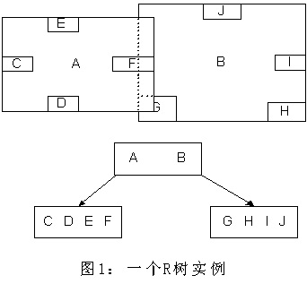
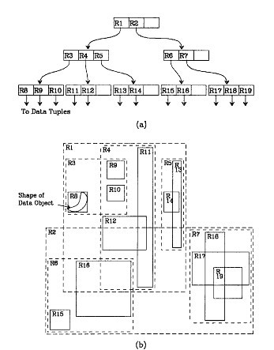
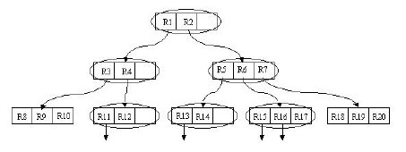
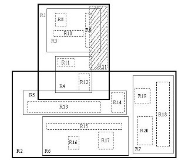
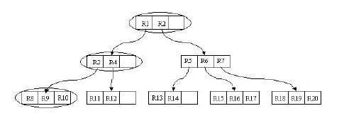
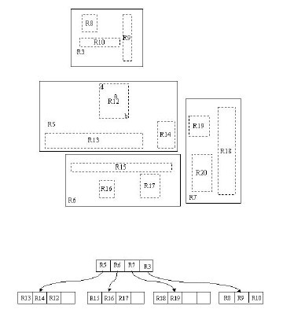

## R樹：處理空間存儲問題

#### R樹簡介

984年，加州大學伯克利分校的Guttman發表了一篇題為“R-trees: a dynamic index structure for spatial searching”的論文，向世人介紹了R樹這種處理高維空間存儲問題的數據結構。本文便是基於這篇論文寫作完成。

R樹在數據庫等領域做出的功績是非常顯著的。它很好的解決了在高維空間搜索等問題。舉個R樹在現實領域中能夠解決的例子：查找20英里以內所有的餐廳。如果沒有R樹你會怎麼解決？
 - 一般情況下我們會把餐廳的座標(x,y)分為兩個字段存放在數據庫中，一個字段記錄經度，另一個字段記錄緯度。
 - 這樣的話我們就需要遍歷所有的餐廳獲取其位置信息，然後計算是否滿足要求。

如果一個地區有100家餐廳的話，我們就要進行100次位置計算操作了，如果應用到谷歌地圖這種超大數據庫中，這種方法便必定不可行了

R樹就很好的解決了這種高維空間搜索問題。它把B樹的思想很好的擴展到了多維空間，採用了B樹分割空間的思想，並在添加、刪除操作時採用合併、分解結點的方法，保證樹的平衡性。因此，R樹就是一棵用來存儲高維數據的平衡樹。

接下來，本文將詳細介紹R樹的數據結構以及R樹的操作。至於R樹的擴展與R樹的性能問題，可以查閱相關論文。

#### R樹的數據結構

R樹是B樹在高維空間的擴展，是一棵平衡樹。每個R樹的葉子結點包含了多個指向不同數據的指針，這些數據可以是存放在硬盤中的，也可以是存在內存中。根據R樹的這種數據結構，當我們需要進行一個高維空間查詢時，我們只需要遍歷少數幾個葉子結點所包含的指針，查看這些指針指向的數據是否滿足要求即可。這種方式使我們不必遍歷所有數據即可獲得答案，效率顯著提高。下圖1是R樹的一個簡單實例：

我們在上面說過，R樹運用了空間分割的理念，這種理念是如何實現的呢？R樹採用了一種稱為MBR(Minimal Bounding Rectangle)的方法，在此我把它譯作“最小邊界矩形”。從葉子結點開始用矩形（rectangle）將空間框起來，結點越往上，框住的空間就越大，以此對空間進行分割。有點不懂？沒關係，繼續往下看。在這裡我還想提一下，R樹中的R應該代表的是Rectangle（此處參考wikipedia上關於[R樹](http://en.wikipedia.org/wiki/R-tree)的介紹），而不是大多數國內教材中所說的Region（很多書把R樹稱為區域樹，這是有誤的）。我們就拿二維空間來舉例。下圖是Guttman論文中的一幅圖：

我來詳細解釋一下這張圖。先來看圖（b）

1. 首先我們假設所有數據都是二維空間下的點，圖中僅僅標誌了R8區域中的數據，也就是那個shape of data object。別把那一塊不規則圖形看成一個數據，我們把它看作是多個數據圍成的一個區域。為了實現R樹結構，我們用一個最小邊界矩形恰好框住這個不規則區域，這樣，我們就構造出了一個區域：R8。R8的特點很明顯，就是正正好好框住所有在此區域中的數據。其他實線包圍住的區域，如R9，R10，R12等都是同樣的道理。這樣一來，我們一共得到了12個最最基本的最小矩形。這些矩形都將被存儲在子結點中。
2. 下一步操作就是進行高一層次的處理。我們發現R8，R9，R10三個矩形距離最為靠近，因此就可以用一個更大的矩形R3恰好框住這3個矩形。
3. 同樣道理，R15，R16被R6恰好框住，R11，R12被R4恰好框住，等等。所有最基本的最小邊界矩形被框入更大的矩形中之後，再次迭代，用更大的框去框住這些矩形。

我想大家都應該理解這個數據結構的特徵了。**用地圖的例子來解釋，就是所有的數據都是餐廳所對應的地點，先把相鄰的餐廳劃分到同一塊區域，劃分好所有餐廳之後，再把鄰近的區域劃分到更大的區域，劃分完畢後再次進行更高層次的劃分，直到劃分到只剩下兩個最大的區域為止。要查找的時候就方便了。**

下面就可以把這些大大小小的矩形存入我們的R樹中去了。根結點存放的是兩個最大的矩形，這兩個最大的矩形框住了所有的剩餘的矩形，當然也就框住了所有的數據。下一層的結點存放了次大的矩形，這些矩形縮小了範圍。每個葉子結點都是存放的最小的矩形，這些矩形中可能包含有n個數據。

在這裡，讀者先不要去糾結於如何劃分數據到最小區域矩形，也不要糾結怎樣用更大的矩形框住小矩形，這些都是下一節我們要討論的。

講完了基本的數據結構，我們來講個實例，如何查詢特定的數據。又以餐廳為例，假設我要查詢廣州市天河區天河城附近一公里的所有餐廳地址怎麼辦？

1. 打開地圖（也就是整個R樹），先選擇國內還是國外（也就是根結點）。
2. 然後選擇華南地區（對應第一層結點），選擇廣州市（對應第二層結點），
3. 再選擇天河區（對應第三層結點），
4. 最後選擇天河城所在的那個區域（對應葉子結點，存放有最小矩形），遍歷所有在此區域內的結點，看是否滿足我們的要求即可。

怎麼樣，其實R樹的查找規則跟查地圖很像吧？對應下圖：

##### 一棵R樹滿足如下的性質：

1. 除非它是根結點之外，所有葉子結點包含有m至M個記錄索引（條目）。作為根結點的葉子結點所具有的記錄個數可以少於m。通常，m=M/2。
2. 對於所有在葉子中存儲的記錄（條目），I是最小的可以在空間中完全覆蓋這些記錄所代表的點的矩形（注意：此處所說的“矩形”是可以擴展到高維空間的）。
3. 每一個非葉子結點擁有m至M個孩子結點，除非它是根結點。
4.  對於在非葉子結點上的每一個條目，i是最小的可以在空間上完全覆蓋這些條目所代表的店的矩形（同性質2）。
5.  所有葉子結點都位於同一層，因此R樹為平衡樹。

##### 葉子結點的結構

先來探究一下葉子結點的結構。葉子結點所保存的數據形式為：(I, tuple-identifier)。
      
其中，tuple-identifier表示的是一個存放於數據庫中的tuple，也就是一條記錄，它是n維的。I是一個n維空間的矩形，並可以恰好框住這個葉子結點中所有記錄代表的n維空間中的點。I=(I0,I1,…,In-1)。其結構如下圖所示：

下圖描述的就是在二維空間中的葉子結點所要存儲的信息。

在這張圖中，I所代表的就是圖中的矩形，其範圍是a<=I0<=b，c<=I1<=d。有兩個tuple-identifier，在圖中即表示為那兩個點。這種形式完全可以推廣到高維空間。大家簡單想想三維空間中的樣子就可以了。這樣，葉子結點的結構就介紹完了。

##### 非葉子結點

非葉子結點的結構其實與葉子結點非常類似。想象一下B樹就知道了，B樹的葉子結點存放的是真實存在的數據，而非葉子結點存放的是這些數據的“邊界”，或者說也算是一種索引（有疑問的讀者可以回顧一下上述第一節中講解B樹的部分）。

同樣道理，R樹的非葉子結點存放的數據結構為：(I, child-pointer)。

其中，child-pointer是指向孩子結點的指針，I是覆蓋所有孩子結點對應矩形的矩形。這邊有點拗口，但我想不是很難懂？給張圖：

D,E,F,G為孩子結點所對應的矩形。A為能夠覆蓋這些矩形的更大的矩形。這個A就是這個非葉子結點所對應的矩形。這時候你應該悟到了吧？無論是葉子結點還是非葉子結點，它們都對應著一個矩形。樹形結構上層的結點所對應的矩形能夠完全覆蓋它的孩子結點所對應的矩形。根結點也唯一對應一個矩形，而這個矩形是可以覆蓋所有我們擁有的數據信息在空間中代表的點的。

我個人感覺這張圖畫的不那麼精確，應該是矩形A要恰好覆蓋D,E,F,G，而不應該再留出這麼多沒用的空間了。但為尊重原圖的繪製者，特不作修改。

##### R樹的操作

這一部分也許是編程者最關注的問題了。這麼高效的數據結構該如何去實現呢？這便是這一節需要闡述的問題。

###### 搜索

R樹的搜索操作很簡單，跟B樹上的搜索十分相似。它返回的結果是所有符合查找信息的記錄條目。而輸入是什麼？就我個人的理解，輸入不僅僅是一個範圍了，它更可以看成是一個空間中的矩形。也就是說，我們輸入的是一個搜索矩形。

先給出偽代碼：

**Function：Search**  
描述：假設T為一棵R樹的根結點，查找所有搜索矩形S覆蓋的記錄條目。  
S1:[查找子樹] 如果T是非葉子結點，如果T所對應的矩形與S有重合，那麼檢查所有T中存儲的條目，對於所有這些條目，使用Search操作作用在每一個條目所指向的子樹的根結點上（即T結點的孩子結點）。  
S2:[查找葉子結點] 如果T是葉子結點，如果T所對應的矩形與S有重合，那麼直接檢查S所指向的所有記錄條目。返回符合條件的記錄。

我們通過下圖來理解這個Search操作。

陰影部分所對應的矩形為搜索矩形。它與根結點對應的最大的矩形（未畫出）有重疊。這樣將Search操作作用在其兩個子樹上。兩個子樹對應的矩形分別為R1與R2。搜索R1，發現與R1中的R4矩形有重疊，繼續搜索R4。最終在R4所包含的R11與R12兩個矩形中查找是否有符合條件的記錄。搜索R2的過程同樣如此。很顯然，該算法進行的是一個迭代操作。

###### 插入

R樹的插入操作也同B樹的插入操作類似。當新的數據記錄需要被添加入葉子結點時，若葉子結點溢出，那麼我們需要對葉子結點進行分裂操作。顯然，葉子結點的插入操作會比搜索操作要複雜。插入操作需要一些輔助方法才能夠完成。

來看一下偽代碼：

**Function：Insert**  
描述：將新的記錄條目E插入給定的R樹中。  
I1：[為新記錄找到合適插入的葉子結點] 開始ChooseLeaf方法選擇葉子結點L以放置記錄E。  
I2：[添加新記錄至葉子結點] 如果L有足夠的空間來放置新的記錄條目，則向L中添加E。如果沒有足夠的空間，則進行SplitNode方法以獲得兩個結點L與LL，這兩個結點包含了所有原來葉子結點L中的條目與新條目E。  
I3：[將變換向上傳遞] 開始對結點L進行AdjustTree操作，如果進行了分裂操作，那麼同時需要對LL進行AdjustTree操作。  
I4：[對樹進行增高操作] 如果結點分裂，且該分裂向上傳播導致了根結點的分裂，那麼需要創建一個新的根結點，並且讓它的兩個孩子結點分別為原來那個根結點分裂後的兩個結點。

**Function：ChooseLeaf**  
描述：選擇葉子結點以放置新條目E。  
CL1：[Initialize] 設置N為根結點。  
CL2：[葉子結點的檢查] 如果N為葉子結點，則直接返回N。  
CL3：[選擇子樹] 如果N不是葉子結點，則遍歷N中的結點，找出添加E.I時擴張最小的結點，並把該結點定義為F。如果有多個這樣的結點，那麼選擇面積最小的結點。  
CL4：[下降至葉子結點] 將N設為F，從CL2開始重複操作。

**Function：AdjustTree**  
描述：葉子結點的改變向上傳遞至根結點以改變各個矩陣。在傳遞變換的過程中可能會產生結點的分裂。
AT1：[初始化] 將N設為L。  
AT2：[檢驗是否完成] 如果N為根結點，則停止操作。  
AT3：[調整父結點條目的最小邊界矩形] 設P為N的父節點，EN為指向在父節點P中指向N的條目。調整EN.I以保證所有在N中的矩形都被恰好包圍。  
AT4：[向上傳遞結點分裂] 如果N有一個剛剛被分裂產生的結點NN，則創建一個指向NN的條目ENN。如果P有空間來存放ENN，則將ENN添加到P中。如果沒有，則對P進行SplitNode操作以得到P和PP。  
AT5：[升高至下一級] 如果N等於L且發生了分裂，則把NN置為PP。從AT2開始重複操作。

同樣，我們用圖來更加直觀的理解這個插入操作。

我們來通過圖分析一下插入操作。現在我們需要插入R21這個矩形。開始時我們進行ChooseLeaf操作。在根結點中有兩個條目，分別為R1，R2。其實R1已經完全覆蓋了R21，而若向R2中添加R21，則會使R2.I增大很多。顯然我們選擇R1插入。然後進行下一級的操作。相比於R4，向R3中添加R21會更合適，因為R3覆蓋R21所需增大的面積相對較小。這樣就在B8，B9，B10所在的葉子結點中插入R21。由於葉子結點沒有足夠空間，則要進行分裂操作。

插入操作如下圖所示：

這個插入操作其實類似於第一節中B樹的插入操作，這裡不再具體介紹，不過想必看過上面的偽代碼大家應該也清楚了。

###### 刪除

R樹的刪除操作與B樹的刪除操作會有所不同，不過同B樹一樣，會涉及到壓縮等操作。相信讀者看完以下的偽代碼之後會有所體會。R樹的刪除同樣是比較複雜的，需要用到一些輔助函數來完成整個操作。

偽代碼如下：

**Function：Delete**  
描述：將一條記錄E從指定的R樹中刪除。  
D1：[找到含有記錄的葉子結點] 使用FindLeaf方法找到包含有記錄E的葉子結點L。如果搜索失敗，則直接終止。  
D2：[刪除記錄] 將E從L中刪除。  
D3：[傳遞記錄] 對L使用CondenseTree操作  
D4：[縮減樹] 當經過以上調整後，如果根結點只包含有一個孩子結點，則將這個唯一的孩子結點設為根結點。

**Function：FindLeaf**  
描述：根結點為T，期望找到包含有記錄E的葉子結點。  
FL1：[搜索子樹] 如果T不是葉子結點，則檢查每一條T中的條目F，找出與E所對應的矩形相重合的F（不必完全覆蓋）。對於所有滿足條件的F，對其指向的孩子結點進行FindLeaf操作，直到尋找到E或者所有條目均以被檢查過。  
FL2：[搜索葉子結點以找到記錄] 如果T是葉子結點，那麼檢查每一個條目是否有E存在，如果有則返回T。

**Function：CondenseTree**  
描述：L為包含有被刪除條目的葉子結點。如果L的條目數過少（小於要求的最小值m），則必須將該葉子結點L從樹中刪除。經過這一刪除操作，L中的剩餘條目必須重新插入樹中。此操作將一直重複直至到達根結點。同樣，調整在此修改樹的過程所經過的路徑上的所有結點對應的矩形大小。  
CT1：[初始化] 令N為L。初始化一個用於存儲被刪除結點包含的條目的鏈表Q。  
CT2：[找到父條目] 如果N為根結點，那麼直接跳轉至CT6。否則令P為N 的父結點，令EN為P結點中存儲的指向N的條目。  
CT3：[刪除下溢結點] 如果N含有條目數少於m，則從P中刪除EN，並把結點N中的條目添加入鏈表Q中。
CT4：[調整覆蓋矩形] 如果N沒有被刪除，則調整EN.I使得其對應矩形能夠恰好覆蓋N中的所有條目所對應的矩形。  
CT5：[向上一層結點進行操作] 令N等於P，從CT2開始重複操作。  
CT6：[重新插入孤立的條目] 所有在Q中的結點中的條目需要被重新插入。原來屬於葉子結點的條目可以使用Insert操作進行重新插入，而那些屬於非葉子結點的條目必須插入刪除之前所在層的結點，以確保它們所指向的子樹還處於相同的層。

R樹刪除記錄過程中的CondenseTree操作是不同於B樹的。我們知道，B樹刪除過程中，如果出現結點的記錄數少於半滿（即下溢）的情況，則直接把這些記錄與其他葉子的記錄“融合”，也就是說兩個相鄰結點合併。然而R樹卻是直接重新插入。

同樣，我們用圖直觀的說明這個操作。

假設結點最大條目數為4，最小條目數為2。在這張圖中，我們的目標是刪除記錄c。首先使用FindLeaf操作找到c所處在的葉子結點的位置——R11。當c從R11刪除時，R11就只有一條記錄了，少於最小條目數2，出現下溢，此時要調用CondenseTree操作。這樣，c被刪除，R11剩餘的條目——指向記錄d的指針——被插入鏈表Q。然後向更高一層的結點進行此操作。這樣R12會被插入鏈表中。原理是一樣的，在這裡就不再贅述。

有一點需要解釋的是，我們發現這個刪除操作向上傳遞之後，根結點的條目R1也被插入了Q中，這樣根結點只剩下了R2。彆著急，重新插入操作會有效的解決這個問題。我們插入R3，R12，d至它原來所處的層。這樣，我們發現根結點只有一個條目了，此時根據Inert中的操作，我們把這個根結點刪除，它的孩子結點，即R5，R6，R7，R3所在的結點被置為根結點。至此，刪除操作結束。

#### 結語

R樹是一種能夠有效進行高維空間搜索的數據結構，它已經被廣泛應用在各種數據庫及其相關的應用中。但R樹的處理也具有侷限性，它的最佳應用範圍是處理2至6維的數據，更高維的存儲會變得非常複雜，這樣就不適用了。近年來，R樹也出現了很多變體，R*樹就是其中的一種。這些變體提升了R樹的性能，感興趣的讀者可以參考相關文獻。文章有任何錯誤，還望各位讀者不吝賜教。本文完。

參考文獻以及推薦閱讀：

1. Organization and Maintenance of Large Ordered Indices
2. the ubiquitous B tree
3. [http://en.wikipedia.org/wiki/Btree](http://en.wikipedia.org/wiki/Btree) （給出了國外一些開源地址）
4. [http://en.wikipedia.org/wiki/Btree#Technical_description](http://en.wikipedia.org/wiki/Btree#Technical_description)
5. [http://cis.stvincent.edu/html/tutorials/swd/btree/btree.html](http://cis.stvincent.edu/html/tutorials/swd/btree/btree.html)（include C++ source code）
6. [http://slady.net/java/bt/view.php](http://slady.net/java/bt/view.php)（如果瞭解了B-tree結構，該地址可以在線對該結構進行查找（search），插入(insert)，刪除(delete)操作。）
7. Guttman, A.; “R-trees: a dynamic index structure for spatial searching,” ACM, 1984, 14
8. [http://www.cnblogs.com/CareySon/archive/2012/04/06/2435349.html](http://www.cnblogs.com/CareySon/archive/2012/04/06/2435349.html)
9. [http://baike.baidu.com/view/298408.htm](http://baike.baidu.com/view/298408.htm)
10. [http://www.cnblogs.com/leoo2sk/archive/2011/07/10/mysql-index.html](http://www.cnblogs.com/leoo2sk/archive/2011/07/10/mysql-index.html) （介紹了mysql中myisam和innodb這兩種引擎的內部索引機制，以及對不同字段的索引時，檢索效率上的對比，主要也是基於其內部機制的理解）
11. [http://www.oschina.net/news/31988/mysql-indexing-best-practices](http://www.oschina.net/news/31988/mysql-indexing-best-practices) （MySQL 索引最佳實踐）
12. [http://idlebox.net/2007/stx-btree/](http://idlebox.net/2007/stx-btree/) （此頁面包含B樹生成構造的一些演示demo）

--------

**版權所有，侵權必究。本blog內任何內容嚴禁用於任何商業用途，違者永久追究法律責任。**
