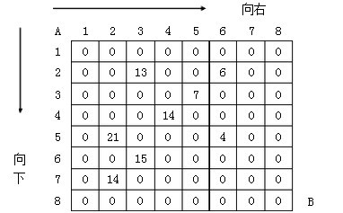
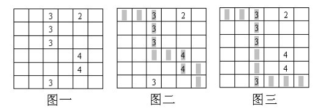

# 格子取數問題


## 題目描述
有n\*n個格子，每個格子裡有正數或者0，從最左上角往最右下角走，只能向下和向右，一共走兩次（即從左上角走到右下角走兩趟），把所有經過的格子的數加起來，求最大值SUM，且兩次如果經過同一個格子，則最後總和SUM中該格子的計數只加一次。




## 分析與解法

初看到此題，因為要讓兩次走下來的路徑總和最大，讀者可能最初想到的思路可能是讓每一次的路徑都是最優的，即不顧全局，只看局部，讓第一次和第二次的路徑都是最優。

但問題馬上就來了，雖然這一算法保證了連續的兩次走法都是最優的，但卻不能保證總體最優，相應的反例也不難給出，請看下圖：



上圖中，圖一是原始圖，那麼我們有以下兩種走法可供我們選擇：

* 如果按照上面的局部貪優走法，那麼第一次勢必會如圖二那樣走，導致的結果是第二次要麼取到2，要麼取到3，
* 但若不按照上面的局部貪優走法，那麼第一次可以如圖三那樣走，從而第二次走的時候能取到2 4 4，很顯然，這種走法求得的最終SUM值更大；

為了便於讀者理解，我把上面的走法在圖二中標記出來，而把應該正確的走法在上圖三中標示出來，如下圖所示：


也就是說，上面圖二中的走法太追求每一次最優，所以第一次最優，導致第二次將是很差；而圖三第一次雖然不是最優，但保證了第二次不差，所以圖三的結果優於圖二。由此可知不要只顧局部而貪圖一時最優，而喪失了全局最優。

局部貪優不行，我們可以考慮窮舉，但最終將導致複雜度過高，所以咱們得另尋良策。

為了方便討論，我們先對矩陣做一個編號，且以5*5的矩陣為例（給這個矩陣起個名字叫M1）：

  M1
  
  0  1  2  3  4
  
  1  2  3  4  5
  
  2  3  4  5  6
  
  3  4  5  6  7
  
  4  5  6  7  8

從左上(0)走到右下(8)共需要走8步（2*5-2）。我們設所走的步數為s。因為限定了只能向右和向下走，因此無論如何走，經過8步後（s = 8)都將走到右下。而DP的狀態也是依據所走的步數來記錄的。

再來分析一下經過其他s步後所處的位置，根據上面的討論，可以知道：

* 經過8步後，一定處於右下角(8)；
* 那麼經過5步後(s = 5)，肯定會處於編號為5的位置；
* 3步後肯定處於編號為3的位置；
* s = 4的時候，處於編號為4的位置，此時對於方格中，共有5（相當於n）個不同的位置，也是所有編號中最多的。

故推廣來說，對於n*n的方格，總共需要走2n - 2步，且當s = n - 1時，編號為n個，也是編號數最多的。

如果用DP[s,i,j]來記錄2次所走的狀態獲得的最大值，其中s表示走s步，i和j分別表示在s步後第1趟走的位置和第2趟走的位置。

為了方便描述，再對矩陣做一個編號（給這個矩陣起個名字叫M2）：

  M2
  
  0  0  0  0  0
  
  1  1  1  1  1
  
  2  2  2  2  2
  
  3  3  3  3  3
  
  4  4  4  4  4

把之前定的M1矩陣也再貼下：

  M1 
  
  0  1  2  3  4
  
  1  2  3  4  5
  
  2  3  4  5  6
  
  3  4  5  6  7
  
  4  5  6  7  8
我們先看M1，在經過6步後，肯定處於M1中編號為6的位置。而M1中共有3個編號為6的，它們分別對應M2中的2 3 4。故對於M2來說，假設第1次經過6步走到了M2中的2，第2次經過6步走到了M2中的4，DP[s,i,j] 則對應 DP[6,2,4]。由於s = 2n - 2,0 <= i <= j <= n，所以這個DP共有O(n^3)個狀態。

  M1
  
  0  1  2  3  4
  
  1  2  3  4  5
  
  2  3  4  5  6
  
  3  4  5  6  7
  
  4  5  6  7  8
再來分析一下狀態轉移，以DP[6,2,3]為例(就是上面M1中加粗的部分)，可以到達DP[6,2,3]的狀態包括DP[5,1,2]，DP[5,1,3]，DP[5,2,2]，DP[5,2,3]。

下面，我們就來看看這幾個狀態：DP[5,1,2]，DP[5,1,3]，DP[5,2,2]，DP[5,2,3]，用加粗表示位置DP[5,1,2]    DP[5,1,3]    DP[5,2,2]    DP[5,2,3] （加紅表示要達到的狀態DP[6,2,3]）

  0 1 2 3 4    0 1 2 3 4    0 1 2 3 4    0 1 2 3 4
  
  1 2 3 4 5    1 2 3 4 5    1 2 3 4 5    1 2 3 4 5
  
  2 3 4 5 6    2 3 4 5 6    2 3 4 5 6    2 3 4 5 6
  
  3 4 5 6 7    3 4 5 6 7    3 4 5 6 7    3 4 5 6 7
  
  4 5 6 7 8    4 5 6 7 8    4 5 6 7 8    4 5 6 7 8
  
因此：

    DP[6,2,3] = Max(DP[5,1,2] ，DP[5,1,3]，DP[5,2,2]，DP[5,2,3]) + 6,2和6,3格子中對應的數值    （式一） 

上面（式一）所示的這個遞推看起來沒有涉及：“如果兩次經過同一個格子，那麼該數只加一次的這個條件”，討論這個條件需要換一個例子，以DP[6,2,2]為例：DP[6,2,2]可以由DP[5,1,1]，DP[5,1,2]，DP[5,2,2]到達，但由於i = j，也就是2次走到同一個格子，那麼數值只能加1次。
所以當i = j時，

    DP[6,2,2] = Max(DP[5,1,1]，DP[5,1,2]，DP[5,2,2]) + 6,2格子中對應的數值                                （式二）

故，綜合上述的（式一），（式二）最後的遞推式就是

  if(i != j)
    DP[s, i ,j] = Max(DP[s - 1, i - 1, j - 1], DP[s - 1, i - 1, j], DP[s - 1, i, j - 1], DP[s - 1, i, j]) + W[s,i] + W[s,j]
  else
    DP[s, i ,j] = Max(DP[s - 1, i - 1, j - 1], DP[s - 1, i - 1, j], DP[s - 1, i, j]) + W[s,i]
其中W[s,i]表示經過s步後，處於i位置，位置i對應的方格中的數字。下一節我們將根據上述DP方程編碼實現。

為了便於實現，我們認為所有不能達到的狀態的得分都是負無窮，參考代碼如下：

```c
//copyright@caopengcs 2013
const int N = 202;
const int inf = 1000000000;  //無窮大
int dp[N * 2][N][N];
bool IsValid(int step, int x1, int x2, int n) //判斷狀態是否合法
{
    int y1 = step - x1, y2 = step - x2;
    return ((x1 >= 0) && (x1 < n) && (x2 >= 0) && (x2 < n) && (y1 >= 0) && (y1 < n) && (y2 >= 0) && (y2 < n));
}

int GetValue(int step, int x1, int x2, int n)  //處理越界 不存在的位置 給負無窮的值
{
    return IsValid(step, x1, x2, n) ? dp[step][x1][x2] : (-inf);
}

//狀態表示dp[step][i][j] 並且i <= j, 第step步  兩個人分別在第i行和第j行的最大得分 時間複雜度O(n^3) 空間複雜度O(n^3)
int MinPathSum(int a[N][N], int n)
{
    int P = n * 2 - 2; //最終的步數
    int i, j, step;

    //不能到達的位置 設置為負無窮大
    for (i = 0; i < n; ++i)
    {
        for (j = i; j < n; ++j)
        {
            dp[0][i][j] = -inf;
        }
    }
    dp[0][0][0] = a[0][0];

    for (step = 1; step <= P; ++step)
    {
        for (i = 0; i < n; ++i)
        {
            for (j = i; j < n; ++j)
            {
                dp[step][i][j] = -inf;
                if (!IsValid(step, i, j, n))   //非法位置
                {
                    continue;
                }
                //對於合法的位置進行dp
                if (i != j)
                {
                    dp[step][i][j] = max(dp[step][i][j], GetValue(step - 1, i - 1, j - 1, n));
                    dp[step][i][j] = max(dp[step][i][j], GetValue(step - 1, i - 1, j, n));
                    dp[step][i][j] = max(dp[step][i][j], GetValue(step - 1, i, j - 1, n));
                    dp[step][i][j] = max(dp[step][i][j], GetValue(step - 1, i, j, n));
                    dp[step][i][j] += a[i][step - i] + a[j][step - j];  //不在同一個格子，加兩個數
                }
                else
                {
                    dp[step][i][j] = max(dp[step][i][j], GetValue(step - 1, i - 1, j - 1, n));
                    dp[step][i][j] = max(dp[step][i][j], GetValue(step - 1, i - 1, j,  n));
                    dp[step][i][j] = max(dp[step][i][j], GetValue(step - 1, i, j,  n));
                    dp[step][i][j] += a[i][step - i]; // 在同一個格子裡，只能加一次
                }
            }
        }
    }
    return dp[P][n - 1][n - 1];
}
```

複雜度分析：狀態轉移最多需要統計4個變量的情況，看做是O(1)的，共有O(n^3)個狀態，所以總的時間複雜度是O(n^3)的，且dp數組開了N^3大小，故其空間複雜度亦為O(n^3)。

事實上，空間上可以利用滾動數組優化，由於每一步的遞推只跟上1步的情況有關，因此可以循環利用數組，將空間複雜度降為O(n^2)。

即我們在推算dp\[step\]的時候，只依靠它上一次的狀態dp\[step - 1\]，所以dp數組的第一維，我們只開到2就可以了。即step為奇數時，我們用dp[1][i][j]表示狀態，step為偶數我們用dp[0][i][j]表示狀態，這樣我們只需要O(n^2)的空間，這就是滾動數組的方法。滾動數組寫起來並不複雜，只需要對上面的代碼稍作修改即可，感興趣的讀者可以自己寫代碼實現下。

## 舉一反三

1、給定m*n的矩陣，每個位置是一個非負整數，從左上角開始，每次只能朝右和下走，走到右下角，但只走一次，求總和最小的路徑。

提示：因為只走一次，所以相對來說比較簡單，dp[0, 0]=a[0, 0]，且dp[x, y] = min(dp[x-1, y] + a[x, y]dp[x, y-1] + a[x, y])。

2、給定m*n的矩陣，每個位置是一個整數，從左上角開始，每次只能朝右、上和下走，並且不允許兩次進入同一個格子，走到右上角，最小和。

分析：@cpcs ：我們按列dp，假設前一列的最優值已經算好了，一旦往右就回不去了。枚舉我們從對固定的(y-1)列，我們已經算好了最優值，我們枚舉行x，朝右走到(x,y),然後再從(x,y)朝上走到(x,0)，再從(x,y)朝下走到(x,n-1)，所有這些第y列的值，作為第y列的候選值，取最優。
實際上，我們枚舉了進入第y列的位置和在最終停在第y列的位置。這樣保證我們不重複經過一個格子，也能保證我們不會往“左”走。
