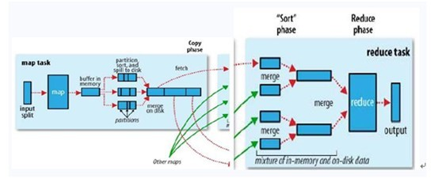

# 分佈式處理之MapReduce

## 方法介紹

MapReduce是一種計算模型，簡單的說就是將大批量的工作（數據）分解（MAP）執行，然後再將結果合併成最終結果（REDUCE）。這樣做的好處是可以在任務被分解後，可以通過大量機器進行並行計算，減少整個操作的時間。但如果你要我再通俗點介紹，那麼，說白了，Mapreduce的原理就是一個歸併排序。

適用範圍：數據量大，但是數據種類小可以放入內存

基本原理及要點：將數據交給不同的機器去處理，數據劃分，結果歸約。

### 基礎架構
想讀懂此文，讀者必須先要明確以下幾點，以作為閱讀後續內容的基礎知識儲備：

1. MapReduce是一種模式。
2. Hadoop是一種框架。
3. Hadoop是一個實現了MapReduce模式的開源的分佈式並行編程框架。

所以，你現在，知道了什麼是MapReduce，什麼是hadoop，以及這兩者之間最簡單的聯繫，而本文的主旨即是，一句話概括：**在hadoop的框架上採取MapReduce的模式處理海量數據**。下面，咱們可以依次深入學習和了解MapReduce和hadoop這兩個東西了。

### MapReduce模式

前面說了，MapReduce是一種模式，一種什麼模式呢?一種雲計算的核心計算模式，一種分佈式運算技術，也是簡化的分佈式編程模式，它主要用於解決問題的程序開發模型，也是開發人員拆解問題的方法。

Ok，光說不上圖，沒用。如下圖所示，MapReduce模式的主要思想是將自動分割要執行的問題（例如程序）拆解成Map（映射）和Reduce（化簡）的方式，流程圖如下圖1所示：  

在數據被分割後通過Map函數的程序將數據映射成不同的區塊，分配給計算機機群處理達到分佈式運算的效果，在通過Reduce 函數的程序將結果彙整，從而輸出開發者需要的結果。

MapReduce借鑑了函數式程序設計語言的設計思想，其軟件實現是指定一個Map函數，把鍵值對(key/value)映射成新的鍵值對(key/value)，形成一系列中間結果形式的key/value 對，然後把它們傳給Reduce(規約)函數，把具有相同中間形式key的value合併在一起。Map和Reduce函數具有一定的關聯性。函數描述如表1 所示：  

MapReduce致力於解決大規模數據處理的問題，因此在設計之初就考慮了數據的局部性原理，利用局部性原理將整個問題分而治之。MapReduce集群由普通PC機構成，為無共享式架構。在處理之前，將數據集分佈至各個節點。處理時，每個節點就近讀取本地存儲的數據處理（map），將處理後的數據進行合併（combine）、排序（shuffle and sort）後再分發（至reduce節點），避免了大量數據的傳輸，提高了處理效率。無共享式架構的另一個好處是配合複製（replication）策略，集群可以具有良好的容錯性，一部分節點的down機對集群的正常工作不會造成影響。

ok，你可以再簡單看看下副圖，整幅圖是有關hadoop的作業調優參數及原理，圖的左邊是MapTask運行示意圖，右邊是ReduceTask運行示意圖：  

如上圖所示，其中map階段，當map task開始運算，併產生中間數據後並非直接而簡單的寫入磁盤，它首先利用內存buffer來對已經產生的buffer進行緩存，並在內存buffer中進行一些預排序來優化整個map的性能。而上圖右邊的reduce階段則經歷了三個階段，分別Copy->Sort->reduce。我們能明顯的看出，其中的Sort是採用的歸併排序，即merge sort。

## 問題實例

1. The canonical example application of MapReduce is a process to count the appearances of each different word in a set of documents:
2. 海量數據分佈在100臺電腦中，想個辦法高效統計出這批數據的TOP10。
3. 一共有N個機器，每個機器上有N個數。每個機器最多存O(N)個數並對它們操作。如何找到N^2個數的中數(median)？
