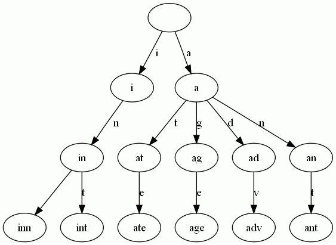

# Trie樹（字典樹）

## 方法介紹

### 1.1、什麼是Trie樹

Trie樹，即字典樹，又稱單詞查找樹或鍵樹，是一種樹形結構。典型應用是用於統計和排序大量的字符串（但不僅限於字符串），所以經常被搜索引擎系統用於文本詞頻統計。它的優點是最大限度地減少無謂的字符串比較，查詢效率比較高。

Trie的核心思想是空間換時間，利用字符串的公共前綴來降低查詢時間的開銷以達到提高效率的目的。

它有3個基本性質：

1. 根節點不包含字符，除根節點外每一個節點都只包含一個字符。
2. 從根節點到某一節點，路徑上經過的字符連接起來，為該節點對應的字符串。
3. 每個節點的所有子節點包含的字符都不相同。

### 1.2、樹的構建

咱們先來看一個問題：假如現在給你10萬個長度不超過10的單詞，對於每一個單詞，我們要判斷它出沒出現過，如果出現了，求第一次出現在第幾個位置。對於這個問題，我們該怎麼解決呢？

如果我們用最傻的方法，對於每一個單詞，我們都要去查找它前面的單詞中是否有它。那麼這個算法的複雜度就是O(n^2)。顯然對於10萬的範圍難以接受。

換個思路想：
 - 假設我要查詢的單詞是abcd，那麼在它前面的單詞中，以b，c，d，f之類開頭的顯然不必考慮，而只要找以a開頭的中是否存在abcd就可以了。
- 同樣的，在以a開頭中的單詞中，我們只要考慮以b作為第二個字母的，一次次縮小範圍和提高針對性，這樣一個樹的模型就漸漸清晰了。
    
即如果現在有b，abc，abd，bcd，abcd，efg，hii 這6個單詞，我們可以構建一棵如下圖所示的樹：

如上圖所示，對於每一個節點，從根遍歷到他的過程就是一個單詞，如果這個節點被標記為紅色，就表示這個單詞存在，否則不存在。
    
那麼，對於一個單詞，只要順著他從根走到對應的節點，再看這個節點是否被標記為紅色就可以知道它是否出現過了。把這個節點標記為紅色，就相當於插入了這個單詞。
    
這樣一來我們查詢和插入可以一起完成，所用時間僅僅為單詞長度（在這個例子中，便是10）。這就是一棵trie樹。
    
我們可以看到，trie樹每一層的節點數是26^i級別的。所以為了節省空間，我們還可以用動態鏈表，或者用數組來模擬動態。而空間的花費，不會超過單詞數×單詞長度。

### 1.3、查詢

Trie樹是簡單但實用的數據結構，通常用於實現字典查詢。我們做即時響應用戶輸入的AJAX搜索框時，就是Trie開始。本質上，Trie是一顆存儲多個字符串的樹。相鄰節點間的邊代表一個字符，這樣樹的每條分支代表一則子串，而樹的葉節點則代表完整的字符串。和普通樹不同的地方是，相同的字符串前綴共享同一條分支。

下面，再舉一個例子。給出一組單詞，inn, int, at, age, adv, ant, 我們可以得到下面的Trie：

可以看出：

- 每條邊對應一個字母。
- 每個節點對應一項前綴。葉節點對應最長前綴，即單詞本身。
- 單詞inn與單詞int有共同的前綴“in”, 因此他們共享左邊的一條分支，root->i->in。同理，ate, age, adv, 和ant共享前綴"a"，所以他們共享從根節點到節點"a"的邊。

查詢操縱非常簡單。比如要查找int，順著路徑i -> in -> int就找到了。

搭建Trie的基本算法也很簡單，無非是逐一把每則單詞的每個字母插入Trie。插入前先看前綴是否存在。如果存在，就共享，否則創建對應的節點和邊。比如要插入單詞add，就有下面幾步：

1. 考察前綴"a"，發現邊a已經存在。於是順著邊a走到節點a。
2. 考察剩下的字符串"dd"的前綴"d"，發現從節點a出發，已經有邊d存在。於是順著邊d走到節點ad
3. 考察最後一個字符"d"，這下從節點ad出發沒有邊d了，於是創建節點ad的子節點add，並把邊ad->add標記為d。

## 問題實例

**1、一個文本文件，大約有一萬行，每行一個詞，要求統計出其中最頻繁出現的前10個詞，請給出思想，給出時間複雜度分析**

**提示**：用trie樹統計每個詞出現的次數，時間複雜度是O(n\*le)（le表示單詞的平均長度），然後是找出出現最頻繁的前10個詞。當然，也可以用堆來實現，時間複雜度是O(n\*lg10)。所以總的時間複雜度，是O(n\*le)與O(n\*lg10)中較大的哪一個。

**2、尋找熱門查詢**

**原題**：搜索引擎會通過日誌文件把用戶每次檢索使用的所有檢索串都記錄下來，每個查詢串的長度為1-255字節。假設目前有一千萬個記錄，這些查詢串的重複讀比較高，雖然總數是1千萬，但是如果去除重複和，不超過3百萬個。一個查詢串的重複度越高，說明查詢它的用戶越多，也就越熱門。請你統計最熱門的10個查詢串，要求使用的內存不能超過1G。  

**提示**：利用trie樹，關鍵字域存該查詢串出現的次數，沒有出現為0。最後用10個元素的最小推來對出現頻率進行排序。
