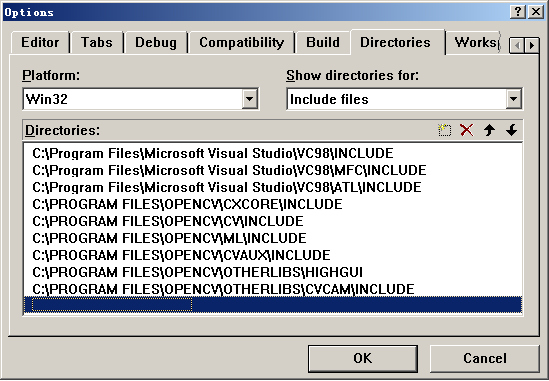
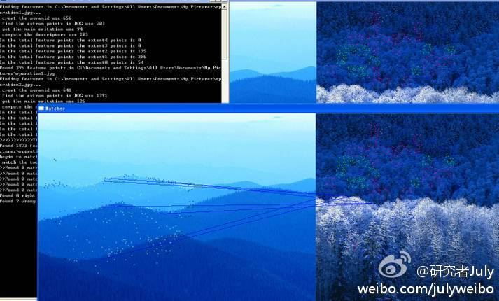

## sift算法的編譯與實現

代碼：Rob Hess維護的sift 庫。  
環境：windows xp+vc6.0。  
條件：opencv1.0、gsl-1.8.exe

昨日，下載了Rob Hess的sift庫，將其源碼粗略的看了看，想要編譯時，遇到了不少問題，先修改了下代碼，然後下載opencv、gsl。最後，幾經周折，才最終編譯成功。

以下便是sift源碼庫編譯後的效果圖：

為了給有興趣實現sift算法的朋友提供個參考，特整理此文如下。要了解什麼是sift算法，請參考：[九、圖像特徵提取與匹配之SIFT算法](http://blog.csdn.net/v_JULY_v/article/details/6186942)。ok，咱們下面，就來利用Rob Hess維護的sift 庫來實現sift算法：

首先，請下載Rob Hess維護的sift 庫：  
<http://blogs.oregonstate.edu/hess/code/sift>  
下載Rob Hess的這個壓縮包後，如果直接解壓縮，直接編譯，那麼會出現下面的錯誤提示：  

	編譯提示:error C1083: Cannot open include file: 'cxcore.h': No such file or directory，找不到這個頭文件。

這個錯誤，是因為你還沒有安裝opencv，因為：cxcore.h和cv.h是開源的OPEN CV頭文件,不是VC++的默認安裝文件,所以你還得下載OpenCV並進行安裝。然後，可以在OpenCV文件夾下找到你所需要的頭文件了。

據網友稱，截止2010年4月4日，還沒有在VC6.0下成功使用opencv2.0的案例。所以，如果你是VC6.0的用戶請下載opencv1.0版本。vs的話，opencv2.0,1.0任意下載。

以下，咱們就以**vc6.0為平臺舉例，下載並安裝opencv1.0版本、gsl**等。當然，你也可以用vs編譯，同樣下載opencv（具體版本不受限制）、gsl等。

請按以下步驟操作：

### 一、下載opencv1.0

<http://sourceforge.net/projects/opencvlibrary/files/opencv-win/1.0/OpenCV_1.0.exe/download>

### 二、安裝opencv1.0，配置Windows環境變量

1. **安裝注意：**假如你是將OpenCV安裝到**C**:/Program Files/OpenCV（**如果你安裝的時候選擇不是安裝在C盤，則下面所有對應的C盤都改為你所安裝在的那個“X盤”，即可**），在安裝時選擇"將/OpenCV/bin加入系統變量"，打上“勾”。（Add/OpenCV/bin to the systerm PATH。**這一步確認選上了之後，下面的檢查環境變量的步驟，便可免去**）

	

2. **檢查環境變量。**為了確保上述步驟中，加入了系統變量，在安裝opencv1.0成功後，還得檢查C:/Program Files/OpenCV/bin是否已經被加入到環境變量PATH，如果沒有，請加入。

3. **最後是配置Visual C++ 6.0。**  

* 全局設置  
菜單Tools->Options->Directories：先設置lib路徑，選擇Library files，在下方填入路徑：  
**C:/Program Files/OpenCV/lib**  
然後選擇include files，在下方填入路徑(參考下圖)：  
**C:/Program Files/OpenCV/cxcore/include**  
**C:/Program Files/OpenCV/cv/include**  
**C:/Program Files/OpenCV/cvaux/include**  
**C:/Program Files/OpenCV/ml/include**  
**C:/Program Files/OpenCV/otherlibs/highgui**  
**C:/Program Files/OpenCV/otherlibs/cvcam/include**  
	  
最後選擇source files，在下方填入路徑：  
**C:/Program Files/OpenCV/cv/src**  
**C:/Program Files/OpenCV/cxcore/src**  
**C:/Program Files/OpenCV/cvaux/src**  
**C:/Program Files/OpenCV/otherlibs/highgui**  
**C:/Program Files/OpenCV/otherlibs/cvcam/src/windows**  

* 項目設置
每創建一個將要使用OpenCV的VC Project，都需要給它指定需要的lib。菜單：Project->Settings，然後將Setting for選為All Configurations，然後選擇右邊的link標籤，在Object/library modules附加上：
cxcore.lib cv.lib ml.lib cvaux.lib highgui.lib cvcam.lib
當然，你不需要這麼多lib，你可以只添加你需要的lib(見下圖)

### 三、下載gsl，gsl也是一個庫，也需要下載：
<http://sourceforge.net/projects/gnuwin32/files/gsl/1.8/gsl-1.8.exe/download>。在編譯時候GSL也是和OpenCV一樣要把頭文件和lib的路徑指定好。

### 四、配置gsl

將C:/WinGsl/bin中的WinGsl.dll和WinGslD.dll複製到C:/VC6.0/Bin；將整個Gsl目錄複製到C:/VC6.0/Bin下；lib目錄下的所有.lib文件全部複製到C:/VC6.0/Lib下。  
然後，在tools－options－directories中，將C:/WinGsl下的lib，gsl分別加入到庫文件和頭文件的搜索路徑中。

**以下是可能會出現的錯誤情況處理：**

1. OpenCV安裝後“沒有找到cxcore100.dll”的錯誤處理
在安裝時選擇“將/OpenCV/bin加入系統變量”（Add/OpenCV/bin to the systerm PATH）。 但該選項並不一定能成功添加到系統變量，如果編寫的程序在運行時出現“沒有找到cxcore100.dll，因為這個應用程序未能啟動。重新安裝應用程序可能會修復此問題。”的錯誤。
手動在我的電腦->屬性->高級->環境變量->系統變量->path添加c:/program files/opencv/bin;添加完成後需要重啟計算機。

2. vc6.0下配置了一下，可是編譯程序時遇到如下一個錯誤： 
Linking... LINK : fatal error LNK1104: cannot open file"odbccp32.libcxcore.lib" 
可能是：在工程設置的時候添加連接庫時沒加空格或.來把兩個文件名（odbccp32.lib cxcore.lib）分開。注意每一次操作後，記得保存。

若經過以上所有的步驟之後，如果還不能正常編譯，那就是還要稍微修改下你下載的Rob Hess代碼。ok，日後，若有空，再好好詳細剖析下此sift的源碼。最後，祝你編譯順利。

updated

今天下午試了下sift + KD + BBF，然後用兩幅不同的圖片做了下匹配（當然，運行結果顯示是不匹配的），效果還不錯：<http://weibo.com/1580904460/yDmzAEwcV#1348475194313>! 

同時，編譯的過程中，直接用的VS2010 + opencv（並沒下gsl）。2012.09.24。完。 
