## 教你一步一步用c語言實現sift算法、上

參考：Rob Hess維護的sift 庫  
環境：windows xp+vc6.0  
條件：c語言實現。  

### 引言：
在我寫的關於sift算法的前倆篇文章裡頭，已經對sift算法有了初步的介紹：[九、圖像特徵提取與匹配之SIFT算法](http://blog.csdn.net/v_JULY_v/article/details/6186942)，而後在：[九（續）、sift算法的編譯與實現](http://blog.csdn.net/v_JULY_v/article/details/6225117)裡，我也簡單記錄下瞭如何利用opencv，gsl等庫編譯運行sift程序。

但據一朋友表示，是否能用c語言實現sift算法，同時，儘量不用到opencv，gsl等第三方庫之類的東西。而且，Rob Hess維護的sift 庫，也不好懂，有的人根本搞不懂是怎麼一回事。

那麼本文，就教你如何利用c語言一步一步實現sift算法，同時，你也就能真正明白sift算法到底是怎麼一回事了。

ok，先看一下，本程序最終運行的效果圖，sift 算法分為五個步驟（下文詳述），對應以下**第二~第六幅圖**：

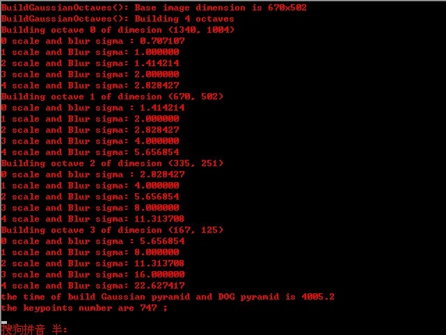

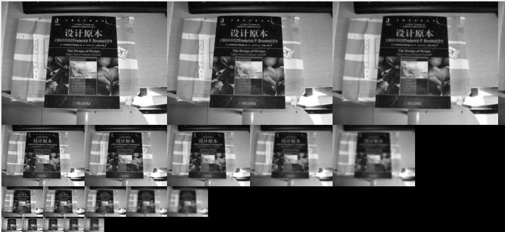

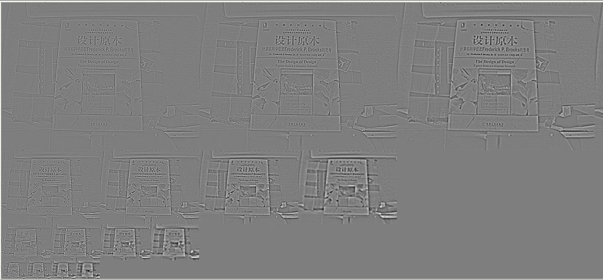

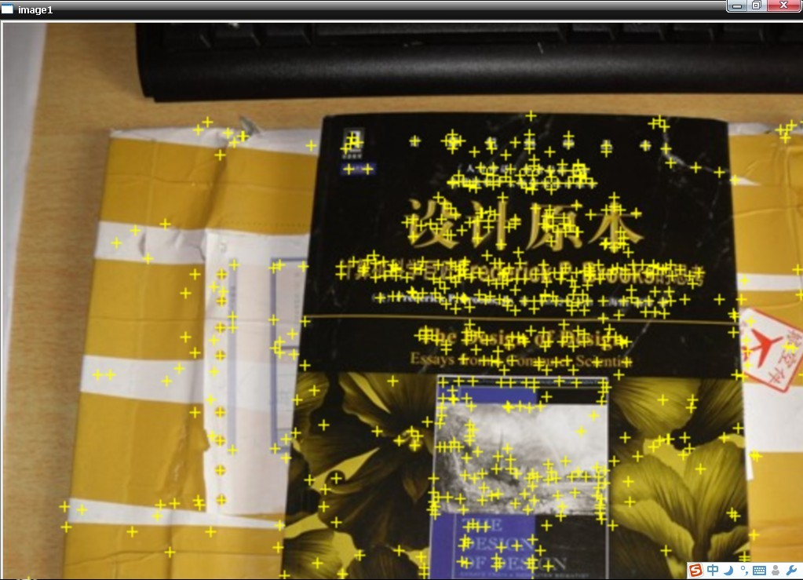

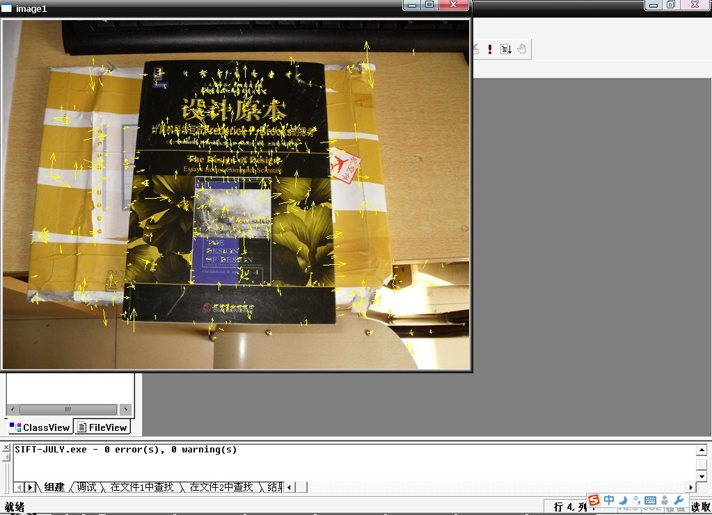

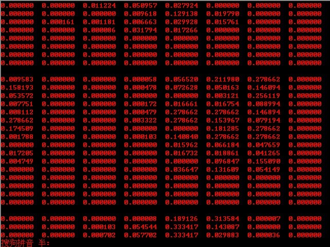

### sift算法的步驟
要實現一個算法，首先要完全理解這個算法的原理或思想。咱們先來簡單瞭解下，什麼叫sift算法：

sift，尺度不變特徵轉換，是一種電腦視覺的算法用來偵測與描述影像中的局部性特徵，它在空間尺度中尋找極值點，並提取出其位置、尺度、旋轉不變量，此算法由 David Lowe 在1999年所發表，2004年完善總結。

所謂，Sift算法就是用不同尺度（標準差）的高斯函數對圖像進行平滑，然後比較平滑後圖像的差別，

差別大的像素就是特徵明顯的點。

以下是sift算法的五個步驟：
    
#### 一、建立圖像尺度空間(或高斯金字塔)，並檢測極值點

首先建立尺度空間，要使得圖像具有尺度空間不變形，就要建立尺度空間，sift算法採用了高斯函數來建立尺度空間，高斯函數公式為：


上述公式G(x,y,e)，即為尺度可變高斯函數。

而，一個圖像的尺度空間L（x,y,e) ,定義為原始圖像I(x,y)與上述的一個可變尺度的2維高斯函數G(x,y,e) 卷積運算。

即，原始影像I(x，y)在不同的尺度e下，與高斯函數G(x,y,e)進行卷積，得到L(x,y,e)，如下：
    


以上的（x，y）是空間座標， e，是尺度座標，或尺度空間因子，e的大小決定平滑程度，大尺度對應圖像的概貌特徵，小尺度對應圖像的細節特徵。大的e值對應粗糙尺度(低分辨率)，反之，對應精細尺度(高分辨率)。

尺度，受e這個參數控制的表示。而不同的L（x,y,e）就構成了尺度空間，具體計算的時候，即使連續的高斯函數，都被離散為（一般為奇數大小）(2\*k+1) \*(2\*k+1)矩陣，來和數字圖像進行卷積運算。

隨著e的變化，建立起不同的尺度空間，或稱之為建立起圖像的高斯金字塔。

**但**，像上述L(x,y,e) = G(x,y,e)\*I(x,y)的操作，在進行高斯卷積時，整個圖像就要遍歷所有的像素進行卷積(邊界點除外)，於此，就造成了時間和空間上的很大浪費。

為了更有效的在尺度空間檢測到穩定的關鍵點，也為了縮小時間和空間複雜度，對上述的操作作了一個改建：即，提出了高斯差分尺度空間（DOG scale-space）。利用不同尺度的高斯差分與原始圖像I(x,y)相乘 ，卷積生成。


DOG算子計算簡單，是尺度歸一化的LOG算子的近似。

**ok，耐心點**，咱們再來總結一下上述內容：

1. 高斯卷積  
在組建一組尺度空間後，再組建下一組尺度空間，對上一組尺度空間的最後一幅圖像進行二分之一採樣，得到下一組尺度空間的第一幅圖像，然後進行像建立第一組尺度空間那樣的操作，得到第二組尺度空間，公式定義為

    L(x,y,e) = G(x,y,e)\*I(x,y)

    圖像金字塔的構建：圖像金字塔共O組，每組有S層，下一組的圖像由上一組圖像降採樣得到，效果圖，**圖A**如下(左為上一組，右為下一組)：
    
    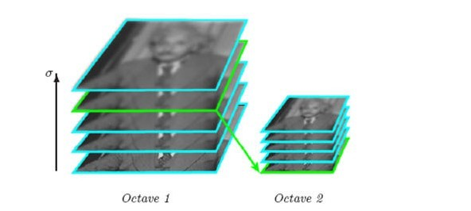
    
2. 高斯差分  
在尺度空間建立完畢後，為了能夠找到穩定的關鍵點，採用高斯差分的方法來檢測那些在局部位置的極值點，即採用倆個相鄰的尺度中的圖像相減，即公式定義為：
D(x,y,e) = ((G(x,y,ke) - G(x,y,e)) \* I(x,y) = L(x,y,ke) - L(x,y,e)

    效果圖，圖B：
    
    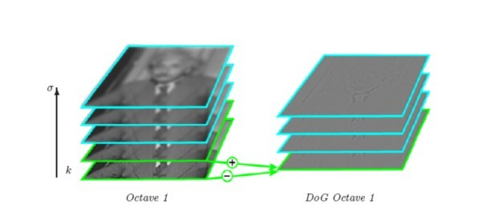
    
SIFT的精妙之處在於採用圖像金字塔的方法解決這一問題，我們可以把兩幅圖像想象成是連續的，分別以它們作為底面作四稜錐，就像金字塔，那麼每一個 截面與原圖像相似，那麼兩個金字塔中必然會有包含大小一致的物體的無窮個截面，但應用只能是離散的，所以我們只能構造有限層，層數越多當然越好，但處理時 間會相應增加，層數太少不行，因為向下採樣的截面中可能找不到尺寸大小一致的兩個物體的圖像。

#### 咱們再來具體闡述下構造D(x,y,e)的詳細步驟：

1. 首先採用不同尺度因子的高斯核對圖像進行卷積以得到圖像的不同尺度空間，將這一組圖像作為金子塔圖像的第一層。
2. 接著對第一層圖像中的2倍尺度圖像（相對於該層第一幅圖像的2倍尺度）以2倍像素距離進行下采樣來得到金子塔圖像的第二層中的第一幅圖像，對該圖像採用不同尺度因子的高斯核進行卷積，以獲得金字塔圖像中第二層的一組圖像。
3. 再以金字塔圖像中第二層中的2倍尺度圖像（相對於該層第一幅圖像的2倍尺度）以2倍像素距離進行下采樣來得到金字塔圖像的第三層中的第一幅圖像，對該圖像採用不同尺度因子的高斯核進行卷積，以獲得金字塔圖像中第三層的一組圖像。這樣依次類推，從而獲得了金字塔圖像的每一層中的一組圖像，如下圖所示：
    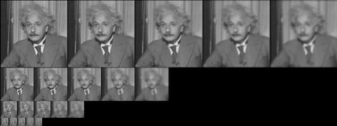
4. 對上圖得到的每一層相鄰的高斯圖像相減，就得到了高斯差分圖像，如下述第一幅圖所示。下述第二幅圖中的右列顯示了將每組中相鄰圖像相減所生成的高斯差分圖像的結果，限於篇幅，圖中只給出了第一層和第二層高斯差分圖像的計算（下述倆幅圖統稱為圖2）：

    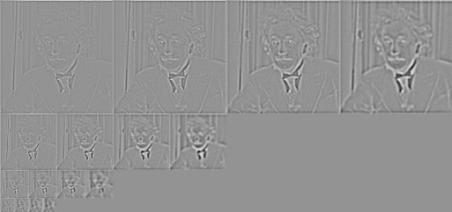

    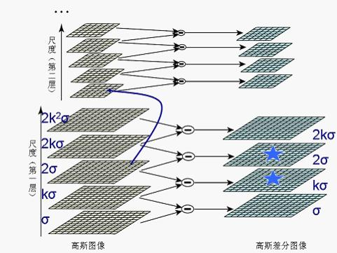
    
    *圖像金字塔的建立：對於一幅圖像I,建立其在不同尺度(scale)的圖像，也成為子八度（octave），這是為了scale-invariant，也就是在任何尺度都能夠有對應的特徵點，第一個子八度的scale為原圖大小，後面每個octave為上一個octave降採樣的結果，即原圖的1/4（長寬分別減半），構成下一個子八度（高一層金字塔）。*
    
5. 因為高斯差分函數是歸一化的高斯拉普拉斯函數的近似，所以可以從高斯差分金字塔分層結構提取出圖像中的極值點作為候選的特徵點。對DOG 尺度空間每個點與相鄰尺度和相鄰位置的點逐個進行比較，得到的局部極值位置即為特徵點所處的位置和對應的尺度。

#### 二、檢測關鍵點

為了尋找尺度空間的極值點，每一個採樣點要和它所有的相鄰點比較，看其是否比它的圖像域和尺度域的相鄰點大或者小。如下圖，圖3所示，中間的檢測點和它同尺度的8個相鄰點和上下相鄰尺度對應的9×2個點共26個點比較，以確保在尺度空間和二維圖像空間都檢測到極值點。

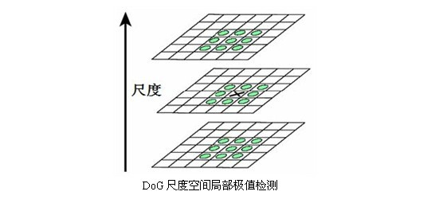

因為需要同相鄰尺度進行比較，所以在一組高斯差分圖像中只能檢測到兩個尺度的極值點（如上述第二幅圖中右圖的五角星標識），而其它尺度的極值點檢測則需要在圖像金字塔的上一層高斯差分圖像中進行。依次類推，最終在圖像金字塔中不同層的高斯差分圖像中完成不同尺度極值的檢測。

當然這樣產生的極值點並不都是穩定的特徵點，因為某些極值點響應較弱，而且DOG算子會產生較強的邊緣響應。

#### 三、關鍵點方向的分配

為了使描述符具有旋轉不變性，需要利用圖像的局部特徵為給每一個關鍵點分配一個方向。利用關鍵點鄰域像素的梯度及方向分佈的特性，可以得到梯度模值和方向如下：


其中，尺度為每個關鍵點各自所在的尺度。

在以關鍵點為中心的鄰域窗口內採樣，並用直方圖統計鄰域像素的梯度方向。梯度直方圖的範圍是0～360度，其中每10度一個方向，總共36個方向。

直方圖的峰值則代表了該關鍵點處鄰域梯度的主方向，即作為該關鍵點的方向。

在計算方向直方圖時，需要用一個參數等於關鍵點所在尺度1.5倍的高斯權重窗對方向直方圖進行加權，上圖中用藍色的圓形表示，中心處的藍色較重，表示權值最大，邊緣處顏色潛，表示權值小。如下圖所示，該示例中為了簡化給出了8方向的方向直方圖計算結果，實際sift創始人David Lowe的原論文中採用36方向的直方圖。

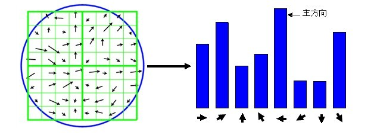

方向直方圖的峰值則代表了該特徵點處鄰域梯度的方向，以直方圖中最大值作為該關鍵點的主方向。為了增強匹配的魯棒性，只保留峰值大於主方向峰值80％的方向作為該關鍵點的輔方向。因此，對於同一梯度值的多個峰值的關鍵點位置，在相同位置和尺度將會有多個關鍵點被創建但方向不同。僅有15％的關鍵點被賦予多個方向，但可以明顯的提高關鍵點匹配的穩定性。
        
至此，圖像的關鍵點已檢測完畢，每個關鍵點有三個信息：位置、所處尺度、方向。由此可以確定一個SIFT特徵區域。

#### 四、特徵點描述符

通過以上步驟，對於每一個關鍵點，擁有三個信息：位置、尺度以及方向。接下來就是為每個關鍵點建立一個描述符，使其不隨各種變化而改變，比如光照變化、視角變化等等。並且描述符應該有較高的獨特性，以便於提高特徵點正確匹配的概率。  

首先將座標軸旋轉為關鍵點的方向，以確保旋轉不變性。

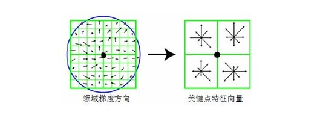

接下來以關鍵點為中心取8×8的窗口。

上圖，圖5中左部分的中央黑點為當前關鍵點的位置，每個小格代表關鍵點鄰域所在尺度空間的一個像素，箭頭方向代表該像素的梯度方向，箭頭長度代表梯度模值，圖中藍色的圈代表高斯加權的範圍（越靠近關鍵點的像素梯度方向信息貢獻越大）。

然後在每4×4的小塊上計算8個方向的梯度方向直方圖，繪製每個梯度方向的累加值，即可形成一個種子點，如圖5右部分所示。此圖中一個關鍵點由2×2共4個種子點組成，每個種子點有8個方向向量信息。這種鄰域方向性信息聯合的思想增強了算法抗噪聲的能力，同時對於含有定位誤差的特徵匹配也提供了較好的容錯性。

實際計算過程中，為了增強匹配的穩健性，Lowe建議對每個關鍵點使用4×4共16個種子點來描述，這樣對於一個關鍵點就可以產生128個數據，即最終形成128維的SIFT特徵向量。此時SIFT特徵向量已經去除了尺度變化、旋轉等幾何變形因素的影響，再繼續將特徵向量的長度歸一化，則可以進一步去除光照變化的影響。

#### 五、最後一步

當兩幅圖像的SIFT特徵向量生成後，下一步我們採用關鍵點特徵向量的歐式距離來作為兩幅圖像中關鍵點的相似性判定度量。取上圖中，**圖像A**中的某個關鍵點，並找出其與**圖像B**中歐式距離最近的前兩個關鍵點，在這兩個關鍵點中，如果最近的距離除以次近的距離少於某個比例閾值，則接受這一對匹配點。降低這個比例閾值，SIFT匹配點數目會減少，但更加穩定。關於sift 算法的更多理論介紹請參看此文：<http://blog.csdn.net/abcjennifer/article/details/7639681>。

### sift算法的逐步c實現

ok，上文攪了那麼多的理論，如果你沒有看懂它，咋辦列?沒關係，下面，咱們來一步一步實現此sift算法，即使你沒有看到上述的理論，慢慢的，你也會明白sift算法到底是怎麼一回事，sift算法到底是怎麼實現的...。

yeah，請看：

#### 前期工作：

在具體編寫核心函數之前，得先做幾個前期的準備工作：

1. 頭文件：

    ```c
    #ifdef _CH_  
    #pragma package <opencv>  
    #endif  
      
    #ifndef _EiC  
    #include <stdio.h>  
      
    #include "stdlib.h"  
    #include "string.h"   
    #include "malloc.h"   
    #include "math.h"   
    #include <assert.h>  
    #include <ctype.h>  
    #include <time.h>  
    #include <cv.h>  
    #include <cxcore.h>  
    #include <highgui.h>  
    #include <vector>  
    #endif  
      
    #ifdef _EiC  
    #define WIN32  
    #endif  
    ```

2. 定義幾個宏，及變量，以免下文函數中，突然冒出一個變量，而您卻不知道怎麼一回事：
    ```c
    #define NUMSIZE 2  
    #define GAUSSKERN 3.5  
    #define PI 3.14159265358979323846  
      
    //Sigma of base image -- See D.L.'s paper.  
    #define INITSIGMA 0.5  
    //Sigma of each octave -- See D.L.'s paper.  
    #define SIGMA sqrt(3)//1.6//  
      
    //Number of scales per octave.  See D.L.'s paper.  
    #define SCALESPEROCTAVE 2  
    #define MAXOCTAVES 4  
    int     numoctaves;  
      
    #define CONTRAST_THRESHOLD   0.02  
    #define CURVATURE_THRESHOLD  10.0  
    #define DOUBLE_BASE_IMAGE_SIZE 1  
    #define peakRelThresh 0.8  
    #define LEN 128  
      
    // temporary storage  
    CvMemStorage* storage = 0;   
    ```

3. 然後，咱們還得，聲明幾個變量，以及建幾個數據結構（數據結構是一切程序事物的基礎麻，:D。）：

    ```c
    //Data structure for a float image.  
    typedef struct ImageSt {        /*金字塔每一層*/  
       
     float levelsigma;  
     int levelsigmalength;  
     float absolute_sigma;  
     CvMat *Level;       //CvMat是OPENCV的矩陣類，其元素可以是圖像的象素值         
    } ImageLevels;  
      
    typedef struct ImageSt1 {      /*金字塔每一階梯*/  
     int row, col;          //Dimensions of image.   
     float subsample;  
     ImageLevels *Octave;                
    } ImageOctaves;  
      
    ImageOctaves *DOGoctaves;        
    //DOG pyr，DOG算子計算簡單，是尺度歸一化的LoG算子的近似。  
        
    ImageOctaves *mag_thresh ;  
    ImageOctaves *mag_pyr ;  
    ImageOctaves *grad_pyr ;  
      
    //keypoint數據結構，Lists of keypoints are linked by the "next" field.  
    typedef struct KeypointSt   
    {  
     float row, col; /* 反饋回原圖像大小，特徵點的位置 */  
     float sx,sy;    /* 金字塔中特徵點的位置*/  
     int octave,level;/*金字塔中，特徵點所在的階梯、層次*/  
       
     float scale, ori,mag; /*所在層的尺度sigma,主方向orientation (range [-PI,PI])，以及幅值*/  
     float *descrip;       /*特徵描述字指針：128維或32維等*/  
     struct KeypointSt *next;/* Pointer to next keypoint in list. */  
    } *Keypoint;  
      
    //定義特徵點具體變量  
    Keypoint keypoints=NULL;      //用於臨時存儲特徵點的位置等  
    Keypoint keyDescriptors=NULL; //用於最後的確定特徵點以及特徵描述字  
    ```
    
4. 聲明幾個圖像的基本處理函數：

    ```c
    CvMat * halfSizeImage(CvMat * im);     //縮小圖像：下采樣  
    CvMat * doubleSizeImage(CvMat * im);   //擴大圖像：最近臨方法  
    CvMat * doubleSizeImage2(CvMat * im);  //擴大圖像：線性插值  
    float getPixelBI(CvMat * im, float col, float row);//雙線性插值函數  
    void normalizeVec(float* vec, int dim);//向量歸一化    
    CvMat* GaussianKernel2D(float sigma);  //得到2維高斯核  
    void normalizeMat(CvMat* mat) ;        //矩陣歸一化  
    float* GaussianKernel1D(float sigma, int dim) ; //得到1維高斯核  
      
    //在具體像素處寬度方向進行高斯卷積  
    float ConvolveLocWidth(float* kernel, int dim, CvMat * src, int x, int y) ;    
    //在整個圖像寬度方向進行1D高斯卷積  
    void Convolve1DWidth(float* kern, int dim, CvMat * src, CvMat * dst) ;         
    //在具體像素處高度方向進行高斯卷積  
    float ConvolveLocHeight(float* kernel, int dim, CvMat * src, int x, int y) ;   
    //在整個圖像高度方向進行1D高斯卷積  
    void Convolve1DHeight(float* kern, int dim, CvMat * src, CvMat * dst);       
    //用高斯函數模糊圖像    
    int BlurImage(CvMat * src, CvMat * dst, float sigma) ;            
    ```
    
#### 算法核心

本程序中，sift算法被分為以下五個步驟及其相對應的函數（可能表述與上，或與前倆篇文章有所偏差，但都一個意思）：

```c
//SIFT算法第一步：圖像預處理  
CvMat *ScaleInitImage(CvMat * im) ;                  //金字塔初始化  
  
//SIFT算法第二步：建立高斯金字塔函數  
ImageOctaves* BuildGaussianOctaves(CvMat * image) ;  //建立高斯金字塔  
  
//SIFT算法第三步：特徵點位置檢測，最後確定特徵點的位置  
int DetectKeypoint(int numoctaves, ImageOctaves *GaussianPyr);  
void DisplayKeypointLocation(IplImage* image, ImageOctaves *GaussianPyr);  
  
//SIFT算法第四步：計算高斯圖像的梯度方向和幅值，計算各個特徵點的主方向  
void ComputeGrad_DirecandMag(int numoctaves, ImageOctaves *GaussianPyr);  
  
int FindClosestRotationBin (int binCount, float angle);  //進行方向直方圖統計  
void AverageWeakBins (double* bins, int binCount);       //對方向直方圖濾波  
//確定真正的主方向  
bool InterpolateOrientation (double left, double middle,double right, double *degreeCorrection, double *peakValue);  
//確定各個特徵點處的主方向函數  
void AssignTheMainOrientation(int numoctaves, ImageOctaves *GaussianPyr,ImageOctaves *mag_pyr,ImageOctaves *grad_pyr);  
//顯示主方向  
void DisplayOrientation (IplImage* image, ImageOctaves *GaussianPyr);  
  
//SIFT算法第五步：抽取各個特徵點處的特徵描述字  
void ExtractFeatureDescriptors(int numoctaves, ImageOctaves *GaussianPyr);  
  
//為了顯示圖象金字塔，而作的圖像水平、垂直拼接  
CvMat* MosaicHorizen( CvMat* im1, CvMat* im2 );  
CvMat* MosaicVertical( CvMat* im1, CvMat* im2 );  
  
//特徵描述點，網格    
#define GridSpacing 4  
```

#### 主體實現
ok，以上所有的工作都就緒以後，那麼接下來，咱們就先來編寫main函數，因為你一看主函數之後，你就立馬能發現sift算法的工作流程及其原理了。

（主函數中涉及到的函數，下一篇文章：[一、教你一步一步用c語言實現sift算法、下](http://blog.csdn.net/v_JULY_v/article/details/6246213)，咱們自會一個一個編寫）：

```c
int main( void )  
{  
 //聲明當前幀IplImage指針  
 IplImage* src = NULL;   
 IplImage* image1 = NULL;   
 IplImage* grey_im1 = NULL;   
 IplImage* DoubleSizeImage = NULL;  
   
 IplImage* mosaic1 = NULL;   
 IplImage* mosaic2 = NULL;   
   
 CvMat* mosaicHorizen1 = NULL;  
 CvMat* mosaicHorizen2 = NULL;  
 CvMat* mosaicVertical1 = NULL;  
   
 CvMat* image1Mat = NULL;  
 CvMat* tempMat=NULL;  
   
 ImageOctaves *Gaussianpyr;  
 int rows,cols;  
  
#define Im1Mat(ROW,COL) ((float *)(image1Mat->data.fl + image1Mat->step/sizeof(float) *(ROW)))[(COL)]  
   
 //灰度圖象像素的數據結構  
#define Im1B(ROW,COL) ((uchar*)(image1->imageData + image1->widthStep*(ROW)))[(COL)*3]  
#define Im1G(ROW,COL) ((uchar*)(image1->imageData + image1->widthStep*(ROW)))[(COL)*3+1]  
#define Im1R(ROW,COL) ((uchar*)(image1->imageData + image1->widthStep*(ROW)))[(COL)*3+2]  
   
 storage = cvCreateMemStorage(0);   
   
 //讀取圖片  
 if( (src = cvLoadImage( "street1.jpg", 1)) == 0 )  // test1.jpg einstein.pgm back1.bmp  
  return -1;  
  
 //為圖像分配內存   
 image1 = cvCreateImage(cvSize(src->width, src->height),  IPL_DEPTH_8U,3);  
 grey_im1 = cvCreateImage(cvSize(src->width, src->height),  IPL_DEPTH_8U,1);  
 DoubleSizeImage = cvCreateImage(cvSize(2*(src->width), 2*(src->height)),  IPL_DEPTH_8U,3);  
  
 //為圖像陣列分配內存，假設兩幅圖像的大小相同，tempMat跟隨image1的大小  
 image1Mat = cvCreateMat(src->height, src->width, CV_32FC1);  
 //轉化成單通道圖像再處理  
 cvCvtColor(src, grey_im1, CV_BGR2GRAY);  
 //轉換進入Mat數據結構,圖像操作使用的是浮點型操作  
 cvConvert(grey_im1, image1Mat);  
   
 double t = (double)cvGetTickCount();  
 //圖像歸一化  
 cvConvertScale( image1Mat, image1Mat, 1.0/255, 0 );  
   
 int dim = min(image1Mat->rows, image1Mat->cols);  
 numoctaves = (int) (log((double) dim) / log(2.0)) - 2;    //金字塔階數  
 numoctaves = min(numoctaves, MAXOCTAVES);  
  
 //SIFT算法第一步，預濾波除噪聲，建立金字塔底層  
 tempMat = ScaleInitImage(image1Mat) ;  
 //SIFT算法第二步，建立Guassian金字塔和DOG金字塔  
 Gaussianpyr = BuildGaussianOctaves(tempMat) ;  
   
 t = (double)cvGetTickCount() - t;  
 printf( "the time of build Gaussian pyramid and DOG pyramid is %.1f/n", t/(cvGetTickFrequency()*1000.) );  
   
#define ImLevels(OCTAVE,LEVEL,ROW,COL) ((float *)(Gaussianpyr[(OCTAVE)].Octave[(LEVEL)].Level->data.fl + Gaussianpyr[(OCTAVE)].Octave[(LEVEL)].Level->step/sizeof(float) *(ROW)))[(COL)]  
 //顯示高斯金字塔  
 for (int i=0; i<numoctaves;i++)  
 {  
  if (i==0)  
  {  
   mosaicHorizen1=MosaicHorizen( (Gaussianpyr[0].Octave)[0].Level, (Gaussianpyr[0].Octave)[1].Level );  
   for (int j=2;j<SCALESPEROCTAVE+3;j++)  
    mosaicHorizen1=MosaicHorizen( mosaicHorizen1, (Gaussianpyr[0].Octave)[j].Level );  
   for ( j=0;j<NUMSIZE;j++)  
    mosaicHorizen1=halfSizeImage(mosaicHorizen1);  
  }  
  else if (i==1)  
  {  
   mosaicHorizen2=MosaicHorizen( (Gaussianpyr[1].Octave)[0].Level, (Gaussianpyr[1].Octave)[1].Level );  
   for (int j=2;j<SCALESPEROCTAVE+3;j++)  
    mosaicHorizen2=MosaicHorizen( mosaicHorizen2, (Gaussianpyr[1].Octave)[j].Level );  
   for ( j=0;j<NUMSIZE;j++)  
    mosaicHorizen2=halfSizeImage(mosaicHorizen2);  
   mosaicVertical1=MosaicVertical( mosaicHorizen1, mosaicHorizen2 );  
  }  
  else  
  {  
   mosaicHorizen1=MosaicHorizen( (Gaussianpyr[i].Octave)[0].Level, (Gaussianpyr[i].Octave)[1].Level );  
   for (int j=2;j<SCALESPEROCTAVE+3;j++)  
    mosaicHorizen1=MosaicHorizen( mosaicHorizen1, (Gaussianpyr[i].Octave)[j].Level );  
   for ( j=0;j<NUMSIZE;j++)  
    mosaicHorizen1=halfSizeImage(mosaicHorizen1);  
   mosaicVertical1=MosaicVertical( mosaicVertical1, mosaicHorizen1 );  
  }  
 }  
 mosaic1 = cvCreateImage(cvSize(mosaicVertical1->width, mosaicVertical1->height),  IPL_DEPTH_8U,1);  
 cvConvertScale( mosaicVertical1, mosaicVertical1, 255.0, 0 );  
 cvConvertScaleAbs( mosaicVertical1, mosaic1, 1, 0 );  
   
 //  cvSaveImage("GaussianPyramid of me.jpg",mosaic1);  
 cvNamedWindow("mosaic1",1);  
 cvShowImage("mosaic1", mosaic1);  
 cvWaitKey(0);  
 cvDestroyWindow("mosaic1");  
 //顯示DOG金字塔  
 for ( i=0; i<numoctaves;i++)  
 {  
  if (i==0)  
  {  
   mosaicHorizen1=MosaicHorizen( (DOGoctaves[0].Octave)[0].Level, (DOGoctaves[0].Octave)[1].Level );  
   for (int j=2;j<SCALESPEROCTAVE+2;j++)  
    mosaicHorizen1=MosaicHorizen( mosaicHorizen1, (DOGoctaves[0].Octave)[j].Level );  
   for ( j=0;j<NUMSIZE;j++)  
    mosaicHorizen1=halfSizeImage(mosaicHorizen1);  
  }  
  else if (i==1)  
  {  
   mosaicHorizen2=MosaicHorizen( (DOGoctaves[1].Octave)[0].Level, (DOGoctaves[1].Octave)[1].Level );  
   for (int j=2;j<SCALESPEROCTAVE+2;j++)  
    mosaicHorizen2=MosaicHorizen( mosaicHorizen2, (DOGoctaves[1].Octave)[j].Level );  
   for ( j=0;j<NUMSIZE;j++)  
    mosaicHorizen2=halfSizeImage(mosaicHorizen2);  
   mosaicVertical1=MosaicVertical( mosaicHorizen1, mosaicHorizen2 );  
  }  
  else  
  {  
   mosaicHorizen1=MosaicHorizen( (DOGoctaves[i].Octave)[0].Level, (DOGoctaves[i].Octave)[1].Level );  
   for (int j=2;j<SCALESPEROCTAVE+2;j++)  
    mosaicHorizen1=MosaicHorizen( mosaicHorizen1, (DOGoctaves[i].Octave)[j].Level );  
   for ( j=0;j<NUMSIZE;j++)  
    mosaicHorizen1=halfSizeImage(mosaicHorizen1);  
   mosaicVertical1=MosaicVertical( mosaicVertical1, mosaicHorizen1 );  
  }  
 }  
 //考慮到DOG金字塔各層圖像都會有正負，所以，必須尋找最負的，以將所有圖像抬高一個臺階去顯示  
 double min_val=0;  
 double max_val=0;  
 cvMinMaxLoc( mosaicVertical1, &min_val, &max_val,NULL, NULL, NULL );  
 if ( min_val<0.0 )  
  cvAddS( mosaicVertical1, cvScalarAll( (-1.0)*min_val ), mosaicVertical1, NULL );  
 mosaic2 = cvCreateImage(cvSize(mosaicVertical1->width, mosaicVertical1->height),  IPL_DEPTH_8U,1);  
 cvConvertScale( mosaicVertical1, mosaicVertical1, 255.0/(max_val-min_val), 0 );  
 cvConvertScaleAbs( mosaicVertical1, mosaic2, 1, 0 );  
   
 //  cvSaveImage("DOGPyramid of me.jpg",mosaic2);  
 cvNamedWindow("mosaic1",1);  
 cvShowImage("mosaic1", mosaic2);  
 cvWaitKey(0);  
   
 //SIFT算法第三步：特徵點位置檢測，最後確定特徵點的位置  
 int keycount=DetectKeypoint(numoctaves, Gaussianpyr);  
 printf("the keypoints number are %d ;/n", keycount);  
 cvCopy(src,image1,NULL);  
 DisplayKeypointLocation( image1 ,Gaussianpyr);  
   
 cvPyrUp( image1, DoubleSizeImage, CV_GAUSSIAN_5x5 );  
 cvNamedWindow("image1",1);  
 cvShowImage("image1", DoubleSizeImage);  
 cvWaitKey(0);    
 cvDestroyWindow("image1");  
   
 //SIFT算法第四步：計算高斯圖像的梯度方向和幅值，計算各個特徵點的主方向  
 ComputeGrad_DirecandMag(numoctaves, Gaussianpyr);  
 AssignTheMainOrientation( numoctaves, Gaussianpyr,mag_pyr,grad_pyr);  
 cvCopy(src,image1,NULL);  
 DisplayOrientation ( image1, Gaussianpyr);  
   
 //  cvPyrUp( image1, DoubleSizeImage, CV_GAUSSIAN_5x5 );  
 cvNamedWindow("image1",1);  
 //  cvResizeWindow("image1", 2*(image1->width), 2*(image1->height) );  
 cvShowImage("image1", image1);  
 cvWaitKey(0);  
   
 //SIFT算法第五步：抽取各個特徵點處的特徵描述字  
 ExtractFeatureDescriptors( numoctaves, Gaussianpyr);  
 cvWaitKey(0);  
   
 //銷燬窗口  
 cvDestroyWindow("image1");  
 cvDestroyWindow("mosaic1");  
 //釋放圖像  
 cvReleaseImage(&image1);  
 cvReleaseImage(&grey_im1);  
 cvReleaseImage(&mosaic1);  
 cvReleaseImage(&mosaic2);  
 return 0;  
}  
```

更多見下文：[一、教你一步一步用c語言實現sift算法、下](http://blog.csdn.net/v_JULY_v/article/details/6246213)。本文完。
