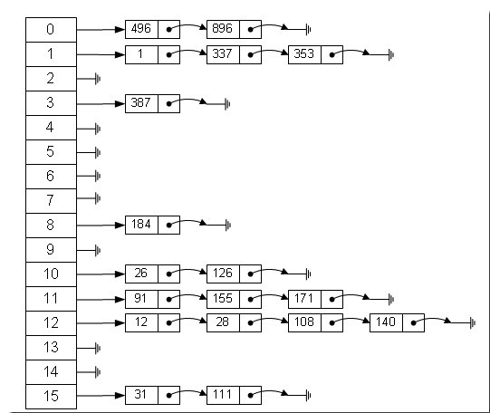
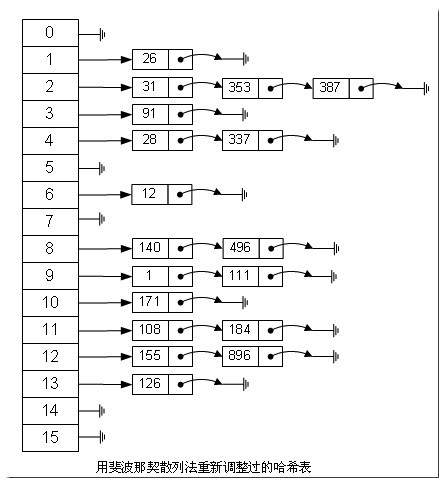

# hash表算法

##第一部分：Top K 算法詳解

####問題描述
百度面試題：

搜索引擎會通過日誌文件把用戶每次檢索使用的所有檢索串都記錄下來，每個查詢串的長度為1-255字節。
假設目前有一千萬個記錄（這些查詢串的重複度比較高，雖然總數是1千萬，但如果除去重複後，不超過3百萬個。一個查詢串的重複度越高，說明查詢它的用戶越多，也就是越熱門。），請你統計最熱門的10個查詢串，要求使用的內存不能超過1G。
####必備知識
什麼是哈希表？

哈希表（Hash table，也叫散列表），是根據關鍵碼值(Key value)而直接進行訪問的數據結構。也就是說，它通過把關鍵碼值映射到表中一個位置來訪問記錄，以加快查找的速度。這個映射函數叫做散列函數，存放記錄的數組叫做散列表。

哈希表hashtable(key，value) 的做法其實很簡單，就是把Key通過一個固定的算法函數既所謂的哈希函數轉換成一個整型數字，然後就將該數字對數組長度進行取餘，取餘結果就當作數組的下標，將value存儲在以該數字為下標的數組空間裡。

而當使用哈希表進行查詢的時候，就是再次使用哈希函數將key轉換為對應的數組下標，並定位到該空間獲取value，如此一來，就可以充分利用到數組的定位性能進行數據定位（文章第二、三部分，會針對Hash表詳細闡述）。

問題解析：

要統計最熱門查詢，首先就是要統計每個Query出現的次數，然後根據統計結果，找出Top 10。所以我們可以基於這個思路分兩步來設計該算法。

 即，此問題的解決分為以下**倆個步驟：**

###**第一步：Query統計**


Query統計有以下倆個方法，可供選擇：

**1、直接排序法**

首先我們最先想到的的算法就是排序了，首先對這個日誌裡面的所有Query都進行排序，然後再遍歷排好序的Query，統計每個Query出現的次數了。

但是題目中有明確要求，那就是內存不能超過1G，一千萬條記錄，每條記錄是255Byte，很顯然要佔據2.375G內存，這個條件就不滿足要求了。

讓我們回憶一下數據結構課程上的內容，當數據量比較大而且內存無法裝下的時候，我們可以採用外排序的方法來進行排序，這裡我們可以採用歸併排序，因為歸併排序有一個比較好的時間複雜度O(NlgN)。

排完序之後我們再對已經有序的Query文件進行遍歷，統計每個Query出現的次數，再次寫入文件中。

綜合分析一下，排序的時間複雜度是O(NlgN)，而遍歷的時間複雜度是O(N)，因此該算法的總體時間複雜度就是O(N+NlgN)=O（NlgN）。

**2、Hash Table法**

在第1個方法中，我們採用了排序的辦法來統計每個Query出現的次數，時間複雜度是NlgN，那麼能不能有更好的方法來存儲，而時間複雜度更低呢？

題目中說明瞭，雖然有一千萬個Query，但是由於重複度比較高，因此事實上只有300萬的Query，每個Query255Byte，因此我們可以考慮把他們都放進內存中去，而現在只是需要一個合適的數據結構，在這裡，Hash Table絕對是我們優先的選擇，因為Hash Table的查詢速度非常的快，幾乎是O(1)的時間複雜度。

那麼，我們的算法就有了：維護一個Key為Query字串，Value為該Query出現次數的HashTable，每次讀取一個Query，如果該字串不在Table中，那麼加入該字串，並且將Value值設為1；如果該字串在Table中，那麼將該字串的計數加一即可。最終我們在O(N)的時間複雜度內完成了對該海量數據的處理。

本方法相比算法1：在時間複雜度上提高了一個數量級，為O（N），但不僅僅是時間複雜度上的優化，該方法只需要IO數據文件一次，而算法1的IO次數較多的，因此該算法2比算法1在工程上有更好的可操作性。

###**第二步：找出Top 10**

**算法一：普通排序**

我想對於排序算法大家都已經不陌生了，這裡不在贅述，我們要注意的是排序算法的時間複雜度是NlgN，在本題目中，三百萬條記錄，用1G內存是可以存下的。

**算法二：部分排序**

題目要求是求出Top 10，因此我們沒有必要對所有的Query都進行排序，我們只需要維護一個10個大小的數組，初始化放入10個Query，按照每個Query的統計次數由大到小排序，然後遍歷這300萬條記錄，每讀一條記錄就和數組最後一個Query對比，如果小於這個Query，那麼繼續遍歷，否則，將數組中最後一條數據淘汰，加入當前的Query。最後當所有的數據都遍歷完畢之後，那麼這個數組中的10個Query便是我們要找的Top10了。

不難分析出，這樣，算法的最壞時間複雜度是N\*K， 其中K是指top多少。

**算法三：堆**

在算法二中，我們已經將時間複雜度由NlogN優化到NK，不得不說這是一個比較大的改進了，可是有沒有更好的辦法呢？

分析一下，在算法二中，每次比較完成之後，需要的操作複雜度都是K，因為要把元素插入到一個線性表之中，而且採用的是順序比較。這裡我們注意一下，該數組是有序的，一次我們每次查找的時候可以採用二分的方法查找，這樣操作的複雜度就降到了logK，可是，隨之而來的問題就是數據移動，因為移動數據次數增多了。不過，這個算法還是比算法二有了改進。

基於以上的分析，我們想想，有沒有一種既能快速查找，又能快速移動元素的數據結構呢？回答是肯定的，那就是堆。

藉助堆結構，我們可以在log量級的時間內查找和調整/移動。因此到這裡，我們的算法可以改進為這樣，維護一個K(該題目中是10)大小的小根堆，然後遍歷300萬的Query，**分別和根元素進行對比。**

具體過程是，堆頂存放的是整個堆中最小的數，現在遍歷N個數，把最先遍歷到的k個數存放到最小堆中，並假設它們就是我們要找的最大的k個數，X1>X2...Xmin(堆頂)，而後遍歷後續的N-K個數，一一與堆頂元素進行比較，如果遍歷到的Xi大於堆頂元素Xmin，則把Xi放入堆中，而後更新整個堆，更新的時間複雜度為logK，如果Xi<Xmin，則不更新堆，整個過程的複雜度為O(K)+O(（N-K）*logK)=O（N*logK）。

（堆排序的3D動畫演示可以參看此鏈接：[http://www.benfrederickson.com/2013/10/10/heap-visualization.html](http://www.benfrederickson.com/2013/10/10/heap-visualization.html)）

思想與上述算法二一致，只是算法在算法三，我們採用了最小堆這種數據結構代替數組，把查找目標元素的時間複雜度有O（K）降到了O（logK）。

那麼這樣，採用堆數據結構，算法三，最終的時間複雜度就降到了N‘logK，和算法二相比，又有了比較大的改進。

###**總結：**

至此，算法就完全結束了，經過上述第一步、先用Hash表統計每個Query出現的次數，O（N）；然後第二步、採用堆數據結構找出Top 10，N\*O（logK）。所以，我們最終的時間複雜度是：O（N） + N'\*O（logK）。（N為1000萬，N’為300萬）。如果各位有什麼更好的算法，歡迎留言評論。

此外，還可以看下此文第二部分的第二題：[教你如何迅速秒殺掉：99%的海量數據處理面試題](08.01.md)


##第二部分、Hash表 算法的詳細解析

###**什麼是Hash**

Hash，一般翻譯做“散列”，也有直接音譯為“哈希”的，就是把任意長度的輸入（又叫做預映射， pre-image），通過散列算法，變換成固定長度的輸出，該輸出就是散列值。這種轉換是一種壓縮映射，也就是，散列值的空間通常遠小於輸入的空間，不同的輸入可能會散列成相同的輸出，而不可能從散列值來唯一的確定輸入值。簡單的說就是一種將任意長度的消息壓縮到某一固定長度的消息摘要的函數。

HASH主要用於信息安全領域中加密算法，它把一些不同長度的信息轉化成雜亂的128位的編碼,這些編碼值叫做HASH值. 也可以說，hash就是找到一種數據內容和數據存放地址之間的映射關係。
 
數組的特點是：尋址容易，插入和刪除困難；而鏈表的特點是：尋址困難，插入和刪除容易。那麼我們能不能綜合兩者的特性，做出一種尋址容易，插入刪除也容易的數據結構？答案是肯定的，這就是我們要提起的哈希表，哈希表有多種不同的實現方法，我接下來解釋的是最常用的一種方法——拉鍊法，我們可以理解為“鏈表的數組”，如圖：



左邊很明顯是個數組，數組的每個成員包括一個指針，指向一個鏈表的頭，當然這個鏈表可能為空，也可能元素很多。我們根據元素的一些特徵把元素分配到不同的鏈表中去，也是根據這些特徵，找到正確的鏈表，再從鏈表中找出這個元素。

元素特徵轉變為數組下標的方法就是散列法。散列法當然不止一種，下面列出三種比較常用的：
 
**1，除法散列法**

最直觀的一種，上圖使用的就是這種散列法，公式： 

index = value % 16  

學過彙編的都知道，求模數其實是通過一個除法運算得到的，所以叫“除法散列法”。

**2，平方散列法**

求index是非常頻繁的操作，而乘法的運算要比除法來得省時（對現在的CPU來說，估計我們感覺不出來），所以我們考慮把除法換成乘法和一個位移操作。公式： 

index = (value * value) >> 28   （右移，除以2^28。記法：左移變大，是乘。右移變小，是除。）

如果數值分配比較均勻的話這種方法能得到不錯的結果，但我上面畫的那個圖的各個元素的值算出來的index都是0——非常失敗。也許你還有個問題，value如果很大，value * value不會溢出嗎？答案是會的，但我們這個乘法不關心溢出，因為我們根本不是為了獲取相乘結果，而是為了獲取index。

**3，斐波那契（Fibonacci）散列法**

平方散列法的缺點是顯而易見的，所以我們能不能找出一個理想的乘數，而不是拿value本身當作乘數呢？答案是肯定的。

1. 對於16位整數而言，這個乘數是40503 
2. 對於32位整數而言，這個乘數是2654435769 
3. 對於64位整數而言，這個乘數是11400714819323198485

這幾個“理想乘數”是如何得出來的呢？這跟一個法則有關，叫黃金分割法則，而描述黃金分割法則的最經典表達式無疑就是著名的斐波那契數列，即如此形式的序列：0, 1, 1, 2, 3, 5, 8, 13, 21, 34, 55, 89, 144, 233, 377, 610， 987, 1597, 2584, 4181, 6765, 10946，…。另外，斐波那契數列的值和太陽系八大行星的軌道半徑的比例出奇吻合。

對我們常見的32位整數而言，公式：

index = (value * 2654435769) >> 28

如果用這種斐波那契散列法的話，那上面的圖就變成這樣了：
 


注：用斐波那契散列法調整之後會比原來的取摸散列法好很多。

###**適用範圍**

快速查找，刪除的基本數據結構，通常需要總數據量可以放入內存。

###**基本原理及要點**

hash函數選擇，針對字符串，整數，排列，具體相應的hash方法。

碰撞處理，一種是open hashing，也稱為拉鍊法；另一種就是closed hashing，也稱開地址法，opened addressing。

###**擴展**

d-left hashing中的d是多個的意思，我們先簡化這個問題，看一看2-left hashing。2-left hashing指的是將一個哈希表分成長度相等的兩半，分別叫做T1和T2，給T1和T2分別配備一個哈希函數，h1和h2。在存儲一個新的key時，同 時用兩個哈希函數進行計算，得出兩個地址h1[key]和h2[key]。這時需要檢查T1中的h1[key]位置和T2中的h2[key]位置，哪一個 位置已經存儲的（有碰撞的）key比較多，然後將新key存儲在負載少的位置。如果兩邊一樣多，比如兩個位置都為空或者都存儲了一個key，就把新key 存儲在左邊的T1子表中，2-left也由此而來。在查找一個key時，必須進行兩次hash，同時查找兩個位置。

###**問題實例（海量數據處理）**

我們知道hash 表在海量數據處理中有著廣泛的應用，下面，請看另一道百度面試題：

題目：海量日誌數據，提取出某日訪問百度次數最多的那個IP。

方案：IP的數目還是有限的，最多2^32個，所以可以考慮使用hash將ip直接存入內存，然後進行統計。

##第三部分、最快的Hash表算法

接下來，咱們來具體分析一下一個最快的Hasb表算法。

我們由一個簡單的問題逐步入手：有一個龐大的字符串數組，然後給你一個單獨的字符串，讓你從這個數組中查找是否有這個字符串並找到它，你會怎麼做？有一個方法最簡單，老老實實從頭查到尾，一個一個比較，直到找到為止，我想只要學過程序設計的人都能把這樣一個程序作出來，但要是有程序員把這樣的程序交給用戶，我只能用無語來評價，或許它真的能工作，但...也只能如此了。

最合適的算法自然是使用HashTable（哈希表），先介紹介紹其中的基本知識，所謂Hash，一般是一個整數，通過某種算法，可以把一個字符串"壓縮" 成一個整數。當然，無論如何，一個32位整數是無法對應回一個字符串的，但在程序中，兩個字符串計算出的Hash值相等的可能非常小，下面看看在MPQ中的Hash算法（參看自此文：[http://sfsrealm.hopto.org/inside_mopaq/chapter2.htm](http://sfsrealm.hopto.org/inside_mopaq/chapter2.htm)）：

**函數一、**以下的函數生成一個長度為0x500（合10進制數：1280）的cryptTable[0x500]

```c
void prepareCryptTable()
{ 
    unsigned long seed = 0x00100001, index1 = 0, index2 = 0, i;
 
    for( index1 = 0; index1 < 0x100; index1++ )
    { 
        for( index2 = index1, i = 0; i < 5; i++, index2 += 0x100 )
        { 
            unsigned long temp1, temp2;
 
            seed = (seed * 125 + 3) % 0x2AAAAB;
            temp1 = (seed & 0xFFFF) << 0x10;
 
            seed = (seed * 125 + 3) % 0x2AAAAB;
            temp2 = (seed & 0xFFFF);
 
            cryptTable[index2] = ( temp1 | temp2 ); 
       } 
   } 
} 
```

**函數二、**以下函數計算lpszFileName 字符串的hash值，其中dwHashType 為hash的類型，在下面的函數三、GetHashTablePos函數中調用此函數二，其可以取的值為0、1、2；該函數返回lpszFileName 字符串的hash值：

```c
unsigned long HashString( char *lpszFileName, unsigned long dwHashType )
{ 
    unsigned char *key  = (unsigned char *)lpszFileName;
unsigned long seed1 = 0x7FED7FED;
unsigned long seed2 = 0xEEEEEEEE;
    int ch;
 
    while( *key != 0 )
    { 
        ch = toupper(*key++);
 
        seed1 = cryptTable[(dwHashType << 8) + ch] ^ (seed1 + seed2);
        seed2 = ch + seed1 + seed2 + (seed2 << 5) + 3; 
    }
    return seed1; 
}
```

Blizzard的這個算法是非常高效的，被稱為"One-Way Hash"( A one-way hash is a an algorithm that is constructed in such a way that deriving the original string (set of strings, actually) is virtually impossible)。舉個例子，字符串"unitneutralacritter.grp"通過這個算法得到的結果是0xA26067F3。

是不是把第一個算法改進一下，改成逐個比較字符串的Hash值就可以了呢，答案是，遠遠不夠，要想得到最快的算法，就不能進行逐個的比較，通常是構造一個哈希表(Hash Table)來解決問題，哈希表是一個大數組，這個數組的容量根據程序的要求來定義，例如1024，每一個Hash值通過取模運算 (mod) 對應到數組中的一個位置，這樣，只要比較這個字符串的哈希值對應的位置有沒有被佔用，就可以得到最後的結果了，想想這是什麼速度？是的，是最快的O(1)，現在仔細看看這個算法吧：

```c
typedef struct
{
    int nHashA;
    int nHashB;
    char bExists;
   ......
} SOMESTRUCTRUE;
```

一種可能的結構體定義？

**函數三、**下述函數為在Hash表中查找是否存在目標字符串，有則返回要查找字符串的Hash值，無則，return -1.

```c
int GetHashTablePos( har *lpszString, SOMESTRUCTURE *lpTable ) 
//lpszString要在Hash表中查找的字符串，lpTable為存儲字符串Hash值的Hash表。
{ 
    int nHash = HashString(lpszString);  //調用上述函數二，返回要查找字符串lpszString的Hash值。
    int nHashPos = nHash % nTableSize;
 
    if ( lpTable[nHashPos].bExists  &&  !strcmp( lpTable[nHashPos].pString, lpszString ) ) 
    {  //如果找到的Hash值在表中存在，且要查找的字符串與表中對應位置的字符串相同，
        return nHashPos;    //則返回上述調用函數二後，找到的Hash值
    } 
    else
    {
        return -1;  
    } 
}
```

看到此，我想大家都在想一個很嚴重的問題：“如果兩個字符串在哈希表中對應的位置相同怎麼辦？”,畢竟一個數組容量是有限的，這種可能性很大。解決該問題的方法很多，我首先想到的就是用“鏈表”,感謝大學裡學的數據結構教會了這個百試百靈的法寶，我遇到的很多算法都可以轉化成鏈表來解決，只要在哈希表的每個入口掛一個鏈表，保存所有對應的字符串就OK了。事情到此似乎有了完美的結局，如果是把問題獨自交給我解決，此時我可能就要開始定義數據結構然後寫代碼了。

然而Blizzard的程序員使用的方法則是更精妙的方法。基本原理就是：他們在哈希表中不是用一個哈希值而是用三個哈希值來校驗字符串。

MPQ使用文件名哈希表來跟蹤內部的所有文件。但是這個表的格式與正常的哈希表有一些不同。首先，它沒有使用哈希作為下標，把實際的文件名存儲在表中用於驗證，實際上它根本就沒有存儲文件名。而是使用了3種不同的哈希：一個用於哈希表的下標，兩個用於驗證。這兩個驗證哈希替代了實際文件名。

當然了，這樣仍然會出現2個不同的文件名哈希到3個同樣的哈希。但是這種情況發生的概率平均是：1:18889465931478580854784，這個概率對於任何人來說應該都是足夠小的。現在再回到數據結構上，Blizzard使用的哈希表沒有使用鏈表，而採用"順延"的方式來解決問題，看看這個算法：

**函數四、**lpszString 為要在hash表中查找的字符串；lpTable 為存儲字符串hash值的hash表；nTableSize 為hash表的長度：

```c
int GetHashTablePos( char *lpszString, MPQHASHTABLE *lpTable, int nTableSize )
{
    const int  HASH_OFFSET = 0, HASH_A = 1, HASH_B = 2;
 
    int  nHash = HashString( lpszString, HASH_OFFSET );
    int  nHashA = HashString( lpszString, HASH_A );
    int  nHashB = HashString( lpszString, HASH_B );
    int  nHashStart = nHash % nTableSize;
    int  nHashPos = nHashStart;
 
    while ( lpTable[nHashPos].bExists )
   {
     /*如果僅僅是判斷在該表中時候存在這個字符串，就比較這兩個hash值就可以了，不用對
     *結構體中的字符串進行比較。這樣會加快運行的速度？減少hash表佔用的空間？這種
      *方法一般應用在什麼場合？*/
        if ( 　 lpTable[nHashPos].nHashA == nHashA
        &&  lpTable[nHashPos].nHashB == nHashB )
       {
            return nHashPos;
       }
       else
       {
            nHashPos = (nHashPos + 1) % nTableSize;
       }
 
        if (nHashPos == nHashStart)
              break;
    }
     return -1;
}
```

上述程序解釋：

1. 計算出字符串的三個哈希值（一個用來確定位置，另外兩個用來校驗)
2. 察看哈希表中的這個位置
3. 哈希表中這個位置為空嗎？如果為空，則肯定該字符串不存在，返回-1。
4. 如果存在，則檢查其他兩個哈希值是否也匹配，如果匹配，則表示找到了該字符串，返回其Hash值。
5. 移到下一個位置，如果已經移到了表的末尾，則反繞到表的開始位置起繼續查詢　
6. 看看是不是又回到了原來的位置，如果是，則返回沒找到
7. 回到3

ok，這就是本文中所說的最快的Hash表算法。什麼?不夠快?:D。歡迎，各位批評指正。

- - -
補充1、一個簡單的hash函數：

```c
/*key為一個字符串，nTableLength為哈希表的長度
*該函數得到的hash值分佈比較均勻*/
unsigned long getHashIndex( const char *key, int nTableLength )
{
    unsigned long nHash = 0;
   
    while (*key)
    {
        nHash = (nHash<<5) + nHash + *key++;
    }
        
    return ( nHash % nTableLength );
}
```

補充2、一個完整測試程序：

哈希表的數組是定長的，如果太大，則浪費，如果太小，體現不出效率。合適的數組大小是哈希表的性能的關鍵。哈希表的尺寸最好是一個質數。當然，根據不同的數據量，會有不同的哈希表的大小。對於數據量時多時少的應用，最好的設計是使用動態可變尺寸的哈希表，那麼如果你發現哈希表尺寸太小了，比如其中的元素是哈希表尺寸的2倍時，我們就需要擴大哈希表尺寸，一般是擴大一倍。

下面是哈希表尺寸大小的可能取值：

||||||
|:-----------|------------:|:------------:|:------------:|:------------:|
|17,         |37,          |   79,        |163,          |331,          |
|673,        |   1361,     |   2729,      | 5471,        | 10949,       | 
|21911,      |    43853,   |   87719,     | 175447,      | 350899,      |  
|701819,     |    1403641, |   2807303,   |  5614657,    | 11229331,    |
|22458671,   |    44917381,|    89834777, |   179669557, |  359339171,  |
|718678369,  |1437356741,  |2147483647    |            

以下為該程序的完整源碼，已在linux下測試通過：

```c
#include <stdio.h>  
#include <ctype.h>     //多謝citylove指正。  
//crytTable[]裡面保存的是HashString函數裡面將會用到的一些數據，在prepareCryptTable  
//函數裡面初始化  
unsigned long cryptTable[0x500];  
  
//以下的函數生成一個長度為0x500（合10進制數：1280）的cryptTable[0x500]  
void prepareCryptTable()  
{   
    unsigned long seed = 0x00100001, index1 = 0, index2 = 0, i;  
  
    for( index1 = 0; index1 < 0x100; index1++ )  
    {   
        for( index2 = index1, i = 0; i < 5; i++, index2 += 0x100 )  
        {   
            unsigned long temp1, temp2;  
  
            seed = (seed * 125 + 3) % 0x2AAAAB;  
            temp1 = (seed & 0xFFFF) << 0x10;  
  
            seed = (seed * 125 + 3) % 0x2AAAAB;  
            temp2 = (seed & 0xFFFF);  
  
            cryptTable[index2] = ( temp1 | temp2 );   
       }   
   }   
}  
  
//以下函數計算lpszFileName 字符串的hash值，其中dwHashType 為hash的類型，  
//在下面GetHashTablePos函數裡面調用本函數，其可以取的值為0、1、2；該函數  
//返回lpszFileName 字符串的hash值；  
unsigned long HashString( char *lpszFileName, unsigned long dwHashType )  
{   
    unsigned char *key  = (unsigned char *)lpszFileName;  
unsigned long seed1 = 0x7FED7FED;  
unsigned long seed2 = 0xEEEEEEEE;  
    int ch;  
  
    while( *key != 0 )  
    {   
        ch = toupper(*key++);  
  
        seed1 = cryptTable[(dwHashType << 8) + ch] ^ (seed1 + seed2);  
        seed2 = ch + seed1 + seed2 + (seed2 << 5) + 3;   
    }  
    return seed1;   
}  
  
//在main中測試argv[1]的三個hash值：  
//./hash  "arr/units.dat"  
//./hash  "unit/neutral/acritter.grp"  
int main( int argc, char **argv )  
{  
    unsigned long ulHashValue;  
    int i = 0;  
  
    if ( argc != 2 )  
    {  
        printf("please input two arguments/n");  
        return -1;  
    }  
  
     /*初始化數組：crytTable[0x500]*/  
     prepareCryptTable();  
  
     /*打印數組crytTable[0x500]裡面的值*/  
     for ( ; i < 0x500; i++ )  
     {  
         if ( i % 10 == 0 )  
         {  
             printf("/n");  
         }  
  
         printf("%-12X", cryptTable[i] );  
     }  
  
     ulHashValue = HashString( argv[1], 0 );  
     printf("/n----%X ----/n", ulHashValue );  
  
     ulHashValue = HashString( argv[1], 1 );  
     printf("----%X ----/n", ulHashValue );  
  
     ulHashValue = HashString( argv[1], 2 );  
     printf("----%X ----/n", ulHashValue );  
  
     return 0;  
} 
```
