## 從頭到尾徹底理解傅裡葉變換算法、上

I、本文中闡述離散傅裡葉變換方法，是根據此書：The Scientist and Engineer's Guide to Digital Signal Processing，By Steven W. Smith, Ph.D.而翻譯而成的，此書地址：<http://www.dspguide.com/pdfbook.htm>。  
II、同時，有相當一部分內容編輯整理自dznlong的博客，也貼出其博客地址，向原創的作者表示致敬：<http://blog.csdn.net/dznlong> 。這年頭，真正靜下心寫來原創文章的人，很少了。

從頭到尾徹底理解傅裡葉變換算法、上  
前言  
第一章、傅立葉變換的由來  
第二章、實數形式離散傅立葉變換（Real DFT）  

從頭到尾徹底理解傅裡葉變換算法、下  
第三章、複數  
第四章、複數形式離散傅立葉變換  

### 前言：  

“關於傅立葉變換，無論是書本還是在網上可以很容易找到關於傅立葉變換的描述，但是大都是些故弄玄虛的文章，太過抽象，盡是一些讓人看了就望而生畏的公式的羅列，讓人很難能夠從感性上得到理解”---dznlong

那麼，到底什麼是傅裡葉變換算法列?傅裡葉變換所涉及到的公式具體有多複雜列?  
**傅裡葉變換**（Fourier transform）是一種線性的積分變換。因其基本思想首先由法國學者傅裡葉系統地提出，所以以其名字來命名以示紀念。

哦，傅裡葉變換原來就是一種變換而已，只是這種變換是從時間轉換為頻率的變化。這下，你就知道了，傅裡葉就是一種變換，一種什麼變換？就是一種從時間到頻率的變化或其相互轉化。

ok，咱們再來總體瞭解下傅裡葉變換，讓各位對其有個總體大概的印象，也順便看看傅裡葉變換所涉及到的公式，究竟有多複雜，
以下就是傅裡葉變換的4種變體（摘自，維基百科）:

**連續傅裡葉變換**  

一般情況下，若“傅裡葉變換”一詞不加任何限定語，則指的是“連續傅裡葉變換”。連續傅裡葉變換將平方可積的函數f(t)表示成復指數函數的積分或級數形式。


這是將頻率域的函數F(ω)表示為時間域的函數f(t)的積分形式。

連續傅裡葉變換的逆變換 (inverse Fourier transform)為：


即將時間域的函數f(t)表示為頻率域的函數F(ω)的積分。

一般可稱函數**f(t)**為原函數，而稱函數**F(ω)**為傅裡葉變換的像函數，原函數和像函數構成一個傅裡葉變換對（transform pair）。

除此之外，還有其它型式的變換對，以下兩種型式亦常被使用。在通信或是信號處理方面，常以來代換，而形成新的變換對:

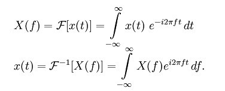

或者是因係數重分配而得到新的變換對：

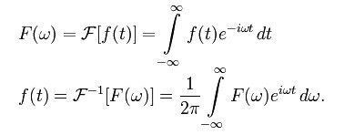

一種對連續傅裡葉變換的推廣稱為分數傅裡葉變換（Fractional Fourier Transform）。分數傅裡葉變換(fractional Fourier transform,FRFT)指的就是傅裡葉變換(Fourier transform, FT)的廣義化。  
分數傅裡葉變換的物理意義即做傅裡葉變換 a 次，其中 a 不一定要為整數；而做了分數傅裡葉變換之後，信號或輸入函數便會出現在介於時域(time domain)與頻域(frequency domain)之間的分數域(fractional domain)。

當f(t)為偶函數（或奇函數）時，其正弦（或餘弦）分量將消亡，而可以稱這時的變換為餘弦變換（cosine transform）或正弦變換（sine transform）.

另一個值得注意的性質是，當f(t)為純實函數時，F(−ω) = F\*(ω)成立.

**傅裡葉級數**

連續形式的傅裡葉變換其實是傅裡葉級數 (Fourier series)的推廣，因為積分其實是一種極限形式的求和算子而已。對於週期函數，其傅裡葉級數是存在的：


其中Fn為復幅度。對於實值函數，函數的傅裡葉級數可以寫成：


其中an和bn是實頻率分量的幅度。

**離散時域傅裡葉變換**

離散傅裡葉變換是離散時間傅裡葉變換（DTFT）的特例（有時作為後者的近似）。DTFT在時域上離散，在頻域上則是週期的。DTFT可以被看作是傅裡葉級數的逆變換。

**離散傅裡葉變換**

離散傅裡葉變換（DFT），是連續傅裡葉變換在時域和頻域上都離散的形式，將時域信號的採樣變換為在離散時間傅裡葉變換（DTFT）頻域的採樣。在形式上，變換兩端（時域和頻域上）的序列是有限長的，而實際上這兩組序列都應當被認為是離散週期信號的主值序列。即使對有限長的離散信號作DFT，也應當將其看作經過週期延拓成為週期信號再作變換。在實際應用中通常採用快速傅裡葉變換以高效計算DFT。

為了在科學計算和數字信號處理等領域使用計算機進行傅裡葉變換，必須將函數xn定義在離散點而非連續域內，且須滿足有限性或週期性條件。這種情況下，使用*離散傅裡葉變換（DFT）*，將函數xn表示為下面的求和形式：


其中Xk是傅裡葉幅度。直接使用這個公式計算的計算複雜度為O（n\*n），而*快速傅裡葉變換（FFT）可以將複雜度改進為O（n\*lgn）*。（後面會具體闡述FFT是如何將複雜度降為O（n\*lgn）的。）計算複雜度的降低以及數字電路計算能力的發展使得DFT成為在信號處理領域十分實用且重要的方法。

下面，比較下上述傅立葉變換的4種變體，

<table>
  <tr>
    <td>變換</td>
    <td>時間</td>
    <td>頻率</td>
  </tr>
  <tr>
    <td>連續傅裡葉變換</td>
    <td>連續，非週期性</td>
    <td>連續，非週期性</td>
  </tr>
  <tr>
    <td>傅裡葉級數</td>
    <td>連續，週期性</td>
    <td>離散，非週期性</td>
  </tr>
  <tr>
    <td>離散時間傅裡葉變換</td>
    <td>離散，非週期性</td>
    <td>連續，週期性</td>
  </tr>
    <tr>
    <td>離散傅裡葉變換</td>
    <td>離散，週期性</td>
    <td>離散，週期性</td>
  </tr>
</table>

如上，容易發現：函數在時（頻）域的離散對應於其像函數在頻（時）域的週期性。反之連續則意味著在對應域的信號的非週期性。也就是說，時間上的離散性對應著頻率上的週期性。同時，注意，離散時間傅裡葉變換，時間離散，頻率不離散，它在頻域依然是連續的。

如果，讀到此，你不甚明白，大沒關係，不必糾結於以上4種變體，繼續往下看，你自會豁然開朗。（有什麼問題，也懇請提出，或者批評指正）

**ok， 本文，接下來，由傅裡葉變換入手，後重點闡述離散傅裡葉變換、快速傅裡葉算法，到最後徹底實現FFT算法，全篇力求通俗易懂、閱讀順暢，教你從頭到尾徹底理解傅裡葉變換算法。**由於傅裡葉變換，也稱傅立葉變換，下文所稱為*傅立葉變換*，同一個變換，不同叫法，讀者不必感到奇怪。

### 第一章、傅立葉變換的由來

要理解傅立葉變換，先得知道傅立葉變換是怎麼變換的，當然，也需要一定的高等數學基礎，最基本的是級數變換，其中傅立葉級數變換是傅立葉變換的基礎公式。
 
#### 一、傅立葉變換的提出

傅立葉是一位法國數學家和物理學家，原名是Jean Baptiste Joseph Fourier(1768-1830)。Fourier於1807年在法國科學學會上發表了一篇論文，論文裡描述運用正弦曲線來描述溫度分佈，論文裡有個在當時具有爭議性的決斷：任何連續週期信號都可以由一組適當的正弦曲線組合而成。

當時審查這個論文拉格朗日堅決反對此論文的發表，而後在近50年的時間裡，拉格朗日堅持認為傅立葉的方法無法表示帶有稜角的信號，如在方波中出現非連續變化斜率。直到拉格朗日死後15年這個論文才被髮表出來。

誰是對的呢？拉格朗日是對的：正弦曲線無法組合成一個帶有稜角的信號。但是，我們可以用正弦曲線來非常逼近地表示它，逼近到兩種表示方法不存在能量差別，基於此，傅立葉是對的。

為什麼我們要用正弦曲線來代替原來的曲線呢？如我們也還可以用方波或三角波來代替呀，分解信號的方法是無窮多的，但分解信號的目的是為了更加簡單地處理原來的信號。

用正餘弦來表示原信號會更加簡單，因為正餘弦擁有原信號所不具有的性質：正弦曲線保真度。一個正餘弦曲線信號輸入後，輸出的仍是正餘弦曲線，只有幅度和相位可能發生變化，但是頻率和波的形狀仍是一樣的。且只有正餘弦曲線才擁有這樣的性質，正因如此我們才不用方波或三角波來表示。

#### 二、傅立葉變換分類

根據原信號的不同類型，我們可以把傅立葉變換分為四種類別：

1. 非週期性連續信號		傅立葉變換（Fourier Transform）
2. 週期性連續信號			傅立葉級數（Fourier Series）
3. 非週期性離散信號        離散*時域*傅立葉變換（Discrete Time Fourier Transform）
4. 週期性離散信號			離散傅立葉變換（Discrete Fourier Transform）


下圖是四種原信號圖例（從上到下，依次是FT，FS，DTFT，DFT）：

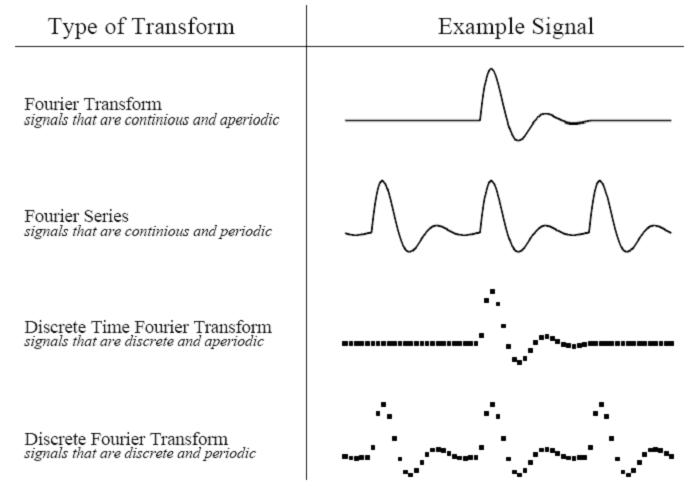

這四種傅立葉變換都是針對正無窮大和負無窮大的信號，即信號的的長度是無窮大的，我們知道這對於計算機處理來說是不可能的，**那麼有沒有針對長度有限的傅立葉變換呢？**沒有。因為正餘弦波被定義成從負無窮小到正無窮大，我們無法把一個長度無限的信號組合成長度有限的信號。

面對這種困難，方法是：把長度有限的信號表示成長度無限的信號。如，可以把信號無限地從左右進行延伸，延伸的部分用零來表示，這樣，這個信號就可以被看成是*非週期性*離散信號，我們可以用到*離散時域傅立葉變換（DTFT）*的方法。也可以把信號用複製的方法進行延伸，這樣信號就變成了*週期性*離散信號，這時我們就可以用*離散傅立葉變換方法（DFT）*進行變換。本章我們要講的是離散信號，對於連續信號我們不作討論，因為計算機只能處理離散的數值信號，我們的最終目的是運用計算機來處理信號的。
 
但是對於非週期性的信號，我們需要用無窮多不同頻率的正弦曲線來表示，這對於計算機來說是不可能實現的。所以對於離散信號的變換隻有**離散傅立葉變換（DFT）**才能被適用，對於計算機來說只有離散的和有限長度的數據才能被處理，對於其它的變換類型只有在數學演算中才能用到，在計算機面前我們只能用DFT方法，後面我們要理解的也正是DFT方法。

這裡要理解的是我們使用週期性的信號目的是為了能夠用數學方法來解決問題，至於考慮週期性信號是從哪裡得到或怎樣得到是無意義的。
 
每種傅立葉變換都分成實數和複數兩種方法，對於實數方法是最好理解的，但是複數方法就相對複雜許多了，需要懂得有關複數的理論知識，不過，如果理解了實數離散傅立葉變換(real DFT)，再去理解複數傅立葉變換就更容易了，所以我們先把複數的傅立葉變換放到一邊去，先來理解實數傅立葉變換，在後面我們會先講講關於複數的基本理論，然後在理解了實數傅立葉變換的基礎上再來理解複數傅立葉變換。
 
還有，這裡我們所要說的變換(transform)雖然是數學意義上的變換，但跟函數變換是不同的，函數變換是符合一一映射準則的，對於離散數字信號處理（DSP），有許多的變換：傅立葉變換、拉普拉斯變換、Z變換、希爾伯特變換、離散餘弦變換等，這些都擴展了函數變換的定義，允許輸入和輸出有多種的值，簡單地說變換就是把一堆的數據變成另一堆的數據的方法。
 
#### 三、一個關於實數離散傅立葉變換(Real DFT)的例子

先來看一個變換實例，下圖是一個原始信號圖像：

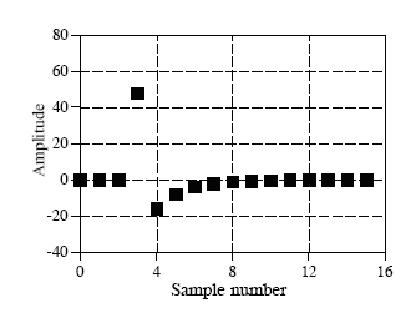

這個信號的長度是16，於是可以把這個信號分解9個餘弦波和9個正弦波（一個長度為N的信號可以分解成N/2+1個正餘弦信號，這是為什麼呢？結合下面的18個正餘弦圖,我想從計算機處理精度上就不難理解，一個長度為N的信號，最多隻能有N/2+1個不同頻率，再多的頻率就超過了計算機所能所處理的精度範圍），如下圖：

9個餘弦信號：

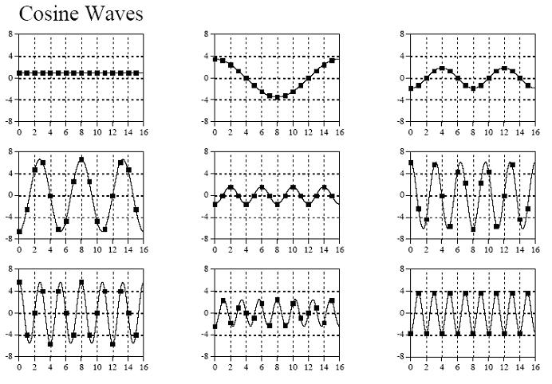

9個正弦信號：

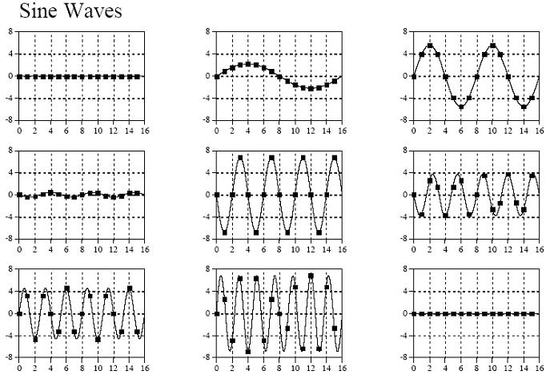

把以上所有信號相加即可得到原始信號，至於是怎麼分別變換出9種不同頻率信號的，我們先不急，先看看對於以上的變換結果，在程序中又是該怎麼表示的，我們可以看看下面這個示例圖：

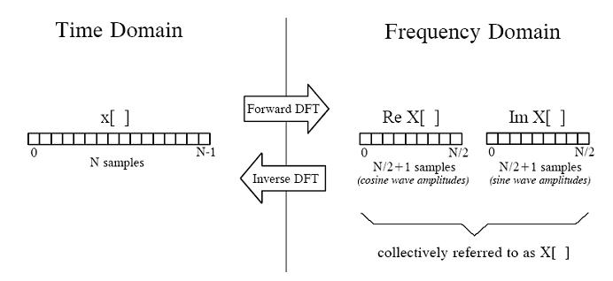

上圖中左邊表示時域中的信號，右邊是頻域信號表示方法，

從左向右，**-->**，表示**正向轉換**(Forward DFT)，從右向左，<--，表示**逆向轉換**(Inverse DFT)，
用小寫x[]表示信號在每個時間點上的幅度值數組, 用大寫X[]表示每種頻率的副度值數組（即時間x-->頻率**X**）, 

因為有N/2+1種頻率，所以該數組長度為N/2+1，

X[]數組又分兩種，一種是表示餘弦波的不同頻率幅度值：Re X[]，

另一種是表示正弦波的不同頻率幅度值：Im X[]，

Re是實數(Real)的意思，Im是虛數(Imagine)的意思，採用複數的表示方法把正餘弦波組合起來進行表示，但這裡我們不考慮複數的其它作用，只記住是一種組合方法而已，目的是為了便於表達（在後面我們會知道，複數形式的傅立葉變換長度是N，而不是N/2+1）。如此，再回過頭去，看上面的正餘弦各9種頻率的變化，相信，問題不大了。

 

### 第二章、實數形式離散傅立葉變換（Real DFT）

上一章，我們看到了一個實數形式離散傅立葉變換的例子，通過這個例子能夠讓我們先對傅立葉變換有一個較為形象的感性認識，現在就讓我們來看看實數形式離散傅立葉變換的正向和逆向是怎麼進行變換的。在此，我們先來看一下頻率的多種表示方法。
 
#### 一、   頻域中關於頻率的四種表示方法
 
1. 序號表示方法，根據時域中信號的樣本數取0 ~ N/2，用這種方法在程序中使用起來可以更直接地取得每種頻率的幅度值，因為頻率值跟數組的序號是一一對應的: X[k]，取值範圍是0 ~ N/2；
2. 分數表示方法，根據時域中信號的樣本數的比例值取0 ~ 0.5: X[ƒ]，ƒ = k/N，取值範圍是0 ~ 1/2；
3. 用弧度值來表示，把ƒ乘以一個2π得到一個弧度值，這種表示方法叫做自然頻率(natural frequency)：X[ω]，ω = 2πƒ = 2πk/N，取值範圍是0 ~ π；
4. 以赫茲(Hz)為單位來表示，這個一般是應用於一些特殊應用，如取樣率為10 kHz表示每秒有10,000個樣本數：取值範圍是0到取樣率的一半。
 
#### 二、   DFT基本函數
 
ck[i] = cos(2πki/N)
sk[i] = sin(2πki/N)

其中k表示每個正餘弦波的頻率，如為2表示在0到N長度中存在兩個完整的週期，10即有10個週期，如下圖：

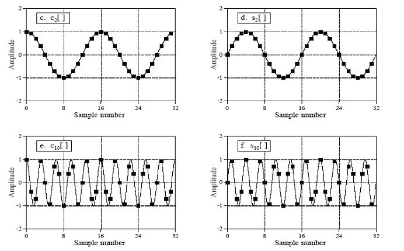

上圖中至於每個波的振幅(amplitude)值(Re X[k],Im X[k])是怎麼算出來的,這個是DFT的核心，也是最難理解的部分，我們先來看看如何把分解出來的正餘弦波合成原始信號(Inverse DFT)。
 
#### 三、   合成運算方法(Real Inverse DFT)
 
DFT合成等式（合成原始**_時間_信號，頻率-->時間，逆向變換**）：


如果有學過傅立葉級數，對這個等式就會有似曾相識的感覺，不錯！這個等式跟傅立葉級數是非常相似的：


當然，差別是肯定是存在的，因為這兩個等式是在兩個不同條件下運用的，至於怎麼證明DFT合成公式，這個我想需要非常強的高等數學理論知識了，這是研究數學的人的工作，對於普通應用者就不需要如此的追根究底了，但是傅立葉級數是好理解的，我們起碼可以從傅立葉級數公式中看出DFT合成公式的合理性。

DFT合成等式中的 *跟之前提到的* Im X[k]和Re X[k]是不一樣的，下面是轉換方法（*關於此公式的解釋，見下文*）:

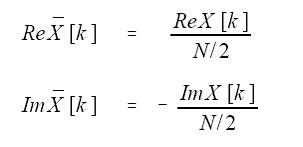

但k等於0和N/2時,實數部分的計算要用下面的等式:

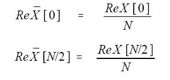

上面四個式中的N是時域中點的總數，k是從0到N/2的序號。

為什麼要這樣進行轉換呢？這個可以從頻譜密度(spectral density)得到理解，如下圖就是個頻譜圖：

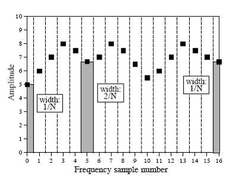

這是一個頻譜圖，橫座標表示頻率大小，縱座標表示振幅大小，原始信號長度為N（這裡是32），經DFT轉換後得到的**17**個頻率的頻譜，頻譜密度表示每單位帶寬中為多大的振幅，那麼帶寬是怎麼計算出來的呢？看上圖，除了頭尾兩個，其餘點的所佔的寬度是2/N，這個寬度便是每個點的帶寬，頭尾兩個點的帶寬是1/N,而Im X[k]和Re X[k]表示的是頻譜密度，即每一個單位帶寬的振幅大小，但  表示2/N（或1/N）帶寬的振幅大小， **所以****分別應當是Im X[k]和Re X[k]的2/N（或1/N）**。

頻譜密度就象物理中物質密度，原始信號中的每一個點就象是一個混合物，這個混合物是由不同密度的物質組成的，混合物中含有的每種物質的質量是一樣的，除了最大和最小兩個密度的物質外，這樣我們只要把每種物質的密度加起來就可以得到該混合物的密度了，又該混合物的質量是單位質量，所以得到的密度值跟該混合物的質量值是一樣的。
 
至於為什麼虛數部分是負數，這是為了跟複數DFT保持一致，這個我們將在後面會知道這是數學計算上的需要（Im X[k]在計算時就已經加上了一個負號（*稍後，由下文，便可知*），再加上負號，結果便是正的，等於沒有變化）。
 
如果已經得到了DFT結果，這時要進行**逆轉換，即合成原始信號**，則可按如下步驟進行轉換：

1. 先根據上面四個式子計算得出的值；
2. 再根據DFT合成等式得到原始信號數據。

	下面是用BASIC語言來實現的轉換源代碼：
	
  ```
  ‘DFT逆轉換方法
  ‘/XX[]數組存儲計算結果（時域中的原始信號）
  ‘/REX[]數組存儲頻域中的實數分量，IMX[]為虛分量
  ‘
  DIM XX[511]
  DIM REX[256]
  DIM IMX[256]
  ‘
  PI = 3.14159265
  N% = 512
  ‘
  GOSUB XXXX ‘轉到子函數去獲取REX[]和IMX[]數據
  ‘
  ‘
  ‘
  FOR K% = 0 TO 256
    REX[K%] = REX[K%] / (N%/2)
    IMX[K%] = -IMX[K%] / (N%/2)
  NEXT k%
  ‘
  REX[0] = REX[0] / N
  REX[256] = REX[256] / N
  ‘
  ‘ 初始化XX[]數組
  FOR I% = 0 TO 511
    XX[I%] = 0
  NEXT I%
  ‘
  ‘
  ‘
  ‘
  ‘
  FOR K% =0 TO 256
    FOR I%=0 TO 511
  ‘
       XX[I%] = XX[I%] + REX[K%] * COS(2 * PI * K% * I% / N%) 
       XX[I%] = XX[I%] + IMX[K%] * SIN(2 * PI * K% * I% / N%)
  ‘
    NEXT I%
  NEXT K%
  ‘
  END
	```
	
  上面代碼中420至490換成如下形式也許更好理解，但結果都是一樣的：
  
  ```
  FOR I% =0 TO 511
    FOR K%=0 TO 256
  ‘
       XX[I%] = XX[I%] + REX[K%] * COS(2 * PI * K% * I% / N%) 
       XX[I%] = XX[I%] + IMX[K%] * SIN(2 * PI * K% * I% / N%)
  ‘
    NEXT I%
  NEXT K%
  ```
 
#### 四、   分解運算方法（DFT）
 
有三種完全不同的方法進行DFT：*一種方法是通過聯立方程進行求解*, 從代數的角度看，要從N個已知值求N個未知值，需要N個聯立方程，且N個聯立方程必須是線性獨立的，但這是這種方法計算量非常的大且極其複雜，所以很少被採用；*第二種方法是利用信號的相關性（correlation）*進行計算，這個是我們後面將要介紹的方法；*第三種方法是快速傅立葉變換（FFT）*，這是一個非常具有創造性和革命性的的方法，因為它大大提高了運算速度，使得傅立葉變換能夠在計算機中被廣泛應用，但這種算法是根據複數形式的傅立葉變換來實現的，它把N個點的信號分解成長度為N的頻域，這個跟我們現在所進行的實域DFT變換不一樣，而且這種方法也較難理解，這裡我們先不去理解，等先理解了複數DFT後，再來看一下FFT。有一點很重要，那就是這三種方法所得的變換結果是一樣的，經過實踐證明，當頻域長度為32時，利用相關性方法進行計算效率最好，否則FFT算法效率較高。現在就讓我們來看一下相關性算法。
 
利用**第一種方法、信號的相關性**(correlation)可以從噪聲背景中檢測出已知的信號，我們也可以利用這個方法檢測信號波中是否含有某個頻率的信號波：把一個待檢測信號波乘以另一個信號波，得到一個新的信號波，再把這個新的信號波所有的點進行相加，從相加的結果就可以判斷出這兩個信號的相似程度。如下圖：

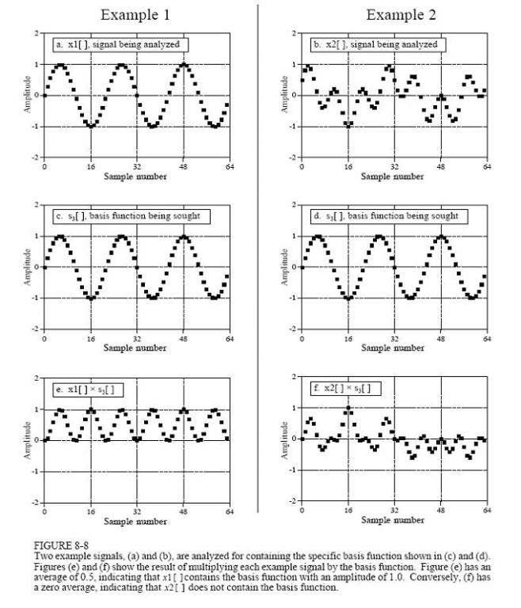

上面a和 b兩個圖是待檢測信號波，圖a很明顯可以看出是個3個週期的正弦信號波，圖b的信號波則看不出是否含有正弦或餘弦信號，圖c和d都是個3個週期的正弦信號波，圖e和f分別是a、b兩圖跟c、d兩圖相乘後的結果，圖e所有點的平均值是0.5，說明信號a含有振幅為1的正弦信號c，但圖f所有點的平均值是0，則說明信號b不含有信號d。這個就是通過信號相關性來檢測是否含有某個信號的方法。
 
**第二種方法：** 相應地，我也可以通過把輸入信號和每一種頻率的正餘弦信號進行相乘（**關聯操作**），從而得到原始信號與每種頻率的關聯程度（即總和大小），這個結果便是我們所要的傅立葉變換結果，下面兩個等式便是我們所要的計算方法：

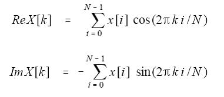

第二個式子中加了個負號，是為了保持複數形式的一致，*前面我們知道在計算**時又加了個負號*，所以這只是個形式的問題，並沒有實際意義，你也可以把負號去掉，並在計算時也不加負號。

這裡有一點必須明白一個正交的概念：兩個函數相乘，如果結果中的每個點的總和為0，則可認為這兩個函數為正交函數。要確保關聯性算法是正確的，則必須使得跟原始信號相乘的信號的函數形式是正交的，我們知道所有的正弦或餘弦函數是正交的，這一點我們可以通過簡單的高數知識就可以證明它，所以我們可以通過關聯的方法把原始信號分離出正餘弦信號。當然，其它的正交函數也是存在的，如：方波、三角波等形式的脈衝信號，所以原始信號也可被分解成這些信號，但這只是說可以這樣做，卻是沒有用的。

下面是實域傅立葉變換的BASIC語言代碼：

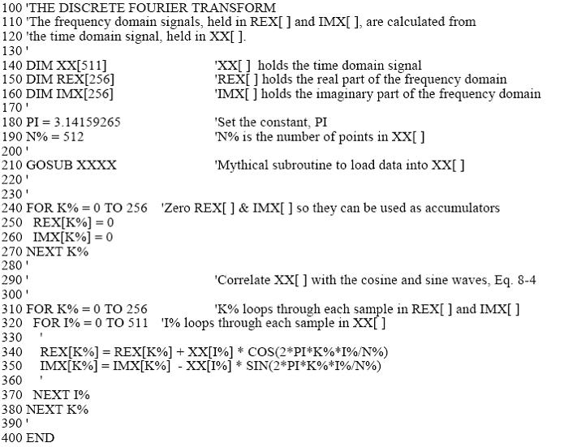

到此為止，我們對傅立葉變換便有了感性的認識了吧。但要記住，這只是在實域上的離散傅立葉變換，其中雖然也用到了複數的形式，但那只是個替代的形式，並無實際意義，現實中一般使用的是複數形式的離散傅立葉變換，且**快速傅立葉變換**是根據複數離散傅立葉變換來設計算法的，在後面我們先來複習一下有關複數的內容，然後再在理解實域離散傅立葉變換的基礎上來理解複數形式的離散傅立葉變換。

  
