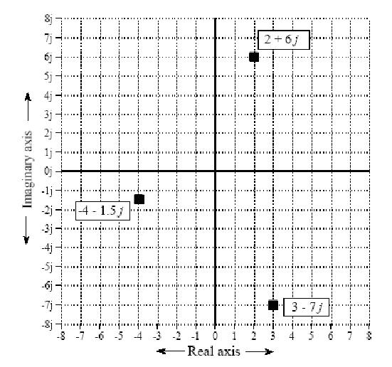
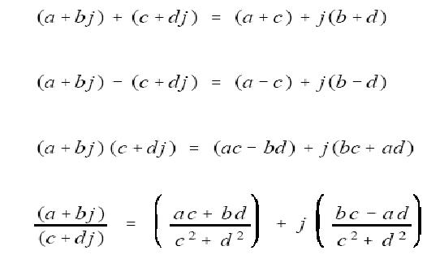
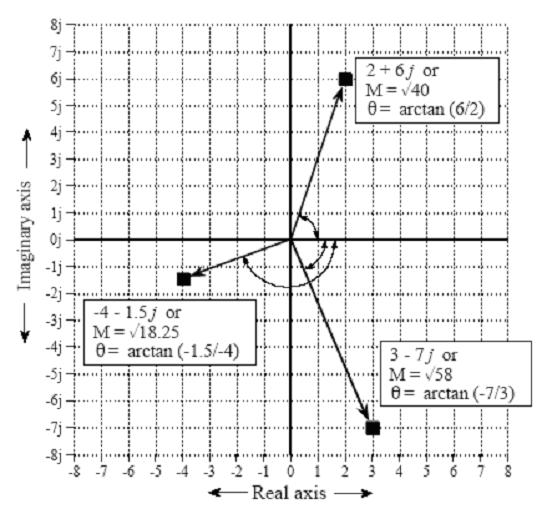
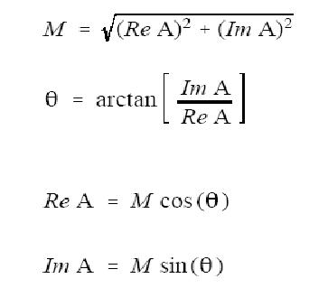
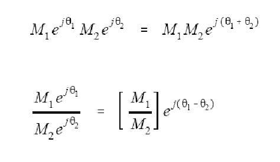
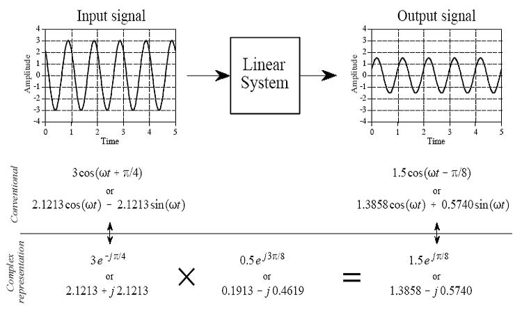
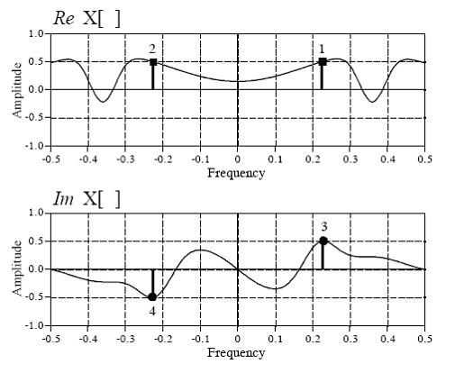

## 從頭到尾徹底理解傅里葉變換算法、下

推薦閱讀：*The Scientist and Engineer's Guide to Digital Signal Processing*，By Steven W. Smith, Ph.D。**此書地址**：<http://www.dspguide.com/pdfbook.htm>。

前期回顧，在上一篇裡，我們講了傅立葉變換的由來、和實數形式離散傅立葉變換（Real DFT）倆個問題，

本文接上文，著重講下複數、和複數形式離散傅立葉變換等倆個問題。

 

### 第三章、複數

複數擴展了我們一般所能理解的數的概念，複數包含了實數和虛數兩部分，利用複數的形式可以把由兩個變量表示的表達式變成由一個變量（復變量）來表達，使得處理起來更加自然和方便。

我們知道傅立葉變換的結果是由兩部分組成的，使用複數形式可以縮短變換表達式，使得我們可以單獨處理一個變量（這個在後面的描述中我們就可以更加確切地知道），而且快速傅立葉變換正是基於複數形式的，所以幾乎所有描述的傅立葉變換形式都是複數的形式。

但是複數的概念超過了我們日常生活中所能理解的概念，要理解複數是較難的，所以我們在理解複數傅立葉變換之前，先來專門複習一下有關複數的知識，這對後面的理解非常重要。
 
#### 一、 複數的提出
 
在此，先讓我們看一個物理實驗：把一個球從某點向上拋出，然後根據初速度和時間來計算球所在高度，這個方法可以根據下面的式子計算得出：

其中h表示高度，g表示重力加速度(9.8m/s2)，v表示初速度，t表示時間。現在反過來，假如知道了高度，要求計算到這個高度所需要的時間，這時我們又可以通過下式來計算：

（*多謝JERRY_PRI提出*：

1. 根據公式h=-(gt2/2)+Vt（gt後面的2表示t的平方），我們可以討論最終情況，也就是說小球運動到最高點時，v=gt，所以，可以得到t=sqt(2h/g)，
且在您給的公式中，根號下為1-(2h)/g，化成分數形式為(g-2h)/g，g和h不能直接做加減運算。
2. g是重力加速度，單位是m/s2，h的單位是m，他們兩個相減的話在物理上沒有意義，而且使用您給的那個公式反向回去的話推出的是h=-(gt2/2)+gt啊（gt後面的2表示t的平方）。
3. 直接推到可以得出t=v/g±sqt((v2-2hg)/g2)（v和g後面的2都表示平方），那麼也就是說當v2<2hg時會產生複數，但是如果從實際的v2是不可能小於2hg的，所以我感覺複數不能從實際出發去推到，只能從抽象的角度說明一下。

）

經過計算我們可以知道，當高度是3米時，有兩個時間點到達該高度：球向上運動時的時間是0.38秒，球向下運動時的時間是1.62秒。但是如果高度等於10時，結果又是什麼呢？根據上面的式子可以發現存在對負數進行開平方運算，我們知道這肯定是不現實的。

第一次使用這個不一般的式子的人是意大利數學家Girolamo Cardano（1501-1576），兩個世紀後，德國偉大數學家Carl Friedrich Gause（1777-1855）提出了複數的概念，為後來的應用鋪平了道路，他對複數進行這樣表示：複數由實數（real）和虛數(imaginary)兩部分組成，虛數中的根號負1用i來表示（在這裡我們用j來表示，因為i在電力學中表示電流的意思）。
 
我們可以把橫座標表示成實數，縱座標表示成虛數，則座標中的每個點的向量就可以用複數來表示，如下圖：

上圖中的ABC三個向量可以表示成如下的式子：
 
	A = 2 + 6j
	B = -4 – 1.5j
	C = 3 – 7j

這樣子來表達方便之處在於運用一個符號就能把兩個原來難以聯繫起來的數組合起來了，不方便的是我們要分辨哪個是實數和哪個是虛數，我們一般是用Re( )和Im( )來表示實數和虛數兩部分，如：

	Re A = 2      Im A = 6
	Re B = -4     Im B = -1.5
	Re C = 3      Im C = -7 
 
複數之間也可以進行加減乘除運算：

這裡有個特殊的地方是j2等於-1，上面第四個式子的計算方法是把分子和分母同時乘以c – dj，這樣就可消去分母中的j了。
 
複數也符合代數運算中的交換律、結合律、分配律：

	A B = B A
	(A + B) + C = A + (B + C)
	A(B + C) = AB + AC
 
 
#### 二、 複數的極座標表示形式
 
前面提到的是運用直角座標來表示複數，其實更為普遍應用的是極座標的表示方法，如下圖：

上圖中的M即是數量積(magnitude)，表示從原點到座標點的距離，θ是相位角(phase angle)，表示從X軸正方向到某個向量的夾角，下面四個式子是計算方法：

我們還可以通過下面的式子進行極座標到直角座標的轉換：
 
	a + jb = M (cosθ + j sinθ)

上面這個等式中左邊是直角座標表達式，右邊是極座標表達式。
 
還有一個更為重要的等式——歐拉等式（歐拉，瑞士的著名數學家，Leonhard Euler，1707-1783）：
	
	ejx = cos x + j sin x 
 
這個等式可以從下面的級數變換中得到證明：

上面中右邊的兩個式子分別是cos(x)和sin(x)的泰勒(Taylor)級數。
 

這樣子我們又可以把複數的表達式表示成指數的形式了：
 
	a + jb = M ejθ （這便是複數的兩個表達式）
 
指數形式是數字信號處理中數學方法的支柱，也許是因為用指數形式進行復數的乘除運算極為簡單的緣故吧：

#### 三、複數是數學分析中的一個工具
 
為什麼要使用複數呢？其實它只是個工具而已，就如釘子和錘子的關係，複數就象那錘子，作為一種使用的工具。我們把要解決的問題表達成複數的形式（因為有些問題用複數的形式進行運算更加方便），然後對複數進行運算，最後再轉換回來得到我們所需要的結果。
 
有兩種方法使用複數，一種是用複數進行簡單的替換，如前面所說的向量表達式方法和前一節中我們所討論的實域DFT，另一種是更高級的方法：數學等價(mathematical equivalence)，複數形式的傅立葉變換用的便是數學等價的方法，但在這裡我們先不討論這種方法，這裡我們先來看一下用複數進行替換中的問題。

用複數進行替換的基本思想是：把所要分析的物理問題轉換成複數的形式，其中只是簡單地添加一個複數的符號j，當返回到原來的物理問題時，則只是把符號j去掉就可以了。

有一點要明白的是並不是所有問題都可以用複數來表示，必須看用複數進行分析是否適用，有個例子可以看出用複數來替換原來問題的表達方式明顯是謬誤的：假設一箱的蘋果是5美元，一箱的桔子是10美元，於是我們把它表示成 5 + 10j，有一個星期你買了6箱蘋果和2箱桔子，我們又把它表示成6 + 2j，最後計算總共花的錢是(5 + 10j)(6 + 2j) = 10 + 70j，結果是買蘋果花了10美元的，買桔子花了70美元，這樣的結果明顯是錯了，所以複數的形式不適合運用於對這種問題的解決。
 
#### 四、用複數來表示正餘弦函數表達式
 
對於象M cos (ωt + φ)和A cos(ωt ) + B sin(ωt )表達式，用複數來表示，可以變得非常簡潔，對於直角座標形式可以按如下形式進行轉換：

上式中餘弦幅值A經變換生成a，正弦幅值B的相反數經變換生成b：A <=> a，B<=> -b，但要注意的是，這不是個等式，只是個替換形式而已。
 
對於極座標形式可以按如下形式進行轉換：

上式中，M <=> M，θ<=>φ。
   
這裡虛數部分採用負數的形式主要是為了跟複數傅立葉變換表達式保持一致，對於這種替換的方法來表示正餘弦，符號的變換沒有什麼好處，但替換時總會被改變掉符號以跟更高級的等價變換保持形式上的一致。
 
在離散信號處理中，運用複數形式來表示正餘弦波是個常用的技術，這是因為利用複數進行各種運算得到的結果跟原來的正餘弦運算結果是一致的，但是，我們要小心使用複數操作，如加、減、乘、除，有些操作是不能用的，如兩個正弦信號相加，採用複數形式進行相加，得到的結果跟替換前的直接相加的結果是一樣的，但是如果兩個正弦信號相乘，則採用複數形式來相乘結果是不一樣的。幸運的是，我們已嚴格定義了正餘弦複數形式的運算操作條件：

1. 參加運算的所有正餘弦的頻率必須是一樣的；
2. 運算操作必須是線性的，如兩個正弦信號可以進行相加減，但不能進行乘除，象信號的放大、衰減、高低通濾波等系統都是線性的，象平方、縮短、取限等則不是線性的。要記住的是卷積和傅立葉分析也只有線性操作才可以進行。
   
下圖是一個相量變換(我們把正弦或餘弦波變成複數的形式稱為相量變換，Phasor transform)的例子，一個連續信號波經過一個線性處理系統生成另一個信號波，從計算過程我們可以看出採用複數的形式使得計算變化十分的簡潔：

在第二章中我們描述的實數形式傅立葉變換也是一種替換形式的複數變換，但要注意的是那還不是複數傅立葉變換，只是一種代替方式而已。下一章、即，第四章，我們就會知道複數傅立葉變換是一種更高級的變換，而不是這種簡單的替換形式。 

 

### 第四章、複數形式離散傅立葉變換

複數形式的離散傅立葉變換非常巧妙地運用了複數的方法，使得傅立葉變換變換更加自然和簡潔，它並不是只是簡單地運用替換的方法來運用複數，而是完全從複數的角度來分析問題，這一點跟實數DFT是完全不一樣的。
 
#### 一、  把正餘弦函數表示成複數的形式

通過歐拉等式可以把正餘弦函數表示成複數的形式：
 
	cos( x ) = 1/2 e j(-x) + 1/2 ejx 
	sin( x ) = j (1/2 e j(-x) - 1/2 ejx)

從這個等式可以看出，如果把正餘弦函數表示成複數後，它們變成了由正負頻率組成的正餘弦波，相反地，一個由正負頻率組成的正餘弦波，可以通過複數的形式來表示。

我們知道，在實數傅立葉變換中，它的頻譜是0 ~ π(0 ~ N/2),但無法表示-π~ 0的頻譜，可以預見，如果把正餘弦表示成複數形式，則能夠把負頻率包含進來。
 
#### 二、  把變換前後的變量都看成複數的形式
 
複數形式傅立葉變換把原始信號x[n]當成是一個用複數來表示的信號，其中實數部分表示原始信號值，虛數部分為0，變換結果X[k]也是個複數的形式，但這裡的虛數部分是有值的。
    
在這裡要用複數的觀點來看原始信號，是理解複數形式傅立葉變換的關鍵（如果有學過複變函數則可能更好理解，即把x[n]看成是一個複數變量，然後象對待實數那樣對這個複數變量進行相同的變換）。
 
#### 三、  對複數進行相關性算法（正向傅立葉變換）
 
從實數傅立葉變換中可以知道，我們可以通過原始信號乘以一個正交函數形式的信號，然後進行求總和，最後就能得到這個原始信號所包含的正交函數信號的分量。

現在我們的原始信號變成了複數，我們要得到的當然是複數的信號分量，我們是不是可以把它乘以一個複數形式的正交函數呢？答案是肯定的，正餘弦函數都是正交函數，變成如下形式的複數後，仍舊還是正交函數（這個從正交函數的定義可以很容易得到證明）：

	cos x + j sin x, cos x – j sin x，……
 
這裡我們採用上面的第二個式子進行相關性求和，為什麼用第二個式子呢?，我們在後面會知道，正弦函數在虛數中變換後得到的是負的正弦函數，這裡我們再加上一個負號，使得最後的得到的是正的正弦波，根據這個於是我們很容易就可以得到了複數形式的**DFT正向變換等式**：

這個式子很容易可以得到歐拉變換式子：

其實我們是為了表達上的方便才用到歐拉變換式，在解決問題時我們還是較多地用到正餘弦表達式。
 
對於上面的等式，我們要清楚如下幾個方面（也是區別於實數DFT的地方）：

1. X[k]、x[n]都是複數，但x[n]的虛數部分都是由0組成的，實數部分表示原始信號；
2. k的取值範圍是0 ~ N-1 (也可以表達成0 ~ 2π)，其中0 ~ N/2（或0 ~ π）是正頻部分，N/2 ~ N-1（π~ 2π）是負頻部分，由於正餘弦函數的對稱性，所以我們把 –π~ 0表示成π~ 2π，這是出於計算上方便的考慮。
3. 其中的j是一個不可分離的組成部分，就象一個等式中的變量一樣，不能隨便去掉，去掉之後意義就完全不一樣了，但我們知道在實數DFT中，j只是個符號而已，把j去掉，整個等式的意義不變；
4. 下圖是個連續信號的頻譜，但離散頻譜也是與此類似的，所以不影響我們對問題的分析：

上面的頻譜圖把負頻率放到了左邊，是為了迎合我們的思維習慣，但在實際實

現中我們一般是把它移到正的頻譜後面的。

從上圖可以看出，時域中的正餘弦波（用來組成原始信號的正餘弦波）在複數DFT的頻譜中被分成了正、負頻率的兩個組成部分，基於此等式中前面的比例係數是1/N（或1/2π），而不是2/N，這是因為現在把頻譜延伸到了2π,但把正負兩個頻率相加即又得到了2/N,又還原到了實數DFT的形式，這個在後面的描述中可以更清楚地看到。
     
由於複數DFT生成的是一個完整的頻譜，原始信號中的每一個點都是由正、負兩個頻率組合而成的，所以頻譜中每一個點的帶寬是一樣的，都是1/N，相對實數DFT，兩端帶寬比其它點的帶寬少了一半；複數DFT的頻譜特徵具有周期性：-N/2 ~ 0與N/2 ~ N-1是一樣的，實域頻譜呈偶對稱性（表示餘弦波頻譜），虛域頻譜呈奇對稱性（表示正弦波頻譜）。
 

#### 四、  逆向傅立葉變換
 
假設我們已經得到了複數形式的頻譜X[k]，現在要把它還原到複數形式的原始信號x[n]，當然應該是把X[k]乘以一個複數，然後再進行求和，最後得到原始信號x[n]，這個跟X[k]相乘的複數首先讓我們想到的應該是上面進行相關性計算的複數：

	cos(2πkn/N) – j si(2πkn/N)，
 
但其中的負號其實是為了使得進行逆向傅立葉變換時把正弦函數變為正的符號，因為虛數j的運算特殊性，使得原來應該是正的正弦函數變為了負的正弦函數（我們從後面的推導會看到這一點），所以這裡的負號只是為了糾正符號的作用，在進行逆向DFT時，我們可以把負號去掉，於是我們便得到了這樣的**逆向DFT變換等式**：

	x[n] = X[k] (cos(2πkn/N) + j sin(2πkn/N))

我們現在來分析這個式子，會發現這個式其實跟實數傅立葉變換是可以得到一樣結果的。我們先把X[k]變換一下：

	X[k] = Re X[k] + j Im X[k]

這樣我們就可以對x[n]再次進行變換，如：

	x[n] = (Re X[k] + j Im X[k]) (cos(2πkn/N) + j sin(2πkn/N))

		= ( Re X[k] cos(2πkn/N) + j Im X[k] cos(2πkn/N) +j Re X[k] sin(2πkn/N) -  Im X[k] sin(2πkn/N) )

		= ( Re X[k] （cos(2πkn/N) + j sin(2πkn/N)） +  	---------------------(1)

		Im X[k] （ - sin(2πkn/N) + j cos(2πkn/N))）		---------------------(2)

 這時我們就把原來的等式分成了兩個部分，第一個部分是跟實域中的頻譜相乘，第二個部分是跟虛域中的頻譜相乘，根據頻譜圖我們可以知道，Re X[k]是個偶對稱的變量，Im X[k]是個奇對稱的變量，即

	Re X[k] = Re X[- k]
	Im X[k] = - Im X[-k]

但k的範圍是0 ~ N-1，0~N/2表示正頻率，N/2~N-1表示負頻率，為了表達方便我們把N/2~N-1用-k來表示，這樣在從0到N-1的求和過程中對於(1)和(2)式分別有N/2對的k和-k的和，對於（1）式有：

	Re X[k] (cos(2πkn/N) + j sin(2πkn/N)) + Re X[- k] (cos( - 2πkn/N) + j sin( -2πkn/N))

根據偶對稱性和三角函數的性質，把上式化簡得到：
 
	Re X[k] (cos(2πkn/N) + j sin(2πkn/N)) + Re X[ k] (cos( 2πkn/N) - j sin( 2πkn/N))

這個式子最後的結果是：

	2 Re X[ k] cos(2πkn/N)。
      
再考慮到求Re X[ k]等式中有個比例係數1/N，把1/N乘以2，這樣的結果不就是跟實數DFT中的式子一樣了嗎？
 
對於(2)式，用同樣的方法，我們也可以得到這樣的結果：

	-2 Im X[k] sin(2πkn/N)

注意上式前面多了個負符號，這是由於虛數變換的特殊性造成的，當然我們肯定不能把負符號的正弦函數跟餘弦來相加，還好，我們前面是用cos(2πkn/N) – j sin(2πkn/N)進行相關性計算，得到的Im X[k]中有個負的符號，這樣最後的結果中正弦函數就沒有負的符號了，這就是為什麼在進行相關性計算時虛數部分要用到負符號的原因（我覺得這也許是複數形式DFT美中不足的地方，讓人有一種拼湊的感覺）。
 
從上面的分析中可以看出，實數傅立葉變換跟複數傅立葉變換，在進行逆變換時得到的結果是一樣的，只不過是殊途同歸吧。
