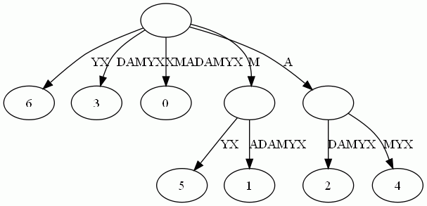

## 後綴樹

### 1.1、後綴樹的定義

後綴樹（Suffix tree）是一種數據結構，能快速解決很多關於字符串的問題。後綴樹的概念最早由Weiner 於1973年提出，既而由McCreight 在1976年和Ukkonen在1992年和1995年加以改進完善。

後綴，顧名思義，就是後面尾巴的意思。比如說給定一長度為n的字符串S=S1S2..Si..Sn，和整數i，1 <= i <= n，子串SiSi+1...Sn便都是字符串S的後綴。

以字符串S=XMADAMYX為例，它的長度為8，所以S[1..8], S[2..8], ... , S[8..8]都算S的後綴，我們一般還把空字串也算成後綴。這樣，我們一共有如下後綴。對於後綴S[i..n]，我們說這項後綴起始於i。

S[1..8], XMADAMYX， 也就是字符串本身，起始位置為1  
 S[2..8], MADAMYX，起始位置為2  
  S[3..8], ADAMYX，起始位置為3  
   S[4..8], DAMYX，起始位置為4  
    S[5..8], AMYX，起始位置為5  
     S[6..8], MYX，起始位置為6  
      S[7..8], YX，起始位置為7  
       S[8..8], X，起始位置為8  
空字串，記為$。 

而後綴樹，就是包含一則字符串所有後綴的壓縮Trie。把上面的後綴加入Trie後，我們得到下面的結構：

仔細觀察上圖，我們可以看到不少值得壓縮的地方。比如藍框標註的分支都是獨苗，沒有必要用單獨的節點同邊表示。如果我們允許任意一條邊裡包含多個字 母，就可以把這種沒有分叉的路徑壓縮到一條邊。而另外每條邊已經包含了足夠的後綴信息，我們就不用再給節點標註字符串信息，只需要**在葉節點上標註上每項後綴的起始位置**。

於是我們得到下圖：

這樣的結構丟失了某些後綴。比如後**綴X在上圖中消失了**，因為它正好是字符串XMADAMYX的前綴。為了避免這種情況，我們也規定**每項後綴不能是其它後綴的前綴**。要解決這個問題其實挺簡單，在**待處理的子串後加一個空字串**就行了。例如我們處理XMADAMYX前，先把XMADAMYX變為 XMADAMYX$，於是就得到suffix tree--後綴樹了，如下圖所示：

### 1.2、後綴樹的應用

後綴樹可以解決最長迴文問題，那它和最長迴文有什麼關係呢？在此之前，我們得先知道兩個簡單概念：

- 最低共有祖先，**LCA**（Lowest Common Ancestor)，也就是任意兩節點（多個也行）最長的共有前綴。比如下圖中，節點7同節點1的共同祖先是節點5與節點10，但最低共同祖先是5。 查找LCA的算法是O(1)的複雜度，當然，代價是需要對後綴樹做複雜度為O(n)的預處理。 

- 廣義後綴樹(Generalized Suffix Tree)。傳統的後綴樹處理一坨單詞的所有後綴。廣義後綴樹存儲任意多個單詞的所有後綴。例如下圖是單詞**XMADAMYX與XYMADAMX的廣義後綴 樹**。注意我們需要區分不同單詞的後綴，所以葉節點用不同的特殊符號與後綴位置配對。 

有了上面的概念，本文引言中提出的查找最長迴文問題就相對簡單了。咱們來回顧下引言中提出的迴文問題的具體描述：找出給定字符串裡的最長迴文。例如輸入XMADAMYX，則輸出MADAM。

思維的突破點在於考察迴文的半徑，而不是迴文本身。所謂半徑，就是迴文對摺後的字串。比如迴文MADAM 的半徑為MAD，半徑長度為3，半徑的中心是字母D。顯然，最長迴文必有最長半徑，且兩條半徑相等。

還是以MADAM為例，以D為中心往左，我們得到半徑 DAM；以D為中心向右，我們得到半徑DAM。二者肯定相等。因為MADAM已經是單詞XMADAMYX裡的最長迴文，我們可以肯定從**D往左數的字串 DAMX與從D往右數的子串DAMYX共享最長前綴DAM**。而這，正是解決迴文問題的關鍵。現在我們有後綴樹，怎麼把從D向左數的字串DAMX變成後綴呢？

到這個地步，答案應該明顯：**把單詞XMADAMYX翻轉（XMADAMYX=>XYMADAMX**，**DAMX**就變成後綴了**）**就行了。於是我們把尋找回文的問題轉換成了尋找兩坨後綴的**LCA**的問題。當然，我們還需要知道 到底查詢那些後綴間的LCA。很簡單，給定字符串S，如果最長迴文的中心在i，那從位置i向右數的後綴剛好是S(i)，而向左數的字符串剛好是翻轉S後得到的字符串S‘的後綴S'(n-i+1)。這裡的n是字符串S的長度。

拿單詞XMADAMYX來說，迴文中心為D，那麼D向右的後綴**DAMYX**假設是S(i)（當N=8，i從1開始計數，i=4時，便是S(4..8)）;而對於翻轉後的單詞XYMADAMX而言，迴文中心D向右對應的後綴為**DAMX**，也就是S'(N-i+1)(（N=8，i=4，便是S‘（5..8）） 。此刻已經可以得出，它們共享最長前綴，即**LCA（DAMYX，DAMX）=DAM**。有了這套直觀解釋，算法自然呼之欲出:

1. 預處理後綴樹，使得查詢LCA的複雜度為O(1)。這步的開銷是O(N)，N是單詞S的長度 ；
  
2. 對單詞的每一位置i(也就是從0到N-1)，獲取LCA(S(i), S‘(N-i+1)) 以及LCA(S(i+1), S’(n-i+1))。查找兩次的原因是我們需要考慮奇數迴文和偶數迴文的情況。這步要考察每坨i，所以複雜度是O(N) ；  

3. 找到最大的LCA，我們也就得到了迴文的中心i以及迴文的半徑長度，自然也就得到了最長迴文。總的複雜度O(n)。 

i為4時，LCA(4$, 5#)為DAM，正好是最長半徑。此外，創建後綴樹為O(n)的時間複雜度。
