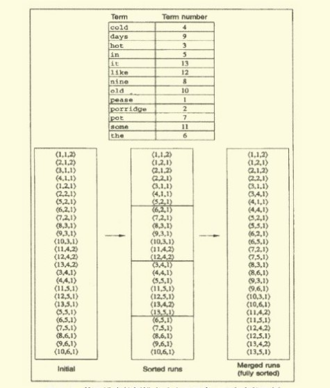
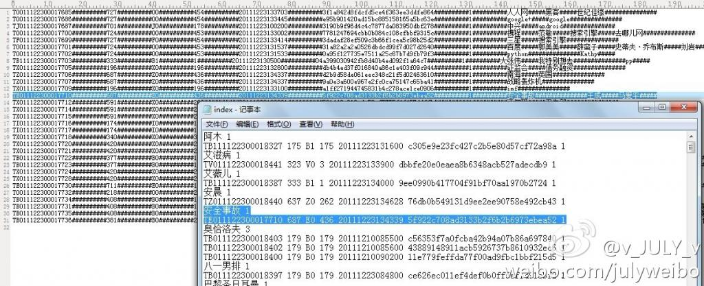
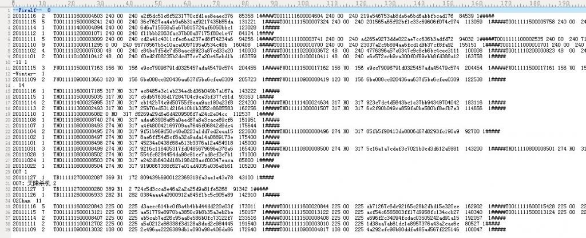
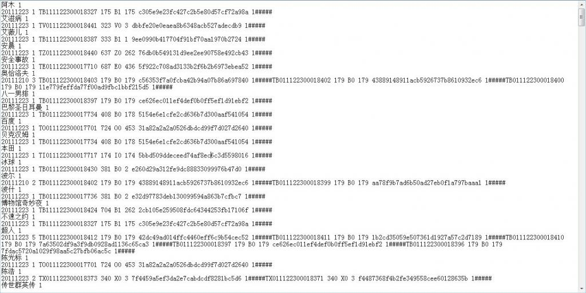
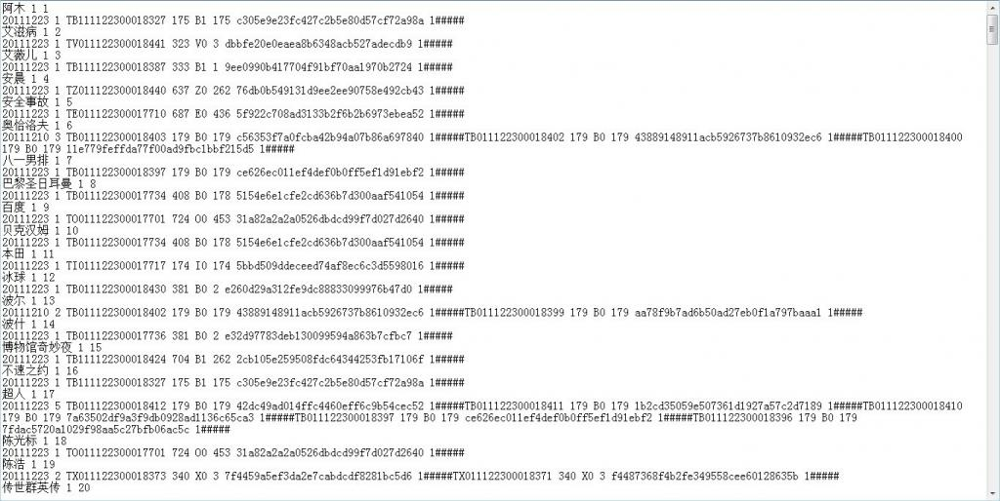
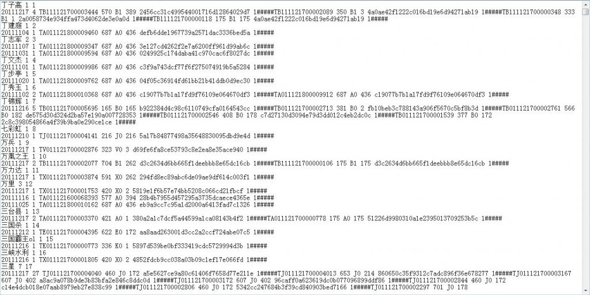

# 基於給定的文檔生成倒排索引的編碼與實踐

作者：July、yansha。

出處：結構之法算法之道

## 引言

本週實現倒排索引。實現過程中，尋找資料，結果發現找份資料諸多不易：1、網上搜倒排索引實現，結果千篇一律，例子都是那幾個同樣的單詞；2、到谷歌學術上想找點稍微有價值水平的資料，結果下篇論文還收費或者要求註冊之類；3、大部分技術書籍只有理論，沒有實踐。於是，朋友戲言：網上一般有價值的東西不多。希望，本blog的出現能改變此現狀。

在第二十四章、倒排索引關鍵詞不重複Hash編碼中，我們針對一個給定的倒排索引文件，提取出其中的關鍵詞，然後針對這些關鍵詞進行Hash不重複編碼。本章，咱們再倒退一步，即給定一個正排文檔（暫略過文本解析，分詞等步驟，日後會慢慢考慮這些且一併予以實現），要求生成對應的倒排索引文件。同時，本章還是基於Hash索引之上（運用暴雪的Hash函數可以比較完美的解決大數據量下的衝突問題），日後自會實現B+樹索引。

與此同時，本編程藝術系列逐步從為面試服務而轉到實戰性的編程當中了，教初學者如何編程，如何運用高效的算法解決實際應用中的編程問題，將逐步成為本編程藝術系列的主旨之一。

OK，接下來，咱們針對給定的正排文檔一步一步來生成倒排索引文件，有任何問題，歡迎隨時不吝賜教或批評指正。謝謝。

## 第一節、索引的構建方法

* 根據信息檢索導論（Christtopher D.Manning等著，王斌譯）一書給的提示，我們可以選擇兩種構建索引的算法：BSBI算法，與SPIMI算法。

BSBI算法，基於磁盤的外部排序算法，此算法首先將詞項映射成其ID的數據結構，如Hash映射。而後將文檔解析成詞項ID-文檔ID對，並在內存中一直處理，直到累積至放滿一個固定大小的塊空間為止，我們選擇合適的塊大小，使之能方便加載到內存中並允許在內存中快速排序，快速排序後的塊轉換成倒排索引格式後寫入磁盤。

建立倒排索引的步驟如下：

* 將文檔分割成幾個大小相等的部分；
* 對詞項ID-文檔ID進行排序；
* 將具有同一詞項ID的所有文檔ID放到倒排記錄表中，其中每條倒排記錄僅僅是一個文檔ID；
* 將基於塊的倒排索引寫到磁盤上。

此算法假如說最後可能會產生10個塊。其偽碼如下：

    BSBI NDEXConSTRUCTION()
    n <- 0
    while(all documents have not been processed)
        do n<-n+1
            block <- PARSENEXTBLOCK()    //文檔分析
            BSBI-INVERT(block)
            WRITEBLOCKTODISK(block,fn)
            MERGEBLOCKS(f1,...,fn;fmerged)

（基於塊的排序索引算法，該算法將每個塊的倒排索引文件存入文件f1,...,fn中，最後合併成fmerged
如果該算法應用最後一步產生了10個塊，那麼接下來便會將10個塊索引同時合併成一個索引文件。）

合併時，同時打開所有塊對應的文件，內存中維護了為10個塊準備的讀緩衝區和一個為最終合併索引準備的寫緩衝區。每次迭代中，利用優先級隊列（如堆結構或類似的數據結構）選擇最小的未處理的詞項ID進行處理。如下圖所示（圖片引自深入搜索引擎--海里信息的壓縮、索引和查詢，樑斌譯），分塊索引，分塊排序，最終全部合併（說實話，跟MapReduce還是有些類似的）：



讀入該詞項的倒排記錄表併合並，合併結果寫回磁盤中。需要時，再次從文件中讀入數據到每個讀緩衝區。

BSBI算法主要的時間消耗在排序上，選擇什麼排序方法呢，簡單的快速排序足矣，其時間複雜度為O（N*logN），其中N是所需要排序的項（詞項ID-文檔ID對）的數目的上界。

SPIMI算法，內存式單遍掃描索引算法

與上述BSBI算法不同的是：SPIMI使用詞項而不是其ID，它將每個塊的詞典寫入磁盤，對於寫一塊則重新採用新的詞典，只要硬盤空間足夠大，它能索引任何大小的文檔集。

倒排索引 = 詞典（關鍵詞或詞項+詞項頻率）+倒排記錄表。建倒排索引的步驟如下：

* 從頭開始掃描每一個詞項-文檔ID（信息）對，遇一詞，構建索引；
* 繼續掃描，若遇一新詞，則再建一新索引塊（加入詞典，通過Hash表實現，同時，建一新的倒排記錄表）；若遇一舊詞，則找到其倒排記錄表的位置，添加其後
* 在內存內基於分塊完成排序，後合併分塊；
* 寫入磁盤。

其偽碼如下：

    SPIMI-Invert(Token_stream)
    output.file=NEWFILE()
    dictionary = NEWHASH()
    while (free memory available)
        do token <-next(token_stream) //逐一處理每個詞項-文檔ID對
            if term(token) !(- dictionary
               /*如果詞項是第一次出現，那麼加入hash詞典，同時，建立一個新的倒排索引表*/
               then postings_list = AddToDictionary(dictionary,term(token))
            /*如果不是第一次出現，那麼直接返回其倒排記錄表，在下面添加其後*/
            else postings_list = GetPostingList(dictionary,term(token))
        if full(postings_list)
            then postings_list =DoublePostingList(dictionary,term(token))
        /*SPIMI與BSBI的區別就在於此，前者直接在倒排記錄表中增加此項新紀錄*/
        AddToPosTingsList (postings_list,docID(token))
    sorted_terms <- SortTerms(dictionary)
    WriteBlockToDisk(sorted_terms,dictionary,output_file)
    return output_file

**SPIMI與BSBI的主要區別：**

SPIMI當發現關鍵詞是第一次出現時，會直接在倒排記錄表中增加一項（與BSBI算法不同）。同時，與BSBI算法一開始就整理出所有的詞項ID-文檔ID，並對它們進行排序的做法不同（而這恰恰是BSBI的做法），這裡的每個倒排記錄表都是動態增長的（也就是說，倒排記錄表的大小會不斷調整），同時，掃描一遍就可以實現全體倒排記錄表的收集。

**SPIMI這樣做有兩點好處:**

由於不需要排序操作，因此處理的速度更快，
由於保留了倒排記錄表對詞項的歸屬關係，因此能節省內存，詞項的ID也不需要保存。這樣，每次單獨的SPIMI-Invert調用能夠處理的塊大小可以非常大，整個倒排索引的構建過程也可以非常高效。

但不得不提的是，由於事先並不知道每個詞項的倒排記錄表大小，算法一開始只能分配一個較小的倒排記錄表空間，每次當該空間放滿的時候，就會申請加倍的空間，

與此同時，自然而然便會浪費一部分空間（當然，此前因為不保存詞項ID，倒也省下一點空間，總體而言，算作是抵銷了）。

不過，至少SPIMI所用的空間會比BSBI所用空間少。當內存耗盡後，包括詞典和倒排記錄表的塊索引將被寫到磁盤上，但在此之前，為使倒排記錄表按照詞典順序來加快最後的合併操作，所以要對詞項進行排序操作。

小數據量與大數據量的區別

* 在小數據量時，有足夠的內存保證該創建過程可以一次完成；
* 數據規模增大後，可以採用分組索引，然後再歸併索 引的策略。該策略是，

建立索引的模塊根據當時運行系統所在的計算機的內存大小，將索引分為 k 組，使得每組運算所需內存都小於系統能夠提供的最大使用內存的大小。
按照倒排索引的生成算法，生成 k 組倒排索引。
然後將這 k 組索引歸併，即將相同索引詞對應的數據合併到一起，就得到了以索引詞為主鍵的最終的倒排文件索引，即反向索引。

為了測試的方便，本文針對小數據量進行從正排文檔到倒排索引文件的實現。而且針對大數量的K路歸併算法或基於磁盤的外部排序算法本編程藝術系列第十章中已有詳細闡述。

## 第二節、Hash表的構建與實現

如下，給定如下圖所示的正排文檔，每一行的信息分別為（中間用##########隔開）：文檔ID、訂閱源（子頻道）、 頻道分類、 網站類ID（大頻道）、時間、 md5、文檔權值、關鍵詞、作者等等。


要求基於給定的上述正排文檔。生成如第二十四章所示的倒排索引文件（注，關鍵詞所在的文章如果是同一個日期的話，是挨在同一行的，用“#”符號隔開）：


我們知道：為網頁建立全文索引是網頁預處理的核心部分，包括分析網頁和建立倒排文件。二者是順序進行，先分析網頁，後建立倒排文件（也稱為反向索引），如圖所示：


正如上圖粗略所示，我們知道倒排索引創建的過程如下：

* 寫爬蟲抓取相關的網頁，而後提取相關網頁或文章中所有的關鍵詞；
* 分詞，找出所有單詞；
* 過濾不相干的信息（如廣告等信息）；
* 構建倒排索引，關鍵詞=>（文章ID 出現次數 出現的位置）生成詞典文件 頻率文件 位置文件；
* 壓縮。

因為已經給定了正排文檔，接下來，咱們跳過一系列文本解析，分詞等中間步驟，直接根據正排文檔生成倒排索引文檔（幸虧有yansha相助，不然，寸步難行，其微博地址為：[http://weibo.com/yanshazi](http://weibo.com/yanshazi)，歡迎關注他）。

OK，閒不多說，咱們來一步一步實現吧。

建相關的數據結構

根據給定的正排文檔，我們可以建立如下的兩個結構體表示這些信息：文檔ID、訂閱源（子頻道）、 頻道分類、 網站類ID（大頻道）、時間、 md5、文檔權值、關鍵詞、作者等等。如下所示：
```cpp
typedef struct key_node
{
    char *pkey;     // 關鍵詞實體
    int count;      // 關鍵詞出現次數
    int pos;        // 關鍵詞在hash表中位置
    struct doc_node *next;  // 指向文檔結點
}KEYNODE, *key_list;

key_list key_array[TABLE_SIZE];

typedef struct doc_node
{
    char id[WORD_MAX_LEN];  //文檔ID
    int classOne;           //訂閱源（子頻道）
    char classTwo[WORD_MAX_LEN];    //頻道分類
    int classThree;                 //網站類ID（大頻道）
    char time[WORD_MAX_LEN];        //時間
    char md5[WORD_MAX_LEN];         //md5
    int weight;                     //文檔權值
    struct doc_node *next;
}DOCNODE, *doc_list;
```

我們知道，通過第二十四章的暴雪的Hash表算法，可以比較好的避免相關衝突的問題。下面，我們再次引用其代碼：
基於暴雪的Hash之上的改造算法
```cpp
//函數prepareCryptTable以下的函數生成一個長度為0x100的cryptTable[0x100]
void PrepareCryptTable()
{
    unsigned long seed = 0x00100001, index1 = 0, index2 = 0, i;

    for( index1 = 0; index1 <0x100; index1++ )
    {
        for( index2 = index1, i = 0; i < 5; i++, index2 += 0x100)
        {
            unsigned long temp1, temp2;
            seed = (seed * 125 + 3) % 0x2AAAAB;
            temp1 = (seed & 0xFFFF)<<0x10;
            seed = (seed * 125 + 3) % 0x2AAAAB;
            temp2 = (seed & 0xFFFF);
            cryptTable[index2] = ( temp1 | temp2 );
        }
    }
}

//函數HashString以下函數計算lpszFileName 字符串的hash值，其中dwHashType 為hash的類型，
unsigned long HashString(const char *lpszkeyName, unsigned long dwHashType )
{
    unsigned char *key  = (unsigned char *)lpszkeyName;
    unsigned long seed1 = 0x7FED7FED;
    unsigned long seed2 = 0xEEEEEEEE;
    int ch;

    while( *key != 0 )
    {
        ch = *key++;
        seed1 = cryptTable[(dwHashType<<8) + ch] ^ (seed1 + seed2);
        seed2 = ch + seed1 + seed2 + (seed2<<5) + 3;
    }
    return seed1;
}

//按關鍵字查詢，如果成功返回hash表中索引位置
key_list SearchByString(const char *string_in)
{
    const int HASH_OFFSET = 0, HASH_C = 1, HASH_D = 2;
    unsigned int nHash = HashString(string_in, HASH_OFFSET);
    unsigned int nHashC = HashString(string_in, HASH_C);
    unsigned int nHashD = HashString(string_in, HASH_D);
    unsigned int nHashStart = nHash % TABLE_SIZE;
    unsigned int nHashPos = nHashStart;

    while (HashTable[nHashPos].bExists)
    {
        if (HashATable[nHashPos] == (int) nHashC && HashBTable[nHashPos] == (int) nHashD)
        {
            break;
            //查詢與插入不同，此處不需修改
        }
        else
        {
            nHashPos = (nHashPos + 1) % TABLE_SIZE;
        }

        if (nHashPos == nHashStart)
        {
            break;
        }
    }

    if( key_array[nHashPos] && strlen(key_array[nHashPos]->pkey))
    {
        return key_array[nHashPos];
    }

    return NULL;
}

//按索引查詢，如果成功返回關鍵字（此函數在本章中沒有被用到，可以忽略）
key_list SearchByIndex(unsigned int nIndex)
{
    unsigned int nHashPos = nIndex;
    if (nIndex < TABLE_SIZE)
    {
        if(key_array[nHashPos] && strlen(key_array[nHashPos]->pkey))
        {
            return key_array[nHashPos];
        }
    }

    return NULL;
}

//插入關鍵字，如果成功返回hash值
int InsertString(const char *str)
{
    const int HASH_OFFSET = 0, HASH_A = 1, HASH_B = 2;
    unsigned int nHash = HashString(str, HASH_OFFSET);
    unsigned int nHashA = HashString(str, HASH_A);
    unsigned int nHashB = HashString(str, HASH_B);
    unsigned int nHashStart = nHash % TABLE_SIZE;
    unsigned int nHashPos = nHashStart;
    int len;

    while (HashTable[nHashPos].bExists)
    {
        nHashPos = (nHashPos + 1) % TABLE_SIZE;

        if (nHashPos == nHashStart)
            break;
    }

    len = strlen(str);
    if (!HashTable[nHashPos].bExists && (len < WORD_MAX_LEN))
    {
        HashATable[nHashPos] = nHashA;
        HashBTable[nHashPos] = nHashB;

        key_array[nHashPos] = (KEYNODE *) malloc (sizeof(KEYNODE) * 1);
        if(key_array[nHashPos] == NULL)
        {
            printf("10000 EMS ERROR !!!!\n");
            return 0;
        }

        key_array[nHashPos]->pkey = (char *)malloc(len+1);
        if(key_array[nHashPos]->pkey == NULL)
        {
            printf("10000 EMS ERROR !!!!\n");
            return 0;
        }

        memset(key_array[nHashPos]->pkey, 0, len+1);
        strncpy(key_array[nHashPos]->pkey, str, len);
        *((key_array[nHashPos]->pkey)+len) = 0;
        key_array[nHashPos]->pos = nHashPos;
        key_array[nHashPos]->count = 1;
        key_array[nHashPos]->next = NULL;
        HashTable[nHashPos].bExists = 1;
        return nHashPos;
    }

    if(HashTable[nHashPos].bExists)
        printf("30000 in the hash table %s !!!\n", str);
    else
        printf("90000 strkey error !!!\n");
    return -1;
}
```
有了這個Hash表，接下來，我們就可以把詞插入Hash表進行存儲了。

## 第三節、倒排索引文件的生成與實現

Hash表實現了（存於HashSearch.h中），還得編寫一系列的函數，如下所示（所有代碼還只是初步實現了功能，稍後在第四部分中將予以改進與優化）：
```cpp
//處理空白字符和空白行
int GetRealString(char *pbuf)
{
    int len = strlen(pbuf) - 1;
    while (len > 0 && (pbuf[len] == (char)0x0d || pbuf[len] == (char)0x0a || pbuf[len] == ' ' || pbuf[len] == '\t'))
    {
        len--;
    }

    if (len < 0)
    {
        *pbuf = '\0';
        return len;
    }
    pbuf[len+1] = '\0';
    return len + 1;
}

//重新strcoll字符串比較函數
int strcoll(const void *s1, const void *s2)
{
    char *c_s1 = (char *)s1;
    char *c_s2 = (char *)s2;
    while (*c_s1 == *c_s2++)
    {
        if (*c_s1++ == '\0')
        {
            return 0;
        }
    }

    return *c_s1 - *--c_s2;
}

//從行緩衝中得到各項信息，將其寫入items數組
void GetItems(char *&move, int &count, int &wordnum)
{
    char *front = move;
    bool flag = false;
    int len;
    move = strstr(move, "#####");
    if (*(move + 5) == '#')
    {
        flag = true;
    }

    if (move)
    {
        len = move - front;
        strncpy(items[count], front, len);
    }
    items[count][len] = '\0';
    count++;

    if (flag)
    {
        move = move + 10;
    } else
    {
        move = move + 5;
    }
}

//保存關鍵字相應的文檔內容
doc_list SaveItems()
{
    doc_list infolist = (doc_list) malloc(sizeof(DOCNODE));
    strcpy_s(infolist->id, items[0]);
    infolist->classOne = atoi(items[1]);
    strcpy_s(infolist->classTwo, items[2]);
    infolist->classThree = atoi(items[3]);
    strcpy_s(infolist->time, items[4]);
    strcpy_s(infolist->md5, items[5]);
    infolist->weight = atoi(items[6]);
    return infolist;
}

//得到目錄下所有文件名
int GetFileName(char filename[][FILENAME_MAX_LEN])
{
    _finddata_t file;
    long handle;
    int filenum = 0;
    //C:\Users\zhangxu\Desktop\CreateInvertedIndex\data
    if ((handle = _findfirst("C:\\Users\\zhangxu\\Desktop\\CreateInvertedIndex\\data\\*.txt", &file)) == -1)
    {
        printf("Not Found\n");
    }
    else
    {
        do
        {
            strcpy_s(filename[filenum++], file.name);
        } while (!_findnext(handle, &file));
    }
    _findclose(handle);
    return filenum;
}

//以讀方式打開文件，如果成功返回文件指針
FILE* OpenReadFile(int index, char filename[][FILENAME_MAX_LEN])
{
    char *abspath;
    char dirpath[] = {"data\\"};
    abspath = (char *)malloc(ABSPATH_MAX_LEN);
    strcpy_s(abspath, ABSPATH_MAX_LEN, dirpath);
    strcat_s(abspath, FILENAME_MAX_LEN, filename[index]);

    FILE *fp = fopen (abspath, "r");
    if (fp == NULL)
    {
        printf("open read file error!\n");
        return NULL;
    }
    else
    {
        return fp;
    }
}

//以寫方式打開文件，如果成功返回文件指針
FILE* OpenWriteFile(const char *in_file_path)
{
    if (in_file_path == NULL)
    {
        printf("output file path error!\n");
        return NULL;
    }

    FILE *fp = fopen(in_file_path, "w+");
    if (fp == NULL)
    {
        printf("open write file error!\n");
    }
    return fp;
}
```

最後，主函數編寫如下：

```cpp
int main()
{
    key_list keylist;
    char *pbuf, *move;
    int filenum = GetFileName(filename);
    FILE *fr;
    pbuf = (char *)malloc(BUF_MAX_LEN);
    memset(pbuf, 0, BUF_MAX_LEN);

    FILE *fw = OpenWriteFile("index.txt");
    if (fw == NULL)
    {
        return 0;
    }

    PrepareCryptTable();    //初始化Hash表

    int wordnum = 0;
    for (int i = 0; i < filenum; i++)
    {
        fr = OpenReadFile(i, filename);
        if (fr == NULL)
        {
            break;
        }

        // 每次讀取一行處理
        while (fgets(pbuf, BUF_MAX_LEN, fr))
        {
            int count = 0;
            move = pbuf;
            if (GetRealString(pbuf) <= 1)
                continue;

            while (move != NULL)
            {
                // 找到第一個非'#'的字符
                while (*move == '#')
                    move++;

                if (!strcmp(move, ""))
                    break;

                GetItems(move, count, wordnum);
            }

            for (int i = 7; i < count; i++)
            {
                // 將關鍵字對應的文檔內容加入文檔結點鏈表中
                if (keylist = SearchByString(items[i]))     //到hash表內查詢
                {
                    doc_list infolist = SaveItems();
                    infolist->next = keylist->next;
                    keylist->count++;
                    keylist->next = infolist;
                }
                else
                {
                    // 如果關鍵字第一次出現，則將其加入hash表
                    int pos = InsertString(items[i]);       //插入hash表
                    keylist = key_array[pos];
                    doc_list infolist = SaveItems();
                    infolist->next = NULL;
                    keylist->next = infolist;
                    if (pos != -1)
                    {
                        strcpy_s(words[wordnum++], items[i]);
                    }
                }
            }
        }
    }

    // 通過快排對關鍵字進行排序
    qsort(words, WORD_MAX_NUM, WORD_MAX_LEN, strcoll);

    // 遍歷關鍵字數組，將關鍵字及其對應的文檔內容寫入文件中
    for (int i = 0; i < WORD_MAX_NUM; i++)
    {
        keylist = SearchByString(words[i]);
        if (keylist != NULL)
        {
            fprintf(fw, "%s %d\n", words[i], keylist->count);
            doc_list infolist = keylist->next;
            for (int j = 0; j < keylist->count; j++)
            {
                //文檔ID，訂閱源（子頻道） 頻道分類 網站類ID（大頻道） 時間  md5，文檔權值
                fprintf(fw, "%s %d %s %d %s %s %d\n", infolist->id, infolist->classOne,
                    infolist->classTwo, infolist->classThree, infolist->time, infolist->md5, infolist->weight);
                infolist = infolist->next;
            }
        }
    }

    free(pbuf);
    fclose(fr);
    fclose(fw);
    system("pause");
    return 0;
}
```

程序編譯運行後，生成的倒排索引文件為index.txt，其與原來給定的正排文檔對照如下：


有沒有發現關鍵詞奧恰洛夫出現在的三篇文章是同一個日期1210的，貌似與本文開頭指定的倒排索引格式要求不符？因為第二部分開頭中，已明確說明：“注，關鍵詞所在的文章如果是同一個日期的話，是挨在同一行的，用“#”符號隔開”。OK，有疑問是好事，代表你思考了，請直接轉至下文第4部分。

## 第四節、程序需求功能的改進

### 對相同日期與不同日期的處理

細心的讀者可能還是會注意到：在第二部分開頭中，要求基於給定的上述正排文檔。生成如第二十四章所示的倒排索引文件是下面這樣子的，即是：


也就是說，上面建索引的過程本該是如下的：


與第一部分所述的SMIPI算法有什麼區別？對的，就在於對在同一個日期的出現的關鍵詞的處理。如果是遇一舊詞，則找到其倒排記錄表的位置：相同日期，添加到之前同一日期的記錄之後（第一個記錄的後面記下同一日期的記錄數目）；不同日期，另起一行新增記錄。

* 相同（單個）日期，根據文檔權值排序
* 不同日期，根據時間排序

代碼主要修改如下：
```cpp
//function: 對鏈表進行冒泡排序
void ListSort(key_list keylist)
{
    doc_list p = keylist->next;
    doc_list final = NULL;
    while (true)
    {
        bool isfinish = true;
        while (p->next != final) {
            if (strcmp(p->time, p->next->time) < 0)
            {
                SwapDocNode(p);
                isfinish = false;
            }
            p = p->next;
        }
        final = p;
        p = keylist->next;
        if (isfinish || p->next == final) {
            break;
        }
    }
}

int main()
{
    key_list keylist;
    char *pbuf, *move;
    int filenum = GetFileName(filename);
    FILE *frp;
    pbuf = (char *)malloc(BUF_MAX_LEN);
    memset(pbuf, 0, BUF_MAX_LEN);

    FILE *fwp = OpenWriteFile("index.txt");
    if (fwp == NULL) {
        return 0;
    }

    PrepareCryptTable();

    int wordnum = 0;
    for (int i = 0; i < filenum; i++)
    {
        frp = OpenReadFile(i, filename);
        if (frp == NULL) {
            break;
        }

        // 每次讀取一行處理
        while (fgets(pbuf, BUF_MAX_LEN, frp))
        {
            int count = 0;
            move = pbuf;
            if (GetRealString(pbuf) <= 1)
                continue;

            while (move != NULL)
            {
                // 找到第一個非'#'的字符
                while (*move == '#')
                    move++;

                if (!strcmp(move, ""))
                    break;

                GetItems(move, count, wordnum);
            }

            for (int i = 7; i < count; i++) {
                // 將關鍵字對應的文檔內容加入文檔結點鏈表中
                // 如果關鍵字第一次出現，則將其加入hash表
                if (keylist = SearchByString(items[i])) {
                    doc_list infolist = SaveItems();
                    infolist->next = keylist->next;
                    keylist->count++;
                    keylist->next = infolist;
                } else {
                    int pos = InsertString(items[i]);
                    keylist = key_array[pos];
                    doc_list infolist = SaveItems();
                    infolist->next = NULL;
                    keylist->next = infolist;
                    if (pos != -1) {
                        strcpy_s(words[wordnum++], items[i]);
                    }
                }
            }
        }
    }

    // 通過快排對關鍵字進行排序
    qsort(words, WORD_MAX_NUM, WORD_MAX_LEN, strcoll);

    // 遍歷關鍵字數組，將關鍵字及其對應的文檔內容寫入文件中
    int rownum = 1;
    for (int i = 0; i < WORD_MAX_NUM; i++) {
        keylist = SearchByString(words[i]);
        if (keylist != NULL) {
            doc_list infolist = keylist->next;

            char date[9];

            // 截取年月日
            for (int j = 0; j < keylist->count; j++)
            {
                strncpy_s(date, infolist->time, 8);
                date[8] = '\0';
                strncpy_s(infolist->time, date, 9);
                infolist = infolist->next;
            }

            // 對鏈表根據時間進行排序
            ListSort(keylist);

            infolist = keylist->next;
            int *count = new int[WORD_MAX_NUM];
            memset(count, 0, WORD_MAX_NUM);
            strcpy_s(date, infolist->time);
            int num = 0;
            // 得到單個日期的文檔數目
            for (int j = 0; j < keylist->count; j++)
            {
                if (strcmp(date, infolist->time) == 0) {
                    count[num]++;
                } else {
                    count[++num]++;
                }
                strcpy_s(date, infolist->time);
                infolist = infolist->next;
            }
            fprintf(fwp, "%s %d %d\n", words[i], num + 1, rownum);
            WriteFile(keylist, num, fwp, count);
            rownum++;
        }
    }

    free(pbuf);
//  fclose(frp);
    fclose(fwp);
    system("pause");
    return 0;
}
```

修改後編譯運行，生成的index.txt文件如下：


### 為關鍵詞添上編碼

如上圖所示，已經滿足需求了。但可以再在每個關鍵詞的背後添加一個計數表示索引到了第多少個關鍵詞：


## 第五節、算法的二次改進

### 省去二次Hash

針對本文評論下讀者的留言，做了下思考，自覺可以省去二次hash：
```cpp
        for (int i = 7; i < count; i++)
        {
            // 將關鍵字對應的文檔內容加入文檔結點鏈表中
            //也就是說當查詢到hash表中沒有某個關鍵詞之,後便會插入
            //而查詢的時候，search會調用hashstring，得到了nHashC ，nHashD
            //插入的時候又調用了一次hashstring，得到了nHashA，nHashB
            //而如果查詢的時候，是針對同一個關鍵詞查詢的，所以也就是說nHashC&nHashD，與nHashA&nHashB是相同的，無需二次hash
            //所以，若要改進，改的也就是下面這個if~else語句裡頭。July，2011.12.30。
            if (keylist = SearchByString(items[i]))     //到hash表內查詢
            {
                doc_list infolist = SaveItems();
                infolist->next = keylist->next;
                keylist->count++;
                keylist->next = infolist;
            }
            else
            {
                // 如果關鍵字第一次出現，則將其加入hash表
                int pos = InsertString(items[i]);       //插入hash表
                keylist = key_array[pos];
                doc_list infolist = SaveItems();
                infolist->next = NULL;
                keylist->next = infolist;
                if (pos != -1)
                {
                    strcpy_s(words[wordnum++], items[i]);
                }
            }
        }
    }
}
// 通過快排對關鍵字進行排序
qsort(words, WORD_MAX_NUM, WORD_MAX_LEN, strcoll);
```

### 除去排序，針對不同日期的記錄直接插入

```cpp
//對鏈表進行冒泡排序。這裡可以改成快速排序：等到統計完所有有關這個關鍵詞的文章之後，才能對他集體快排。
//但其實完全可以用插入排序，不同日期的，根據時間的先後找到插入位置進行插入：
//假如說已有三條不同日期的記錄 A B C
//來了D後，發現D在C之前，B之後，那麼就必須為它找到B C之間的插入位置，
//A B D C。July、2011.12.31。
void ListSort(key_list keylist)
{
    doc_list p = keylist->next;
    doc_list final = NULL;
    while (true)
    {
        bool isfinish = true;
        while (p->next != final) {
            if (strcmp(p->time, p->next->time) < 0) //不同日期的按最早到最晚排序
            {
                SwapDocNode(p);
                isfinish = false;
            }
            p = p->next;
        }
        final = p;
        p = keylist->next;
        if (isfinish || p->next == final) {
            break;
        }
    }
}
```

綜上兩節免去冒泡排序和，省去二次hash和免去冒泡排序，修改後如下：

```cpp
        for (int i = 7; i < count; i++) {
            // 將關鍵字對應的文檔內容加入文檔結點鏈表中
            // 如果關鍵字第一次出現，則將其加入hash表
            InitHashValue(items[i], hashvalue);
            if (keynode = SearchByString(items[i], hashvalue)) {
                doc_list infonode = SaveItems();
                doc_list p = keynode->next;
                // 根據時間由早到晚排序
                if (strcmp(infonode->time, p->time) < 0) {
                    //考慮infonode插入keynode後的情況
                    infonode->next = p;
                    keynode->next = infonode;
                } else {
                    //考慮其他情況
                    doc_list pre = p;
                    p = p->next;
                    while (p)
                    {
                        if (strcmp(infonode->time, p->time) > 0) {
                            p = p->next;
                            pre = pre->next;
                        } else {
                            break;
                        }
                    }
                    infonode->next = p;
                    pre->next = infonode;
                }
                keynode->count++;
            } else {
                int pos = InsertString(items[i], hashvalue);
                keynode = key_array[pos];
                doc_list infolist = SaveItems();
                infolist->next = NULL;
                keynode->next = infolist;
                if (pos != -1) {
                    strcpy_s(words[wordnum++], items[i]);
                }
            }
        }
    }
}

// 通過快排對關鍵字進行排序
qsort(words, WORD_MAX_NUM, WORD_MAX_LEN, strcoll);
```
修改後編譯運行的效果圖如下（用了另外一份更大的數據文件進行測試）：

