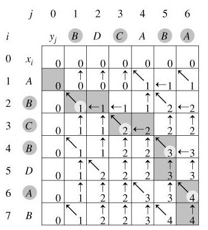

# 最長公共子序列

## 問題描述  

什麼是最長公共子序列呢?好比一個數列 S，如果分別是兩個或多個已知數列的子序列，且是所有符合此條件序列中最長的，則S 稱為已知序列的最長公共子序列。  

舉個例子，如：有兩條隨機序列，如 1 3 4 5 5 ，and 2 4 5 5 7 6，則它們的最長公共子序列便是：4 5 5。  

## 分析與解法

### 解法一 

最容易想到的算法是窮舉搜索法，即對X的每一個子序列，檢查它是否也是Y的子序列，從而確定它是否為X和Y的公共子序列，並且在檢查過程中選出最長的公共子序列。X和Y的所有子序列都檢查過後即可求出X和Y的最長公共子序列。X的一個子序列相應於下標序列{1, 2, …, m}的一個子序列，因此，X共有2m個不同子序列（Y亦如此，如為2^n），從而窮舉搜索法需要指數時間（2^m * 2^n）。  

### 解法二 

事實上，最長公共子序列問題也有最優子結構性質。  

記：  
  Xi=﹤x1，⋯，xi﹥即X序列的前i個字符 (1≤i≤m)（前綴）  
 
  Yj=﹤y1，⋯，yj﹥即Y序列的前j個字符 (1≤j≤n)（前綴）  

假定Z=﹤z1，⋯，zk﹥∈LCS(X , Y) 。 

* 若**xm=yn**（最後一個字符相同），則不難用反證法證明：該字符必是X與Y的任一最長公共子序列Z（設長度為k）的最後一個字符，即有zk = xm = yn 且顯然有Zk-1∈LCS(Xm-1 , Yn-1)即Z的前綴**Zk-1是Xm-1與Yn-1的最長公共子序列。**此時，問題化歸成求Xm-1與Yn-1的LCS（LCS(X , Y)的長度等於LCS(Xm-1 , Yn-1)的長度加1）。  

* 若**xm≠yn**，則亦不難用反證法證明：要麼Z∈LCS(Xm-1, Y)，要麼Z∈LCS(X , Yn-1)。由於zk≠xm與zk≠yn其中至少有一個必成立，若zk≠xm則有Z∈LCS(Xm-1 , Y)，類似的，若zk≠yn 則有Z∈LCS(X , Yn-1)。此時，問題化歸成求Xm-1與Y的LCS及X與Yn-1的LCS。LCS(X , Y)的長度為：max{LCS(Xm-1 , Y)的長度, LCS(X , Yn-1)的長度}。  

由於上述當**xm≠yn**的情況中，求LCS(Xm-1 , Y)的長度與LCS(X , Yn-1)的長度，這兩個問題不是相互獨立的：兩者都需要求LCS(Xm-1，Yn-1)的長度。另外兩個序列的LCS中包含了兩個序列的前綴的LCS，故問題具有最優子結構性質考慮用動態規劃法。  

也就是說，解決這個LCS問題，你要求三個方面的東西：1、LCS(Xm-1，Yn-1)+1；2、LCS(Xm-1，Y)，LCS(X，Yn-1)；3、max{LCS(Xm-1, Y)，LCS(X, Yn-1)}。  

#### 最長公共子序列的結構

最長公共子序列的結構有如下表示：  

設序列X=< x1, x2, …, xm >和Y=< y1, y2, …, yn >的一個最長公共子序列Z=< z1, z2, …, zk >，則：

1. 若xm=yn，則zk=xm=yn且Zk-1是Xm-1和Yn-1的最長公共子序列；  
2. 若xm≠yn且zk≠xm ，則Z是Xm-1和Y的最長公共子序列；  
3. 若xm≠yn且zk≠yn ，則Z是X和Yn-1的最長公共子序列。  
其中Xm-1 = < x1, x2, …, xm-1 >，Yn-1 = < y1, y2, …, yn-1 >，Zk-1 = < z1, z2, …, zk-1 >。

#### 子問題的遞歸結構

由最長公共子序列問題的最優子結構性質可知，要找出X=< x1, x2, …, xm >和Y=< y1, y2, …, yn >的最長公共子序列，可按以下方式遞歸地進行：當xm=yn時，找出Xm-1和Yn-1的最長公共子序列，然後在其尾部加上xm(=yn)即可得X和Y的一個最長公共子序列。當xm≠yn時，必須解兩個子問題，即找出Xm-1和Y的一個最長公共子序列及X和Yn-1的一個最長公共子序列。這兩個公共子序列中較長者即為X和Y的一個最長公共子序列。  
  
由此遞歸結構容易看到最長公共子序列問題具有子問題重疊性質。例如，在計算X和Y的最長公共子序列時，可能要計算出X和Yn-1及Xm-1和Y的最長公共子序列。而這兩個子問題都包含一個公共子問題，即計算Xm-1和Yn-1的最長公共子序列。

與矩陣連乘積最優計算次序問題類似，我們來建立子問題的最優值的遞歸關係。用c[i,j]記錄序列Xi和Yj的最長公共子序列的長度。其中Xi=< x1, x2, …, xi >，Yj=< y1, y2, …, yj >。當i=0或j=0時，空序列是Xi和Yj的最長公共子序列，故c[i,j]=0。其他情況下，由定理可建立遞歸關係如下：


#### 計算最優值

直接利用上節節末的遞歸式，我們將很容易就能寫出一個計算c[i,j]的遞歸算法，但其計算時間是隨輸入長度指數增長的。由於在所考慮的子問題空間中，總共只有θ(m*n)個不同的子問題，因此，用動態規劃算法自底向上地計算最優值能提高算法的效率。  

計算最長公共子序列長度的動態規劃算法LCS_LENGTH(X,Y)以序列X=< x1, x2, …, xm >和Y=< y1, y2, …, yn >作為輸入。輸出兩個數組c[0..m ,0..n]和b[1..m ,1..n]。其中c[i,j]存儲Xi與Yj的最長公共子序列的長度，b[i,j]記錄指示c[i,j]的值是由哪一個子問題的解達到的，這在構造最長公共子序列時要用到。最後，X和Y的最長公共子序列的長度記錄於c[m,n]中。  

```
Procedure LCS_LENGTH(X,Y);  
begin  
  m:=length[X];  
  n:=length[Y];  
  for i:=1 to m do c[i,0]:=0;  
  for j:=1 to n do c[0,j]:=0;  
  for i:=1 to m do  
    for j:=1 to n do  
      if x[i]=y[j] then  
        begin  
          c[i,j]:=c[i-1,j-1]+1;  
          b[i,j]:="↖";  
        end  
      else if c[i-1,j]≥c[i,j-1] then  
        begin  
          c[i,j]:=c[i-1,j];  
          b[i,j]:="↑";  
        end  
      else  
        begin  
          c[i,j]:=c[i,j-1];  
          b[i,j]:="←"  
        end;  
  return(c,b);  
end;   
```

由算法LCS_LENGTH計算得到的數組b可用於快速構造序列X=< x1, x2, …, xm >和Y=< y1, y2, …, yn >的最長公共子序列。首先從b[m,n]開始，沿著其中的箭頭所指的方向在數組b中搜索。  

* 當b[i,j]中遇到"↖"時（*意味著xi=yi是LCS的一個元素*），表示Xi與Yj的最長公共子序列是由Xi-1與Yj-1的最長公共子序列在尾部加上xi得到的子序列；  

* 當b[i,j]中遇到"↑"時，表示Xi與Yj的最長公共子序列和Xi-1與Yj的最長公共子序列相同；  

* 當b[i,j]中遇到"←"時，表示Xi與Yj的最長公共子序列和Xi與Yj-1的最長公共子序列相同。  

這種方法是按照反序來找LCS的每一個元素的。由於每個數組單元的計算耗費Ο(1)時間，算法LCS_LENGTH耗時Ο(mn)。  

#### 構造最長公共子序列

下面的算法LCS(b,X,i,j)實現根據b的內容打印出Xi與Yj的最長公共子序列。通過算法的調用LCS(b,X,length[X],length[Y])，便可打印出序列X和Y的最長公共子序列。  

```
Procedure LCS(b,X,i,j);  
begin  
  if i=0 or j=0 then return;  
  if b[i,j]="↖" then  
    begin  
      LCS(b,X,i-1,j-1);  
      print(x[i]); {打印x[i]}  
    end  
  else if b[i,j]="↑" then LCS(b,X,i-1,j)   
                      else LCS(b,X,i,j-1);  
end;   
```

在算法LCS中，每一次的遞歸調用使i或j減1，因此算法的計算時間為O(m+n)。  

例如，設所給的兩個序列為X=< A，B，C，B，D，A，B >和Y=< B，D，C，A，B，A >。由算法LCS_LENGTH和LCS計算出的結果如下圖所示：  



* 我來說明下此圖（參考算法導論）*。在序列X={A，B，C，B，D，A，B}和 Y={B，D，C，A，B，A}上，由LCS_LENGTH計算出的表c和b。第i行和第j列中的方塊包含了c[i，j]的值以及指向b[i，j]的箭頭。在c[7,6]的項4，表的右下角為X和Y的一個LCS < B，C，B，A >的長度。對於i，j>0，項c[i，j]僅依賴於是否有xi=yi，及項c[i-1，j]和c[i，j-1]的值，這幾個項都在c[i，j]之前計算。為了重構一個LCS的元素，從右下角開始跟蹤b[i，j]的箭頭即可，這條路徑標示為陰影，這條路徑上的每一個“↖”對應於一個使xi=yi為一個LCS的成員的項（高亮標示）。  
  所以根據上述圖所示的結果，程序將最終輸出：“B C B A”。  

#### 算法的改進
  對於一個具體問題，按照一般的算法設計策略設計出的算法，往往在算法的時間和空間需求上還可以改進。這種改進，通常是利用具體問題的一些特殊性。  

例如，在算法LCS_LENGTH和LCS中，可進一步將數組b省去。事實上，數組元素c[i,j]的值僅由c[i-1,j-1]，c[i-1,j]和c[i,j-1]三個值之一確定，而數組元素b[i,j]也只是用來指示c[i,j]究竟由哪個值確定。因此，在算法LCS中，我們可以不借助於數組b而藉助於數組c本身臨時判斷c[i,j]的值是由c[i-1,j-1]，c[i-1,j]和c[i,j-1]中哪一個數值元素所確定，代價是Ο(1)時間。既然b對於算法LCS不是必要的，那麼算法LCS_LENGTH便不必保存它。這一來，可節省θ(mn)的空間，而LCS_LENGTH和LCS所需要的時間分別仍然是Ο(mn)和Ο(m+n)。不過，由於數組c仍需要Ο(mn)的空間，因此這裡所作的改進，只是在空間複雜性的常數因子上的改進。  

另外，如果只需要計算最長公共子序列的長度，則算法的空間需求還可大大減少。事實上，在計算c[i,j]時，只用到數組c的第i行和第i-1行。因此，只要用2行的數組空間就可以計算出最長公共子序列的長度。更進一步的分析還可將空間需求減至min(m, n)。  

#### 編碼實現LCS問題

動態規劃的一個計算最長公共子序列的方法如下，以兩個序列 X、Y 為例子：

設有二維數組 f[i][j] 表示 X 的 i 位和 Y 的 j 位之前的最長公共子序列的長度，則有：

  f[1][1] = same(1,1)  
  f[i][j] = max{f[i − 1][j − 1] +same(i,j), f[i − 1][j] ,f[i][j − 1]}  

其中，same(a,b)當 X 的第 a 位與 Y 的第 b 位完全相同時為“1”，否則為“0”。  

此時，f[i][j]中最大的數便是 X 和 Y 的最長公共子序列的長度，依據該數組回溯，便可找出最長公共子序列。  

該算法的空間、時間複雜度均為O(n2)，經過優化後，空間複雜度可為O(n)，時間複雜度為O(nlogn)。  

## 舉一反三

1、最長遞增子序列LIS（Longest Increasing Subsequence）

給定一個長度為N的數組，找出一個最長的單調自增子序列（不一定連續，但是順序不能亂）。例如：給定一個長度為6的數組A{5， 6， 7， 1， 2， 8}，則其最長的單調遞增子序列為{5，6，7，8}，長度為4。

分析：其實此LIS問題可以轉換成最長公子序列問題，為什麼呢？

 - 原數組為A {5， 6， 7， 1， 2， 8}
 - 排序後：A‘{1， 2， 5， 6， 7， 8}

因為，原數組A的子序列順序保持不變，而且排序後A‘本身就是遞增的，這樣，就保證了兩序列的最長公共子序列的遞增特性。如此，若想求數組A的最長遞增子序列，其實就是求數組A與它的排序數組A‘的最長公共子序列。

此外，本題也可以使用動態規劃來求解，讀者可以繼續思考。
