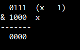
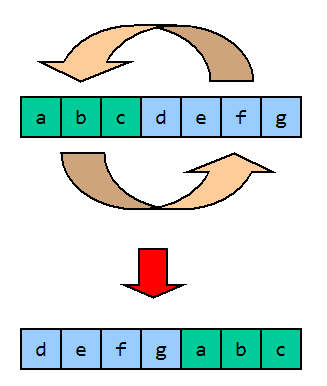

# 面試經驗談 - C 語言篇


年紀一把還要被人確認 C 語言程度實在蠻冏的，不過兩個月沒 coding，程度真的有點下降(拜某幸福企業所賜)，只好再進牛棚熱身一下

這邊揀選的題目，是這1、2個月碰到出現率偏高的題目。這些題目相信很多人都看過了，但這邊不但列出所有的解法，而且還附上大量參考資料，夠有誠意吧？

##問題 1: 無號整數裡位元 == 1 的個數

###解法 1
最基本的解法，沒什麼可以多說的，除非你對 C 語言位移運算很生疏

```c
int bitcount(unsigned int x)
{
    int count, i;
     
    for(i = 0, count = 0; i < 32; ++i)
        if((1<<i) & x)
            ++count;
         
    return count;
}
```

### 解法 2

```c
int bitcount(unsigned int x)
{
    int count;
 
    for(count = 0; x != 0; x &= x - 1)
        ++count;
 
    return count;
}
```

###解法 2 

出自 The C Abswer Book 2nd，也就是 K&R C 2nd 習題 2-9 的解答。這個解法的原理利用最右邊的 bit - 1 時產生的位元變化。首先我們知道：

x = (x - 1) + 1

這邊假設 x 是個只有 4bits 長度的無號整數，x = 1010b：


這代表 x - 1 後，最右端為 0 的位元 0 變 1，最右端為 1 的位元變成 0，則

x &= x - 1 -> x = 1010 & 1001 = 1000

可以清除 x  最右端為 1 的位元。由上面的例子得到 x &= x - 1 得到
x = 1000b，這時候再進行一次 x &= x - 1 效果會更明顯：



按照這個路數，worst case 就是 x 的位元全部等於 1 的情形，但平均起來還是快過解法 1。

###解法 3

解法 3 的思路是這樣，首先，假設我們有一個 32bits unsigned int x，x 內容以二進制表示如下：


然後我們把位元倆倆一組，也就是除以 2 分成 16 組，每一組有 2 bits，如果把這兩個 bit 相加，那就可以得到這一組 bit = 1 的個數。我們知道兩個 bit = 1，相加的極大值就是 2，這個和剛好可以放在這 2 bits 裡：


以這個思路再繼續下去，這次分成 8 組(16 / 2 = 8)，每一組有 4 bits，每一組左半部與右半部相加極大值為 4，也就是需要用 3 bits 表示，但每一組空間有 4bits，可見得綽綽有餘：


以此類推，最後 x 就會等於 x 中 bit = 1 的個數，需要的運算的次數為 log(32) = 5，說穿了這個技巧就是 divide and conquer。C 語言範例如下：

```c
int bitcount(unsigned int x)
{
    x = (x & 0x55555555) + ((x>>1) & 0x55555555);
    x = (x & 0x33333333) + ((x>>2) & 0x33333333);
    x = (x & 0x0F0F0F0F) + ((x>>4) & 0x0F0F0F0F);
    x = (x & 0x00FF00FF) + ((x>>8) & 0x00FF00FF);
    x = (x & 0x0000FFFF) + ((x>>16) & 0x0000FFFF);
    return x;
}
```

甚至還可以再進一步簡化： 


```c
int bitcount(unsigned int x)
{
    x = x - ((x>>1) & 0x55555555);
    x = (x & 0x33333333) + ((x>>2) & 0x33333333);
    x = (x + (x>>4)) & 0x0F0F0F0F;
    x = x + (x>>8);
    x = x + (x>>16);
    return (x & 0x0000003F);
}
```

Line#3 運用了下列公式的前兩項：


其餘部份則是應用了進行位移之後與原數相加會不會造成 每組發生 overflow？以 Line#5 來說，4bits 與 4bits 相加，每個 4bits 裡最大為 4，相加最大為 8，所以不會造成 overflow，可以放心進行省略。

解法 3 取自 Hacker's Delight Chapter 5，事實上筆者不建議面試時用這種解法，因為如此炫技的解法，八成會讓不少主管窮追猛打，正所謂作人張揚，木秀於林風必摧之。建議先用解法 1，如果主管追問有沒有更好的作法再慢慢秀出 2 跟 3，敵不動我不動，積蓄力量，後發制人。


##如何檢查 linked list 是否存在循環？

筆者最早是在 Expert C Programming 附錄 A 看到這個題目，有興趣的朋友請可以找這本書來看，這邊整理出一些摘要分享給大家：

###解法 1
對訪問過的每個元素做標記，直到碰到已經被標記過的元素代表存在循環。

###解法 2
把每個訪問過的元素位址存在一個陣列中，每次訪問下一個元素就檢查是否出現在這個陣列中。

###解法 3
如果面試官說沒有足夠空間放解法 2 的陣列，那訪問第 n 個元素時就往前檢查 n - 1  個元素。

旋轉一維陣列

簡單來說，就是把陣列分為 a b 兩個部份，a 與 b 交換，得到 b a：




對這一題解法有興趣的朋友可以參考 Programmng Pearls 2nd 專欄 2，大概沒有人可以解釋的比 Jon Bentley 更好了。筆者 n 年前也寫過一篇相關文章，這邊就不重複了。


