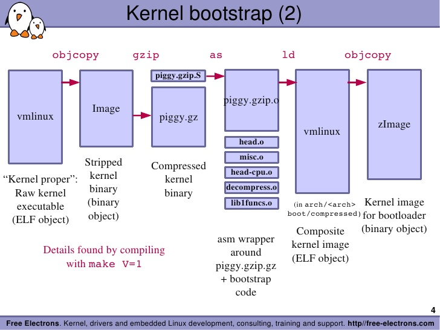
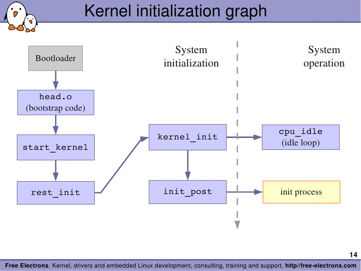

#Chapter 5 : Kernel Initialization

###### tags: `gnitnaw` `twlkh`

## 寫在前面

這章的重點在bootloader之後，也就是kernel開始接手系統後會發生的事。寫心得的同時我會儘量使用RPi kernel(v.4.4.31)驗證本書的內容。如果有興趣補充的請自便(為方便編輯，加入comment後請留下大名)。

[RPi kernel可以在此下載](https://github.com/raspberrypi/linux)

## 5.1 Composite Kernel Image: Piggy and Friend

如果從kernel編譯過程來看vmlinux是如何組成的話：

```
make ARCH=arm CROSS_COMPILE=arm-linux-gnueabihf- zImage -j4
(....)
  LD      vmlinux
  SORTEX  vmlinux
  SYSMAP  System.map
  OBJCOPY arch/arm/boot/Image
  Kernel: arch/arm/boot/Image is ready
  Kernel: arch/arm/boot/Image is ready
  LDS     arch/arm/boot/compressed/vmlinux.lds
  AS      arch/arm/boot/compressed/head.o
  GZIP    arch/arm/boot/compressed/piggy.gzip
  CC      arch/arm/boot/compressed/misc.o
  CC      arch/arm/boot/compressed/decompress.o
  CC      arch/arm/boot/compressed/string.o
  AS      arch/arm/boot/compressed/lib1funcs.o
  AS      arch/arm/boot/compressed/ashldi3.o
  AS      arch/arm/boot/compressed/bswapsdi2.o
  AS      arch/arm/boot/compressed/piggy.gzip.o
  LD      arch/arm/boot/compressed/vmlinux
  OBJCOPY arch/arm/boot/zImage
  Kernel: arch/arm/boot/zImage is ready

```
這裡列出比較重要的幾個：

| 檔案 | 功能 | RPi source |
| --- | --- | ----- |
|`vmlinux`|`vmlinux`是ELF格式binary檔案，為最原始也未壓縮的kernel鏡像。|`./vmlinux`|
|[`System.map`](https://zh.wikipedia.org/wiki/System.map)|在符號名稱與它們的記憶體位置間的查詢表格|`./System.map`|
|`Image`|`vmlinux`經過[`objcopy`](http://stackoverflow.com/questions/19944441/make-executable-binary-file-from-elf-using-gnu-objcopy)處理，把代碼從中抽出(去除註解或debugging symbols)以用於形成可執行的機器碼。不過`Image`此時還不能直接執行，需加入metadata資訊。|`./arch/arm/boot/Image`|
|`head.o`|ARM特有的code，用來接受從bootloader送來的系統控制權，source code `head.S`是用組語(arm-assembly)寫成。|`./arch/arm/boot/compressed/head.S`|
|`piggy.gzip`|被gzip壓縮的Image|`./arch/arm/boot/compressed/piggy.gzip`|
|`piggy.gzip.o`|用組語寫成，可被用來連結到別的物件，例如`piggy.gzip`。|`./arch/arm/boot/compressed/piggy.gzip.S`|
|`misc.o`|用來解壓縮。|`./arch/arm/boot/compressed/misc.c`|
|`compressed/vmlinux`|結合`System.map`等檔案並產生鏡像檔，意義跟一開始的`vmlinux`不太一樣。|`./arch/arm/boot/compressed/vmlinux`|
|`zImage`|最後產生的鏡像檔，已經被壓縮過。|`./arch/arm/boot/zImage`|



以下是我實際用RPi驗證的結果(`make ARCH=arm CROSS_COMPILE=arm-linux-gnueabihf- zImage V=1`)。

### 5.1.1 Image
vmlinux被objcopy包到Image：
- -O：告訴objcopy要生成一個binary檔。
- -R：移除ELF(vmlinux)中名稱為.comment的section。
- -S：去除debug symbols。

```
arm-linux-gnueabihf-objcopy -O binary -R .comment -S  vmlinux arch/arm/boot/Image
```

### 5.1.2 Architecture
`Image`被`gzip`壓縮成`piggy.gzip`，這是說如果`gzip`不成功就砍掉`piggy.gzip`？
```
(cat arch/arm/boot/compressed/../Image | gzip -n -f -9 > arch/arm/boot/compressed/piggy.gzip) || (rm -f arch/arm/boot/compressed/piggy.gzip ; false)
```
然後`piggy.gzip.S`被生成(**不過我看不懂這個步驟**)。

```
arm-linux-gnueabihf-gcc -Wp,-MD,arch/arm/boot/compressed/.piggy.gzip.o.d  -nostdinc -isystem /usr/lib/gcc-cross/arm-linux-gnueabihf/5/include -I./arch/arm/include -Iarch/arm/include/generated/uapi -Iarch/arm/include/generated  -Iinclude -I./arch/arm/include/uapi -Iarch/arm/include/generated/uapi -I./include/uapi -Iinclude/generated/uapi -include ./include/linux/kconfig.h -D__KERNEL__ -mlittle-endian -Iarch/arm/mach-bcm2709/include   -D__ASSEMBLY__ -mabi=aapcs-linux -mno-thumb-interwork -mfpu=vfp -funwind-tables -marm -D__LINUX_ARM_ARCH__=7 -march=armv7-a  -include asm/unified.h -msoft-float  -DCC_HAVE_ASM_GOTO        -DZIMAGE     -c -o arch/arm/boot/compressed/piggy.gzip.o arch/arm/boot/compressed/piggy.gzip.S
```
這個`piggy.gzip.S`檔案內容如下，內含剛剛提到的`piggy.gzip`。
```
        .section .piggydata,#alloc
        .globl  input_data
input_data:
        .incbin "arch/arm/boot/compressed/piggy.gzip"
        .globl  input_data_end
input_data_end:
```
`input_data`和`input_data_end`這兩個label是用來當boundary的(介於這兩個label的才是要載入的binary檔案)。大概可以知道，這個`piggy.gzip.S`的功能就是把`piggy.gzip`提供給"kernel鏡像載入前"的啟動程序(其命名piggy帶有揹負之意)。
:::warning
書中有一段我不太懂：
It is triggered by the .incbin assembler preprocessor directive, which can be viewed as the assembler's version of a #include file. In summary, the net result of this assembly language file is to contain the compressed binary kernel image as a payload within another imagethe bootstrap loader.
:::

:::info
.incbin 是把 binary file 變成程式的 data 的一種方法(assembly directive)。舉例來說用這方法你可以把一個圖檔內容變成程式的data array。在這邊的用法就是把壓縮完的 kernel 變成第二階段的 vmlinux 裡的一個 data（可透過變數 input_data 來讀取）。
:::
### 5.1.3 Bootstrap Loader
如果bootloader是前半段，那bootstrap loader就是後半段，其作用主要在於：
- 初始CPU/SoC與需要的記憶體。
- 解壓縮kernel鏡像(有壓縮的話，有些bootstrap loader還會使用checksum確認是否正確)並將其安置。
- 載入解壓縮完畢的kernel鏡像。

bootloader與bootstrap loader的不同在於：前者在電源被打開始開始啟動，並不依賴kernel；後者則處於bootloader結束與kernel介入之前的過渡期。我們可以把bootstrap loader的流程概括如下：
- 當bootloader把控制權交出，`head.o`(與相關檔案)接住了控制權，然後針對不同的處理器開始了其初始化流程(打開特殊指令或cache、關掉中斷等)。
- `misc.o`根據`piggy.gzip.S`找到並解壓縮Image。
- 其他針對特定處理器的初始流程。
- 載入Image。

### 5.1.4 Boot Message
我看了一下我的RPi的dmesg，並沒有如書中提到有decompress_kernel的相關訊息(dmesg的第1條訊息是從`start_kernel`來的，就算開了`initcall_debug`也一樣)，不過原始檔`misc.c`裏面的確有這個function
```C=1
void
decompress_kernel(unsigned long output_start, unsigned long free_mem_ptr_p,
                unsigned long free_mem_ptr_end_p,
                int arch_id)
{
        int ret;

        __stack_chk_guard_setup();

        output_data             = (unsigned char *)output_start;
        free_mem_ptr            = free_mem_ptr_p;
        free_mem_end_ptr        = free_mem_ptr_end_p;
        __machine_arch_type     = arch_id;

        arch_decomp_setup();

        putstr("Uncompressing Linux...");
        ret = do_decompress(input_data, input_data_end - input_data,
                            output_data, error);
        if (ret)
                error("decompressor returned an error");
        else
                putstr(" done, booting the kernel.\n");
}

```
:::warning
不過我覺得奇怪，bootstrap loader的過程怎麼會顯示在dmesg裡，如果bootstrap真的是介於bootloader跟kernel介入之間的過渡期的話，那它怎麼有機會管到`pr_info`那去？kernel應該還沒有機會初始關於`pr_info`的設定不是嗎？
:::
然後dmesg裏面的確有kernel version string，這行是對應到`start_kernel`中的`pr_notice("%s", linux_banner)`：
```
[    0.000000] Linux version 4.4.21-rt27 (wtchen@wtchen-Inspiron-5423) (gcc version 5.4.0 20160609 (Ubuntu/Linaro 5.4.0-6ubuntu1~16.04
.1) ) #1 PREEMPT RT Mon Sep 19 16:03:55 CEST 2016
```
這邊的`#1`是Build number，每重新compile一次就會被`./scripts/mkversion`增加1，可用`make mrproper`使之重新回到1。

但是我在原始檔的`init/main.c`裏面的start_kernel裡並沒有看到相關部份：

 // scripts/mkcompile_h

## 5.2 Initialization Flow of Control

Linux啟動流程大概是這樣：



### 5.2.1 Kernel Entry Point: head.o

當head.o從`bootstrap loader`拿到控制權，kernel是處於真實模式(real mode)，可以直接讀取physical memory。RPi的`head.o`內容可以在`./arch/arm/kernel/head.S`找到，以後可以根據此檔案研究一下低階的ARM操作。此module主要功能為：
- 確認處理器與架構。
- 新增並初始page table。
- 打開MMU。**從此時開始，kernel可以使用virtual memory**。
- 建立基本的錯誤偵測與回報。
- 控制權交給main.c裡的`start_kernel()`。以下是我在`head-common.S`(被include進`head.S`)找到的相關片段：

```c
 THUMB( ldr sp, [r3, #16]       )
    str r9, [r4]            @ Save processor ID
    str r1, [r5]            @ Save machine type
    str r2, [r6]            @ Save atags pointer
    cmp r7, #0
    strne   r0, [r7]            @ Save control register values
    b   start_kernel
ENDPROC(__mmap_switched)
```

由於真實模式可被定址的記憶體只有1MB，所以`head.o`能做的事不多，如果不是非常必要，最好不要嘗試去動這個步驟，不然容易因為`page fault`發生意想不到的問題，真的要更改的話請盡可能在MMU啟動之後進行，難度會降低很多。

### 5.2.2 ./init/main.c
`./init/main.c`的主要函式為`start_kernel()`，這個函式會呼叫setup_arch(&command_line)函式(定義在`./arch/arm/kernel/setup.c`)來設定整個架構，包括辨別CPU並將其進階功能初始化。此函式的頭兩行：

```c
void __init setup_arch(char **cmdline_p)
{
        const struct machine_desc *mdesc;

        setup_processor();
```

這個`setup_processor()`是用來確認CPU ID而且顯示其資訊。`dmesg`可看到：

```
[    0.000000] CPU: ARMv6-compatible processor [410fb767] revision 7 (ARMv7), cr=00c5387d
[    0.000000] CPU: PIPT / VIPT nonaliasing data cache, VIPT nonaliasing instruction cache
[    0.000000] Machine model: Raspberry Pi Model B Plus Rev 1.2

```

`setup_arch`最後會做一些machine-dependent的初始化，至於會怎麼做不同結構有不同作法。ARM的話它會指到`./arch/arm/mach-*`去抓該結構對應的檔案(使用第4章說的.config去設定Makefile)，MIPS的作法也類似，Power Architecture則會放在`platforms`資料夾。

## 5.3 Kernel Command-Line Processing
一樣，RPi的dmesg

```
[    0.000000] Kernel command line: dma.dmachans=0x7f35 bcm2708_fb.fbwidth=656 bcm2708_fb.fbheight=416 bcm2708.boardrev=0x10 bcm2708.serial=0x38df2486 smsc95xx.macaddr=B8:27:EB:DF:24:86 bcm2708_fb.fbswap=1 bcm2708.uart_clock=48000000 bcm2708.disk_led_gpio=47 bcm2708.disk_led_active_low=0 vc_mem.mem_base=0x1ec00000 vc_mem.mem_size=0x20000000  dwc_otg.lpm_enable=0 console=ttyAMA0,115200 console=tty1 root=/dev/mmcblk0p2 rootfstype=ext4 elevator=deadline fsck.repair=yes rootwait
```
`bootloader`把控制權交給`bootstrap loader`時會附送已經規範好的kernel命令列 (kernel command line)。如果你是用`grub`或`lilo`等多重開機程式(其實他們也是`bootloader`)，可以用鍵盤選擇作業系統，這就相當於用kernel命令列去改變boot參數。`./Documentation/kernel-parameters.txt`中有註明已經定義且可用的參數(不過需注意因為kernel更新太快Documentation的資訊會跟不上)，開發者也可自行定義參數。
:::info
在RPi，`/boot/cmdline.txt`可用來輸入kernel command line，例如：`dwc_otg.lpm_enable=0 console=serial0,115200 console=tty1 root=/dev/mmcblk0p2 rootfstype=ext4 elevator=deadline fsck.repair=yes rootwait`
:::

### 5.3.1 __setup Macro
為了要讓kernel message早點生效(這樣有問題才知道)，console initialization必須愈早做愈好。此物件為`printk.o`，原始檔在`./kernel/printk/printk.c`，其中的函式`console_setup(char *str)`便是console initialization。以下為`console_setup(char *str)`的原始碼，可以看到最後`__setup("console=", console_setup)`把`console`定義成`buf`。
```C=1
static int __init console_setup(char *str)
{
        char buf[sizeof(console_cmdline[0].name) + 4]; /* 4 for "ttyS" */
(...)
        if (str[0] >= '0' && str[0] <= '9') {
                strcpy(buf, "ttyS");
                strncpy(buf + 4, str, sizeof(buf) - 5);
        } else {
                strncpy(buf, str, sizeof(buf) - 1);
        }
        buf[sizeof(buf) - 1] = 0;
        options = strchr(str, ',');
        if (options)
                *(options++) = 0;
(...)
        for (s = buf; *s; s++)
                if (isdigit(*s) || *s == ',')
                        break;
        idx = simple_strtoul(s, NULL, 10);
        *s = 0;

        __add_preferred_console(buf, idx, options, brl_options);
        console_set_on_cmdline = 1;
        return 1;
}
__setup("console=", console_setup);
```
這個`__setup`的Macro是定義在`./include/linux/init.h`：
```c
#define __setup_param(str, unique_id, fn, early)                        \
        static const char __setup_str_##unique_id[] __initconst         \
                __aligned(1) = str;                                     \
        static struct obs_kernel_param __setup_##unique_id              \
                __used __section(.init.setup)                           \
                __attribute__((aligned((sizeof(long)))))                \
                = { __setup_str_##unique_id, fn, early }
  
#define __setup(str, fn)                                                \
        __setup_param(str, fn, fn, 0)
```
所以`__setup("console=", console_setup)`會被前置處理為`__setup_param("console=", console_setup, console_setup, 0)`，然後變成
```C=1
static const char __setup_str_console_setup[] __initconst __aligned(1) = "console=";
static struct obs_kernel_param __setup_console_setup __used __section(.init.setup) __attribute__((aligned((sizeof(long))))) = { __setup_str_console_setup, console_setup, early }
```
:::warning
我看不懂`__aligned(1)`和`__used`的作用。
:::
:::info

```
1. 編譯器通常可透過一些擴充語法來為函數或變數設置屬性。一般比較常用到的例子如變數的字節對齊(aligment)，例如希望某個變數的位址對齊 4-byte aligment。
2. 由於每個編譯器擴充語法不同，甚至不同版本關鍵字不同等。所以程式中通常會透過 macro 來定義通用規則以達到較好的可移植性。如以下語法 
   #define __used         `__attribute__ ((__used__))` 
3. 在 GCC 中可在宣告時加上 `__attribute__` 來設置屬性。如以下連結介紹
   https://goo.gl/aJstCH
4. __aligned(1) 不太確定是否有特殊涵意，通常是 2-byte 以上會特別設置。
5. 寫程式時有時候會看到編譯時會吐出 compiling warning，某些狀況可能是人為疏忽，會造成程式運行時不可預期的錯誤(有時在最佳化後才會出現問題)。嚴謹的專案會盡可能清除所有的 compiling warning。kernel 中將所有的 compiling warning 都轉換成 compiling error（GCC 提供的功能）。其中有一項 warning 是關於定義卻未被使用（`defined but not used` or `set but not used`），但在某些情況下這是我們預期的行為時，可設置 `__used` 這個屬性告知編譯器，希望保留變數不被最佳化移除，設置後也不會吐出這個 compiling warning (或是 error)了。如以下連結的討論
   http://stackoverflow.com/questions/31637626/whats-the-usecase-of-gccs-used-attribute
```


第2行去掉對齊設定就變成
```c
static struct obs_kernel_param __setup_console_setup __section(.init.setup) 
= { __setup_str_console_setup, console_setup, early }
```
所以這兩行code做的就是：
1. 編譯器創造出一個叫作`__setup_str_console_setup[]`的區域字串常數為`"console"`;
2. 編譯器創造出一個類型為`struct obs_kernel_param`的靜態變數`__setup_console_setup`，裏面含有三個元件：剛剛創的字串常數`__setup_str_console_setup[]`，一個指向setup function的函數指標(此例來說就是`console_setup`)，一個flag。
3. 在連結期間(link stage)，這兩行定義出的結構都會被塞到ELF物件的`.init.setup`部位。

以下是從`./init/main.c`摘錄出如何處理`struct obs_kernel_param`物件的函式，我以註解的方式說明我對這code的理解。

```c
// 每跑一次__setup Macro，就會多一個struct obs_kernel_param物件。這些物件形成一個陣列被放在.init.setup裡，第1個跟最後一個分別是__setup_start[]與__setup_end[]。
extern const struct obs_kernel_param __setup_start[], __setup_end[];

static int __init obsolete_checksetup(char *line) //line指要處理的字串，本例來說就是"console=tty1"
{
    const struct obs_kernel_param *p;
    int had_early_param = 0;
    //針對每個struct obs_kernel_param物件，從__setup_start[]到__setup_end[]
    p = __setup_start;
    do {
        int n = strlen(p->str);
        if (parameqn(line, p->str, n)) {    // 定義在./kernel/params.c，作為解析
            if (p->early) {            // 如果已經被main.c中的do_early_param定義過了
                /* Already done in parse_early_param?
                 * (Needs exact match on param part).
                 * Keep iterating, as we can have early
                 * params and __setups of same names 8( */
                if (line[n] == '\0' || line[n] == '=')
                    had_early_param = 1;
            } else if (!p->setup_func) {        //定義的函數指標執行後傳回的值非1
                pr_warn("Parameter %s is obsolete, ignored\n", p->str);
                return 1;
            } else if (p->setup_func(line + n)) // 字串後面還有字？不懂...
                return 1;
        }
        p++;
    } while (p < __setup_end);
    return had_early_param;
}
```
在`./include/linux/init.h`定義的有關`init`的macro有：
```C
#define __init          __section(.init.text) __cold notrace
#define __initdata      __section(.init.data)                
#define __initconst     __constsection(.init.rodata)            //只使用一次的data
```
含有這些macro的變數(`__init.data`)或函式(`__init`)作kernel做完這個module_init function過後就會釋放其佔有的資源，也就是說在boot步驟結束前就會被清除，可以從`dmesg`中看到相關訊息。
```
[    3.340251] Freeing unused kernel memory: 372K (c0803000 - c0860000)
```

:::info
`obsolete_`開頭的函式是屬於`module_param*` macro(參見`./include/linux/moduleparam.h`)，見Ch8。
:::

## 5.4 Subsystem Initialization
在`./init/main.c`中，要初始化子系統：
- 有些重要的子系統如`timer`或`console`已經被main.c預設初始化。
- 其他子系統可以用前一節說的`__setup`。
- 特殊架構的話，可以自己寫routine，範例可看`./arch/arm/kernel/setup.c`的`customize_machine(void)`。

```c
static int __init customize_machine(void)
{
    /*
     * customizes platform devices, or adds new ones
     * On DT based machines, we fall back to populating the
     * machine from the device tree, if no callback is provided,
     * otherwise we would always need an init_machine callback.
     */
    of_iommu_init();
    if (machine_desc->init_machine)
        machine_desc->init_machine();
#ifdef CONFIG_OF
    else
        of_platform_populate(NULL, of_default_bus_match_table,
                                        NULL, NULL);
#endif
    return 0;
}
arch_initcall(customize_machine);
```
### 5.4.1 __initcall

上一節說的`arch_initcall`一樣是定義在`./include/linux/init.h`：

```c
#define __define_initcall(fn, id) \
        static initcall_t __initcall_##fn##id __used \
        __attribute__((__section__(".initcall" #id ".init"))) = fn; \
        LTO_REFERENCE_INITCALL(__initcall_##fn##id)

/*
 * Early initcalls run before initializing SMP.
 *
 * Only for built-in code, not modules.
 */
#define early_initcall(fn)              __define_initcall(fn, early)

/*
 * A "pure" initcall has no dependencies on anything else, and purely
 * initializes variables that couldn't be statically initialized.
 *
 * This only exists for built-in code, not for modules.
 * Keep main.c:initcall_level_names[] in sync.
 */
#define pure_initcall(fn)               __define_initcall(fn, 0)

#define core_initcall(fn)               __define_initcall(fn, 1)
#define core_initcall_sync(fn)          __define_initcall(fn, 1s)
#define postcore_initcall(fn)           __define_initcall(fn, 2)
#define postcore_initcall_sync(fn)      __define_initcall(fn, 2s)
#define arch_initcall(fn)               __define_initcall(fn, 3)
#define arch_initcall_sync(fn)          __define_initcall(fn, 3s)
#define subsys_initcall(fn)             __define_initcall(fn, 4)
#define subsys_initcall_sync(fn)        __define_initcall(fn, 4s)
#define fs_initcall(fn)                 __define_initcall(fn, 5)
#define fs_initcall_sync(fn)            __define_initcall(fn, 5s)
#define rootfs_initcall(fn)             __define_initcall(fn, rootfs)
#define device_initcall(fn)             __define_initcall(fn, 6)
#define device_initcall_sync(fn)        __define_initcall(fn, 6s)
#define late_initcall(fn)               __define_initcall(fn, 7)
#define late_initcall_sync(fn)          __define_initcall(fn, 7s)
(...)
```
所以`arch_initcall(customize_machine)`經過首次預處理後會變成`__define_initcall(customize_machine, 3)`，再次預處理然後去掉`__section(.initcall3.init) `(這表示相關變數會放在此section)相關部份就變成：
```C
static initcall_t __initcall_customize_machine3 = customize_machine;
LTO_REFERENCE_INITCALL(__initcall_customize_machine3)
```
:::warning
書中是說會變成`static initcall_t __initcall_customize_machine = customize_machine`，跟我判斷的不太一樣耶。
:::

要注意的是`.initcallN.init`這部份，這個`N`代表初始化的順序(level)，在`__define_initcall`的程式碼中可發現，`arch_initcall`是排在`core_initcall`等後面。

不管是`__setup`還是`__initcall`，這些macro是提供一個可以初始子系統，並且在初始完成後釋放占用的記憶體的機制。
`__initcall` macro是在kernel 2.6之後才開始加入，至於之前是使用`device_initcall` macro (level=6)。

## 5.5 init Thread
`./init/main.c`中的`start_kernel`函式跑完基本的初始化程序後，函式最後就會呼叫`rest_init()`函式產生第1個thread，就是`init()`。由於它是第1個process，所以它的`PID=1`。這個process是所有`user space process`的老爸，換言之，所有的`user space process`皆是由`init()`用`fork()`分出來的。以下是`rest_init()`的內容：
```C=1
static noinline void __init_refok rest_init(void)
{
    int pid;
                                                          
    rcu_scheduler_starting(); // 啟動rcu_scheduler
    smpboot_thread_init();

    kernel_thread(kernel_init, NULL, CLONE_FS);    // 建立第1個thread!執行kernel_init
    numa_default_policy();
    pid = kernel_thread(kthreadd, NULL, CLONE_FS | CLONE_FILES);//第2個thread，kthreadd，管理調度其他kernel thread
    rcu_read_lock();
    kthreadd_task = find_task_by_pid_ns(pid, &init_pid_ns);
    rcu_read_unlock();
    complete(&kthreadd_done); //得到kthreadd的資訊，確認kthreadd執行成功並通知kernel_init thread

    init_idle_bootup_task(current); 把所在process設成idle狀態
    schedule_preempt_disabled();把所在process設成可搶佔，但不重新排程
    /* Call into cpu_idle with preempt disabled */
    cpu_startup_entry(CPUHP_ONLINE); // kernel進入idle狀態，用loop消耗時間，此函式不return，有必要隨時可被搶佔。
}

```

### 5.5.1 initcalls
`kernel_init` thread被建立了以後，此函式先呼叫的是`kernel_init_freeable()`函式，然後`kernel_init_freeable()`中間會呼叫`do_basic_setup`，`do_basic_setup`中間又會呼叫`do_initcalls()`，這個函式就是用來處理之前提到的`__initcall`的，會依序處理在不同`.initcallN.init`的參數。

### 5.5.2 initcall_debug
RPi可以在`/boot/cmdline.txt`內加入`initcall_debug=1`，把debug info.打開，重新開機後用`dmesg`就能看了。

### 5.5.3 Final Boot Steps
書中所說的這部份`init_post()`在已經被併到`kernel_init`最後面了，內容如下：
```C=1
    if (execute_command) {
        ret = run_init_process(execute_command);
        if (!ret)
            return 0;
        panic("Requested init %s failed (error %d).",        // 大家都不想看到的kernel panic
            execute_command, ret);
    }
    if (!try_to_run_init_process("/sbin/init") ||
        !try_to_run_init_process("/etc/init") ||
        !try_to_run_init_process("/bin/init") ||
        !try_to_run_init_process("/bin/sh"))
        return 0;

    panic("No working init found.  Try passing init= option to kernel. "
        "See Linux Documentation/init.txt for guidance.");
```
對照一下RPi的`ps -ef`：
```
pi@raspberrypi:~/git/RTPiDrone $ ps -ef
UID        PID  PPID  C STIME TTY          TIME CMD
root         1     0  0 17:01 ?        00:00:04 /sbin/init
root         2     0  0 17:01 ?        00:00:00 [kthreadd]
```
可以知道，`kernel_init`執行到`/sbin/init`後(link到`/lib/systemd/systemd`)就一直run沒有停下來。當系統必須做其他的事(例如某user要執行程式)時，此process(或某個子process)就會fork()出一個分身去處理，證據如下：
```
pi@raspberrypi:~/git/RTPiDrone $ pstree
systemd─┬─agetty
        ├─avahi-daemon───avahi-daemon
        ├─cron
        ├─dbus-daemon
        ├─dhcpcd
        ├─ntpd
        ├─rsyslogd─┬─{in:imklog}
        │          ├─{in:imuxsock}
        │          └─{rs:main Q:Reg}
        ├─sshd───sshd───sshd───bash───pstree
        ├─systemd───(sd-pam)
        ├─systemd-journal
        ├─systemd-logind
        ├─systemd-udevd
        ├─thd
        └─wpa_supplicant
```

## 同場加映：RPi的bootloader
[資料來源](http://raspberrypi.stackexchange.com/questions/10489/how-does-raspberry-pi-boot)
1. 當RPi一開機，ARM core為off，SDRAM還不能用，只有GPU是On。
2. GPU開始第1階段的`bootloader`(儲存在ROM裡)：讀取SD並載入第2階段的bootloader (`/boot/bootcode.bin`)到L2 cache。
3. `bootcode.bin`將SDRAM啟動並繼續第3階段的bootloader：讀取GPU firmware(`/boot/start.elf`)。
4. `start.elf`讀取`config.txt`，`cmdline.txt`和`kernel.img`(即zImage)，以啟動bootstrap Loader。

### 5.6 Summary
- ~~靠！一堆好複雜的code！終於看完了！~~
- 因為kernel超複雜，所以了解其架構很重要。

## 參考資料
- [The initcall mechanism](https://xinqiu.gitbooks.io/linux-insides-cn/content/Concepts/initcall.html)
- [預處理器(Preprocessor)](http://edisonx.pixnet.net/blog/post/42489122-%E9%A0%90%E8%99%95%E7%90%86%E5%99%A8(preprocessor))
- [The C Preprocessor](http://www.cprogramming.com/tutorial/cpreprocessor.html)
- [=5内核启动流程之(start_kernel()-rest_init()-cpu_idle() schedule() 0&1号进程)](http://wenku.baidu.com/view/f384a4d980eb6294dd886ca4.html)
- [`__init`-開機完成後釋放記憶體](http://kezeodsnx.pixnet.net/blog/post/32301845-__init%3A-%E9%96%8B%E6%A9%9F%E5%AE%8C%E6%88%90%E5%BE%8C%E9%87%8B%E6%94%BE%E8%A8%98%E6%86%B6%E9%AB%94)
- [kernel__initcalls](http://blog.techveda.org/kernel__initcalls/)
- [How Boot Loaders Work](https://lennartb.home.xs4all.nl/bootloaders/node3.html)
- [How does Raspberry Pi's boot loader work?](http://stackoverflow.com/questions/16317623/how-does-raspberry-pis-boot-loader-work)
