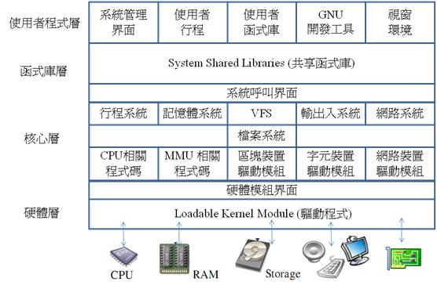

# 簡介

Linux作業系統 是Linus Torvalds於芬蘭赫爾辛基大學當學生時，希望在IBM PC 個人電腦上實作出類似UNIX系統的一個專案。在 Linux 剛發展時主要參考的對象是荷蘭阿姆斯特丹大學教授 Andrew S. Tanenbaum 的 Minix 系統，後來 Torvalds 決定利用 GNU 工具全面改寫，於是發展出一個全新的作業系統，後來該作業系統被稱為Linux。

Linux 的系統架構大致分為『硬體』、『核心』、『函式庫』、『使用者程式』等四層，
硬體層主要包含許多硬體裝置的驅動程式、核心層乃是由 Linus Torvalds 所維護的 Linux 作業系統，而函式庫層則對作業系統的功能進行封裝後，提供給使用者程式呼叫使用。

LinuxArchitecture.jpg
圖 10.12 Linux 的基本架構

當行程需要作業系統服務 (例如讀取檔案) 時，可以利用『系統呼叫』請求作業系統介入，此時處理器會由使用者模式 (User Mode) 切換到核心模式 (Kernel Mode)，核心模式具有最高的權限，可以執行任何的動作。圖 10.12中的系統呼叫界面所扮演的，正是這樣一個中介的角色。

Linux 所支援的硬體模組眾多，這些模組必須被掛載到作業系統當中，當然不可能由 Torvalds 一個人包辦寫出所有的驅動程式。所以 Linux 定訂了一整套輸出入介面規格，透過註冊機制與反向呼叫函數，讓驅動程式得以掛載到作業系統中。作業系統會在適當的時機呼叫這些驅動函數，以便取得輸出入資料。而這正是硬體模組介面的功能。這個介面可以載入 Loadable Kernel Module (大部分都是驅動程式)，以進行裝置輸出入的動作。

Linux 2.6 版的核心包含『行程』、『記憶體』、『檔案』、『輸出入』、『網路』等五大子系統。行程系統是支援行程與執行緒等功能，實作了排程、行程切換等程式。記憶體系統可利用硬體的 MMU 單元支援虛擬記憶體等機制。檔案系統的最上層稱為虛擬檔案系統 (Virtual File System: VFS) ，VFS 是一組檔案操作的抽象介面，我們可以將任何的真實檔案系統，像是 FAT32, EXT2, JFS 等，透過 VFS 掛載到 Linux 中。真實檔案系統是在檔案結構的組織下，利用區塊裝置驅動模組所建構出來的。網路系統也是透過網路裝置驅動模組與 TCP/IP 相關程式碼所堆疊出來的。而輸出入系統則統合了『區塊、字元、網路』等三類裝置，以支援檔案、網路與虛擬記憶體等子系統。

Linux 是一個注重速度與實用性的系統，因此沒有採用微核心的技術，以避免因為行程切換次數過多而減慢執行速度。目前圍繞著 Linux 作業系統已經形成了一個龐大的產業，幾乎沒有任何一家公司能主導 Linux 的發展方向，因為 Linux 是開放原始碼社群被工業化後的結果。

由於開放原始碼的影響，Linux擁有眾多的版本，像是 Red Hat、Ubuntu、Fedora、Debian 等，但是這些版本幾乎都利用 Tovarlds 所維護的核心，整合其他開放原始碼軟體後所形成的，因此雖然版本眾多卻有統一的特性。

由於 Linux 原本是以 GNU 工具所開發的，因此也被稱為 GNU/Linux。由於 GNU工具支援 IEEE 所制定的POSIX 標準，該標準對 UNIX 平台的函式庫進行了基本的統一動作，因此Linux 自然也就屬於POSIX 標準的成員之一。

雖然 Tovarlds 最早是利用 IBM PC 開發 Linux 作業系統的，但是目前Linux 已經被移值到各種平台上。因此 Linux 所支援的處理器非常眾多，包含 IA32、MIPS、ARM、Power PC 等。當您想要將 Linux 移植到新的處理器上時，必須重新編譯 Linux 核心，您可以利用 GNU 的 gcc, make 等工具編譯 Linux 核心與大部分的 Linux 程式。

Linux 並不是一個小型的作業系統，因此在啟動時通常必須透過啟動載入器載入 Linux 。在桌上型電腦中，常被使用的Linux啟動載入器有 GRUB、LILO 等。但是在高階的嵌入式系統當中，Linux 最常用的啟動程式則是U-Boot，這是因為 U-Boot 所支援的處理器非常眾多，因此成為目前最廣為使用的嵌入式啟動載入器。

在本系列的文章中，我們將分別就 Linux 中的行程、記憶體、輸出入、檔案等四大子系統，分別進行說明，以便讓讀者能更進一步的理解 Linux 作業系統。