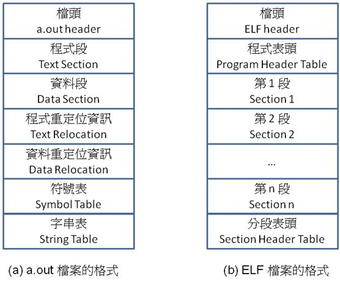
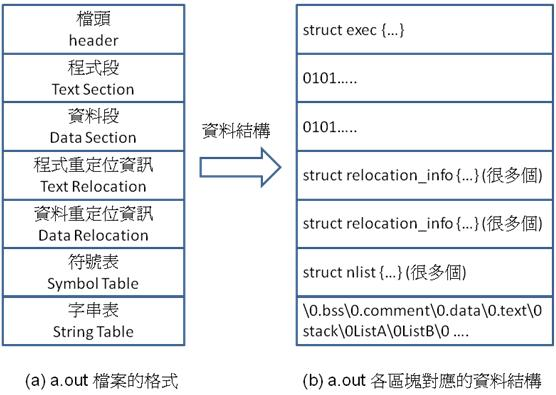
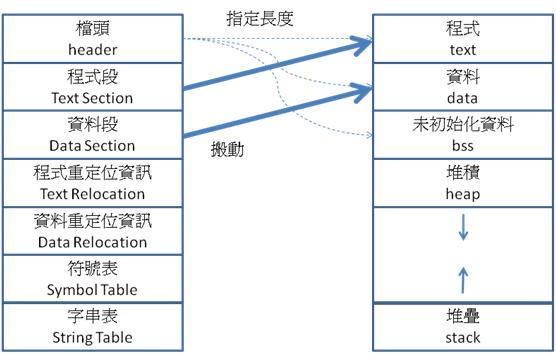
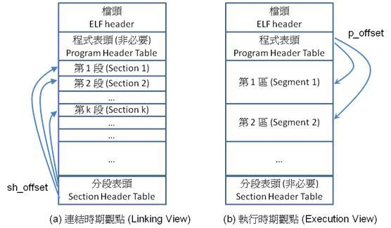
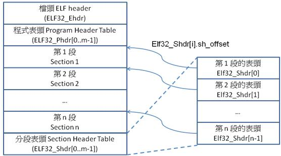
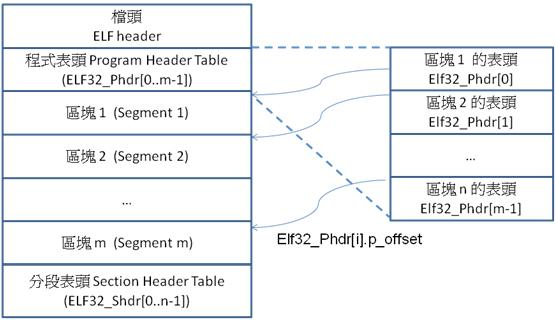
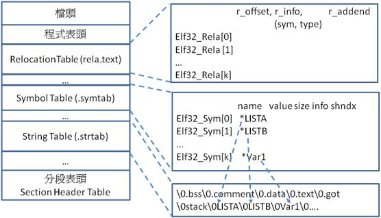

# Linux 的目的檔


為了效能的緣故，目的檔通常不會儲存為文字格式，而是儲存為二進位格式。像是 DOS 當中的 .com 檔案，Windows 當中的 .exe 檔案，與 Linux 早期的 a.out格式，還有近期的ELF格式，都是常見的目的檔格式。

為了讓讀者更清楚目的檔的格式，在本節中，我們將以Linux 早期的 a.out ，與近期的 ELF 格式，作為範例，以便詳細說明目的檔的格式。




圖 1. 兩種目的檔的格式 – a.out 與 ELF 之比較

##目的檔格式 a.out

在早期的 Linux，像是 Linux 0.12 版，採用的是較簡單的目的檔格式，稱為 a.out。這是由於 UNIX與 Linux 的預設編譯執行檔名稱為 a.out 的原因。圖 1 顯示了a.out 的檔案格式 ，並且與目前 Linux 所使用的 ELF 格式進行對比。

目的檔 a.out 的格式相當簡單，總共分為 7 的段落，包含三種主要的資料結構，也就是 1. 檔頭結構 (exec)、2. 重定位結構 (relocation_info)、3. 字串表結構 (nlist)。這三個結構的定義如下程式所示。

程式片段 1 : 目的檔 a.out 的資料結構 (以C語言定義)

```c
struct exec {                   // a.out 的檔頭結構
  unsigned long a_magic;        // 執行檔魔數
                                //   OMAGIC:0407, NMAGIC:0410,ZMAGIC:0413
  unsigned a_text;              // 程式段長度
  unsigned a_data;              // 資料段長度
  unsigned a_bss;               // 檔案中的未初始化資料區長度
  unsigned a_syms;              // 檔案中的符號表長度
  unsigned a_entry;             // 執行起始位址
  unsigned a_trsize;            // 程式重定位資訊長度
  unsigned a_drsize;            // 資料重定位資訊長度
};

struct relocation_info {        // a.out 的重定位結構
  int r_address;                // 段內需要重定位的位址
  unsigned int r_symbolnum:24;  // r_extern=1時:符號的序號值, 
                                // r_extern=0時:段內需要重定位的位址
  unsigned int r_pcrel:1;       // PC 相關旗標
  unsigned int r_length:2;      // 被重定位的欄位長度 (2 的次方) 
                                // 2^0=1,2^1=2,2^2=4,2^3=8 bytes)。
  unsigned i4nt r_extern:1;      // 外部引用旗標。    1-以外部符號重定位 
                                //                   0-以段的地址重定位。
  unsigned int r_pad:4;         // 最後補滿的 4 個位元 (沒有使用到的部分)。
};

struct nlist {                  // a.out 的符號表結構
  union {                       // 
    char *n_name;               // 字串指標，
    struct nlist *n_next;       // 或者是指向另一個符號項結構的指標，
    long n_strx;                // 或者是符號名稱在字串表中的位元組偏移值。
  } n_un;                       // 
  unsigned char n_type;         // 符號類型N_ABS/N_TEXT/N_DATA/N_BSS等。
  char n_other;                 // 通常不用
  short n_desc;                 // 保留給除錯程式用
  unsigned long n_value;        // 含有符號的值，對於代碼、資料和BSS符號，
                                // 通常是一個位址。
};
```
請讀者對照圖 1 與程式片段 1，很容易看出『檔頭部分』使用的是 exec 結構。『程式碼部分』與『資料部分』則直接存放二進位目的碼，不需定義特殊的資料結構。而在『程式碼重定位的部分』與『資料重定位的部分』，使用的是 relocation_info 的結構。最後，在『符號表』與『字串表』的部分，使用的是 nlist 的結構。圖 2 顯示了此種對照關係，讀者可以很容易的辨認各分段的資料結構。



圖 2. 目的檔 a.out 各區段所對應的資料結構

當 a.out 檔案被載入時，載入器首先會讀取檔頭部分，接著根據檔頭保留適當的大小的記憶體空間 (包含程式段、資料段、BSS段、堆疊段、堆積段等)。然後，載入器會讀取程式段與資料段的目的碼，放入對應的記憶體中。接著，利用重定位資訊修改對應的記憶體資料。最後，才把程式計數器設定為 exec.a_entry所對應的位址，開始執行該程式，圖 3 顯示了 a.out 檔被載入的過程。




圖 3. 目的檔 a.out 的載入過程

目的檔格式a.out 是一種比較簡單而直接的格式，但其缺點是檔案格式太過固定，因此無法支援較為進階的功能，像是動態連結與載入等。目前，UNIX/Linux 普遍都已改用 ELF 格式作為標準的目的檔格式，在 Linux 2.6 當中就支援了動態載入的功能。在下一節當中，我們將介紹較為先進的目的檔格式 - ELF。

##目的檔格式 – ELF

目的檔ELF 格式(Executable and Linking Format) 是 UNIX/Linux 系統中較先進的目的檔格式。這種格式是 AT&T 公司在設計第五代UNIX (UNIX System V) 時所發展出來的。因此，ELF格式的主要文件被放在規格書 -『System V Application Binary Interface』的第四章的 Object Files當中 ，該文件詳細的介紹了 UNIX System V 中二進位檔案格式的存放方式。並且在第五章的 Program Loading and Dynamic Linking 當中，說明了動態連結與載入的設計方法。

雖然該規格書當中並沒有介紹與機器結構相關的部分，但由於各家CPU廠商都會自行撰寫與處理器有關的規格書，以補充該文件的不足之處，因此，若要查看與處理器相關的部分，可以查看各個廠商的補充文件 。

ELF可用來記錄目的檔 (object file)、執行檔 (executable file)、動態連結檔 (share object)、與核心傾印 (core dump) 檔等格式，並且支援較先進的動態連結與載入等功能。因此，ELF 格式在 UNIX/Linux 的設計上具有相當關鍵性的地位。

為了支援連結與執行等兩種時期的不同用途，ELF 格式可以分為兩種不同觀點，第一種是連結時期觀點 (Linking View)，第二種是執行時期觀點 (Execution View)。圖 4 顯示了這兩種不同觀點的結構圖。在連結時期，是以分段 (Section) 為主的結構，如圖 4 (a) 所示，但在執行時期，則是以分區 (Segment) 為主的結構，如圖 4 (b) 所示。其中，一個區通常是數個分段的組合體，像是與程式有關的段落，包含程式段、程式重定位等，在執行時期會被組合為一個分區。


圖 4. 目的檔 ELF 的兩種不同觀點

因此，ELF 檔案有兩個不同用途的表頭，第一個是程式表頭 (Program Header Table)，這個表頭記載了分區資訊，因此也可稱為分區表頭 (Segment Header Table)。程式表頭是執行時期的主要結構。而第二個表頭是分段表頭 (Section Header Table)，記載了的分段資訊，是連結時期的主要結構。

程式片段 2 顯示了ELF 的檔頭結構 Elf32_Ehdr，其中的 e_phoff 指向程式表頭，而 e_shoff 指向分段表頭，透過這兩個欄位，我們可以取得兩種表頭資訊。

程式片段 2 : 目的檔 ELF 的檔頭結構 (Elf32_Ehdr)

```c
typedef struct {
  unsigned char     e_ident[EI_NIDENT];     // ELF 辨識代號區
  Elf32_Half        e_type;                 // 檔案類型代號
  Elf32_Half        e_machine;              // 機器平台代號
  Elf32_Word        e_version;              // 版本資訊
  Elf32_Addr        e_entry;                // 程式的起始位址
  Elf32_Off         e_phoff;                // 程式表頭的位址
  Elf32_Off         e_shoff;                // 分段表頭的位址
  Elf32_Word        e_flags;                // 與處理器有關的旗標值
  Elf32_Half        e_ehsize;               // ELF檔頭的長度
  Elf32_Half        e_phentsize;            // 程式表頭的記錄長度
  Elf32_Half        e_phnum;                // 程式表頭的記錄個數
  Elf32_Half        e_shentsize;            // 分段表頭的記錄長度
  Elf32_Half        e_shnum;                // 分段表頭的記錄個數
  Elf32_Half        e_shstrndx;             // 分段字串表 .shstrtab 的分段代號
} Elf32_Ehdr;
```

在連結時期，連結器會以 ELF 的分段結構為主，利用分段表頭讀出各個分段。ELF 檔可支援任意數目的分段 (當然有上限，必須可以用16 位元整數表達)。而且，每個分段可以具有不同的結構，常見的分段有程式段 (.text) , 資料段 (.data), 唯讀資料段 (.rodata) , 未設定變數段 (.bss), 字串表 (.strtab), 符號表 (.symtab)等。但是，ELF為了支援較先進的連結載入方式，還包含了許多其他類型的段落，像是動態連結相關的區段等，表格 1 顯示了 ELF 中的常見分段名稱與其用途。

表格 1. 目的檔ELF 中的常見分段列表

<table class="wiki-content-table">
<tbody><tr>
<td>分段名稱</td>
<td>說明</td>
</tr>
<tr>
<td>.text</td>
<td>程式段</td>
</tr>
<tr>
<td>.data</td>
<td></td>
</tr>
<tr>
<td>.data1</td>
<td>資料段</td>
</tr>
<tr>
<td>.bss</td>
<td>未設初值的全域變數</td>
</tr>
<tr>
<td>.rodata</td>
<td></td>
</tr>
<tr>
<td>.rodata1</td>
<td>唯讀資料段</td>
</tr>
<tr>
<td>.dynamic</td>
<td>動態連結資訊</td>
</tr>
<tr>
<td>.dynstr</td>
<td>動態連結用字串表</td>
</tr>
<tr>
<td>.dynsym</td>
<td>動態連結用符號表</td>
</tr>
<tr>
<td>.got</td>
<td>動態連結用的全域位移表 (Global Offset Table)</td>
</tr>
<tr>
<td>.plt</td>
<td>動態連結用的程序連結表 (Porcedure Linkage Table)</td>
</tr>
<tr>
<td>.interp</td>
<td>記錄程式解譯器的路徑 (program interpreter file)</td>
</tr>
<tr>
<td>.ctors</td>
<td>物件導向中的建構函數 (constructor) (C++可用)</td>
</tr>
<tr>
<td>.dtors</td>
<td>物件導向中的解構函數 (destructor) (C++可用)</td>
</tr>
<tr>
<td>.hash</td>
<td>雜湊表</td>
</tr>
<tr>
<td>.init</td>
<td>在主程式執行前會執行此段落</td>
</tr>
<tr>
<td>.fini</td>
<td>在主程式執行後會執行此段落</td>
</tr>
<tr>
<td>.rel&lt;name&gt;</td>
<td></td>
</tr>
<tr>
<td>.rela&lt;name&gt;</td>
<td>重定位資訊，例如： rel.text 是程式段的重定位資訊，rel.data 則是資料段的重定位資訊。</td>
</tr>
<tr>
<td>.shstrtab</td>
<td>儲存分段 (Section) 名稱</td>
</tr>
<tr>
<td>.strtab</td>
<td>字串表</td>
</tr>
<tr>
<td>.symtab</td>
<td>符號表</td>
</tr>
<tr>
<td>.debug</td>
<td>除錯資訊 (保留給未來用)</td>
</tr>
<tr>
<td>.line</td>
<td>除錯時的行號資訊</td>
</tr>
<tr>
<td>.comment</td>
<td>版本控制訊息</td>
</tr>
<tr>
<td>.note</td>
<td>附註資訊</td>
</tr>
</tbody></table>

由於 ELF 的分段眾多，我們將不詳細介紹每的段落的資料結構，只針對較重要或常見的資料結構進行說明。圖 5 顯示了ELF 檔案的分段與對應的資料結構，其中，檔頭結構是 Elf32_Ehdr、程式表頭結構是 Elf32_Phdr、分段表頭結構是 Elf32_Shdr。而在分段中，符號記錄 (Elf32_Sym) 、重定位記錄 (Elf32_Rel、Elf32_Rela)、與動態連結記錄 (Elf32_Dyn)，是較重要的結構。



圖 5. 目的檔ELF的資料結構

分段表頭記錄了各分段 (Section) 的基本資訊，包含分段起始位址等，因此可以透過分段表頭讀取各分段，圖 6 顯示了如何透過分段表頭讀取分段的方法。程式片段 3 則顯示了分段表頭的結構定義程式。




圖 6. 目的檔ELF的分段表頭

程式片段 3 : ELF 的分段表頭記錄


```c
typedef struct {
  Elf32_Word    sh_name;                    // 分段名稱代號
  Elf32_Word    sh_type;                    // 分段類型
  Elf32_Word    sh_flags;                   // 分段旗標
  Elf32_Addr    sh_addr;                    // 分段位址 (在記憶體中的位址)
  Elf32_Off     sh_offset;                  // 分段位移 (在目的檔中的位址)
  Elf32_Word    sh_size;                    // 分段大小
  Elf32_Word    sh_link;                    // 連結指標 (依據分段類型而定)
  Elf32_Word    sh_info;                    // 分段資訊
  Elf32_Word    sh_addralign;               // 對齊資訊
  Elf32_Word    sh_entsize;                 // 分段中的結構大小 (分段包含子結構時使用)
} Elf32_Shdr;
```

程式表頭指向各個分區 (Segment) ，包含分區的起始位址，因此可以透過程式表頭取得各分區的詳細內容，
圖 7 顯示了如何透過程式表頭取得各分區的方法。 程式片段 4 則顯示了程式表頭的結構定義程式。





圖 7. 目的檔ELF的程式表頭

程式片段 4. 目的檔 ELF 的程式表頭結構

```c
typedef struct {                   
   Elf32_Word p_type;             // 分區類型
   Elf32_Off p_offset;            // 分區位址 (在目的檔中)
   Elf32_Addr p_vaddr;            // 分區的虛擬記憶體位址
   Elf32_Addr p_paddr;            // 分區的實體記憶體位址
   Elf32_Word p_filesz;           // 分區在檔案中的大小
   Elf32_Word p_memsz;            // 分區在記憶體中的大小
   Elf32_Word p_flags;            // 分區旗標
   Elf32_Word p_align;            // 分區的對齊資訊
} Elf32_Phdr;
```

在靜態連結的情況之下，ELF的連結器同樣會合併 .text, .data, .bss 等段落，也會利用修改記錄 Elf32_Rel 與 Elf32_Rela，進行合併後的修正動作。而且，不同類型的分段會被組合成分區，像是.text, .rodata, .hash, .dynsym, .dynstr, .plt, .rel.got 等分段會被併入到內文區 (Text Segment) 當中。而 .data, .dynamic, .got, .bss 等分段則會被併入到資料區 (Data Segemnt) 當中。

Elf32_Sym 儲存了符號記錄，包含名稱 (st_name)、值 (st_value)、大小 (st_size)、資訊 (st_info)、其他 (st_other)、分段代號 (st_shndx) 等，其中 st_info 欄位又可細分為兩個子欄位，前四個位元是 bind 欄，用來記錄符號的屬性，後四個位元是 type欄，用來記錄符號的類型。

程式片段 5. 目的檔ELF的符號記錄

```c
typedef struct
{
    Elf32_Word    st_name;                          // 符號名稱的代號
    Elf32_Addr    st_value;                         // 符號的值，通常是位址
    Elf32_Word    st_size;                          // 符號的大小，以 byte為單位
    unsigned char st_info;                          // 細分為bind與type兩欄位
    unsigned char st_other;                         // 目前為 0，保留未來使用
    Elf32_Half    st_shndx;                         // 符號所在的分段 (Section) 代號
} Elf32_Sym;                                        

#define ELF32_ST_BIND(i) ((i) >> 4)                 // 取出 st_info 中的bind欄位
#define ELF32_ST_TYPE(i) ((i)&0xf)                  // 取出 st_info 中的type欄位
#define ELF32_ST_INFO(b,t) (((b)<<4)+((t)&0xf))     // 將 bind 與 type 組成 info
```

Elf32_Rel 與 Elf32_Rela 是 ELF 檔的兩種重定位記錄，兩者均包含位址欄 (r_offset) 與資訊欄 (r_info)，其中資訊欄又可分為兩個子欄位，前面的 byte 是符號代號，後面的 byte 記錄符號類型。另外，在 Elf32_Rela 中，多了一個外加的數值欄位 (r_addend)，可用來儲存重定位的位移值。

程式片段 6. 目的檔ELF的重定位記錄


```c
typedef struct
{
    Elf32_Addr    r_offset;                         // 符號的位址
    Elf32_Word    r_info;                           // r_info可分為sym與type兩欄
} Elf32_Rel;                                         

typedef struct                                       
{                                                    
    Elf32_Addr    r_offset;                         // 符號的位址
    Elf32_Word    r_info;                           // r_info可分為sym與type兩欄
    Elf32_Sword r_addend;                           // 外加的數值
} Elf32_Rela;                                                                          

#define ELF32_R_SYM(i) ((i)>>8)
#define ELF32_R_TYPE(i) ((unsigned char) (i))
#define ELF32_R_INFO(s,t) (((s)<<8) + (unsigned char) (t))
```

重定位記錄 Elf32_rel 的 r_info 欄中的 sym 子欄位，會儲存符號表的索引值，因此，程式可以透過 sym 子欄位取得符號記錄。然後，在符號記錄 Elf32_Sym 中的 st_name 欄位，會儲存字串表中的索引值，因此，可以透過 st_name 取得符號的名稱。透過 sym 與 st_name 欄位，可將重定位表、符號表與字串表關連起來，圖 8 顯示了這三個表格的關連狀況圖。





圖 8. 目的檔ELF中的重定位表、符號表與字串表的關連性

雖然分段結構主要式為了連結時使用的，但是，如果不考慮動態連結的情況，載入器也可以利用分段結構直接進行載入。只要載入 .text, .data, .data2, .bss等區段，然後利用 .rel.text, .rel.data, .rel.data2, .rela.text, .rela.data, .rela.data2 等分段進行修改的動作，就能載入 ELF目的檔了。

但是，為了支援動態連結與載入 的技術，ELF 當中多了許多相關的分段，包含解譯段 (.interp)、動態連結段 (.dynamic)、全域位移表 (Global Offset Table : .got)、程序連結表 (Porcedure Linkage Table : .plt) 等，另外還有動態連結專用的字串表 (.dynstr) 、符號表 (.dynsym)、映射表 (.hash)、全域修改記錄 (rel.got) 等作為輔助。

執行ELF載入動作時，使用的是以區塊為主的執行時期觀點，常見的區塊包含程式表頭 (PHDR)、解譯區塊 (INTERP)、載入區塊(LOAD)、動態區塊 (DYNAMIC)、註解區塊 (NOTE)、共用函式庫區塊 (SHLIB) 等。其中，載入區塊通常有兩個以上，如此才能容納程式區塊 (TEXT) 與資料區塊 (DATA) 等不同屬性的區域。

表格 2 目的檔ELF 的常見區塊列表

<table class="wiki-content-table">
<tbody><tr>
<td>Segment (區塊型態)</td>
<td>Sections (分段)</td>
<td>說明</td>
</tr>
<tr>
<td>PT_PHDR</td>
<td>Program Header</td>
<td>表頭段，用來計算基底位址 (base address)</td>
</tr>
<tr>
<td>PT_INTERP</td>
<td>.interp</td>
<td>動態載入區段。</td>
</tr>
<tr>
<td>PT_LOAD</td>
<td>.interp .note .hash .dynsym .dynstr .rel.dyn .rel.plt .init .plt .text .fini .rodata …</td>
<td>載入器將此區塊載入程式段。</td>
</tr>
<tr>
<td>PT_LOAD</td>
<td>.data .dynamic .ctors .dtors .jcr .got .bss</td>
<td>載入器將此區塊載入資料段。</td>
</tr>
<tr>
<td>PT_DYNAMIC</td>
<td>.dynamic</td>
<td>由動態載入器處理</td>
</tr>
</tbody></table>

在 Linux 當中，一般目的檔的附檔名是 .o (Object File)，而動態連結函式庫的附檔名是 .so (Shared Object)。當程式被編譯為 .so 檔時，ELF目的檔中才會有INTERP 區塊，這個區塊中記錄了動態載入器的相關資訊，ELF載入器可透過這些資訊找到動態載入器 (ELF 文件中稱為Program Interpreter，但若稱為 Dynamic Loader 或許更恰當)。然後，當目的檔載入完成後，就可以開始執行，一但需要使用到動態函數時，才能利用動態載入器將動態函式庫載入。

通常，載入的動作是由作業系統的核心 (Kernel) 所負責的，載入器是作業系統的一部分。例如，Linux 作業系統的核心就會負責載入 ELF 格式的檔案，ELF 檔案的載入過程大致如下所示：

1. Kernel 將 ELF 檔案中的所有 PT_LOAD 型態的區塊載入到記憶體，這些區塊包含程式區塊與資料區塊。
2. Kernel 將載入的區塊映射到該行程的虛擬位址空間中 (例如使用 linux 的 mmap 系統呼叫)。
3. Kernel 找到 PT_INTERP 型態的區塊，並根據區塊內的資訊找到動態連結器 (Dynamic Linker ) 的ELF檔 。
4. Kernel 將動態連結器載入到記憶體，並將其映射到該行程的虛擬位址空間中，然後啟動『動態連結器』。
5. 目的程式開始執行，在呼叫動態函數時，『動態連結器』根據需要，決定出正確的連結順序，然後對該程式與動態函數進行重定位的動作，再將控制權轉移到動態函數中。

ELF 檔案的載入過程，會因 CPU 的結構不同而有差異，因此，在 ELF 文件中這些與 CPU 有關的主題都被分離出來，由各家 CPU 廠商自行撰寫。舉例而言，動態函數的呼叫就是一個與 CPU 有關的主題，不同的 CPU實作方法會有所不同。

程式片段 7. IA32 處理器中的靜態函數呼叫與動態函數呼叫方式


```c
C語言程式                    靜態函數呼叫            動態函數呼叫
extern int var;              pushl var               movl var@GOT(%ebx)
extern int func(int);        call func               pushl (%eax)
                                                     call func@PLT
int call_func(void) {                                                      
  return func(var);                               
}
```

程式片段 8. IA32 處理器中的動態連結函數區 (Stub) 的程式


```c
.PLT0:  pushl 4(%ebx)
        Jmp *8(%ebx)
        nop
        nop
.PLT1:  jmp *name1@GOT(%ebx)
        pushl $offset1
        jmp .PLT0@PC
.PLT2   jmp *name2@GOT(%ebx)
        pushl $offset2
        jmp .PLT0@PC
```

程式片段 9 顯示了 ELF目的檔的動態連結記錄 Elf32_Dyn，這些記錄會被儲存在一個名為 _DYNAMIC[] 的陣列中，以便讓動態連結器使用。

程式片段 9. 目的檔ELF的動態連結 (重定位) 記錄

```c
typedef struct {                
    Elf32_Sword    d_tag;          // 標記
    union {                     
        Elf32_Word    d_val;       // 值 (用途很多樣)
        Elf32_Addr    d_ptr;       // 指標 (程式的虛擬位址)
    } d_un;                     
} Elf32_Dyn;                    

extern Elf32_Dyn _DYNAMIC[];       // 動態連結陣列
```

有關 ELF 目的檔的進一步資訊，有興趣的讀者可以參考規格書 System V Application Binary Interface 中的第四章與第五章 。

##說明與參考文獻

<ol>
<li>讀者可於下列網址下載到System V 的二進位應用介面規格書『System V Application Binary Interface』, <a href="http://www.caldera.com/developers/devspecs/gabi41.pdf">http://www.caldera.com/developers/devspecs/gabi41.pdf</a> ，其中的第四章 (Chapter 4) Object Files 即是 ELF 檔案格式的規格書。</li>
<li>在維基百科的 ELF 主題中，列有 ELF 的詳細相關資訊，包含 System V 的規格書與各家處理器廠商的補充文件，讀者可參閱<a href="http://en.wikipedia.org/wiki/Executable_and_Linkable_Format">http://en.wikipedia.org/wiki/Executable_and_Linkable_Format</a>，其中 IA32 處理器的補充文件位於<a href="http://www.caldera.com/developers/devspecs/abi386-4.pdf">http://www.caldera.com/developers/devspecs/abi386-4.pdf</a>，而 ARM 的補充文件位於<a href="http://infocenter.arm.com/help/topic/com.arm.doc.ihi0044b/IHI0044B_aaelf.pdf">http://infocenter.arm.com/help/topic/com.arm.doc.ihi0044b/IHI0044B_aaelf.pdf</a></li>
<li>有關 Linux 的動態連結技術可以參考 Ulrich Drepper , How To Write Shared Libraries, Red Hat, Inc., August 20, 2006, 其網址為<a href="http://people.redhat.com/drepper/dsohowto.pdf">http://people.redhat.com/drepper/dsohowto.pdf</a>。</li>
<li>Jollen’s Blog, Program Loading 觀念介紹, last update 2007/03/13, <a href="http://www.jollen.org/EmbeddedLinux/Program_Loading.html">http://www.jollen.org/EmbeddedLinux/Program_Loading.html</a></li>
<li>動態連結器的英文名稱為Dynamic Linker，但在 ELF 文件中被稱為 Program Interpreter。</li>
<li>動態連結器 (Dynamic Linker ) 的ELF檔，在Linux 中通常被儲存的檔名為ld.so。</li>
<li>a.out 執行文件格式 — <a href="http://www.cnscn.org/htm_data/56/0903/21669.html">http://www.cnscn.org/htm_data/56/0903/21669.html</a></li>
</ol>