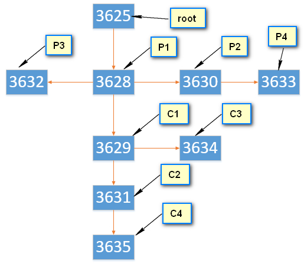

# Linux下fork函数及pthread函数的总结


##fork
Linux多进程编程中的可以使用fork函数来创建子进程。`fork函数定义在头文件unistd.h中（uni表示unix，std当然是标准库，所以很好记），该函数的声明为pid_t fork(void)其中函数的返回值类型为pid_t，`可以理解为一个整型，返回值具体为：

- 在父进程中，fork返回新创建的子进程的进程ID；
- 在子进程中，fork返回0；
- 如果创建子进程失败，则返回一个负值

具体创建的子进程与父进程的关系，很显示fork函数不能接受任何参数，它只简单地将父进程的几乎所有资源全部复制给子进程，然后就相当于父进程的一个副本运行，且无法与父进行共享数据。
具体 来说使用fork函数得到的子进程从父进程继承了整个进程的地址空间，包括：进程上下文、进程堆栈、内存信息、打开的文件描述符、信号控制设置、进程优先级、进程组号、当前工作目录、根目录、资源限制、控制终端等。

## 子进程与父进程的区别在于：

- 父进程设置的锁，子进程不继承（因为如果是排它锁，被继承的话，矛盾了）
- 各自的进程ID和父进程ID不同
- 子进程的未决告警被清除；
- 子进程的未决信号集设置为空集。


当然linux下的头文件sched.h中有一个fork升级版本的进程创建函数clone。clone是fork的升级版本，不仅可以创建进程或者线程，还可以指定创建新的命名空间（namespace）、有选择的继承父进程的内存、甚至可以将创建出来的进程变成父进程的兄弟进程等。clone() 函数则可以将部分父进程的资源通过参数设定有选择地复制给子进程，没有复制的资源可以通过指针共享给子进程

下面主要分析fork函数创建进程数及运行情况
获取进程ID的相关函数有：

- getppid()返回当前进程的父进程ID
- getpid()返回当前进程ID

`这两个函数都在头文件unistd.h中，不接受参数，返回值类型为pid_t`
网上关于fork函数创建多少个子进程的分析有很多，这里说一个简单分析方法，其实fork就是为父进程创建子进程，也就是说一个进程，执行fork之后就会变成2个进程，仅此而已。当执行多次fork函数时与二叉树很像，从根结点往叶子节点，每次一个变2个，可以很好地用二叉树来分析创建的子进程树，以及涉及到循环时，循环执行的次数。首先说一下结论：假定根结点为二叉树的第0层（为了方便后面分析），每执行一次fork，就增加一层，如果使用循环执行n个fork，则共有n层，相应满二叉树的叶子结点数2^n即为总共创建的子进程数（根为第0层），满二叉树除了根结点之外的总结点数2^(n+1)-2就是循环执行的总次数。也就是说 `执行n次fork函数，创建的子进程数为2^n个，用循环创建的fork时，循环执行的总次数为2^(n+1)-2次`
下面使用几个实例分析根据fork的原理和二叉树方法（其实也是根据原理）来分析：


## fork()用法

```cpp
#include <iostream>
#include <unistd.h>
int main(void)
{
    pid_t fpid; //创建一个临时变量用于存放fork的返回值
    int count = 0;
    fpid = fork();  //创建子进程，父进程与子进程将分别执行此后的代码

    if (fpid < 0) { //创建子进程失败时将返回负值
        std::cout << "Error in fork!" << std::endl;
    } else if (fpid ==
               0) { //子进程中fork的返回值为0，所以将由子进程执行该分支
        std::cout << "Child: parent_pid:" << getppid() << " pid:" << getpid() <<
                  " child_pid:" << fpid << std::endl;
        count++;  //子进程复制来的count值为0，++之后将为1
    } else { //父进程中fork的返回值为子进程的pid，所以将由父进程执行该分支
        std::cout << "Parent: parent_pid:" << getppid() << " pid:" << getpid() <<
                  " child_pid:" << fpid << std::endl;
        count++;  //父进程中count为0，父子进程中的变量等数据是完全独立的
    }

    std::cout << "count: " << count <<
              std::endl;  //最后输出count的当前值，显示该句父子进程都要执行
    return 0;
}
```

## 输出结果为：

```sh
Parent: parent_pid:3084 pid:3087 child_pid:3088
count: 1
Child: parent_pid:3087 pid:3088 child_pid:0
count: 1
```

可以看到父进程的中创建的子进程的pid:3088刚好是子进程当前的pid，两个进程输出的count都是1，也就是只进行了一次累加
套用上面关于二叉树方法分析的情况，执行一次fork，即2^1=2两个进程

##通过循环执行多个fork-1
不看输出的话考虑输出结果是什么，会输出多少次

```c
#include <iostream>
#include <unistd.h>
int main(void)
{
    int count = 0;

    for (int i = 1; i < 4; ++i) {  //通过for循环执行3次fork
        fork();
    }

    std::cout << ++count << std::endl;
    return 0;
}
```

输出结果为：

```sh
1
1
1
1
1
1
1
1
```

执行第一个fork时，由原来的1个进程变成2个进程，第二次fork时，由2个变成4个，第三次fork时，由4个变成8个。所以最终共有8个进程。

二叉树法分析：

一共8个1，for循环中执行了3次fork，共创建了2^3=8个子进程，所以共有8个1输出。如下二叉树图中叶子结点所示：


红色结点（即叶子结点）为创建的所有子进程

如图中标识，C1、P2、P3都是P1的子进程，只是它们创建于p1的不同时期，同样P4是P2的子进程，从C1创建的子进程有C2，C3。其中来自不同颜色的箭头表示不同的关系，箭头表示父进程->子进程，相同颜色的线表示来自同一个进程。

可以通过以下代码来验证：


```c
#include <iostream>
#include <unistd.h>
int main(void)
{
    int count = 0;

    for (int i = 1; i < 4; ++i) {
        fork();
    }

    //分别输出各进程的父进程PID:当前进程PID:子进程PID
    std::cout << getppid() << " : " << getpid() << " : " << fpid << std::endl;
    return 0;
}
```

某一次的执行结果为（每次执行的结果都不一样，因为进程号肯定不同，当然有可能会出现进程号为1的情况，由于当获取父进程时，如果父进程此时已经执行完成并退出，那么系统中就不存在此进程，此时就返回其进程号为1）：

```sh
3628 : 3630 : 3633
3630 : 3633 : 0
3629 : 3634 : 0
3628 : 3629 : 3634
3625 : 3628 : 3632
3628 : 3632 : 0
3629 : 3631 : 3635
3631 : 3635 : 0
```

可以根据类似链表的关系画出如下图：



再根据上图的分析，很容易推断出各进程的ID在二叉树图上的对应关系

## 通过循环执行多个fork-2

注意下面的代码与上面fork-1中的唯一区别是将输出放在了for循环里面
不看输出的话考虑输出结果是什么，会输出多少次

```cpp
#include <iostream>
#include <unistd.h>

int main(void)
{
    int count = 0;

    for (int i = 1; i < 4; ++i) {  //通过for循环执行3次fork
        fork();
        std::cout << ++count << std::endl;
    }

    return 0;
}
```

输出结果为：


```sh
1
1
2
2
2
2
3
3
3
3
3
3
3
3
```


创建的子进程数分析与fork-1中一样，都是8个子进程。关于for循环中的输出执行次数，当i=1时，执行一次fork，创建2个子进程，记为p1, c1（px表示父进程，cx表示子进程），进程p1,c1将分别从i=1执行到i=3，在for循环内部共执行23=6次，即这两个子进程会分别输出1，2，3各一次。由于这两个进程在执行for循环时还会继续创建进程，所以它们的2个1会首先输出在前面。当i=2时，执行第二次fork，之前的2个进程p1, c1将分别再创建一个进程，记为p2、c2（假设p2来自p1,c2来自c1），p2、c2将从i=2开始执行到i=3，这两个进程for循环内部共执行22=4次。当前执行到i=2时共有4个进程，分别为p1、c1、p2、c2，它们会分别输出一次2，共输出4个2。当i=3时，当前的4个进程将再分别创建一个进程，共创建4个进程，新创建的4个进程将各自执行一次for循环内部，for循环即结束了，共执行4次for循环内部。此时共有8个进程，每个进程都会输出一次3，共8个3。再综合各个进程中for循环执行的次数，可知6+4+4=14次，所以共有14个输出。


二叉树分析如下图所示：


从上图可以看出i的取值为1，2，3阶段，各阶段执行的进程数分别为2，4，8，虽然一共只有8个进程，但for循环各阶段的进程都会进行一次输出，所以共输出14次，即为二叉树除根节点的结点总数2^4-2=14。

##fork()||fork()进程数
分析如下代码创建的进程数：

```c
#include <iostream>
#include <unistd.h>

int main(void)
{
    int count = 0;
    fork() || fork();
    std::cout << count << std::endl;
    return 0;
}
```

输出结果为：

```sh
1
1
1
```

由于fork函数在不同进程中的返回值不同，在子进程中返回为0，所以第一个fork执行完之后会有两个进程，父进程中fork返回值为真，||后面的代码不会执行，直接返回。子进程中fork()返回值为0，需要继续执行后面一个fork，再次为子进程创建一个子进程，所以共有3个子进程。
画二叉树分析：


图中叶子节点数即为进程数。

##fork()&&fork()||fork()
分析以下代码创建的进程数：


```c
#include <iostream>
#include <unistd.h>

int main(void)
{
    int count = 0;
    (fork() && fork()) || fork();
    std::cout << count << std::endl;
    return 0;
}
```

输出结果为：

```sh
1
1
1
1
1
```

首先第一个fork执行完之后为父进程（记为p1）创建一个子进程，记为c1，由于子进程fork返回值为0，所以子进程中第一个括号&&后面的表达式不需要再执行。父进程p1需要继续执行第二个fork，再次创建一个子进程p2，父进程p1的fork返回为真，||后面的不需要再执行。第二个子进程p2需要继续执行第三个fork，再次为第二子进程创建一个子进程p3，同样由于c1进程fork返回值为0，所以也还需要执行第三个fork，为其创建一个子进程c2，所以一共会创建5个进程。

画二叉树分析，如下图：


对于以下代码创建的进程数为多少？

```c
#include <iostream>
#include <unistd.h>

int main(void)
{
    int count = 0;
    fork();  //执行完后将有2个进程
    (fork() && fork()) || fork();  //根据上面分析，这部分会创建5个进程，执行完成会有2*5=10个进程
    fork();  //执行完这句进程数会再次翻倍
    std::cout << count << std::endl;
    return 0;
}
```

结果为252=20，自行分析，这类问题只需要分步分析即可，如果涉及到一些输出的情况，最好画图看看

##循环fork，不刷新输出缓冲区的情况
考虑以下程序会输出多少个*：


```c
#include <iostream>
#include <unistd.h>

int main(void)
{
    int i;
    for (i = 0; i < 3; i++) { 
        fork(); 
        std::cout << "*"; 
    } 
    return 0; 
}
```

输出结果为：

```sh
************************
```

按照通常的的想法，比如我们之前的公式，应该输出2^4-2=14个，实际上输出结果去是38=24个。

因为std::cout后面没有输出\n或者std::endl，也就是说在输出时没有刷新输出缓冲区，会导致父进程中的输出缓冲区内容依然是上次的内容，子进程在复制时同样会复制输出缓冲区中的内容，导致子进程输出缓冲区的内容实际上与父进程是一样的。由于第一个父进程的for循环会执行3次，输出缓冲区中会有3个，虽然有的子进程的循环只能执行2次或1次，但输出缓冲区中的内容并没有少，所以同样最终也都会输出3个。

一共有8个进程，所以共有38=24个*输出。

##fork与虚拟地址空间
思考下面这段程序的输出中父进程与子进程中的num及num地址是否相同：

```c
#include <iostream>
#include <unistd.h>
int main()
{
    int pid;
    int num = 1;
    pid = fork();

    if (pid > 0) {
        num++;
        std::cout << "in parent:num:" << num << " addr:" << &num << std::endl;

    } else if (pid == 0) {
        std::cout << "in child:num:" << num << " addr:" << &num << std::endl;
    }

    return 0;
}
```

输出结果为：

```sh
in parent:num:2 addr:0x7fffed819768
in child:num:1  addr:0x7fffed819768
```

竟然num的地址为父进程与子进程中是一样的，但num的值却是不同的，之所以会出现这种情况是因为linu的虚拟地址空间策略下，所有进程都以为自己独享整个地址空间，所以每个进程都可以有0x01地址空间，但其实际映射到的真实地址空间并不相同。就像本文刚开始时说的一样，fork在复制时会继承父进程的整个地址空间，所以num的输出地址是一样的。


## pthread

最后说一下Linux下的pthread函数，该函数属于POSIX线程（POSIX threads）标准，该标准定义了一套用于线程的API，pthread函数包含在头文件pthread.h中。


## 线程 VS 进程

线程也称为轻量级的进程（lightweight process, LWP），在支持线程的系统中，线程是CPU调度和分派的基本单元；传统操作系统中CPU高度和分派的基本单位是进程，传统上的进程（相当于只含有一个线程的进程）也被称为重量级进程（heavyweight process, HWP）。

当一个进程包含多个线程时，相当于将进程的任务划分成多个子任务，由线程同时执行多个任何。

进程中引入线程后，线程即作为CPU调度和分派的基本单位，而进程则作为资源拥有的基本单位，同一进程中的线程切换不会引起进程切换，可以避免昂贵的系统调用。

因为进程之间可以并发执行，而同一进程中的线程之间也可以并发执行，所以线程提高了操作系统的并发性，能更有效的使用系统资源和提高系统的吞吐量。

线程拥有自己独立的栈、调度优先级和策略、信号屏蔽字（创建时继承）、errno变量以及线程私有数据，这些资源相对于进程占用的资源来说很少。进程的其他地址空间（包含进程的代码段、数据段以及其他系统资源，如已打开的文件、IO设备等）均被所有线程所共享，因此线程可以访问进程的全局变量和堆中分配的数据，并通过同步机制保证对数据访问的一致性。这样多线程相对于进程可以降低系统开销。


##pthread线程操作相关的函数或类型
- pthread_t 是pthread的线程ID
- pthread_create()用于创建新的线程
- pthread_equal()用于比较两个线程id是否相等
- pthread_self() 用于获取当前线程的id
- pthread_exit() 线程调用该函数主动退出线程
- pthread_join() 用于线程同步，以阻塞的方式等待指定线程结束

##参考：

- http://blog.csdn.net/jason314/article/details/5640969
- man fork
- man pthreads
- 其他网络搜索


