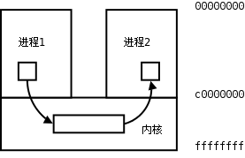
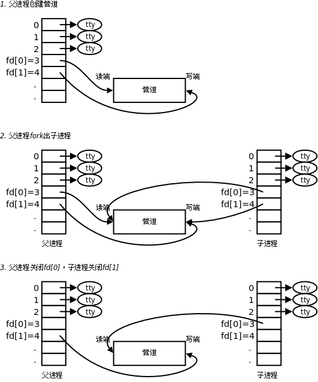

# PIPE


每個進程各自有不同的用戶地址空間，任何一個進程的全局變量在另一個進程中都看不到，所以進程之間要交換數據必須通過`內核`，在內核中開闢一塊緩衝區，進程1把數據從用戶空間拷到內核緩衝區，進程2再從內核緩衝區把數據讀走，內核提供的這種機制稱為進程間通信（IPC，InterProcess Communication）。如下圖所示。





##管道

管道是一種最基本的IPC機制，由pipe函數創建：


```c
#include <unistd.h>

int pipe(int filedes[2]);
```
調用pipe函數時在`內核中開闢一塊緩衝區`（稱為管道）用於通信，它有一個讀端一個寫端，然後通過filedes參數傳出給用戶程序兩個文件描述符，filedes[0]指向管道的讀端，filedes[1]指向管道的寫端（很好記，就像0是標準輸入1是標準輸出一樣）。所以管道在用戶程序看起來就像一個打開的文件，通過read(filedes[0]);或者write(filedes[1]);向這個文件讀寫數據其實是在讀寫內核緩衝區。pipe函數調用成功返回0，調用失敗返回-1。

開闢了管道之後如何實現兩個進程間的通信呢？比如可以按下面的步驟通信。




- 父進程調用pipe開闢管道，得到兩個文件描述符指向管道的兩端。

- 父進程調用`fork創建子進程`，那麼`子進程也有兩個文件描述符指向同一管道`。

- 父進程關閉管道讀端，子進程關閉管道寫端。父進程可以往管道里寫，子進程可以從管道里讀，管道是用環形隊列實現的，數據從寫端流入從讀端流出，這樣就實現了進程間通信。`


```c
#include <stdlib.h>
#include <unistd.h>
#define MAXLINE 80

int main(void)
{
    int n;
    int fd[2];
    pid_t pid;
    char line[MAXLINE];

    if (pipe(fd) < 0) {
        perror("pipe");
        exit(1);
    }

    if ((pid = fork()) < 0) {
        perror("fork");
        exit(1);
    }

    if (pid > 0) { /* parent */
        close(fd[0]);
        write(fd[1], "hello world\n", 12);
        wait(NULL);
    } else {       /* child */
        close(fd[1]);
        n = read(fd[0], line, MAXLINE);
        write(STDOUT_FILENO, line, n);
    }

    return 0;
}
```

### 使用管道有一些限制：

兩個進程通過一個管道只能實現`單向`通信，比如上面的例子，父進程寫子進程讀，如果有時候也需要子進程寫父進程讀，`就必須另開一個管道`。請讀者思考，如果只開一個管道，但是父進程不關閉讀端，子進程也不關閉寫端，雙方都有讀端和寫端，為什麼不能實現雙向通信？

管道的讀寫端通過打開的`文件描述符來傳遞`，因此要通信的`兩個進程必須從它們的公共祖先那裡繼承管道文件描述符`。上面的例子是父進程把文件描述符傳給子進程之後父子進程之間通信，也可以父進程fork兩次，把文件描述符傳給兩個子進程，然後兩個子進程之間通信，總之需要通過fork傳遞文件描述符使兩個進程都能訪問`同一管道`，它們才能通信。


