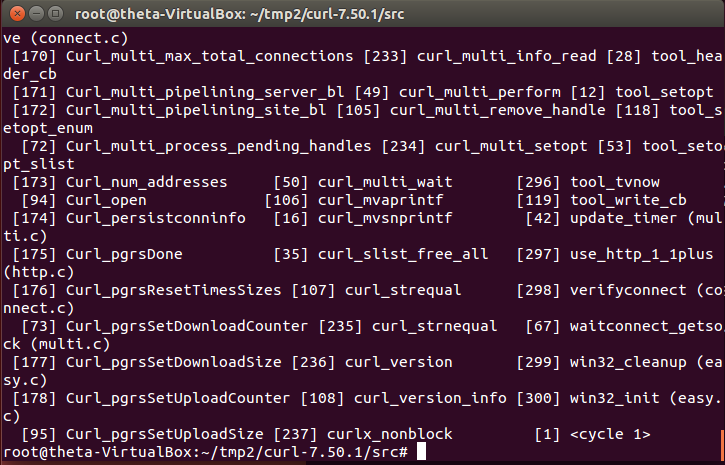

# 運用 gprof + graphviz 學習 Open Source

有時我們想了解一個 Open Source 軟體是如何運作的，可能是為了除錯，也可能是想了解心中的一些議題在這個軟體中是如何運作的。舉例來說，如果你正在用 socket 開發軟體，想要知道如何正確使用 socket API，找一個很受歡迎，很多人使用的 Open Source 軟體打開研究，比起只看文檔或書上的範例，抓頭騷耳老半天要來的快速有效。

又或者有一種可能，你正在為一個 Open Source 程式庫編寫練習程式，可能這個程式庫比較小眾缺乏足夠的參考資料，你不知道你做的對不對，你想知道你的程式有沒有經過正確的路徑。例如你寫的程式屬於 even driven，你想知道你的 callback function 是何時何地為何被呼叫，如果能知道 `call graph`，用起就更有信心也更不容易犯錯。


##如何產生 Call Graph？


一些軟體，如 Source Insight、Doxygen，可以靜態分析 Source Code，產生 Call Graph，但以 80/20 法則來看，一隻程式在實際運行中，大部分時間只有用到 20% 的程式碼。所以我們應集中心力去了解這 20%，這是靜態分析幫不上忙的。

這邊我們要採用的工具是 GNU gprof，原本是用於分析程式效能的工具，他會找出各個函數被呼叫的頻率，也因此他有能力在運行時找出 Call Graph。

但 gprof 產生的報告並非視覺化的產物，所以需要再轉換成圖形，最好還可以以 function name 搜尋節點，這裡我們要利用 Graphviz 來協助我們產生 SVG。

以資料流程圖表示：


接下來，我們來看一個實際的例子。

##curl


curl 是一個號稱有百萬使用者的命令列工具與程式庫，支援 http, smtp, ftp...多種協議，我們今天就來看看，curl 在抓取一個網頁的過程中，會呼叫哪些函數，會經過了哪些路徑，從中可以學習到什麼？

請以以下步驟編譯 curl：

```sh
wget https://curl.haxx.se/download/curl-7.50.1.tar.gz
tar -zxvf curl-7.50.1.tar.gz
./configure LDFLAGS=-static
make CFLAGS='-pg -g -O0 -Wall' LDLIBS+=' -pg'
```

因為 gprof 只支援靜態連結，所以必須以環境變數告訴 configure 我們要採用靜態編譯的方式編譯 curl，否則我們就看不到 libcurl.so 中的 call graph，目前查到可以用 sprof 來處理 .so，不過小弟還沒實驗過。

上面也提過編譯跟連結時都要加上 -pg 旗標，加上 -g 是盡量保留除錯資訊，讓 gprof 可以檢索到正確的 function name，-O0 則是希望 gcc 編譯時不要最佳化，讓我們盡量看到程式的原始風貌。

進入目錄 /src ，輸入命令：`./curl http://www.google.com.tw`

接著你應該會在目錄下看到多出了一個 gmon.out


輸入 gprof -q curl，你會看到 gprof 的確已經取得本次執行的 call graph 了：



但 Graphviz 無法直接解析這些資訊，因為 Grpahviz 本身自有一套繪圖語言 - dot，在實驗了多個轉換工具後 gprof2dot 算是其中最穩定的。接著以 pipe 結合各個工具：

```sh
gprof -q curl | ./gprof2dot.py | dot -Tsvg -o curltest.svg
```

用 InkScape 打開 curltest.svg 瞧瞧：


gprof2dot 會以顏色來標記函數被呼叫次數的比例，因為 curl 不屬於 CPU bound 的程式，所以會出現一片大紅色。

這樣的圖似乎大到不知道怎麼看，gprof2dot 提供了相當多剪裁的方法，小弟用的方法是直接看有興趣的函數，比方說我想知道是在哪裡建立連接的。於是我搜尋 connect() 這個 socket API，找到了 singleipconnect() 這個嫌疑犯，我們在圖中搜尋 singleipconnect 看看：


圖形似乎太密集了，而且線太粗了，大紅色也太嚇人，用下面的命令不顯示顏色，而且把線的寬度改為最小：

```sh
gprof -q curl | ./gprof2dot.py -c print  | perl -pe 's/,\s+penwidth="[\d.]+"//g' | dot -Tsvg -o curltest.svg
```


因為我們只對 singleipconnect 有興趣，透過再一次剪裁

```sh
gprof -q curl | ./gprof2dot.py -l singleipconnect -c print  | perl -pe 's/,\s+penwidth="[\d.]+"//g' | dot -Tsvg -o curltest.svg
```

結果宛如水晶一樣透明：


---


如果您照著前面的文章按圖索驥，您會發現有些情況或某些類型的程式會卡住無法進行下去。比方說如果您按 Ctrl+C 中斷 process，或者是用 kill 殺掉某些 background process, daemon，您會發現目錄下找不到 gmon.out，少了 gmon.out，就無法產生 call graph 與最終的 svg 圖檔。


```c
#include <dlfcn.h>
#include <signal.h>
 
//...
 
int main()
{
    //...
    signal(SIGUSR1, sigUsr1Handler);
    //...
    return 0;
}
 
 
void sigUsr1Handler(int sig)
{
    void (*_mcleanup)(void);
     
    fprintf(stderr, "Exiting on SIGUSR1\n");    
    _mcleanup = (void (*)(void))dlsym(RTLD_DEFAULT, "_mcleanup");
    if(_mcleanup == NULL)
         fprintf(stderr, "Unable to find gprof exit hook\n");
    else
        _mcleanup();
         
    _exit(0);
}
```
編譯時您可能需要加上連結旗標 `-dl`。然後你就可以用下面的命令中止 process，取得 gmon.out:

```sh
pkill -SIGUSR1 program_name
```

這邊當然不能只是貼上 stackoverflow 的解答騙字數，餵狗後找到一篇官方說明:

The profiling library also includes a function (mcleanup) which is typically registered using atexit() to be called as the program exits, and is responsible for writing the file gmon.out. Profiling is turned off, various headers are output, and the histogram is written, followed by the call-graph arcs and the basic-block counts.

由上面的文字可以看到，原本 mcleanup 用 atexit 註冊(應為編譯/連結 -pg 旗標的效果)，然後在 process 自然死亡時被呼叫寫出 gmon.out。但是在 process 不是自我了斷的情況下，顯然mcleanup 沒有被呼叫，也得不到 gmon.out 了。所以必須採取攔截 signal，透過 dlsym 取得 .so 中 mcleanup 符號的手段強制輸出 gmon.out。

