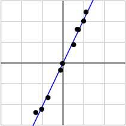

# 奇異值分解(SVD) --- 幾何意義


PS：一直以來對SVD分解似懂非懂，此文為譯文，原文以細緻的分析+大量的可視化圖形演示了SVD的幾何意義。能在有限的篇幅把這個問題講解的如此清晰，實屬不易。原文舉了一個簡單的圖像處理問題，簡單形象，真心希望路過的各路朋友能從不同的角度闡述下自己對SVD實際意義的理解，比如 個性化推薦中應用了SVD，文本以及Web挖掘的時候也經常會用到SVD。


關於線性變換部分的一些知識可以猛戳這裡  奇異值分解(SVD) --- 線性變換幾何意義

奇異值分解( The singular value decomposition )

該部分是從幾何層面上去理解二維的SVD：對於任意的 2 x 2 矩陣，通過SVD可以將一個相互垂直的網格(orthogonal grid)變換到另外一個相互垂直的網格。

我們可以通過向量的方式來描述這個事實: 首先，選擇兩個相互正交的單位向量 v1 和 v2, 向量Mv1 和 Mv2 正交。


```sh
u1 和 u2分別表示Mv1 和 Mv2的單位向量，σ1 * u1 =  Mv1 和 σ2 * u2 =  Mv2。
σ1 和 σ2分別表示這不同方向向量上的模，也稱作為矩陣 M 的奇異值。
```


這樣我們就有了如下關係式

```sh
Mv1 = σ1u1 
Mv2 = σ2u2
```

我們現在可以簡單描述下經過 M 線性變換後的向量 x 的表達形式。由於向量v1 和 v2是正交的單位向量，我們可以得到如下式子：

```sh
x = (v1x) v1 + (v2x) v2
```

這就意味著：

```sh
Mx = (v1x) Mv1 + (v2x) Mv2 
Mx = (v1x) σ1u1 + (v2x) σ2u2
```

向量內積可以用向量的轉置來表示，如下所示

```sh
vx = vTx
```

最終的式子為

```sh
Mx = u1σ1 v1Tx + u2σ2 v2Tx 
M = u1σ1 v1T + u2σ2 v2T
```

上述的式子經常表示成

```sh
M = UΣVT
```

u 矩陣的列向量分別是u1,u2 ，Σ 是一個對角矩陣，對角元素分別是對應的σ1 和 σ2，V 矩陣的列向量分別是v1,v2。上角標 T 表示矩陣 V 的轉置。


這就表明任意的矩陣 M 是可以分解成三個矩陣。V 表示了原始域的標準正交基，u 表示經過 M 變換後的co-domain的標準正交基，Σ 表示了V 中的向量與u 中相對應向量之間的關係。(V describes an orthonormal basis in the domain, and U describes an orthonormal basis in the co-domain, and Σ describes how much the vectors in V are stretched to give the vectors in U.)

##如何獲得奇異值分解？( How do we find the singular decomposition? )

   事實上我們可以找到任何矩陣的奇異值分解，那麼我們是如何做到的呢？假設在原始域中有一個單位圓，如下圖所示。經過 M 矩陣變換以後在co-domain中單位圓會變成一個橢圓，它的長軸(Mv1)和短軸(Mv2)分別對應轉換後的兩個標準正交向量，也是在橢圓範圍內最長和最短的兩個向量。


換句話說，定義在單位圓上的函數|Mx|分別在v1和v2方向上取得最大和最小值。這樣我們就把尋找矩陣的奇異值分解過程縮小到了優化函數|Mx|上了。結果發現（具體的推到過程這裡就不詳細介紹了）這個函數取得最優值的向量分別是矩陣 MT M 的特徵向量。由於MTM是對稱矩陣，因此不同特徵值對應的特徵向量都是互相正交的，我們用vi 表示MTM的所有特徵向量。奇異值σi = |Mvi| ， 向量 ui 為 Mvi 方向上的單位向量。但為什麼ui也是正交的呢？

推倒如下：

σi 和 σj分別是不同兩個奇異值

```sh
Mvi = σiui 
Mvj = σjuj.
```

我們先看下MviMvj，並假設它們分別對應的奇異值都不為零。一方面這個表達的值為0，推到如下

```sh
Mvi Mvj = viTMT Mvj = vi MTMvj = λjvi vj = 0
```

另一方面，我們有

```sh
Mvi Mvj = σiσj ui uj = 0
```


因此，ui 和 uj是正交的。但實際上，這並非是求解奇異值的方法，效率會非常低。這裡也主要不是討論如何求解奇異值，為了演示方便，採用的都是二階矩陣。

現在我們來看幾個實例。

###實例一


經過這個矩陣變換後的效果如下圖所示


在這個例子中，第二個奇異值為 0，因此經過變換後只有一個方向上有表達。

```sh
M = u1σ1 v1T.
```

換句話說，如果某些奇異值非常小的話，其相對應的幾項就可以不同出現在矩陣 M 的分解式中。因此，我們可以看到矩陣 M 的秩的大小等於非零奇異值的個數。

###實例二

我們來看一個奇異值分解在數據表達上的應用。假設我們有如下的一張 15 x 25 的圖像數據。


如圖所示，該圖像主要由下面三部分構成。


我們將圖像表示成 15 x 25 的矩陣，矩陣的元素對應著圖像的不同像素，如果像素是白色的話，就取 1，黑色的就取 0. 我們得到了一個具有375個元素的矩陣，如下圖所示


如果我們對矩陣M進行奇異值分解以後，得到奇異值分別是

```sh
σ1 = 14.72 
σ2 = 5.22 
σ3 = 3.31
```

矩陣M就可以表示成

```sh
M=u1σ1 v1T + u2σ2 v2T + u3σ3 v3T
```

vi具有15個元素，ui 具有25個元素，σi 對應不同的奇異值。如上圖所示，我們就可以用123個元素來表示具有375個元素的圖像數據了。

###實例三

`減噪(noise reduction)`

前面的例子的`奇異值都不為零，或者都還算比較大`，下面我們來探索一下擁有零或者非常小的奇異值的情況。通常來講，`大的奇異值對應的部分會包含更多的信息`。比如，我們有一張掃描的，帶有噪聲的圖像，如下圖所示


我們採用跟實例二相同的處理方式處理該掃描圖像。得到圖像矩陣的奇異值：

```sh
σ1 = 14.15 
σ2 = 4.67 
σ3 = 3.00 
σ4 = 0.21 
σ5 = 0.19 
... 
σ15 = 0.05
```

很明顯，前面三個奇異值遠遠比後面的奇異值要大，這樣矩陣 M 的分解方式就可以如下：

```sh
M  u1σ1 v1T + u2σ2 v2T + u3σ3 v3T
```

經過奇異值分解後，我們得到了一張降噪後的圖像。


###實例四

`數據分析(data analysis)`

我們蒐集的數據中總是存在噪聲：無論採用的設備多精密，方法有多好，總是會存在一些誤差的。如果你們還記得上文提到的，大的奇異值對應了矩陣中的主要信息的話，運用SVD進行數據分析，提取其中的主要部分的話，還是相當合理的。

作為例子，假如我們蒐集的數據如下所示：


我們將數據用矩陣的形式表示：


經過奇異值分解後，得到

```sh
σ1 = 6.04 
σ2 = 0.22
```


由於第一個奇異值遠比第二個要大，數據中有包含一些噪聲，第二個奇異值在原始矩陣分解相對應的部分可以忽略。經過SVD分解後，保留了主要樣本點如圖所示



就保留主要樣本數據來看，該過程跟PCA( principal component analysis)技術有一些聯繫，PCA也使用了SVD去檢測數據間依賴和冗餘信息.

###總結(Summary)

這篇文章非常的清晰的講解了SVD的幾何意義，不僅從數學的角度，還聯繫了幾個應用實例形象的論述了SVD是如何發現數據中主要信息的。在netflix prize中許多團隊都運用了矩陣分解的技術，該技術就來源於SVD的分解思想，矩陣分解算是SVD的變形，但思想還是一致的。之前算是能夠運用矩陣分解技術於個性化推薦系統中，但理解起來不夠直觀，閱讀原文後醍醐灌頂，我想就從SVD能夠發現數據中的主要信息的思路，就幾個方面去思考下如何利用數據中所蘊含的潛在關係去探索個性化推薦系統。也希望路過的各位大俠不吝分享呀。


##References:

Gilbert Strang, Linear Algebra and Its Applications. Brooks Cole

William H. Press et al, Numercial Recipes in C: The Art of Scientific Computing. Cambridge University Press.

Dan Kalman, A Singularly Valuable Decomposition: The SVD of a Matrix, The College Mathematics Journal 27 (1996), 2-23.

If You Liked This, You're Sure to Love That, The New York Times, November 21, 2008.


