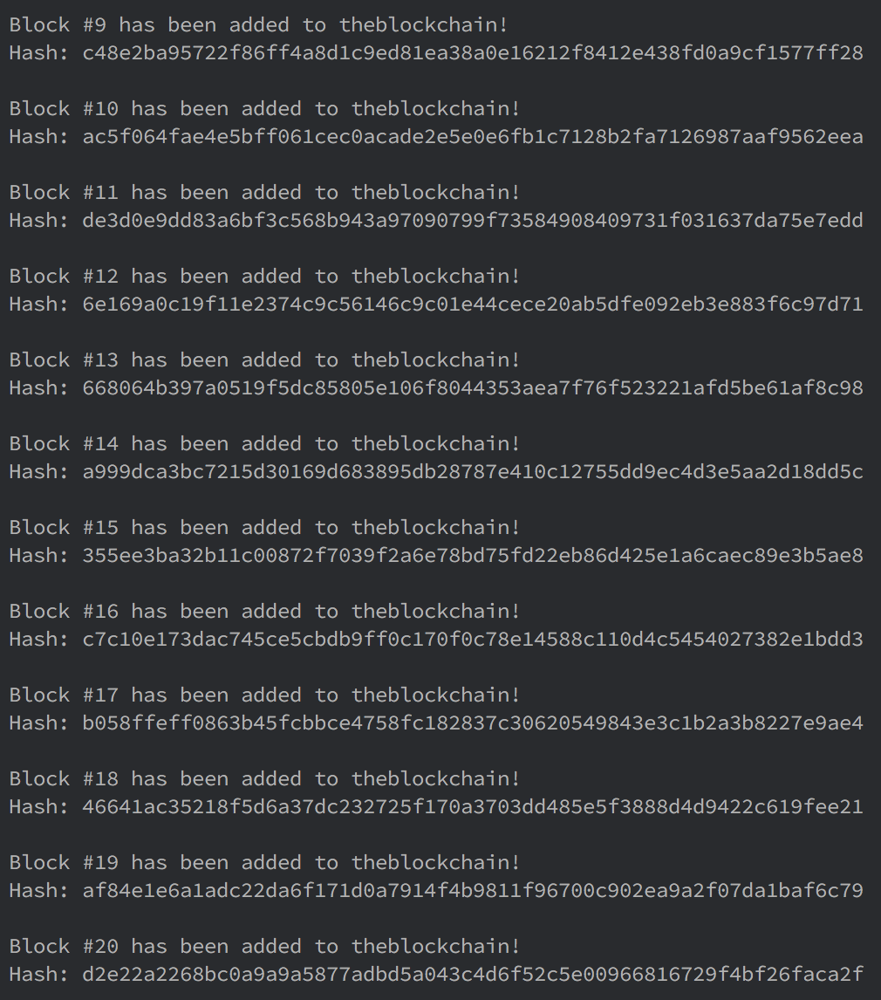

# 50 行 Python 代碼構建一個區塊鏈


儘管有人認為區塊鏈 (blockchain) 是一個答案先於問題的技術，但毫無疑問, 這項新的技術已然是一個計算的奇蹟。不過，到底區塊鏈是什麼呢

##區塊鏈

```
一個隨時間增長，記錄比特幣或其他加密貨幣的交易的公開數字賬本。
```

簡單來說，區塊鏈是一個公開的數據庫，新的數據會被存儲到一個叫做區塊 (block) 的數據結構中，而區塊會被添加到一個不可更改的鏈 (chain) 上 (也就是區塊鏈)，該鏈上存儲著過去所添加的所有數據。在比特幣和其他一些加密貨幣中，這些數據就是交易。不過，實際上，這些數據可以是任何類型。

區塊鏈技術催生了像比特幣，萊特幣這樣全新的完全數字資產，它們不由任何一箇中心權威機構發行或管理。這給那些不信任現有銀行系統的個人帶來了新的選項。區塊鏈也重新定義了分佈式計算，出現了像以太坊這樣的技術，它引入了像智能合約這樣新的概念。

在本文，我將會通過不到 50 行的 Python 代碼構建一個簡單的區塊鏈原型（原文代碼為 Python 2，分為多個部分託管於 gist。譯者已將其改為 Python 3，並將源碼放到了 GitHub 上，點擊 這裡 查看。)，就叫 SnakeCoin 吧。


```py
#!/usr/bin/env python
# -*- coding: utf-8 -*-

import hashlib as hasher
import datetime as date


class Block:
    def __init__(self, index, timestamp, data, previous_hash):
        self.index = index
        self.timestamp = timestamp
        self.data = data
        self.previous_hash = previous_hash
        self.hash = self.hash_block()

    def hash_block(self):
        sha = hasher.sha256()
        sha.update(
            bytes(
                str(self.index) + str(self.timestamp) + str(self.data) + str(
                    self.previous_hash), 'utf-8'))
        return sha.hexdigest()


def create_genesis_block():
    #  Manually construct a block with index 0 and arbitrary previous hash
    return Block(0, date.datetime.now(), "Genesis Block", "0")


def next_block(last_block):
    this_index = last_block.index + 1
    this_timestamp = date.datetime.now()
    this_data = "Hey! I'm block " + str(this_index)
    this_hash = last_block.hash
    return Block(this_index, this_timestamp, this_data, this_hash)


def main():
    #  Create the blockchain and add the genesis block
    blockchain = [create_genesis_block()]
    previous_block = blockchain[0]

    #  How many blocks should we add to the chain after the genesis block
    num_of_blocks_to_add = 20

    for i in range(0, num_of_blocks_to_add):
        block_to_add = next_block(previous_block)
        blockchain.append(block_to_add)
        previous_block = block_to_add
        #  Tell everyone about it!
        print("Block #{} has been added to the"
              "blockchain!".format(block_to_add.index))
        print("Hash: {}\n".format(block_to_add.hash))


if __name__ == "__main__":
    main()
```


首先，來定義我們的區塊大概是什麼樣。在區塊鏈中，每個區塊都需要一個時間戳 (timestamp) 和一個可選的索引 (index)。在 SnakeCoin 中，我們會同時存儲這兩項。為了確保區塊鏈的完整性，每個區塊都需要有一個能夠識別自身身份的哈希 (hash)。在比特幣中，每個區塊的哈希對區塊索引、時間戳、數據和前一區塊哈希所有內容的一個加密哈希。此外，數據可以是任何你想要存儲的任何內容。

```py
import hashlib as hasher

class Block:
    def __init__(self, index, timestamp, data, previous_hash):
        self.index = index
        self.timestamp = timestamp
        self.data = data
        self.previous_hash = previous_hash
        self.hash = self.hash_block()

    def hash_block(self):
        sha = hasher.sha256()
        sha.update(
            bytes(
                str(self.index) + str(self.timestamp) + str(self.data) + str(
                    self.previous_hash), 'utf-8'))
        return sha.hexdigest()
```

很好，已經有了區塊結構，但是我們構建的是一個區塊鏈。所以，我們需要將區塊添加到真正的鏈上。正如前文所說，每個區塊都需要前一個區塊的信息。如此一來，就出現了一個問題：區塊鏈中的第一個區塊是如何而來？ 第一個區塊，或者一般叫做創始塊(genesis block), 這是一個十分特殊的塊。在很多情況下，它是通過手動或是一些特殊的邏輯添加到區塊鏈中。

為簡便起見，我們創建一個簡單返回創世塊的函數。創始塊的索引為 0，有一個任意的數據值，一個屬於 “前一個哈希” 參數的任意值。


```py
import datetime as date
def create_genesis_block():
    #  Manually construct a block with index 0 and arbitrary previous hash
    return Block(0, date.datetime.now(), "Genesis Block", "0")
```

現在我們已經創建一個創世塊，接下來我們需要一個能夠在區塊鏈中生成後續區塊的函數。這個函數接受區塊鏈中的前一個區塊作為參數，創建所要生成區塊的數據，然後返回帶有數據的新區塊。當新區塊對前面的區塊信息進行哈希時，區塊鏈的完整性將會得到進一步增強。如果我們不對以前的區塊信息進行哈希，那麼第三者就能夠輕易地“篡改歷史”，用一個他們自己的鏈替換我們的鏈。區塊鏈的哈希就像是一個加密證明，它能夠保證一旦一個區塊被加入到區塊鏈中，那麼這個區塊就永遠無法被替換或者移除。


```py
def next_block(last_block):
    this_index = last_block.index + 1
    this_timestamp = date.datetime.now()
    this_data = "Hey! I'm block " + str(this_index)
    this_hash = last_block.hash
    return Block(this_index, this_timestamp, this_data, this_hash)
```

這就是整個部分最困難的地方了。現在，可以來創建我們的區塊鏈了！在我們的案例中，區塊鏈其實僅僅是一個 Python 的列表。列表的第一個元素是創世塊。當然了，我們需要增加後續區塊。因為這只是一個極簡的區塊鏈模型，我們僅添加 20 個新的區塊。可以通過一個循環來添加。


```py
#  Create the blockchain and add the genesis block
blockchain = [create_genesis_block()]
previous_block = blockchain[0]

#  How many blocks should we add to the chain after the genesis block
num_of_blocks_to_add = 20

for i in range(0, num_of_blocks_to_add):
    block_to_add = next_block(previous_block)
    blockchain.append(block_to_add)
    previous_block = block_to_add
    #  Tell everyone about it!
    print("Block #{} has been added to the"
          "blockchain!".format(block_to_add.index))
    print("Hash: {}\n".format(block_to_add.hash))
```


來看一下效果：



可以看出我們的鏈已經如期工作了。如果想要在控制檯中看到更多信息，可以編輯源文件打印每個塊的時間戳和數據。

這是 SnakeCoin 能夠完成的事情了。如果想要將 SnakeCoin 達到今天可真實使用的區塊鏈標準，我們還必須要加入更多特性，比如跟蹤在多臺機器上鍊的變化的服務層，限制在給定時間內能夠加入的區塊數量的工作量證明算法。

如果想要了解更多技術細節，可以查看原版的比特幣白皮書。