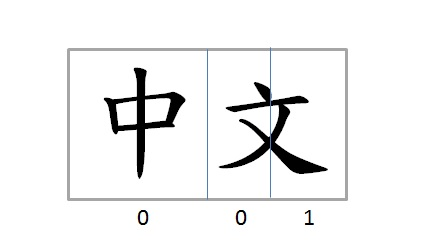
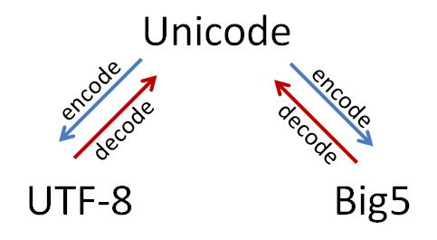

# 淺談 python2及 python3處理中文字串編碼的差異


大家都知道 python有 2與 3兩個分支，除了部份程式語法不同之外，兩個分支對字串物件 (string object)的處理更是採取完全不一樣的方式。

當初為了開發四大報爬蟲程式處理中文字串時著實吃了非常大的苦頭......在網路資源裡游蕩了許久才瞭解不同編碼之間轉換的關係。本文就是希望大家能免去查資料的麻煩，一次就搞懂。



在這邊先讓大家簡單快速地瞭解不同中文編碼之間的關係。拼音文字如英文，所有單字的排列組合都僅需用 [a-zA-Z]就可以表示。但中文不是拼音文字，若要完整的組合出所有的中文字詞，就必須將所有獨一無二的中文字都紀錄下來，而 Unicode(萬國碼)就是為了這項任務而生。


Unicode的誕生是試圖將世界上所有的文字都以一組獨一無二的編號儲存下來，類似車牌號碼的概念。例如"中"及"文"這兩字的 Unicode編碼分別為 "\u4e2d"及 "\u6587"。你可以想像為了囊括所有的文字進來 Unicode，其必須要以相對多位數的編號才能達成目的。因此，因應儲存以及傳輸效率的需求， UTF-8及 *Big5兩套能處理繁中的編碼系統便應運而生。(*感謝網友蔡炎龍指正，這句話是不正確的，因為 Big5 出來時尚未有 Unicode。)


簡單來說，你可以把 Unicode想像成字的原始碼，如上述"中文"二字對應的"\u4e2d\u6587"。當你要想要將字寫進文件檔如 .txt儲存時，你必須要將字以 UTF-8或 Big5的編碼系統編碼(encode)後才能成功。後文會以"**編碼狀態**"來稱呼 encode後的文字，來與 Unicode作區別。

以下就來用簡單的程式碼來解釋 python2中對於中文字串編碼間的處理。

在 python2中，字串分作 unicode及 str兩種物件，分別對應到 Unicode以及編碼狀態。當你建立一個字串實例 (instance)時如"中文"，這個字串會是編碼狀態的字，並因作業系統而採用不同的預設編碼。Windows預設是 Big5，而 Linux及蘋果 iOS則是使用 UTF-8的編碼。聰明的你一定就發現到這就是為什麼在不同作業系統上開啟同一份文檔時，常常會發生殘酷亂碼的原因......

若不想要使用預設的編碼，你也可以在.py檔的開頭加上 # -*- coding: utf-8 -*- 或是 # -*- coding: big5 -*- 來自行設定想採用的編碼系統。附帶一提，不論是 Window、Linux或是 iOS，在  jupyter notebook的環境中編碼系統都是預設為 UTF-8。

在 unicode及 str這兩個不同的物件之間，你可以透過 .encode()及 .decode()的方法(method)來實現轉換，如下圖所示：



舉例來說，在 jupyter notebook環境中，"中文"這個字串實例建立時是處在 UTF-8編碼的狀態。若想要得到"中文"二字的 Unicode，你可以透過 .decode()來實現。另外，你也可以在字串前面加上一個英文字母 u，如u"中文"，來直接建立一個 unicode物件的實例。


```py
### input ###
print type("中文")
print type("中文".decode("utf-8"))
print type(u"中文")
```

```sh
### output ###
type 'str'
type 'unicode'
type 'unicode'
```

當你想要從 UTF-8編碼狀態轉換成 Big5編碼狀態時，你必需要將編碼狀態的字串先解碼成 Unicode後，再重新編碼成 Big5的編碼狀態才能成功。


```py
print "中文" # encoded in utf-8
print "中文".decode("utf-8").encode("big5") # encoded in big5
```

編碼不同除了造成亂碼之外，也會造成文本分析的錯誤，最明顯的例子就是計算字數的問題。當你用 len()這個內建的函式(built-in function)來計算"中文"這個字串有幾個字時，你會發現結果並不是預期的 2而是 6。

```py
### input ###
print len("中文")
print len("中文".decode("utf-8"))
print len(u"中文")
```

```sh
### output ###
6
2
2
```
這跟 len()這個函式演算法的設計有關，當字串是編碼狀態時就會無法得到正確的字數。若要修正這個問題，請記得一定要以 unicode去計算才會得到正確的結果。這也是為什麼許多中文處理套件的第一步總是先將字串轉換成 unicode的原因。

透過以上簡單的例子，我想大家應該可以清楚的掌握中文編碼轉換的問題，你可能也發現到 python2對於這些問題的態度就是**什麼都讓使用者自己來解決**。對於瞭解的人來說或許沒問題，但對不瞭解前述觀念的人一定很快就會來到崩潰邊緣，就如以前的我一樣。

介紹完 python2對中文字串的處理後，接下來就來談談 python3與 python2的差異。之前早有耳聞 python3對於中文高支持的說法，但一直到最近因工作接觸 python3時才親自體會其對於中文字串處理的方便。

python3中是將字串分作 str及 byte兩種物件，分別對應到 Unicode以及編碼狀態。你發現差異了嗎？這就表示說，當你建立一個字串實例如"中文"時，這個字串就會是 Unicode的文字了。以 Unicode優先的這種設計避掉了許多因編碼不同而挖的坑，像是前面舉例使用 len()計算字數的問題。


```py
### input ###
print(type("中文"))
print(type("中文".encode("utf-8")))
print(type(u"中文"))
print(len("中文"))
```

```sh
### output ###
class 'str'
class 'bytes'
class 'str'
2
```

另外，在讀檔寫檔時， python2必須要在每一個要寫入的字串後面都手動加上編碼的方法。但在 python3中免去了這個麻煩，它直接在建立 I/O實例時就將編碼透過 encoding這個變數來處理，如此一來不論讀或是寫時都非常的方便。特別要注意 python2的 I/O物件並沒有支持 encoding這個變數。 


```py
### input ###
with open("filename.txt",'w',encoding='utf-8') as outfile:
    outfile.write("anything you want to write")
    ...

with open("filename.txt",'r',encoding='utf-8') as infile:
    text = infile.read()
print(type(text))
```

```sh
### output ###
class 'str'
```

由於我都是在網路上搜集資料自學，因此在專業用詞上可能不是非常精確，若觀念理解上有錯誤的話再麻煩提出。希望本文能夠幫助到正在或即將使用 python處理中文字串的朋友，免去不必要的苦難。 
