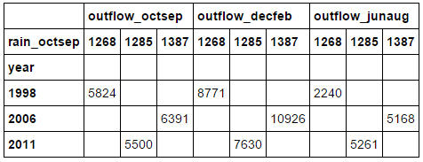
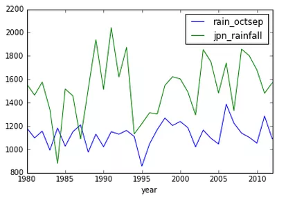

# 十分鐘快速入門 Pandas


`Pandas` 是我最喜愛的庫之一。通過帶有標籤的列和索引，`Pandas` 使我們可以以一種所有人都能理解的方式來處理數據。它可以讓我們毫不費力地從諸如 csv 類型的文件中導入數據。我們可以用它快速地對數據進行複雜的轉換和過濾等操作。Pandas 真是超級棒。

我覺得它和 `Numpy、Matplotlib` 一起構成了一個 Python 數據探索和分析的強大基礎。`Scipy` （將會在下一篇推文裡介紹）當然也是一大主力並且是一個絕對讚的庫，但是我覺得前三者才是 Python 科學計算真正的頂樑柱。

那麼，趕緊看看 python 科學計算系列的第三篇推文，一窺 Pandas 的芳容吧。如果你還沒看其它幾篇文章的話，別忘了去看看。


## 導入 Pandas

第一件事當然是請出我們的明星 —— Pandas。

```sh
import pandas as pd # This is the standard
```

這是導入 `pandas` 的標準方法。我們不想一直寫 `pandas` 的全名，但是保證代碼的簡潔和避免命名衝突都很重要，所以折中使用 `pd` 。如果你去看別人使用 `pandas` 的代碼，就會看到這種導入方式。


## Pandas 中的數據類型

Pandas 基於兩種數據類型，`series` 和 `dataframe`。

`series` 是一種一維的數據類型，其中的每個元素都有各自的標籤。如果你之前看過這個系列關於 Numpy 的推文，你可以把它當作一個由帶標籤的元素組成的 `numpy` 數組。標籤可以是數字或者字符。

`dataframe` 是一個二維的、表格型的數據結構。Pandas 的 dataframe 可以儲存許多不同類型的數據，並且每個軸都有標籤。你可以把它當作一個 series 的字典。

## 將數據導入 Pandas

在對數據進行修改、探索和分析之前，我們得先導入數據。多虧了 Pandas ，這比在 `Numpy` 中還要容易。

這裡我鼓勵你去找到自己感興趣的數據並用來練習。你的（或者別的）國家的網站就是不錯的數據源。如果要舉例的話，首推英國政府數據和美國政府數據。Kaggle也是個很好的數據源。

我將使用英國降雨數據，這個數據集可以很容易地從英國政府網站上下載到。此外，我還下載了一些日本降雨量的數據。


```sh
# Reading a csv into Pandas.
df = pd.read_csv('uk_rain_2014.csv', header=0)
```

譯者註：如果你的數據集中有中文的話，最好在裡面加上 `encoding = 'gbk'` ，以避免亂碼問題。後面的導出數據的時候也一樣。


這裡我們從 `csv` 文件裡導入了數據，並儲存在 dataframe 中。這一步非常簡單，你只需要調用 `read_csv` 然後將文件的路徑傳進去就行了。`header` 關鍵字告訴 Pandas 哪些是數據的列名。如果沒有列名的話就將它設定為 `None` 。Pandas 非常聰明，所以這個經常可以省略。

## 準備好要進行探索和分析的數據

現在數據已經導入到 Pandas 了，我們也許想看一眼數據來得到一些基本信息，以便在真正開始探索之前找到一些方向。

查看前 x 行的數據：

```py
# Getting first x rows.
df.head(5)
```

我們只需要調用 head() 函數並且將想要查看的行數傳入。

得到的結果如下：


你可能還想看看最後幾行：

```py
# Getting last x rows.
df.tail(5)
```

跟 head 一樣，我們只需要調用 tail 並且傳入想要查看的行數即可。注意，它並不是從最後一行倒著顯示的，而是按照數據原來的順序顯示。

得到的結果如下：


你通常使用列的名字來在 Pandas 中查找列。這一點很好而且易於使用，但是有時列名太長，比如調查問卷的一整個問題。不過你把列名縮短之後一切就好說了。

```py
# Changing column labels.
df.columns = ['water_year','rain_octsep', 'outflow_octsep',
              'rain_decfeb', 'outflow_decfeb', 'rain_junaug', 'outflow_junaug']

df.head(5)
```

需要注意的一點是，我故意沒有在每列的標籤中使用空格和破折號。之後你會看到這樣為變量命名可以使我們少打一些字符。

你得到的數據與之前的一樣，只是換了列的名字：


你通常會想知道數據的另一個特徵——它有多少條記錄。在 Pandas 中，一條記錄對應著一行，所以我們可以對數據集調用 len 方法，它將返回數據集的總行數：


```py
# Finding out how many rows dataset has.
len(df)
```

上面的代碼返回一個表示數據行數的整數，在我的數據集中，這個值是 33 。

你可能還想知道數據集的一些基本的統計數據，在 Pandas 中，這個操作簡單到哭：

```py
# Finding out basic statistical information on your dataset.
pd.options.display.float_format = '{:,.3f}'.format # Limit output to 3 decimal places.
df.describe()
```

這將返回一張表，其中有諸如總數、均值、標準差之類的統計數據：


## 過濾

在探索數據的時候，你可能經常想要抽取數據中特定的樣本，比如你有一個關於工作滿意度的調查表，你可能就想要提取特定行業或者年齡的人的數據。

在 Pandas 中有多種方法可以實現提取我們想要的信息：

有時你想提取一整列，使用列的標籤可以非常簡單地做到：


```py
# Getting a column by label
df['rain_octsep']
```

注意，當我們提取列的時候，會得到一個 series ，而不是 dataframe 。記得我們前面提到過，你可以把 dataframe 看作是一個 series 的字典，所以在抽取列的時候，我們就會得到一個 series。

還記得我在命名列標籤的時候特意指出的嗎？不用空格、破折號之類的符號，這樣我們就可以像訪問對象屬性一樣訪問數據集的列——只用一個點號。

```py
# Getting a column by label using .
df.rain_octsep
```


這句代碼返回的結果與前一個例子完全一樣——是我們選擇的那列數據。

如果你讀過這個系列關於 Numpy 的推文，你可能還記得一個叫做 布爾過濾（boolean masking）的技術，通過在一個數組上運行條件來得到一個布林數組。在 Pandas 裡也可以做到。

```py
# Creating a series of booleans based on a conditional
df.rain_octsep < 1000 # Or df['rain_octsep] < 1000
```

上面的代碼將會返回一個由布爾值構成的 dataframe。`True` 表示在十月-九月降雨量小於 1000 mm，`False` 表示大於等於 1000 mm。

我們可以用這些條件表達式來過濾現有的 dataframe。

```py
# Using a series of booleans to filter
df[df.rain_octsep < 1000]
```

這條代碼只返回十月-九月降雨量小於 1000 mm 的記錄：


也可以通過復合條件表達式來進行過濾：

```py
# Filtering by multiple conditionals
df[(df.rain_octsep < 1000) & (df.outflow_octsep < 4000)] # Can't use the keyword
```


這條代碼只會返回 `rain_octsep` 中小於 1000 的和 `outflow_octsep` 中小於 4000 的記錄：

注意重要的一點：這裡不能用 `and` 關鍵字，因為會引發操作順序的問題。必須用 `&` 和圓括號。


如果你的數據中字符串，好消息，你也可以使用字符串方法來進行過濾：

```py
# Filtering by string methods
df[df.water_year.str.startswith('199')]
```

注意，你必須用 `.str.[string method]` ，而不能直接在字符串上調用字符方法。上面的代碼返回所有 90 年代的記錄：


## 索引

之前的部分展示了如何通過列操作來得到數據，但是 Pandas 的行也有標籤。行標籤可以是基於數字的或者是標籤，而且獲取行數據的方法也根據標籤的類型各有不同。

如果你的行標籤是數字型的，你可以通過 `iloc` 來引用：

```py
# Getting a row via a numerical index
df.iloc[30]
```

`iloc` 只對數字型的標籤有用。它會返回給定行的 series，行中的每一列都是返回 series 的一個元素。

也許你的數據集中有年份或者年齡的列，你可能想通過這些年份或者年齡來引用行，這個時候我們就可以設置一個（或者多個）新的索引：


```py
# Setting a new index from an existing column
df = df.set_index(['water_year'])
df.head(5)
```

上面的代碼將 `water_year` 列設置為索引。注意，列的名字實際上是一個列表，雖然上面的例子中只有一個元素。如果你想設置多個索引，只需要在列表中加入列的名字即可。


上例中我們設置的索引列中都是字符型數據，這意味著我們不能繼續使用 `iloc` 來引用，那我們用什麼呢？用 `loc` 。


```py
# Getting a row via a label-based index
df.loc['2000/01']
```


和 `iloc` 一樣，`loc` 會返回你引用的列，唯一一點不同就是此時你使用的是基於字符串的引用，而不是基於數字的。

還有一個引用列的常用常用方法—— `ix` 。如果 `loc` 是基於標籤的，而 `iloc` 是基於數字的，那 ix 是基於什麼的？事實上，ix 是基於標籤的查詢方法，但它同時也支持數字型索引作為備選。

```py
# Getting a row via a label-based or numerical index
df.ix['1999/00'] # Label based with numerical index fallback *Not recommended
```

與`iloc`、`loc` 一樣，它也會返回你查詢的行。


如果 `ix` 可以同時起到 `loc` 和 `iloc` 的作用，那為什麼還要用後兩個？一大原因就是 `ix` 具有輕微的不可預測性。還記得我說過它所支持的數字型索引只是備選嗎？這一特性可能會導致 `ix` 產生一些奇怪的結果，比如講一個數字解釋為一個位置。而使用 `iloc` 和 `loc` 會很安全、可預測並且讓人放心。但是我要指出的是，`ix` 比 `iloc` 和 `loc` 要快一些。

將索引排序通常會很有用，在 Pandas 中，我們可以對 dataframe 調用 `sort_index` 方法進行排序。

```py
df.sort_index(ascending=False).head(5) #inplace=True to apple the sorting in place
```

我的索引本來就是有序的，為了演示，我將參數 `ascending` 設置為 `false`，這樣我的數據就會呈降序排列。


當你將一列設置為索引的時候，它就不再是數據的一部分了。如果你想將索引恢復為數據，調用 `set_index` 相反的方法 `reset_index` 即可：

```py
# Returning an index to data
df = df.reset_index('water_year')
df.head(5)
```

這一語句會將索引恢復成數據形式：


## 對數據集應用函數

有時你想對數據集中的數據進行改變或者某種操作。比方說，你有一列年份的數據，你需要新的一列來表示這些年份對應的年代。Pandas 中有兩個非常有用的函數，`apply` 和 `applymap`。


```py
# Applying a function to a column
def base_year(year):
    base_year = year[:4]
    base_year= pd.to_datetime(base_year).year
    return base_year

df['year'] = df.water_year.apply(base_year)
df.head(5)
```

上面的代碼創建了一個叫做 `year` 的列，它只將 `water_year` 列中的年提取了出來。這就是 `apply` 的用法，即對一列數據應用函數。如果你想對整個數據集應用函數，就要使用 `applymap`。


## 操作數據集的結構


另一常見的做法是重新建立數據結構，使得數據集呈現出一種更方便並且（或者）有用的形式。

掌握這些轉換最簡單的方法就是觀察轉換的過程。比起這篇文章的其他部分，接下來的操作需要你跟著練習以便能掌握它們。

首先，是 groupby ：

```py
#Manipulating structure (groupby, unstack, pivot)
# Grouby
df.groupby(df.year // 10 *10).max()
```

`groupby` 會按照你選擇的列對數據集進行分組。上例是按照年代分組。不過僅僅這樣做並沒有什麼用，我們必須對其調用函數，比如 `max 、 min 、mean` 等等。例中，我們可以得到 90 年代的均值。


你也可以按照多列進行分組：

```py
# Grouping by multiple columns
decade_rain = df.groupby([df.year // 10 * 10, df.rain_octsep // 1000 * 1000])[['outflow_octsep',                                                              'outflow_decfeb', 'outflow_junaug']].mean()
decade_rain
```


接下來是 `unstack` ，最開始可能有一些困惑，它可以將一列數據設置為列標籤。最好還是看看實際的操作：

```py
# Unstacking
decade_rain.unstack(0)
```

這條語句將上例中的 dataframe 轉換為下面的形式。它將第 0 列，也就是 year 列設置為列的標籤。


讓我們再操作一次。這次使用第 1 列，也就是 rain_octsep 列：

```py
# More unstacking
decade_rain.unstack(1)
```


在進行下次操作之前，我們先創建一個用於演示的 dataframe :

```py
# Create a new dataframe containing entries which 
# has rain_octsep values of greater than 1250
high_rain = df[df.rain_octsep > 1250]
high_rain
```

上面的代碼將會產生如下的 dataframe ，我們將會在上面演示軸向旋轉（pivoting）。


軸旋轉其實就是我們之前已經看到的那些操作的一個集合。首先，它會設置一個新的索引`（set_index()`），然後對索引排序（`sort_index()`），最後調用 `unstack` 。以上的步驟合在一起就是 `pivot` 。接下來看看你能不能搞清楚下面的代碼在幹什麼：

```py
#Pivoting
#does set_index, sort_index and unstack in a row
high_rain.pivot('year', 'rain_octsep')[['outflow_octsep', 'outflow_decfeb', 'outflow_junaug']].fillna('')
```

注意，最後有一個 `.fillna('') `。pivot 產生了很多空的記錄，也就是值為 `NaN` 的記錄。我個人覺得數據集裡面有很多 `NaN` 會很煩，所以使用了 `fillna('')` 。你也可以用別的別的東西，比方說 0 。我們也可以使用 `dropna(how = 'any')` 來刪除有 `NaN` 的行，不過這樣就把所有的數據都刪掉了，所以不這樣做。





