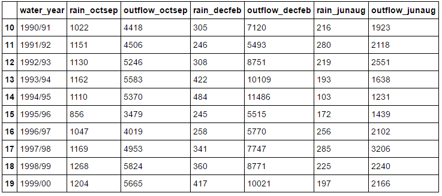
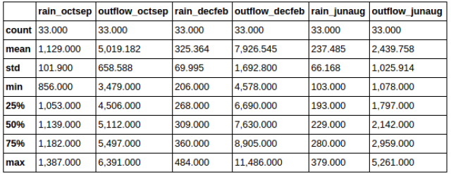

# 十分鐘快速入門 Pandas


`Pandas` 是我最喜愛的庫之一。通過帶有標籤的列和索引，`Pandas` 使我們可以以一種所有人都能理解的方式來處理數據。它可以讓我們毫不費力地從諸如 csv 類型的文件中導入數據。我們可以用它快速地對數據進行複雜的轉換和過濾等操作。Pandas 真是超級棒。

我覺得它和 `Numpy、Matplotlib` 一起構成了一個 Python 數據探索和分析的強大基礎。`Scipy` （將會在下一篇推文裡介紹）當然也是一大主力並且是一個絕對讚的庫，但是我覺得前三者才是 Python 科學計算真正的頂樑柱。

那麼，趕緊看看 python 科學計算系列的第三篇推文，一窺 Pandas 的芳容吧。如果你還沒看其它幾篇文章的話，別忘了去看看。


## 導入 Pandas

第一件事當然是請出我們的明星 —— Pandas。

```sh
import pandas as pd # This is the standard
```

這是導入 `pandas` 的標準方法。我們不想一直寫 `pandas` 的全名，但是保證代碼的簡潔和避免命名衝突都很重要，所以折中使用 `pd` 。如果你去看別人使用 `pandas` 的代碼，就會看到這種導入方式。


## Pandas 中的數據類型

Pandas 基於兩種數據類型，`series` 和 `dataframe`。

`series` 是一種一維的數據類型，其中的每個元素都有各自的標籤。如果你之前看過這個系列關於 Numpy 的推文，你可以把它當作一個由帶標籤的元素組成的 `numpy` 數組。標籤可以是數字或者字符。

`dataframe` 是一個二維的、表格型的數據結構。Pandas 的 dataframe 可以儲存許多不同類型的數據，並且每個軸都有標籤。你可以把它當作一個 series 的字典。

## 將數據導入 Pandas

在對數據進行修改、探索和分析之前，我們得先導入數據。多虧了 Pandas ，這比在 `Numpy` 中還要容易。

這裡我鼓勵你去找到自己感興趣的數據並用來練習。你的（或者別的）國家的網站就是不錯的數據源。如果要舉例的話，首推英國政府數據和美國政府數據。Kaggle也是個很好的數據源。

我將使用英國降雨數據，這個數據集可以很容易地從英國政府網站上下載到。此外，我還下載了一些日本降雨量的數據。


```sh
# Reading a csv into Pandas.
df = pd.read_csv('uk_rain_2014.csv', header=0)
```

譯者註：如果你的數據集中有中文的話，最好在裡面加上 `encoding = 'gbk'` ，以避免亂碼問題。後面的導出數據的時候也一樣。


這裡我們從 `csv` 文件裡導入了數據，並儲存在 dataframe 中。這一步非常簡單，你只需要調用 `read_csv` 然後將文件的路徑傳進去就行了。`header` 關鍵字告訴 Pandas 哪些是數據的列名。如果沒有列名的話就將它設定為 `None` 。Pandas 非常聰明，所以這個經常可以省略。

## 準備好要進行探索和分析的數據

現在數據已經導入到 Pandas 了，我們也許想看一眼數據來得到一些基本信息，以便在真正開始探索之前找到一些方向。

查看前 x 行的數據：

```sh
# Getting first x rows.
df.head(5)
```

我們只需要調用 head() 函數並且將想要查看的行數傳入。

得到的結果如下：








