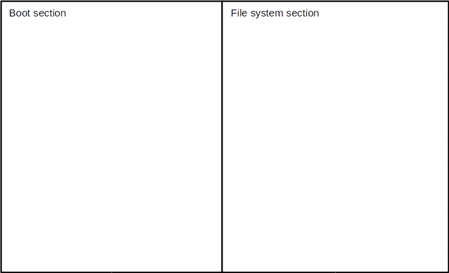

# buildRoot study - 建立自己的作業系統

[轉] http://fichugh.blogspot.tw/2016/02/buildroot-study.html  

##Introduction
因為想要了解整個Linux作業系統，從開機到系統穩定的中間流程，到底經歷過哪幾個步驟，
所以想要自己兜「boot-loader」,「kernel」和「root file system」，
研究過程中發現了，原來早已經有組織在從事類似的專案，像是「Buildroot」，「Yocto/OpenEmbedded」
所以我就想來研究一下Buildroot的架構。


這篇文章的成果會從Buildroot專案中build出「bootloader」, 「kernel」和「root fileSystem」，
然後我們會在將這幾個元件和官方的firmware放到raspberry pi 2裏面開機後來研究整個開機流程。


## Buildroot


以一個專案標語：Making Embedded Linux Easy啟動的這個專案，
基本的概念就是先建立一個自用的cross-compilation toolchain，
然後經由這個這個cross-compiler去編譯kernel和建立root file system。

主要的設計理念是：
- Simple to use
- Simple to customize
- Reproducible builds
- Small root filesystem
- Relatively fast boot
- Easy to understand

那有誰在用呢？
- System makers
    - Google
    - Barco
    - Rockwell Collins

- Processor vendors
    - Imagination Technologies
    - Marvell
    - Atmel
    - Analog Devices


當然除了以上大公司，還有很多其他公司和業餘愛好者都會用它來開發版子。

##Simplified Linux system architecture
一個簡單的Linux系統架構，如下圖，主要分為4個部份：

```sh
1.  Hardware
2. Boot loader
3. Linux Kernel
4. User space (Applications)
```

除了Hardware以外，Buildroot專案建制過程中其他的3個部份都會自己建置。
所以建制完後，我們主要會有「ToolChain」, 「bootloader image」, 「kernel image」和「root fileSystem image」。


假設我們的專案現在已經建制好了，也已經放到儲存裝置（Flash or EMMC ....），電源插上去後，
第 1 個跑的程式就是BootLoader，他會啟動一些基本的驅動程式，以供開機中使用，最終就是將kerner載入到記憶體裡，接下來就是將控制權轉交給Kernel。<br>
第2個就是Kernel會初始化硬體裝置和我們的檔案系統，然後執行第一個程式/sbin/init。<br>
第3步init就會啟動剩下來user space的service和application。<br>
第4步我們通常就會看到login shell展示再我們面前了，在後面章節會有更詳細的介紹。<br>


## Preparation
Ubuntu
這邊使用的Host OS是Ubuntu。

數莓派[廢話]


TTL Cable [天瓏書局有在賣]


##Docker

使用一個完全乾淨的Container來做這件事，
事情會比較單純化，也會加深很多印象。<br>
詳細Docker內容請參考網站。

##開啟Docker

```sh
sudo docker run -t -i -v ~/mnt/mnt_docker:/tmp/package ubuntu bash
```

~/mnt/mnt_docker : /tmp/package語法是host 和container的資料共享 => host folder ： Container folder
接下來所有內容都是在Docker裏面執行的。

## 下載套件

```sh
sudo apt-get update
sudo apt-get install g++ make gawk -y
sudo apt-get install git-core libncurses5-dev vim -y
sudo apt-get install wget python unzip bc -y
```

## Build buildRoot

### 最簡單的建置法

```sh
git clone git://git.busybox.net/buildroot
cd buildroot/
make raspberrypi2_defconfig
make 2>&1 | tee build.log
```
結束~~<br>
但是我要故意把他複雜化，這樣才可以理解他裏面的運作原理！<br>
請接下面的Build Step by Step開始。<br>


## Build Step by Step
### get sources by git

```sh
cd /tmp/
git clone git://git.busybox.net/buildroot
cd buildroot/
```

`get build information`
buildroot裏面有很多內建的組態，


裏面有raspberrypi2！
在來看一下怎麼弄，很簡單

```sh
vim /board/raspberrypi2/readme.txt
```


官方github上的文件--> [請點我](https://git.busybox.net/buildroot/tree/board/raspberrypi/readme.txt)

##Download all Sources 
buildroot的所有package, sources都是build之前才會從網路上下載下來，所以第一次build會很久，
因為包含下載，所以這邊我們先來研究一下，他下載了多少東西，請下指令：


```sh
make help
```

發現裏面有個指令是

```sh
source - download all sources needed for offline-build
```
下載所有資源之前要先建立組態

```sh
make list-defconfigs
```
上面這個指令會顯示目前有支援多少預設的組態，
我們發現有數莓派2的，所以下以下指令：
 
 ```sh
 make raspberrypi2_defconfig
 ```
 
然後只要下這個指令就會下載所有個資源：

```sh
make source
```

套件說明：
總共下載了21個套件，下載完的套件都放在資料夾「dl」裏面，
底下就來介紹一下每個套件大概的用途：
- xz-5.2.2:
 包含對檔案的壓縮和解壓縮，裏面提供了「lzma」和新的「xz」壓縮的格式。
- gcc-4.9 - 略
- binutils-2.24 - 略
- gmp-6.1.0 - 略
- mpc-1.0.3 - 略
- mpfr-3.1.3 - 略
- linux-header - 略
以上6個套件都是用來建立Corss-Compiler的，請參考我之前發過的主題「How to Build a GCC Cross-Compiler」裏面的套件說明有解釋。
- m4-1.4.17:
裏面包含了巨集處理器(macro processor)。
- uClibc-ng-1.0.12
是一種C的library，一般來說都是用Glibc，但是這邊選用uClibc，因為他比較小，也支援沒有MMU的架構，非常適合比較小的系統（< 10 MB）。
- kmod-22:
包含了讀取kernel module的函式庫和程式。
- pkgconf-0.9.12:
在設定組態或者在make 專案時，這個套件會傳遞一些include和library的路徑給建置的軟體。
- busybox-1.24.1
Busybox在單一的可執行文件中提供了精簡的Unix工作集，可運行於多款POSIX環境得的操作系統。
- dosfstools-3.0.28
可以讓使用者在GNU/Linux OS上很快速的建立，設立標籤和檢查MS-DOS FAT 的檔案格式（mkfs.fat, fsck.fat and fatlabel）。
- e2fsprogs-1.42.13:
裏面有處理ext2 檔案系統的程式。當然他也支援ext3和ext4。
- genext2fs-1.4.1
這個程式可以讓你建立ext2的檔案系統。
- genimage-8
可從一個root filesystem裏面建立多種檔案系統和flash image。
- confuse-2.8:
libcoufuse提供了一些組態分析函式庫。
- flex-2.5.37:
裏面的套件可以產生可辨識文字pattern的程式(反正就是正規表示法那些東西)。
- mtools-4.0.18:
是一套允許讓Unix系統去操控MS-DOS格式上的檔案操作，像是讀寫檔，和搬運檔案等等。
- rpi-firmware:
數莓派官方release出來的軔體，這部份待回會在說明。
- fakeroot_1.20.2.orig
可用來模擬root的權限去做一些操作。

修改組態
如果想要自己修改設定，就跟修改kernel 組態一樣，
這邊我們來修改一下兩個設定，請輸入

```sh
make menuconfig
```

然後將選項 Filesystem images ---> tar the root filesystem--->Compression method選擇是bzip2，如下圖：


這樣我們待回的root filesytem就會以tar ball 的型式。
然後我們也想要自己build個u-boot來玩玩。
所以選項 Bootloaders -->  選擇U-boot選項，Board defconfig 輸入「rpi_2」。
上面那個指令會產生一個.conifg檔案，這邊來研究一下他開啟了哪些功能-->[請按我](http://fichugh.blogspot.tw/2016/02/u-boot-raspberry-pi-2.html)


##開始建制
剛剛組態已經產生，sources也已經下載好了，接下來我們就開始建制。


```sh
make 2>&1 | tee build.log
```

所有的package都會解壓縮在output/build，並且建置。
所有的結果都會在output/images裏面。


在output/images裏面，
sdcard.img算是整個結果的image，
假設你的sdcard是 /dev/sdd，
你只要下指令:

```sh
sudo dd if=sdcard.img of=/dev/sdd
```

然後在把sdcard卡插進去pi2裏面，就可以開機了，
但是像我說的，我要故意把他複雜化，這樣才可以理解裏面的運作原理。

在output/images裏面，
我們待回會用到的是:
```sh
1. kernel                        --> zImage
2. root file system        --> rootfs.tar.bz2
3. device tree blob      --> bcm2709-rpi-2-b.dtb
4. raspberry firmware   --> rpi-firmware/*
5. boot loader               --> u-boot.bin
```

所以底下會有另外5相對應的標題，
教怎麼把以上5個部份裝起來，並且開機。

## Partition SD Card

首先我們必須有一塊Micro SD，我們要將它分成兩個partition，其中第一個為boot section,另一個partition是放我們的rootfs的地方。

###1. 假設路徑是/dev/sdd，先進入fdisk系統

```sh
$ sudo fdisk /dev/sdd
```

###2. 將預設單位改成cylinders

```sh
Command (m for help): u
```


###3. 建立一個新的DOS格式的partition table:

```sh
Command (m for help): o
```


###4. 建立放boot loader的partition
  （以下兩步的重點是規劃200MB的boot partition，其他的都規檔案系統用）

```sh
Command (m for help): n
Partition type:
p   primary (0 primary, 0 extended, 4 free)
e   extended
Select (default p): p    (The new partition is a primary partition.)
Partition number (1-4, default 1): (Press Enter for default.)
Using default value 1
First cylinder (2-15193, default 2): 2
Last cylinder, +cylinders or +size{K,M,G} (2-15193, default 15193): +200M
```

###5. 建立放檔案系統的partition

```sh
Command (m for help): n
Partition type:
p   primary (1 primary, 0 extended, 3 free)
e   extended
Select (default p): p    (The new partition is a primary partition.)
Partition number (2-4, default 2): (Press Enter for default.)
Using default value 2
First cylinder (2048-15193, default 2): 2048
Last cylinder, +cylinders or +size{K,M,G} (2-15193, default 15193): 15193
```

###6. 將第一個磁區標注為bootable 

```sh
Command (m for help): a
Partition number (1-4): 1   (Select Partition 1 to be active.)
```

###7. 將第一個磁區改為FAT32
```sh
Command (m for help): t
Selected partition 1
Hex code (type L to list codes): c 
Changed system type of partition 1 to c (W95 FAT32 (LBA))
```
###8.寫入新的partition table
```sh
Command (m for help): w
```

###9. 格式化新的boot load磁區為DOS FAT32 檔案系統

```sh
$sudo mkfs.vfat -F32 /dev/sdd1
mkfs.vfat 3.0.13 (30 Jun 2012)
```
###10.格式化第二個磁區為ext4檔案系統

```sh
$sudo mkfs.ext4 /dev/sdd2
```

###11. 掛載裝置

```sh
mkdir -p ~/mnt/fat32
mkdir -p ~/mnt/rtfs
sudo mount /dev/sdd1 ~/mnt/fat32
sudo mount /dev/sdd2 ~/mnt/rtfs
```

所以我們得到了兩個Partitions，概念如下：




###1. Kernel Image
我們將kernel的Image複製到boot section

```sh
sudo cp output/images/zImage ~/mnt/fat32
```


### 2. root file system

將root file system的image複製到第二個partition底下然後再解壓縮。

```sh
sudo cp outpupt/images/rootfs.tar.bz2 ~/mnt/rtfs
cd ~/mnt/rtfs
sudo tar -jvxf rootfs.tar.bz2
sudo rm rootfs.tar.bz2 
```

所以我們的極小型root filesystem已經到位了。<br>
這一個file system裏面所有的東西，基本上都是busybox去兜出來的。<br>
由下圖可以看到，幾乎所有的檔案都是連結到/bin/busybox的。<br>
而/dev這資料夾的檔案都是kernel devtmpfs所建立出來的。<br>


###3. device tree blob
將裝置樹檔複製到boot section。

```sh
sudo cp output/images/bcm2709-rpi-2-b.dtb ~/mnt/fat32/
```


## 4. raspberry pi official firmware

些軔體並不是這個專案build出來的，是從官方那邊下載下來的。
其實有兩種方式取得：

- https://github.com/raspberrypi/firmware/tree/master/boot
- https://www.raspberrypi.org/downloads/raspbian/

第二個為Ra pi 2的image file，
如果想要把相對應的檔案取出來，請看底下3步驟
阿不想知道的，請忽略底下3步驟：
- 下載image  File
- 這個image有兩個partitions，所以無法直接掛載，需要先找到boot partition的開始section


由上可知道，第一個磁區是從8192開始，所以總共要偏移8192*512 = 4194304 bytes
