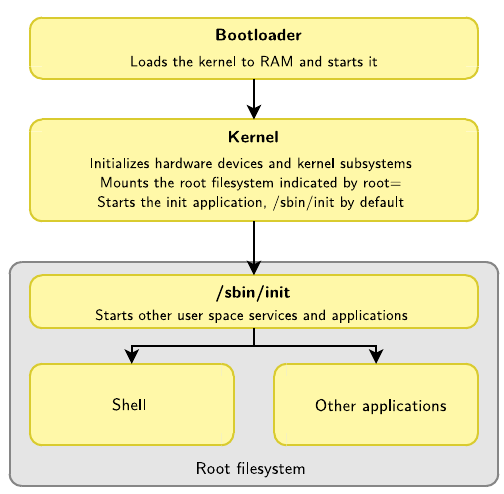
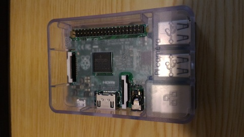
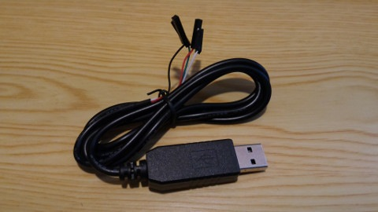
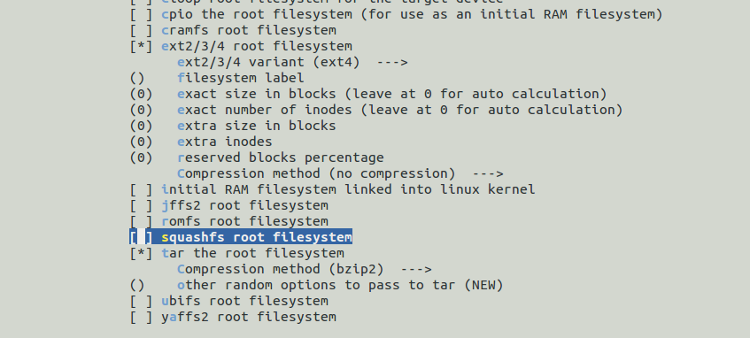
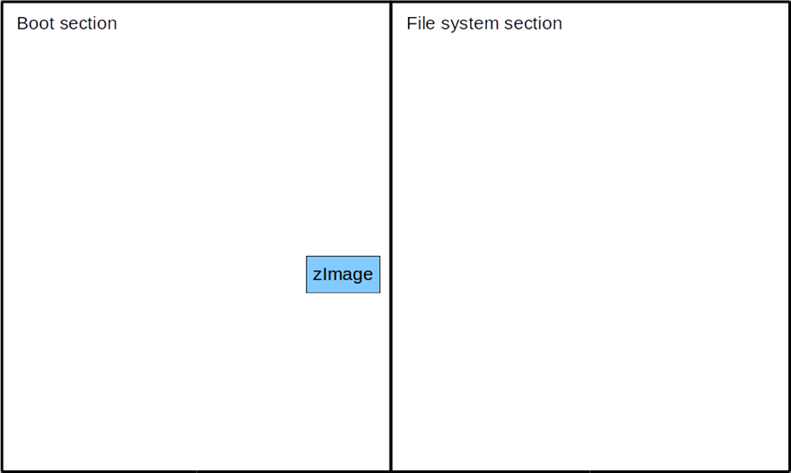
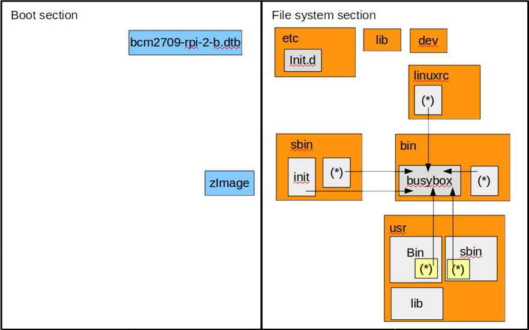
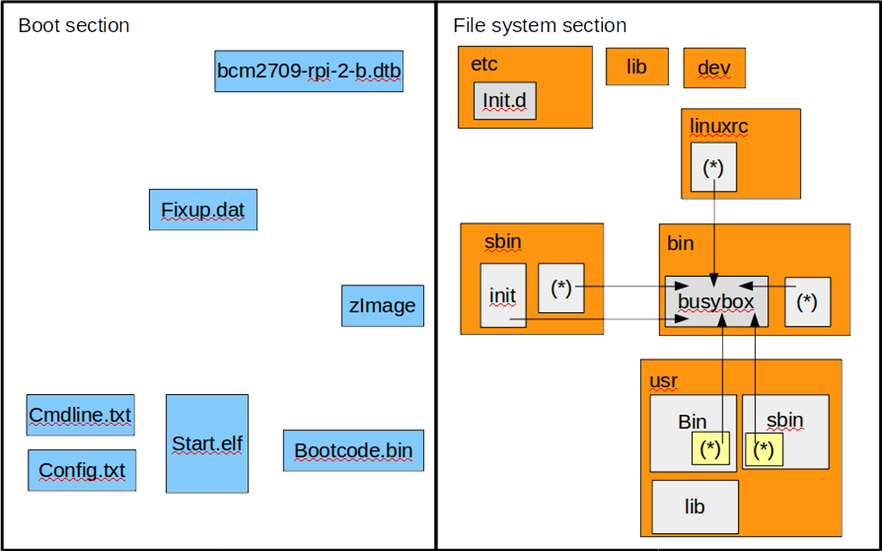
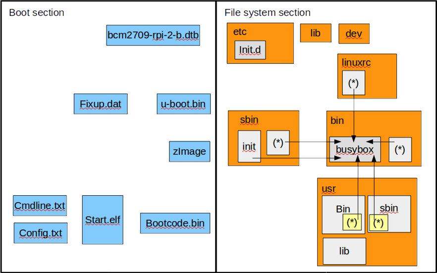
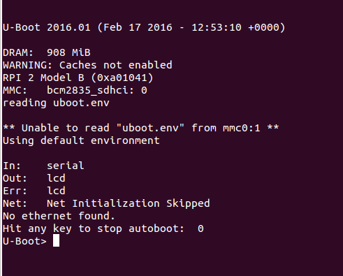
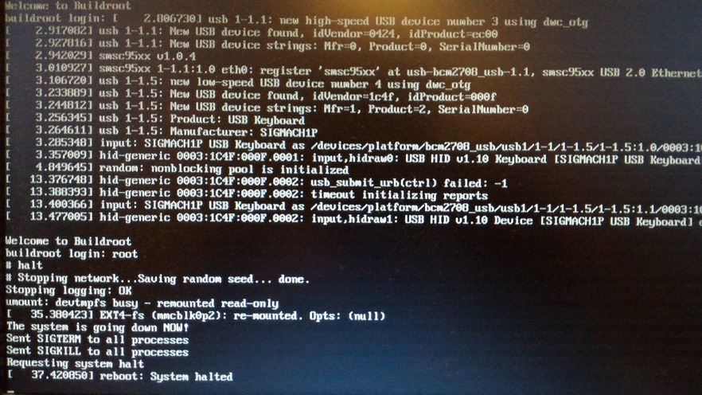

# buildRoot study - 建立自己的作業系統

[轉] http://fichugh.blogspot.tw/2016/02/buildroot-study.html  

##Introduction
因為想要了解整個Linux作業系統，從開機到系統穩定的中間流程，到底經歷過哪幾個步驟，
所以想要自己兜「boot-loader」,「kernel」和「root file system」，
研究過程中發現了，原來早已經有組織在從事類似的專案，像是「Buildroot」，「Yocto/OpenEmbedded」
所以我就想來研究一下Buildroot的架構。


這篇文章的成果會從Buildroot專案中build出「bootloader」, 「kernel」和「root fileSystem」，
然後我們會在將這幾個元件和官方的firmware放到raspberry pi 2裡面開機後來研究整個開機流程。


## Buildroot


以一個專案標語：Making Embedded Linux Easy啟動的這個專案，
基本的概念就是先建立一個自用的cross-compilation toolchain，
然後經由這個這個cross-compiler去編譯kernel和建立root file system。

主要的設計理念是：
- Simple to use
- Simple to customize
- Reproducible builds
- Small root filesystem
- Relatively fast boot
- Easy to understand

那有誰在用呢？
- System makers
    - Google
    - Barco
    - Rockwell Collins

- Processor vendors
    - Imagination Technologies
    - Marvell
    - Atmel
    - Analog Devices


當然除了以上大公司，還有很多其他公司和業餘愛好者都會用它來開發版子。

##Simplified Linux system architecture
一個簡單的Linux系統架構，如下圖，主要分為4個部份：

```sh
1.  Hardware
2. Boot loader
3. Linux Kernel
4. User space (Applications)
```

除了Hardware以外，Buildroot專案建制過程中其他的3個部份都會自己建置。
所以建制完後，我們主要會有「ToolChain」, 「bootloader image」, 「kernel image」和「root fileSystem image」。


假設我們的專案現在已經建制好了，也已經放到儲存裝置（Flash or EMMC ....），電源插上去後，
第 1 個跑的程式就是BootLoader，他會啟動一些基本的驅動程式，以供開機中使用，最終就是將kerner載入到記憶體裡，接下來就是將控制權轉交給Kernel。<br>
第2個就是Kernel會初始化硬體裝置和我們的檔案系統，然後執行第一個程式/sbin/init。<br>
第3步init就會啟動剩下來user space的service和application。<br>
第4步我們通常就會看到login shell展示再我們面前了，在後面章節會有更詳細的介紹。<br>




## Preparation
Ubuntu
這邊使用的Host OS是Ubuntu。

數莓派[廢話]



TTL Cable [天瓏書局有在賣]




##Docker

使用一個完全乾淨的Container來做這件事，
事情會比較單純化，也會加深很多印象。<br>
詳細Docker內容請參考網站。

##開啟Docker

```sh
sudo docker run -t -i -v ~/mnt/mnt_docker:/tmp/package ubuntu bash
```

~/mnt/mnt_docker : /tmp/package語法是host 和container的資料共享 => host folder ： Container folder
接下來所有內容都是在Docker裡面執行的。

## 下載套件

```sh
sudo apt-get update
sudo apt-get install g++ make gawk -y
sudo apt-get install git-core libncurses5-dev vim -y
sudo apt-get install wget python unzip bc -y
```

## Build buildRoot

### 最簡單的建置法

```sh
git clone git://git.busybox.net/buildroot
cd buildroot/
make raspberrypi2_defconfig
make 2>&1 | tee build.log
```
結束~~<br>
但是我要故意把他複雜化，這樣才可以理解他裡面的運作原理！<br>
請接下面的Build Step by Step開始。<br>


## Build Step by Step
### get sources by git

```sh
cd /tmp/
git clone git://git.busybox.net/buildroot
cd buildroot/
```

`get build information`
buildroot裡面有很多內建的組態，


裡面有raspberrypi2！
在來看一下怎麼弄，很簡單

```sh
vim /board/raspberrypi2/readme.txt
```


官方github上的文件--> [請點我](https://git.busybox.net/buildroot/tree/board/raspberrypi/readme.txt)

##Download all Sources 
buildroot的所有package, sources都是build之前才會從網路上下載下來，所以第一次build會很久，
因為包含下載，所以這邊我們先來研究一下，他下載了多少東西，請下指令：


```sh
make help
```

發現裡面有個指令是

```sh
source - download all sources needed for offline-build
```
下載所有資源之前要先建立組態

```sh
make list-defconfigs
```
上面這個指令會顯示目前有支援多少預設的組態，
我們發現有數莓派2的，所以下以下指令：
 
 ```sh
 make raspberrypi2_defconfig
 ```
 
然後只要下這個指令就會下載所有個資源：

```sh
make source
```

套件說明：
總共下載了21個套件，下載完的套件都放在資料夾「dl」裡面，
底下就來介紹一下每個套件大概的用途：
- xz-5.2.2:
 包含對檔案的壓縮和解壓縮，裡面提供了「lzma」和新的「xz」壓縮的格式。
- gcc-4.9 - 略
- binutils-2.24 - 略
- gmp-6.1.0 - 略
- mpc-1.0.3 - 略
- mpfr-3.1.3 - 略
- linux-header - 略
以上6個套件都是用來建立Corss-Compiler的，請參考我之前發過的主題「How to Build a GCC Cross-Compiler」裡面的套件說明有解釋。
- m4-1.4.17:
裡麵包含了巨集處理器(macro processor)。
- uClibc-ng-1.0.12
是一種C的library，一般來說都是用Glibc，但是這邊選用uClibc，因為他比較小，也支援沒有MMU的架構，非常適合比較小的系統（< 10 MB）。
- kmod-22:
包含了讀取kernel module的函式庫和程式。
- pkgconf-0.9.12:
在設定組態或者在make 專案時，這個套件會傳遞一些include和library的路徑給建置的軟體。
- busybox-1.24.1
Busybox在單一的可執行文件中提供了精簡的Unix工作集，可運行於多款POSIX環境得的操作系統。
- dosfstools-3.0.28
可以讓使用者在GNU/Linux OS上很快速的建立，設立標籤和檢查MS-DOS FAT 的檔案格式（mkfs.fat, fsck.fat and fatlabel）。
- e2fsprogs-1.42.13:
裡面有處理ext2 檔案系統的程式。當然他也支援ext3和ext4。
- genext2fs-1.4.1
這個程式可以讓你建立ext2的檔案系統。
- genimage-8
可從一個root filesystem裡面建立多種檔案系統和flash image。
- confuse-2.8:
libcoufuse提供了一些組態分析函式庫。
- flex-2.5.37:
裡面的套件可以產生可辨識文字pattern的程式(反正就是正規表示法那些東西)。
- mtools-4.0.18:
是一套允許讓Unix系統去操控MS-DOS格式上的檔案操作，像是讀寫檔，和搬運檔案等等。
- rpi-firmware:
數莓派官方release出來的軔體，這部份待回會在說明。
- fakeroot_1.20.2.orig
可用來模擬root的權限去做一些操作。

修改組態
如果想要自己修改設定，就跟修改kernel 組態一樣，
這邊我們來修改一下兩個設定，請輸入

```sh
make menuconfig
```

然後將選項 Filesystem images ---> tar the root filesystem--->Compression method選擇是bzip2，如下圖：



這樣我們待回的root filesytem就會以tar ball 的型式。
然後我們也想要自己build個u-boot來玩玩。
所以選項 Bootloaders -->  選擇U-boot選項，Board defconfig 輸入「rpi_2」。
上面那個指令會產生一個.conifg檔案，這邊來研究一下他開啟了哪些功能-->[請按我](http://fichugh.blogspot.tw/2016/02/u-boot-raspberry-pi-2.html)


##開始建制
剛剛組態已經產生，sources也已經下載好了，接下來我們就開始建制。


```sh
make 2>&1 | tee build.log
```

所有的package都會解壓縮在output/build，並且建置。
所有的結果都會在output/images裡面。


在output/images裡面，
sdcard.img算是整個結果的image，
假設你的sdcard是 /dev/sdd，
你只要下指令:

```sh
sudo dd if=sdcard.img of=/dev/sdd
```

然後在把sdcard卡插進去pi2裡面，就可以開機了，
但是像我說的，我要故意把他複雜化，這樣才可以理解裡面的運作原理。

在output/images裡面，
我們待回會用到的是:
```sh
1. kernel                        --> zImage
2. root file system        --> rootfs.tar.bz2
3. device tree blob      --> bcm2709-rpi-2-b.dtb
4. raspberry firmware   --> rpi-firmware/*
5. boot loader               --> u-boot.bin
```

所以底下會有另外5相對應的標題，
教怎麼把以上5個部份裝起來，並且開機。

## Partition SD Card

首先我們必須有一塊Micro SD，我們要將它分成兩個partition，其中第一個為boot section,另一個partition是放我們的rootfs的地方。

###1. 假設路徑是/dev/sdd，先進入fdisk系統

```sh
$ sudo fdisk /dev/sdd
```

###2. 將預設單位改成cylinders

```sh
Command (m for help): u
```


###3. 建立一個新的DOS格式的partition table:

```sh
Command (m for help): o
```


###4. 建立放boot loader的partition
  （以下兩步的重點是規劃200MB的boot partition，其他的都規檔案系統用）

```sh
Command (m for help): n
Partition type:
p   primary (0 primary, 0 extended, 4 free)
e   extended
Select (default p): p    (The new partition is a primary partition.)
Partition number (1-4, default 1): (Press Enter for default.)
Using default value 1
First cylinder (2-15193, default 2): 2
Last cylinder, +cylinders or +size{K,M,G} (2-15193, default 15193): +200M
```

###5. 建立放檔案系統的partition

```sh
Command (m for help): n
Partition type:
p   primary (1 primary, 0 extended, 3 free)
e   extended
Select (default p): p    (The new partition is a primary partition.)
Partition number (2-4, default 2): (Press Enter for default.)
Using default value 2
First cylinder (2048-15193, default 2): 2048
Last cylinder, +cylinders or +size{K,M,G} (2-15193, default 15193): 15193
```

###6. 將第一個磁區標注為bootable 

```sh
Command (m for help): a
Partition number (1-4): 1   (Select Partition 1 to be active.)
```

###7. 將第一個磁區改為FAT32
```sh
Command (m for help): t
Selected partition 1
Hex code (type L to list codes): c 
Changed system type of partition 1 to c (W95 FAT32 (LBA))
```
###8.寫入新的partition table
```sh
Command (m for help): w
```

###9. 格式化新的boot load磁區為DOS FAT32 檔案系統

```sh
$sudo mkfs.vfat -F32 /dev/sdd1
mkfs.vfat 3.0.13 (30 Jun 2012)
```
###10.格式化第二個磁區為ext4檔案系統

```sh
$sudo mkfs.ext4 /dev/sdd2
```

###11. 掛載裝置

```sh
mkdir -p ~/mnt/fat32
mkdir -p ~/mnt/rtfs
sudo mount /dev/sdd1 ~/mnt/fat32
sudo mount /dev/sdd2 ~/mnt/rtfs
```

所以我們得到了兩個Partitions，概念如下：


###1. Kernel Image
我們將kernel的Image複製到boot section

```sh
sudo cp output/images/zImage ~/mnt/fat32
```


### 2. root file system

將root file system的image複製到第二個partition底下然後再解壓縮。

```sh
sudo cp outpupt/images/rootfs.tar.bz2 ~/mnt/rtfs
cd ~/mnt/rtfs
sudo tar -jvxf rootfs.tar.bz2
sudo rm rootfs.tar.bz2 
```

所以我們的極小型root filesystem已經到位了。<br>
這一個file system裡面所有的東西，基本上都是busybox去兜出來的。<br>
由下圖可以看到，幾乎所有的檔案都是連結到/bin/busybox的。<br>
而/dev這資料夾的檔案都是kernel devtmpfs所建立出來的。<br>


###3. device tree blob
將裝置樹檔複製到boot section。

```sh
sudo cp output/images/bcm2709-rpi-2-b.dtb ~/mnt/fat32/
```


## 4. raspberry pi official firmware

些軔體並不是這個專案build出來的，是從官方那邊下載下來的。
其實有兩種方式取得：

- https://github.com/raspberrypi/firmware/tree/master/boot
- https://www.raspberrypi.org/downloads/raspbian/

第二個為Ra pi 2的image file，
如果想要把相對應的檔案取出來，請看底下3步驟
阿不想知道的，請忽略底下3步驟：
- 下載image  File
- 這個image有兩個partitions，所以無法直接掛載，需要先找到boot partition的開始section


由上可知道，第一個磁區是從8192開始，所以總共要偏移8192*512 = 4194304 bytes


###3. mount 第一個磁區.

```sh
$ sudo mount -o loop,offset=4194304 2015-05-05-raspbian-wheezy.img ~/mnt
```

在firmware裡，我們需要的檔案有

```sh
start.elf （GPU frimware） 
bootcode.bin  ( bootloaders)
config.txt (裡面也是有一些組態)
cmdline.txt (這個檔案裡面的文字都會當作參數傳遞給Kernel)
fixup.dat  (用來組態GPU和CPU之間的SDRAM partition)
```

反正就是把rpi-firmware資料夾底下的東西都複製到boot section就對了




###5. U-boot
將u-boot.bin複製到boot section，

```sh
sudo cp output/images/u-boot.bin ~/mnt/fat32
```

`然後修改config.txt`，
kernel=zImage 
改成
kernel=u-boot.bin

這樣在final-stage bootloader時，就會去讀我們的u-boot.bin而不是直接進入kernel。




##開機和驗收

###1. 接上TTL Cable
###2. 開啟終端機

```sh
sudo screen /dev/ttyUSB0 115200
```


ttyUSB0是我這邊的Port，每個人的不一定一樣，所以請根據自己的case修改（然後要記得裝driver），
bound rate我這邊是115200，因為這是rapi2的預設，如有其他case也請自行修改。

###3. 接上電源
在rapi2上的HDMI接著螢幕的狀況下，接上電源
如果成功的話，你就會發現終端機上開始有log了，
記得在Hit any key to stop autoboot時，隨便敲個字，
然後就會進入U-boot的命令列了，如下：





###4. 手動u-boot開機

我們第一次可以先手動開機，藉由一個指令一個指令去了解做了什麼事。

```sh
# Tell Linux that it is booting on a Raspberry Pi2
setenv machid 0x00000c42
# Set the kernel boot command line
setenv bootargs "earlyprintk console=tty0 console=ttyAMA0 root=/dev/mmcblk0p2 rootfstype=ext4 rootwait noinitrd"
# Save these changes to u-boot's environment
saveenv
# Load the existing Linux kernel into RAM
fatload mmc 0:1 ${kernel_addr_r} zImage
# Boot the kernel we have just loaded
bootz ${kernel_addr_r}
```
- 如果不是在開發kernel或測試，又或者沒有遇到一些早期loader的問題的話，可以把earlyprintk這個選項省略，就不會一堆log了。
- 我們要使用serial console所以這個選項要留著。
- /dev/mmcblk0p2這個路徑是Raspbian的，如果路徑不一樣的話，這邊要記得改成存放rootfs的路徑。
- 如果rootfs的格式不是EXT4的話，這邊要記得˙改。


當這一行bootz ${kernel_addr_r}執行下去後，如果沒問題的話，就會看到一堆log了，代表已經順利開機，u-boot已經順利將控制權交給kernel了。

但是跑到「random: nonblocking pool is initialized」這一行時，你會發現，
怪了，怎麼不會動了？？而且HDMI上也沒有畫面。


##5. 改回kernel開機
這時關機以後，我們在嘗試著修改config.txt

把kernel=u-boot.bin

再改回

kernel=zImage

在TTL  cable還接著的狀態下，再次開機，
我們發現，HDMI下的螢幕，開機正常，
但是終端機還是卡在相同的一行，
所以我們對著pi2上的鍵盤輸入登入帳號：root
然後嘗試著關機輸入：halt
顯示圖如下：




## 6. 再次手動u-boot開機

再次修改config.txt，
把kernel=zImage
再改回
kernel=u-boot.bin

然後跟剛剛一樣的步驟，發現還是停在「random: nonblocking pool is initialized」，
這時候我們一樣對著接著rapi2的鍵盤（不是終端機）輸入：root 按Enter
然後再輸入：halt 按Enter
發現有log了，也正常關機了。
如下圖：


##7. 檢查inittab

正常開機後，檢查一下/etc/inittab，
發現在開機階段，只有宣告tty1的getty：

```sh
# Put a getty on the serial port
tty1::respawn:/sbin/getty -L  tty1 0 vt100 # GENERIC_SERIAL
```

數莓派的UART driver是AMA，
所以我們自己在加入ttyAMA0的getty ：

```sh
# Spawn a getty on Raspberry Pi serial line
ttyAMA0::respawn:/sbin/getty -L  ttyAMA0 115200 vt100 
```

然後reboot以後到log停住的地方，按一下Enter就會出現login shell了。


## How the Raspberry Pi boots up


如上圖，pi 2 的SOC是採用Broadcom BCM2835，它包含了 ARM11的CPU，VideoCore GPU, ROM chips, SDRAM和其他的東西。

底下是搭配剛剛我們兜出來的元件概念圖，來解釋數莓派上簡單的Linux開機流程：


1. 當pi 2 通電以後，其實第一個啟動的指令，是在SOC的ROM上，好吧，所以代表這邊已經是黑箱了，無法繼續追下去=.=，所以這個黑箱裡所做的是是所謂的first-stage bootloader。在first-stage時，他會mount上我們的SD card裡的FAT32的 boot partition，接下來我們SD Card裡面的bootcode.bin 就是second-stage bootloader。根據文獻，在first-stage時，CPU跟RAM都還沒被初始化（意思是CPU還是在reset的狀態）。所以到目前為止，都是再GPU裡面運行，而不是CPU。

2. 接下來bootloader.bin就會被讀到GPU上的L2 cache上並且被執行。在這步驟就會啟動RAM，並且讀取start.elf檔。

3. 讀取start.elf以後，就是third-stage bootloader了，這個檔案是GPU的軔體，他會去讀取再config.txt裡面得的設定（根據網路文獻，就是把config.txt當成BIOS setting就對了XD）。裡面有些參數是我們可以調整的，都是是些frequency，有需要可以參考[h]。在start.elf階段，GPU和CPU所使用的RAM還是在不同的區段(ex. 如果GPU使用0X0000F000~0X0000FFFF的話，CPU就會使用0X00000000~0X0000EFFF)。

4. 接下來，如果有cmdline.txt的話，在start.elf裡面也會被讀取，這個檔案包含了一些cmd的參數，然後跑fixup.dat，組態GPU和CPU之間的SDRAM partition，在這個階段CPU就會reset，也代表交接結束了。

5. 到這個階段已經是final-stage bootloader了，接下來start.elf會讀取u-boot.bin。

6. 然後我們再自己手動把kernel 也就是zImage給讀進記憶體裡面，並且將控制權交給kernel，然後作業系統就啟動了。
當作業系統啟動後，其實GPU還在運行，因為start.elf並不只是GPU的軔體，他也是一個"proprietary OS (私權OS)"叫作VideoCore OS，有時候正常的OS需要一些參數時，也會經由˙mailbox messaging system去要求VCOS傳給他。

7. 當Kernel將大部分的硬體裝置和我們的檔案系統初始化後，就會執行第一個程式/sbin/init。

8. 然後會在去啟動剩下來user space的service和application。在來就是login shell

結論
1. 正常的狀況下，buildroot並沒有提供GPIO的login shell。（因為是使用busybox，所以當kernel將控制權交給busy的init時，就沒有log了，這地方要再研究一下）`（solved --> 要修改inittab）`

2. 如果是用u-boot去開機的話，螢幕的驅動程式都不會作用。但是鍵盤是可以的。（所以照裡來說，u-boot裡面應該要有驅動才對，這地方也要再研究一下）
`:另一處「如果是用u-boot去開機的話，螢幕的驅動程式都不會作用」，應該明確說 HDMI output 是否運作，要注意到 RPi 的設定，這點在官方網頁就有說明瞭`

3. 所以整個專案下來，我們已經瞭解了數莓派上Linux的開機流程，接下來，我要嘗試著不要依賴buildroot套件，而是每個元件都自己建立會更加的瞭解Linux的構成。
`Jserv:「接下來，我要嘗試著不要依賴buildroot套件，而是每個元件都自己建立會更加的瞭解Linux的構成」這個目標也不壞，但為何不先試著修改 buildroot 呢？嘗試新增或移除特定的套件呢？
如果現在是 2000 年，我會鼓勵學生用「不透過 buildroot 一類的工具，徒手建立 root filesystem」，但我現在不會建議這樣作，原因是：(1) 你得跟得上時代，和技術社群用相似的開發工具、開發流程，知道如何和其他開發者交流; (2) 這幾年系統變異很大，諸如用 systemd 取代 init、Yocto/OpenEmbedded 技術社群的快速成長，幾乎只能透過閱讀 git log，才能窺知技術發展的動向。倘若你今天還是「閉門造車」，恐怕只是遠離這個世界`

4. `Jserv:至於修改 buildroot，你可以參考這個專案:https://github.com/mpolakovic/qemrdux-player # 透過 buildroot，從無到有打造一個 MP3 Player 的韌體`


## ref:
- a. https://docs.google.com/viewerng/viewer?url=http://free-electrons.com/doc/training/buildroot/buildroot-slides.pdf
- b. http://free-electrons.com/
- c. https://buildroot.org/downloads/manual/manual.pdf
- d. http://cellux.github.io/articles/diy-linux-with-buildroot-part-1/
- e. how-the-raspberry-pi-boots-up
-  f. Booting a Raspberry Pi2, with u-boot and HYP enabled
- g. Embedded Linux 嵌入式系統開發實務
- h. RPi Serial Connection
- i. Preparing a bootable SD card
