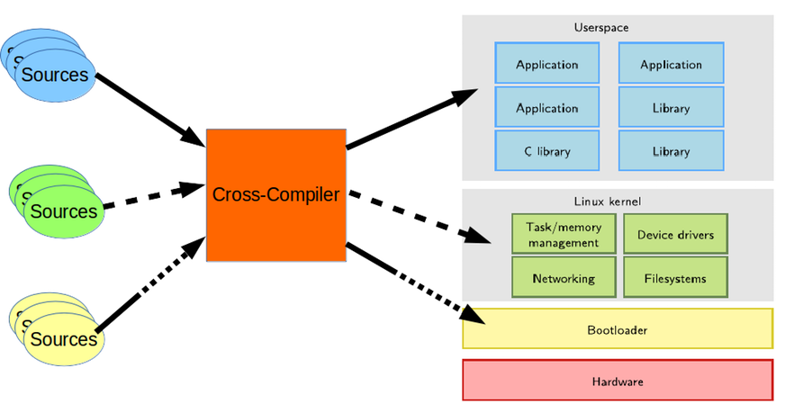

# buildRoot study - 建立自己的作業系統

[轉] http://fichugh.blogspot.tw/2016/02/buildroot-study.html  

##Introduction
因為想要了解整個Linux作業系統，從開機到系統穩定的中間流程，到底經歷過哪幾個步驟，
所以想要自己兜「boot-loader」,「kernel」和「root file system」，
研究過程中發現了，原來早已經有組織在從事類似的專案，像是「Buildroot」，「Yocto/OpenEmbedded」
所以我就想來研究一下Buildroot的架構。


這篇文章的成果會從Buildroot專案中build出「bootloader」, 「kernel」和「root fileSystem」，
然後我們會在將這幾個元件和官方的firmware放到raspberry pi 2裏面開機後來研究整個開機流程。


## Buildroot


以一個專案標語：Making Embedded Linux Easy啟動的這個專案，
基本的概念就是先建立一個自用的cross-compilation toolchain，
然後經由這個這個cross-compiler去編譯kernel和建立root file system。

主要的設計理念是：
- Simple to use
- Simple to customize
- Reproducible builds
- Small root filesystem
- Relatively fast boot
- Easy to understand

那有誰在用呢？
- System makers
    - Google
    - Barco
    - Rockwell Collins

- Processor vendors
    - Imagination Technologies
    - Marvell
    - Atmel
    - Analog Devices


當然除了以上大公司，還有很多其他公司和業餘愛好者都會用它來開發版子。

##Simplified Linux system architecture
一個簡單的Linux系統架構，如下圖，主要分為4個部份：

```sh
1.  Hardware
2. Boot loader
3. Linux Kernel
4. User space (Applications)
```

除了Hardware以外，Buildroot專案建制過程中其他的3個部份都會自己建置。
所以建制完後，我們主要會有「ToolChain」, 「bootloader image」, 「kernel image」和「root fileSystem image」。





假設我們的專案現在已經建制好了，也已經放到儲存裝置（Flash or EMMC ....），電源插上去後，
第 1 個跑的程式就是BootLoader，他會啟動一些基本的驅動程式，以供開機中使用，最終就是將kerner載入到記憶體裡，接下來就是將控制權轉交給Kernel。<br>
第2個就是Kernel會初始化硬體裝置和我們的檔案系統，然後執行第一個程式/sbin/init。<br>
第3步init就會啟動剩下來user space的service和application。<br>
第4步我們通常就會看到login shell展示再我們面前了，在後面章節會有更詳細的介紹。<br>


## Preparation
Ubuntu
這邊使用的Host OS是Ubuntu。

數莓派[廢話]


TTL Cable [天瓏書局有在賣]


##Docker

使用一個完全乾淨的Container來做這件事，
事情會比較單純化，也會加深很多印象。<br>
詳細Docker內容請參考網站。

##開啟Docker

```sh
sudo docker run -t -i -v ~/mnt/mnt_docker:/tmp/package ubuntu bash
```

~/mnt/mnt_docker : /tmp/package語法是host 和container的資料共享 => host folder ： Container folder
接下來所有內容都是在Docker裏面執行的。

## 下載套件

```sh
sudo apt-get update
sudo apt-get install g++ make gawk -y
sudo apt-get install git-core libncurses5-dev vim -y
sudo apt-get install wget python unzip bc -y
```

## Build buildRoot

### 最簡單的建置法

```sh
git clone git://git.busybox.net/buildroot
cd buildroot/
make raspberrypi2_defconfig
make 2>&1 | tee build.log
```


