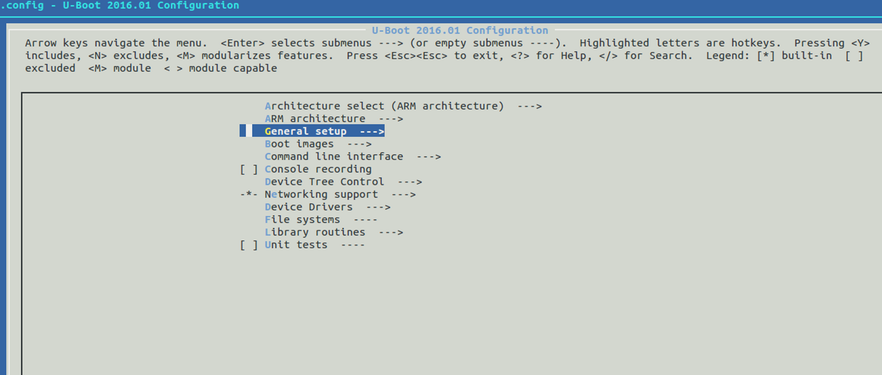

# u-boot 組態研究- raspberry pi 2


這份文件主要研究當uboot的組態設定成raspberry pi 2時，他的config file開了什麼compile options.

實際上可以用make menuconfig去看。但是記得要先裝ncurse套件。「這個套件主要在命令列底下提供滑鼠支援，建立視窗（UI），處理顏色等等http://tldp.org/HOWTO/NCURSES-Programming-HOWTO/intro.html」


```sh
$ sudo apt-get install libncurses5-dev
```




##1. ARM architecture
當然是Arm 架構 
- Target Select (Broadcom BCM283X family)
- Broadcom BCM283X board select (Raspberry Pi 2)

##3. General Setup
-Automatically append version information to the version string
-Optimize for size 「用-Os取代-O2，得到最小的Image」
-Enable malloc() pool before relocation 「因為有些driver再這個階段還是需要記憶體配置，所以打開這個選項會配置一個很小的記憶體區塊，讓驅動程式用」
-Size of malloc() pool before relocation [0x400] 「同上，就是這個區塊的大小」
-Configure standard U-Boot features (expert users)
-Init with zeros the memory reserved for malloc (slow) 「將上面的記憶體區塊配置後，順便reset成0，有點像是kernel的zmalloc吧」
- 
##5. Command line interface
Shell prompt (U-Boot>)
Info commands
bdinfo「可列印出版子的資訊」
coninfo 「可列印出console 裝置的資訊」
Boot commands
bootd 「執行已經儲存在環境"bootcmd"裡的命令」
bootm 「從記憶體裡啟動程式的印象檔」
bootelf, bootvx 「從記憶體裡啟動 ELF/vxWorks格式的印象檔」
go 「從所給予的記憶體位置裡啟動一個程式」
run 「在一個已經設定好的環境變數下，去執行這個命令」
iminfo 「印出這個程式印象檔的標頭資訊」
imxtract 「萃取出多重印象檔的某個部份」
Environment commands
env export 「輸出環境變數」
envimport 「輸入環境變數」
editenv 「編輯環˙境變數」
saveenv 「儲存所有環境變數」
env exists 「檢查這個變數是否已經定義再這個環境下」
Memory commands
md, mm, nm, mw, cp, cmp, base, loop ，「就是一些記憶體命令」
crc32 ，「計算CRC32」
Device access commands
dm - Access to driver model information
loadb 「通過序列阜去讀取一個binary檔案」
loads 「經由序列阜讀取一個S-Record檔案」
gpio 「支援GPIO」
Shell scripting commands
echo 「這不用說明吧？@@」
itest 「整數比較」
source 「從記憶體裡執行script」
setexpr 「Evaluate boolean and math expressions and store the result in an env variable.」
Network commands
bootp, tftpboot 「使用BOOTP/TFTP協定去啟動印象檔」
nfs 「使用NFS協定去啟動印象檔」
Misc commands
sleep
Boot timing
Number of boot ID numbers available for user use [20] 「待研究...」
Address to stash boot timing information [0] 「提供一個位址，當bootloader轉交控制權給OS時，這個位址的數去不會被覆寫掉，所以可以傳資料給OS」
Size of boot timing stash region [4096]  「什麼是boot timing stash region??」

##8. Networking support
Control TFTP timeout and count through environment
「TFTP是一種協定，通常是將Kernel放在網路裝置上，然後在經由TFTP下載kernel到記憶體開始執行，
所以這個選項是關於TFTP的timeout的」
##9. Device Drivers
Serial drivers
Require a serial port for console 「很清楚，不需要說明」
Provide a serial driver 「也是很清楚」
Provide a serial driver in SPL 「再一個空間需要非常限制的裝置上，一個完全的UART驅動程式也是很佔空間的，所以這個選項被省略了，就不會有full uart driver，以節省空間」
Custom physical to bus address mapping 「有些SOCs會對於CPU實體位址和DMA，使用一個不同位址的map，如果是的話，就選這個選項，並且記得再你的code裏面去實作相關的mapping funciton」

##11. Library routines
- Enable regular expression support 「就是正規表示法的函式庫...」