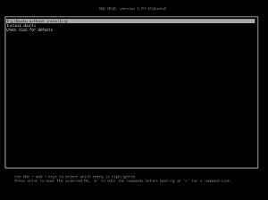

# Windows與Ubuntu雙系統，開機時偵測不到彼此的解決方法 [轉]

http://ericsilverblade.blogspot.tw/2015/05/windowsubuntu.html

Windows跟Ubuntu雙系統在各種不同的情況之下，在灌的時候都有不同的注意事項。這裡有一些雙系統各種灌法的參考網頁(英文)：
```sh
[1] 同一顆硬碟；同一顆硬碟 教學2
[2] 同一顆硬碟+UEFI；同一顆硬碟+UEFI 教學2；同一顆硬碟+UEFI 教學3
[3] 兩顆硬碟
[4] 兩顆硬碟+UEFI
```
首先要注意的是，如果將兩個系統
```sh
a) 分別安裝在兩顆硬碟，而且
b) 在安裝Windows的時候是以UEFI驅動，但在安裝Ubuntu的時候是用傳統BIOS
，那兩個系統絕對不可能抓得到彼此的開機程式。如果已經這樣灌了，那只能直接重灌Ubuntu比較簡單。
```

##1. 開機選單為Windows模式，但Ubuntu未顯示在選單上

(1) 從這個網站下載EasyBCD、安裝、執行。

(2) 在「新增項目」(Add New Entry)選擇Linux/BSD標籤，「類型」(Type)選擇GRUB 2；「名稱」(Name)自己取個喜歡的，我是用"Ubuntu 12.04"；磁碟機(Device)維持原本預設的「自動尋找並載入」(Automatically configured)；最後按「加入項目」(Add Entry)。

重開機之後應該就會出現開機選單了。

參考網址：
http://askubuntu.com/questions/141450/installed-ubuntu-12-04-and-no-menu-on-boot

##2. 開機選單為Ubuntu模式，但Windows未顯示在選單上

遇到這種情況的時候，大多要嘛是Windows的開機管理程式(Bootmgr)被無意間洗掉了，要嘛是像我一開始說的Windows跟Ubuntu分別被裝在UEFI跟傳統Bios模式底下，所以通常只有重灌一途......但如果你想掙扎看看的話，可以參考下面的說明。

要注意的是，在Ubuntu 10.04以前是用Grub, 在Ubuntu 10.10之後是用Grub2，所以在找資料的時候別搞混了。舊版的Grub的開機選單在/boot/grub/menu.lst。要在Grub的選單裡加上Windows可以參考這篇；或者可以透過升級成Grub2解決這個問題。

##(0) 讓開機選單顯示出來：

一個可能的情況是你在開機的時候根本沒有顯示選單。這是因為當Grub2判定電腦裡面只有一個Linux系統的時候，就會自動隱藏開機選單。要讓開機選單顯示出來的方法是：
```sh
  a) 以sudo打開/etc/default/grub
  b) 在"GRUB_HIDDEN_TIMEOUT=0"這一行前面加上"#"將它拿掉。
```

參考網址：
http://askubuntu.com/questions/16042/how-to-get-to-the-grub-menu-at-boot-time

##(1) 讓Ubuntu自動更新開機選單：

在終端機執行：

```sh
sudo update-grub
```
##(2) 使用Boot-Repair

在終端機執行：

```sh
sudo add-apt-repository ppa:yannubuntu/boot-repair
sudo apt-get update
sudo apt-get install -y boot-repair
boot-repair
```

在Boot-Repair掃描完之後選擇Recommended repair即可。

參考網址：
https://help.ubuntu.com/community/Boot-Repair

##(3) 手動修改開機選單：

首先得找出你的Windows是在哪個硬碟跟磁區上。硬碟的編號規則是：

```sh
/dev/sda -> hd0
/dev/sdb -> hd1
......
```

，而磁區的規則則是：<br>
第一個磁區：msdos0 <br>
第二個磁區：msdos1<br><br>
......<br>
所以例如sdb3就是(hd1,msdos2)

假設我們找到Windows 7在/dev/sda的第三個磁區。之後，以sudo編輯/etc/grub.d/40_custom，在檔案後面加上


```sh
menuentry ‘Windows 7′ {
  insmod part_msdos # 註：這行不見得需要
  insmod ntfs # 註：這行不見得需要；而且記得要使用windows磁碟的真正格式
  set root='(hd0,msdos2)′
  search --no-floppy --fs-uuid --set=root XXX # 註：這行不見得需要；而且XXX要代入硬碟的uuid
  drivemap -s (hd0) ${root} # 註：這行不見得需要
  chain
  ```
  
  
查詢硬碟uuid的指令是：
```sh
sudo blkid
```

最後在終端機執行：

```sh
sudo grub-mkconfig
sudo update-grub
```

##參考網址：
```sh
[1] Manually adding an entry for Windows 7 to an Ubuntu GRUB2 menu
[2] 對兩個SATA硬碟套用grub多重開機
[3] [Notes][Linux]如何復原 GRUB2 開機程序
```

##3. 特殊情況：用UEFI bios將Windows跟Ubuntu裝在兩顆硬碟上

關於Ubuntu跟UEFI最重要的補充資料就是官方網站上的教學(英文)，可以的話不妨整篇看完。以下節錄重點：

(1) 第一步就是要確定自己是以UEFI驅動光碟機，開啟Ubuntu光碟。關於各家主機板的UEFI bios的設定就請自己上網找資料了。

(2) 判斷有沒有成功以UEFI驅動光碟機的方法是，如果以UEFI驅動，第一個看到的畫面會像這樣：



但如果是以BIOS驅動，則是這樣：


(3) 選擇「Try Ubuntu」。

(4) 在試用Ubuntu的桌面環境下，用GParted程式先幫Ubuntu建立一個專門放UEFI的磁碟分割。這個磁碟分割必須：
```sh
  a) 最小100Mib；建議200MiB
  b) 檔案格式：FAT32
  c) 將"flag"欄位改成"boot"
```
(5) 點選桌面上的安裝Ubuntu捷徑，開始安裝程序。

(6) 在安裝過程中如果選擇手動指定/分割硬碟，注意下面的下拉選單，要選擇將Ubuntu開機程序安裝在Ubuntu那顆硬碟上。例如如果是sdb，不需要指定到剛剛建立的專門放UEFI的磁碟分割(例如可能是sdb0)，只要指定到sdb就可以了。
 